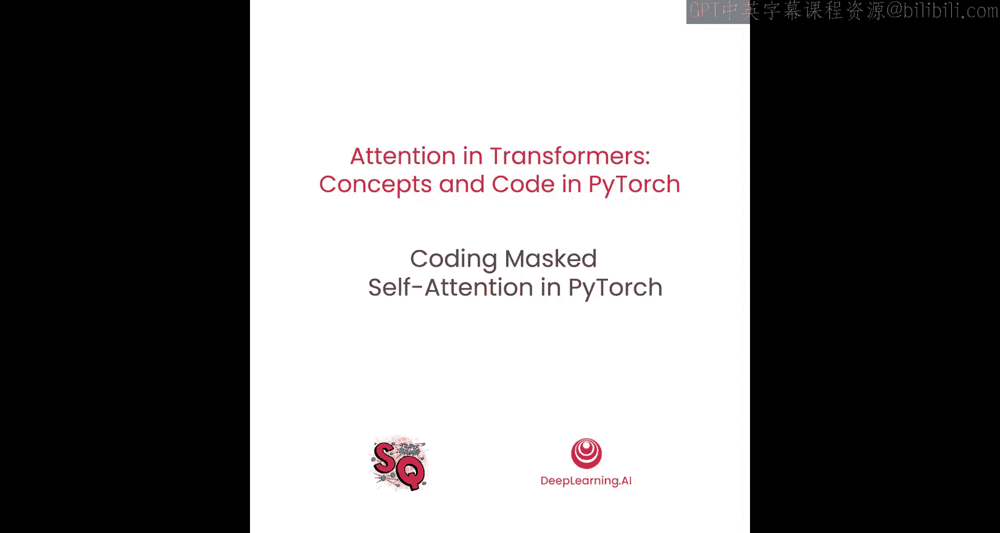
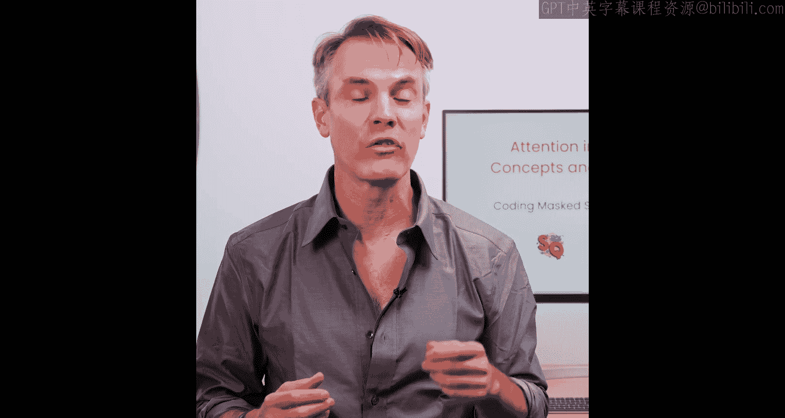
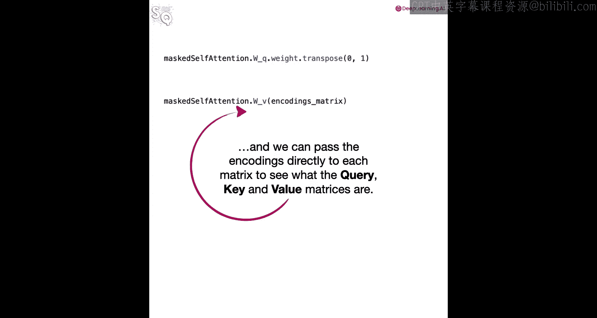
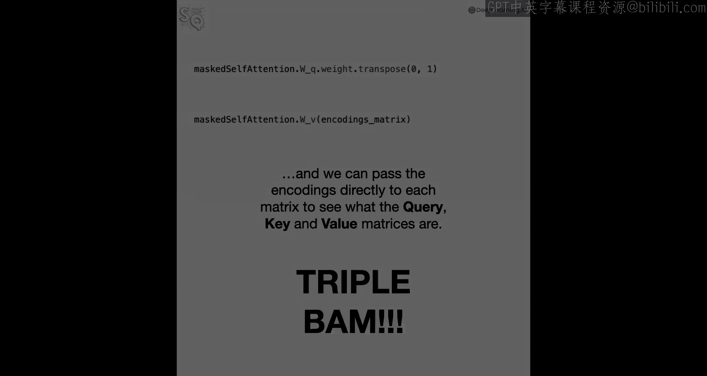

# 007：使用PyTorch实现掩码自注意力




在本节课中，你将使用PyTorch编写一个实现掩码自注意力的类。然后，你将输入一些数据来运行它，并验证计算是否正确。让我们开始编码。



## 概述

在本节中，我们将学习如何使用PyTorch构建一个掩码自注意力模块。我们将定义一个类，它继承自`nn.Module`，并实现前向传播逻辑，其中包含对注意力分数应用掩码的关键步骤。我们将通过一个具体的例子来验证其功能。

## 导入必要的库

首先，我们需要导入PyTorch及其神经网络模块。

```python
import torch
import torch.nn as nn
import torch.nn.functional as F
```

## 定义掩码自注意力类

接下来，我们定义一个名为`MaskedSelfAttention`的类，它继承自`nn.Module`。

```python
class MaskedSelfAttention(nn.Module):
```

### 初始化方法

在`__init__`方法中，我们定义类的参数并初始化权重矩阵。

```python
    def __init__(self, d_model):
        super().__init__()
        # 创建查询、键和值的权重矩阵
        self.W_q = nn.Linear(d_model, d_model)  # 查询权重矩阵
        self.W_k = nn.Linear(d_model, d_model)  # 键权重矩阵
        self.W_v = nn.Linear(d_model, d_model)  # 值权重矩阵
```

`d_model`参数表示模型的维度，即每个词元嵌入向量的长度。我们使用`nn.Linear`层来创建查询、键和值的权重矩阵。

### 前向传播方法

`forward`方法是计算掩码自注意力的核心。它接收词元编码和一个可选的掩码矩阵。

```python
    def forward(self, x, mask=None):
        # 计算查询、键和值
        Q = self.W_q(x)  # 查询矩阵
        K = self.W_k(x)  # 键矩阵
        V = self.W_v(x)  # 值矩阵

        # 计算缩放点积注意力分数
        attention_scores = torch.matmul(Q, K.transpose(-2, -1)) / (K.size(-1) ** 0.5)

        # 如果提供了掩码，则应用掩码
        if mask is not None:
            # 将掩码中为True的位置填充为极小的负数
            attention_scores = attention_scores.masked_fill(mask == 0, -1e9)

        # 应用Softmax获取注意力权重
        attention_weights = F.softmax(attention_scores, dim=-1)

        # 计算加权和
        output = torch.matmul(attention_weights, V)

        return output
```

在前向传播中，我们首先通过权重矩阵计算查询、键和值。然后，我们计算查询和键之间的相似度，并进行缩放。如果提供了掩码，我们使用`masked_fill`方法将掩码中指定位置（通常对应未来词元）的注意力分数替换为一个极小的负数（如`-1e9`），这样在后续的Softmax步骤中，这些位置的概率就会接近零。最后，我们计算注意力权重与值的加权和，得到输出。

## 验证实现

现在，让我们通过一个例子来验证我们的实现是否正确。

### 设置随机种子

为了确保结果可复现，我们设置随机种子。

```python
torch.manual_seed(42)
```

### 创建输入数据

假设我们有一个包含三个词元的提示，每个词元的编码维度为4。

```python
# 假设的编码矩阵，形状为 (序列长度, d_model)
encodings = torch.randn(3, 4)
print("编码矩阵:")
print(encodings)
```

### 创建掩码

我们需要创建一个掩码来防止词元在计算注意力时“看到”未来的词元。对于长度为3的序列，我们创建一个下三角矩阵。

```python
# 创建一个3x3的下三角掩码矩阵
mask = torch.tril(torch.ones(3, 3)).bool()
print("掩码矩阵:")
print(mask)
```

这个掩码矩阵的主对角线及以下元素为`True`，以上元素为`False`，确保了每个位置只能关注到自身及之前的位置。

### 实例化并运行模型

现在，我们实例化掩码自注意力类，并将编码和掩码输入。

```python
# 实例化模型
d_model = 4
model = MaskedSelfAttention(d_model)

# 进行前向传播
output = model(encodings, mask)
print("掩码自注意力输出:")
print(output)
```

### 检查中间结果

为了深入理解，我们可以打印出权重矩阵和中间生成的查询、键、值矩阵。

```python
print("查询权重矩阵:")
print(model.W_q.weight)
print("键权重矩阵:")
print(model.W_k.weight)
print("值权重矩阵:")
print(model.W_v.weight)

# 手动计算查询、键、值以验证
Q = model.W_q(encodings)
K = model.W_k(encodings)
V = model.W_v(encodings)
print("查询矩阵 Q:")
print(Q)
print("键矩阵 K:")
print(K)
print("值矩阵 V:")
print(V)
```

通过比较这些中间结果，你可以验证整个计算流程是否符合预期。



## 总结



在本节课中，我们一起学习了如何使用PyTorch实现一个掩码自注意力机制。我们定义了一个类，它能够计算查询、键和值，应用缩放点积注意力，并根据提供的掩码矩阵屏蔽掉未来的信息。最后，我们通过一个具体的例子验证了代码的正确性。理解并实现掩码自注意力是构建Transformer解码器的关键一步。