# 009：多头注意力机制 🧠

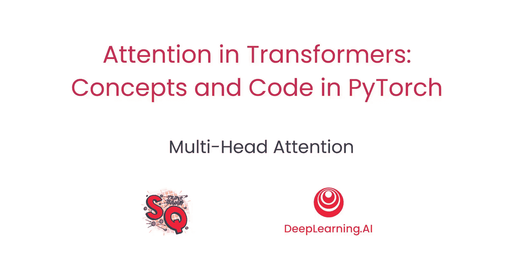

在本节课中，我们将要学习多头注意力机制。我们将了解它的用途以及它如何被整合到Transformer架构中。

## 概述

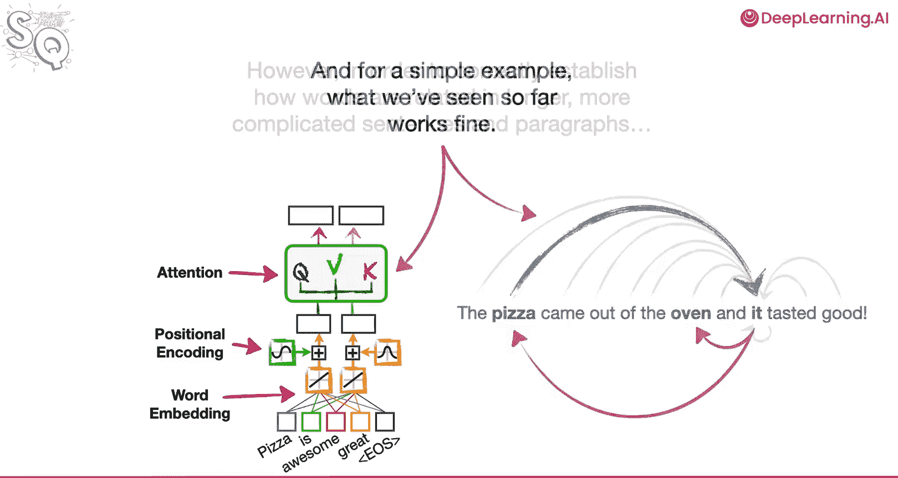

上一节我们介绍了注意力机制如何帮助建立输入中每个词与其他词之间的关系。对于简单的例子，我们之前看到的方法工作得很好。然而，为了在更长、更复杂的句子和段落中正确建立词与词之间的关系，我们可以同时多次对编码值应用注意力机制。

## 多头注意力机制的概念

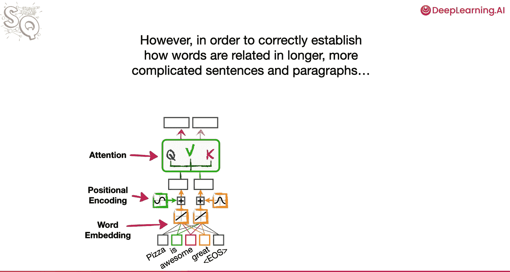

每个注意力单元被称为一个“头”，并且每个头都有自己独立的权重集，用于计算查询、键和值。

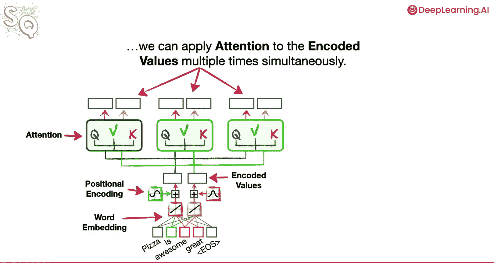

当我们有多个头同时计算注意力时，我们称之为**多头注意力**。

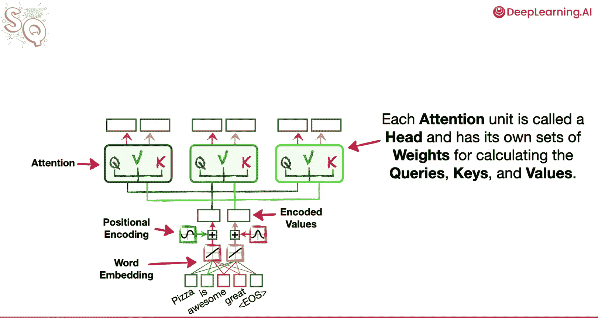

例如，在这个例子中，我们使用了三个注意力头。

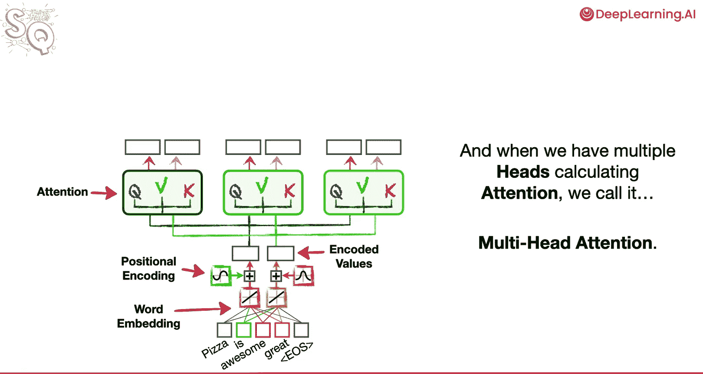

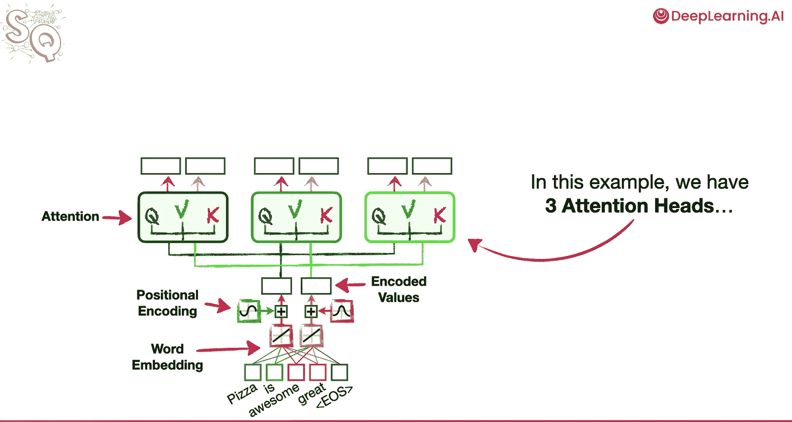

然而，在首次描述Transformer的论文中，作者使用了八个注意力头。

在我们的例子中，有三个头，每个头产生两个注意力值。

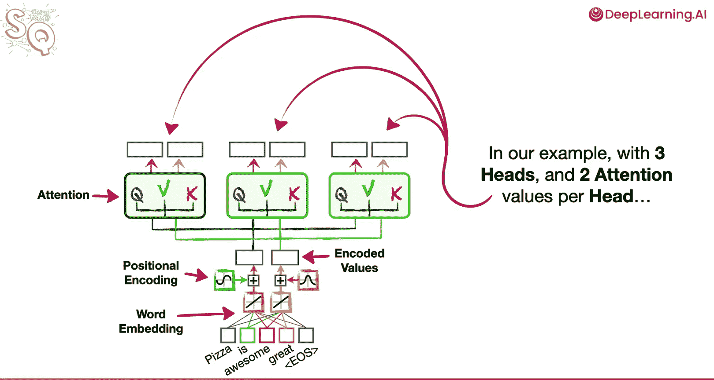

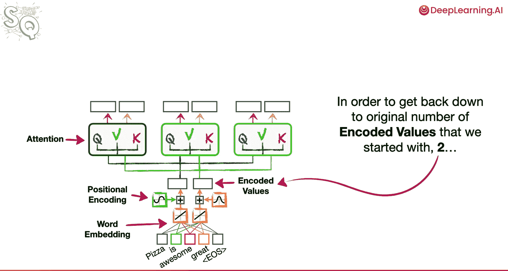

我们最终得到了六个注意力值。为了将输出数量减少到我们开始时编码值的原始数量（2个），我们只需将所有注意力值连接到一个具有两个输出的全连接层。

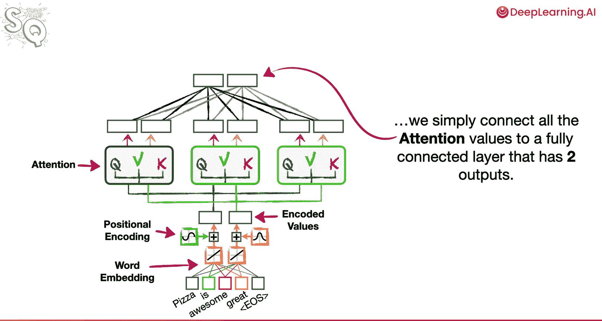

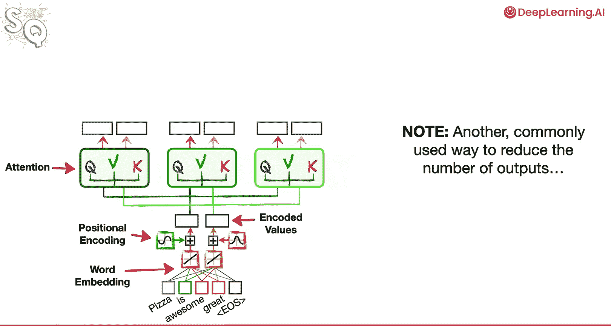

## 减少输出数量的另一种方法

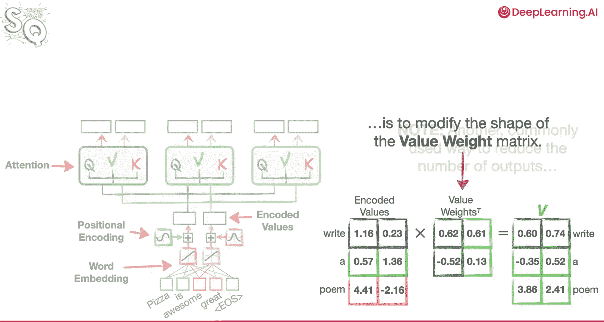

另一种常用的减少输出数量的方法是修改值权重矩阵的形状。

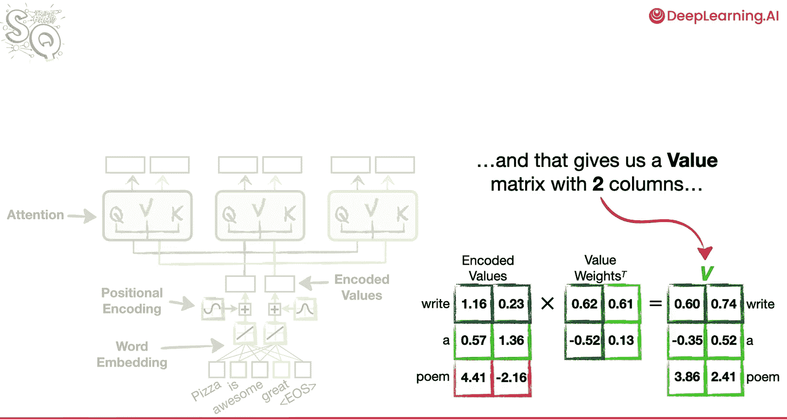

到目前为止，我们使用了一个具有两列权重的矩阵。这产生了一个具有两列的值矩阵。

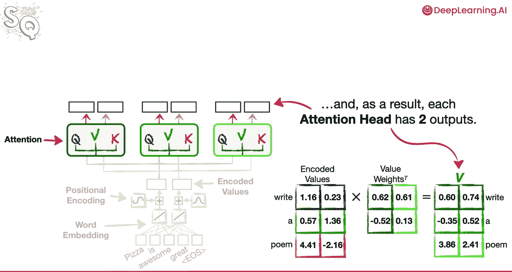

因此，每个注意力头有两个输出。

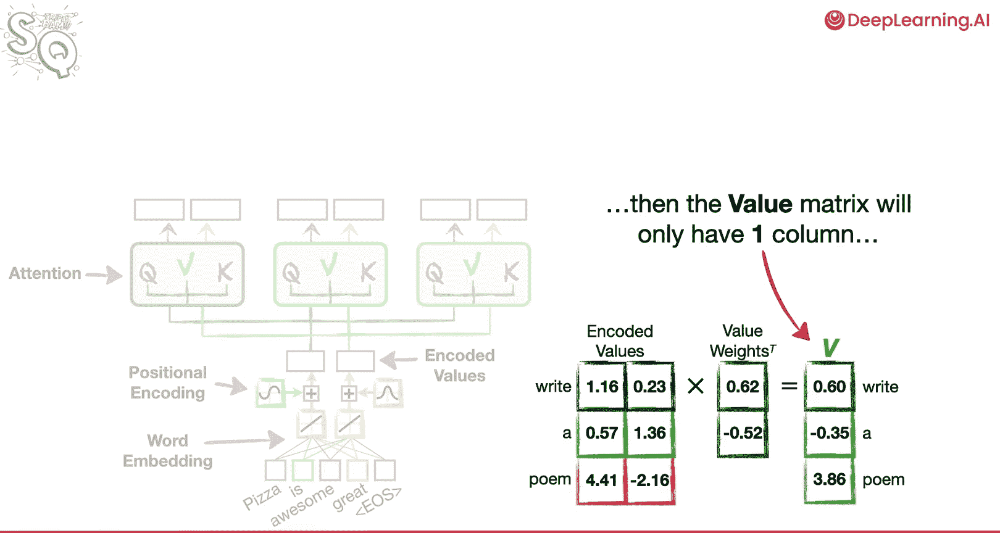

然而，如果我们只使用一列权重，那么值矩阵将只有一列。

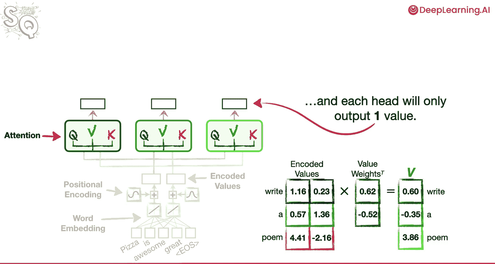

每个头将只输出一个值。

在这种情况下，由于我们开始时有两个编码值，我们最多需要两个头来恢复到相同的数量。或者，我们可以将Transformer编码得更灵活，以适应这些变化。

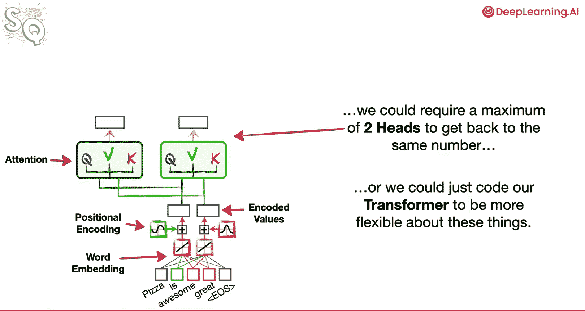

## 总结

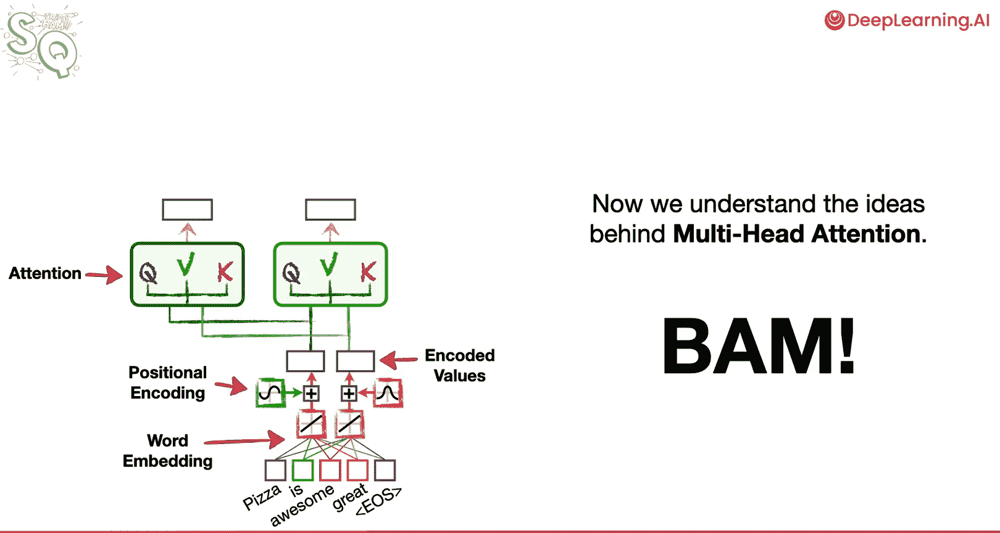

本节课中我们一起学习了多头注意力机制的核心思想。我们了解到，通过使用多个独立的注意力头，模型可以同时从不同的表示子空间捕获信息，从而更有效地处理复杂序列中的关系。多头注意力是Transformer架构强大能力的关键组成部分。