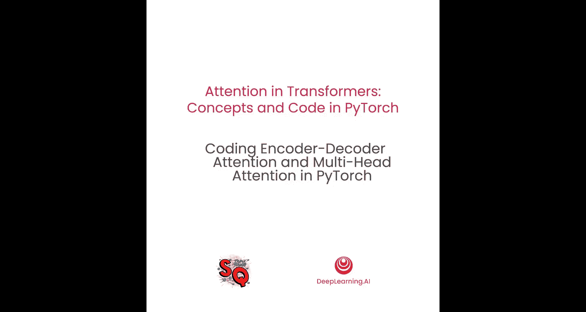
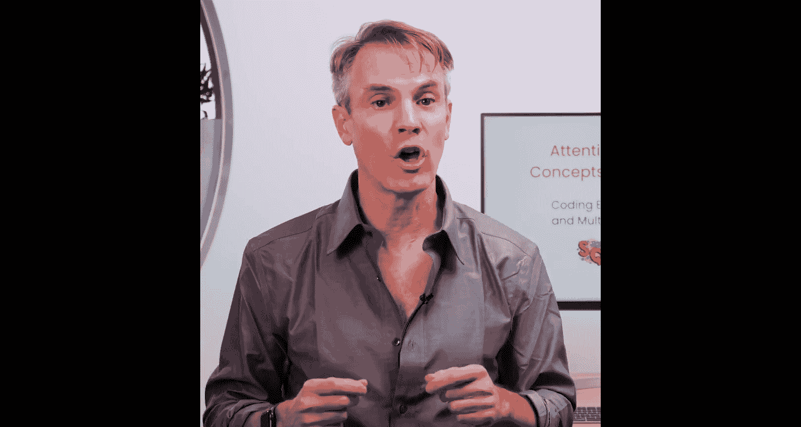
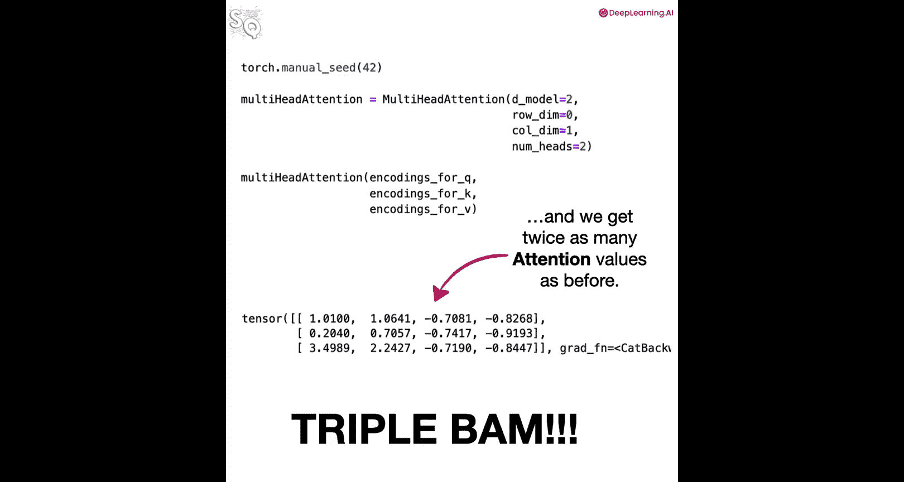

# 010：使用PyTorch实现编码器-解码器注意力与多头注意力

## 概述



在本节课中，我们将学习如何使用PyTorch编写一个类，该类能够实现自注意力、掩码自注意力以及编码器-解码器注意力。我们还将编写一个实现多头注意力的类。通过动手编码，我们将深入理解这些核心注意力机制的工作原理。

## 实现通用的注意力类

上一节我们介绍了注意力机制的基本概念，本节中我们来看看如何用代码实现一个通用的注意力类。

我们首先导入必要的库。



```python
import torch
import torch.nn as nn
import torch.nn.functional as F
```

接下来，我们定义一个名为 `Attention` 的类，它继承自 `nn.Module`。这个类将实现我们学过的三种注意力类型：自注意力、掩码自注意力和编码器-解码器注意力。

`__init__` 方法与之前编写的代码完全相同。

```python
class Attention(nn.Module):
    def __init__(self, d_model, d_k, d_v):
        super(Attention, self).__init__()
        self.d_k = d_k
        self.W_q = nn.Linear(d_model, d_k)
        self.W_k = nn.Linear(d_model, d_k)
        self.W_v = nn.Linear(d_model, d_v)
```

`forward` 方法有两处关键变化。首先，我们现在可以为查询、键和值指定不同的输入编码矩阵。其次，我们将这些可能不同的编码矩阵传递给相应的权重矩阵以生成查询、键和值。其余部分保持不变。

```python
    def forward(self, encodings_q, encodings_k, encodings_v):
        Q = self.W_q(encodings_q)
        K = self.W_k(encodings_k)
        V = self.W_v(encodings_v)
        scores = torch.matmul(Q, K.transpose(-2, -1)) / torch.sqrt(torch.tensor(self.d_k, dtype=torch.float32))
        attention_weights = F.softmax(scores, dim=-1)
        output = torch.matmul(attention_weights, V)
        return output
```

现在，让我们运行一些数据来验证它是否按预期工作。

我们使用与之前相同的令牌编码矩阵作为查询的输入。

```python
encodings_q = torch.tensor([[1.0, 0.0], [0.0, 1.0], [1.0, 1.0]])
```

然后，我们创建用于生成键和值的编码矩阵。在这个例子中，为了使结果易于与之前的比较，我让这些编码值相同。

```python
encodings_k = torch.tensor([[1.0, 0.0], [0.0, 1.0], [1.0, 1.0]])
encodings_v = torch.tensor([[1.0, 0.0], [0.0, 1.0], [1.0, 1.0]])
```

设置随机数种子以确保结果可复现。

```python
torch.manual_seed(42)
```

使用之前相同的参数创建我们的注意力类对象。

```python
attn = Attention(d_model=2, d_k=2, d_v=2)
```

最后，将编码矩阵传递给我们的注意力对象。

```python
output = attn(encodings_q, encodings_k, encodings_v)
print(output)
```

运行后，我们将得到注意力值。如果得到不同的结果，可以像之前一样通过手动计算来验证。

## 实现多头注意力类

理解了基础注意力类的实现后，本节我们来看看如何构建更强大的多头注意力机制。

我们首先定义一个名为 `MultiHeadAttention` 的类，它也继承自 `nn.Module`。

在 `__init__` 方法中，我们添加一个新的参数 `num_heads`，它表示我们想要的注意力头的数量。

```python
class MultiHeadAttention(nn.Module):
    def __init__(self, d_model, d_k, d_v, num_heads):
        super(MultiHeadAttention, self).__init__()
        self.num_heads = num_heads
```

与往常一样，接下来我们调用父类的 `__init__` 方法。然后，我们使用一个 `for` 循环来创建 `num_heads` 个注意力对象。

每个创建的注意力对象都用相同的 `d_model`、`d_k` 和 `d_v` 值进行初始化，并将它们存储在一个名为 `heads` 的 `ModuleList` 中。`ModuleList` 顾名思义，是一个我们可以索引的模块列表。

```python
        self.heads = nn.ModuleList([Attention(d_model, d_k, d_v) for _ in range(num_heads)])
```

`__init__` 方法中最后要做的是保存 `d_v` 参数，以便后续使用。

```python
        self.d_v = d_v
```

`forward` 方法接收编码矩阵，然后使用一个 `for` 循环将这些矩阵传递给每个注意力头。

每个头返回的注意力值随后被拼接起来并返回。

```python
    def forward(self, encodings_q, encodings_k, encodings_v):
        head_outputs = []
        for head in self.heads:
            head_output = head(encodings_q, encodings_k, encodings_v)
            head_outputs.append(head_output)
        # 沿最后一个维度拼接所有头的输出
        concatenated = torch.cat(head_outputs, dim=-1)
        return concatenated
```

以上就是实现多头注意力的全部代码。

现在，让我们运行一些数据来确保它按预期工作。

首先设置随机数种子。

```python
torch.manual_seed(42)
```

然后创建并初始化一个多头注意力对象。参数 `d_model`、`d_k` 和 `d_v` 与之前相同。我们将 `num_heads` 设置为 1，以查看是否能得到与之前单头注意力相同的结果。

```python
multi_head_attn_1 = MultiHeadAttention(d_model=2, d_k=2, d_v=2, num_heads=1)
```

接着传入我们之前制作的编码矩阵。

```python
output_1 = multi_head_attn_1(encodings_q, encodings_k, encodings_v)
print("Output with 1 head:\n", output_1)
```

我们应该得到与之前单头注意力相同的结果。

现在，让我们用两个头来做同样的事情。

重置随机数种子。

```python
torch.manual_seed(42)
```

创建一个新的 `num_heads` 等于 2 的多头注意力对象。

```python
multi_head_attn_2 = MultiHeadAttention(d_model=2, d_k=2, d_v=2, num_heads=2)
```

然后传递编码矩阵。

```python
output_2 = multi_head_attn_2(encodings_q, encodings_k, encodings_v)
print("Output with 2 heads:\n", output_2)
```

我们将得到之前两倍数量的注意力值（因为输出维度是 `d_v * num_heads`）。

## 总结



本节课中，我们一起学习了如何使用PyTorch实现一个通用的注意力类，该类支持自注意力、掩码自注意力和编码器-解码器注意力。我们还实现了一个多头注意力类，它通过并行运行多个注意力头来捕获输入序列中不同子空间的信息。通过具体的代码示例和测试，我们验证了这些类的正确性，为后续构建完整的Transformer模型打下了坚实的基础。