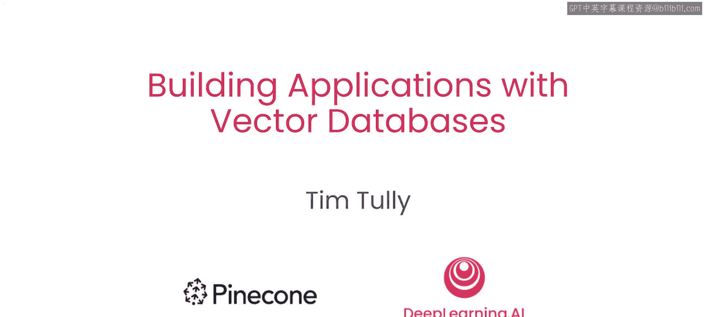
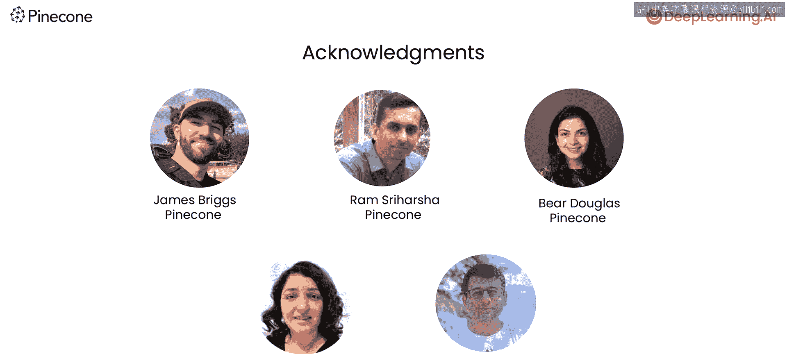

# 001：课程介绍 🚀

在本课程中，我们将学习如何使用向量数据库构建多种类型的应用程序。向量数据库已成为结合大型语言模型（特别是RAG，即检索增强生成）构建应用的关键基础设施。不仅如此，其应用范围实际上比普遍认知的更为广泛。

## 课程概述

向量数据库允许你输入一组向量（例如，在实现RAG时文档的嵌入向量），然后向其发送查询（例如，一个新文本查询的嵌入向量），以检索与你的查询相关的文档。正是这种能力，使得向量数据库成为RAG的关键组件，用于为LLM获取额外的上下文以生成响应。

然而，这种获取相似向量的能力，也使其对许多其他应用非常有用。例如，在图像相似性搜索中，你可以计算图像的嵌入向量，然后使用向量数据库快速找到相似图像。或者，你可以通过检查一个新项目是否有任何相似项来进行异常检测，如果没有，则它可能是一个异常点。

## 你将学习构建的应用

以下是本课程将涵盖的六个核心应用示例：

1.  **基础文本语义搜索**：你将从为文本文档构建一个基础的语义搜索应用开始。
2.  **RAG应用**：接下来，你将构建一个检索增强生成应用。
3.  **推荐系统**：然后，你将构建一个推荐系统。
4.  **混合搜索产品推荐**：你将实现一个用于产品推荐的混合搜索应用。
5.  **子-父图像相似性应用**：你将构建一个基于图像相似性的子-父关系应用。
6.  **异常检测应用**：最后，你将基于服务器日志数据集构建一个异常检测应用。

通过这些示例，你将学习如何使用向量数据库来存储和帮助你操作多种不同的数据。我们将从维基百科文本、人脸图片、问答文本、网络日志形式的结构化数据以及包含配对图像和文本的时尚数据中提取示例。

## 核心技术：混合搜索

你将学习到的一个很酷的技术是**混合搜索**。在这种技术中，你可以使用向量数据库来操作同时包含稀疏和密集分量的向量。

例如，在产品推荐场景中，你将看到如何同时使用服装图像的密集嵌入向量和文本描述的稀疏嵌入向量，以及如何调节一个控制向量稀疏部分与密集部分相对权重的“旋钮”。

其核心思想可以概括为：
**混合向量 = α * 稀疏向量 + β * 密集向量**
其中，α 和 β 是权重参数，用于平衡两种表示形式的影响。

## 课程资源与致谢

本课程是与Pinecone合作构建的。许多人为此课程的创建付出了努力，感谢Pinecone团队的James Bgg、Ra Shihasha和Bear Douglas，以及DeepLearning.AI的Dila Eadin和Eshma Gagari所做的贡献。

## 总结

在本介绍课中，我们一起了解了向量数据库的广泛应用前景以及本课程将涵盖的六个实践项目。从下一课开始，你将首先探索语义搜索的基础知识，这将是贯穿本课程其他课程的核心技能。掌握了向量数据库的基础知识并完成了这些应用构建后，相信你会发现更多值得探索的可能性。让我们进入下一个视频，开始学习吧！