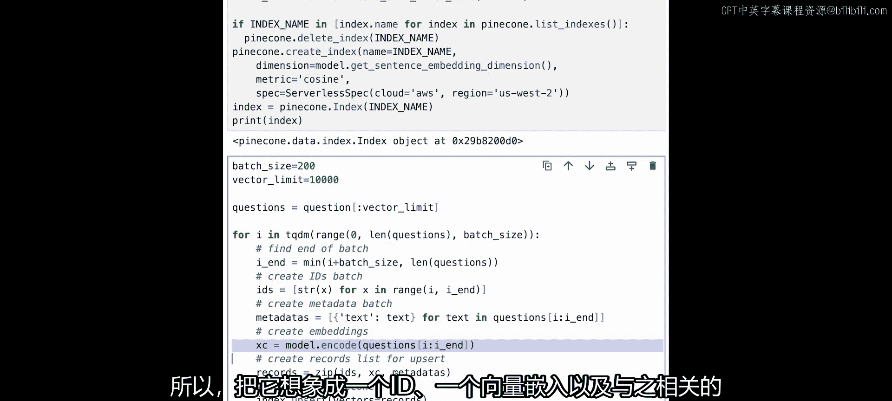
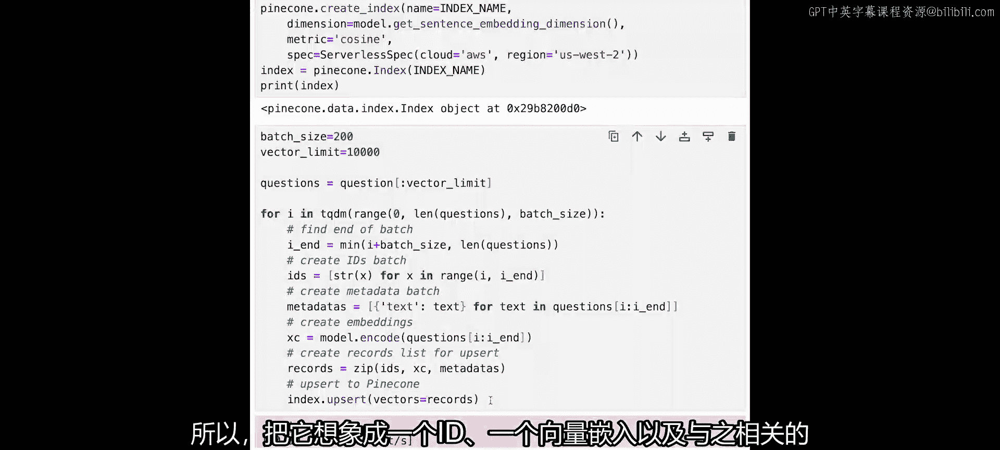
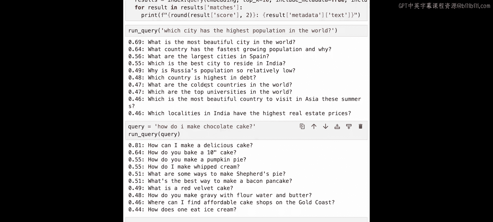

# 002：语义搜索 🔍


## 概述
在本节课中，我们将学习语义搜索的基本概念，并动手构建一个简单的语义搜索应用程序。我们将使用Pinecone向量数据库和Sentence Transformers模型，将文本数据转化为向量嵌入，并基于语义相似性进行检索。

---

## 什么是语义搜索？🤔


语义搜索是一种专注于搜索内容含义的搜索方式，这与词法搜索形成对比。

词法搜索寻找的是字符串的字面或模式匹配。

语义搜索是一个极其强大的构建模块，它是我们所见的大多数从文本到生成式AI应用的基础。

在接下来的课程中，我们将介绍向量数据库和语义搜索的基础知识。

---

## 构建语义搜索应用 🛠️

上一节我们介绍了语义搜索的概念，本节中我们来看看如何构建一个具体的应用。

我们将构建一个非常简单的语义搜索应用程序，使用Pinecone。

我们的流程是：从左侧的用户开始，下载一个核心数据集，将其转化为一系列向量嵌入，并存储在Pinecone中。

然后，我们将构建一个简单的问答响应系统。例如，我们可以提问“哪个国家人口最多？”。这将是一个足够通用的应用程序，你也可以向它提出多个问题。

---

## 准备数据与环境 📥

以下是构建应用的第一步：导入必要的库并准备数据。

```python
import warnings
warnings.filterwarnings('ignore')
from sentence_transformers import SentenceTransformer
from deeplearningai_utils import DLIUtils
from tqdm import tqdm
import pandas as pd
```

我们下载Quora数据集的一个子集，以便管理。

```python
data = pd.read_csv('quora_questions.csv')
data_subset = data.iloc[240000:290000]
```

查看数据的前几行，确认数据结构。

```python
print(data_subset.head())
```

数据中包含问题和问题标识符，看起来可用。接下来，我们提取所有问题。

```python
questions = []
for q in data_subset['question']:
    questions.append(q)
all_questions = '\n'.join(questions)
print('-' * 50)
print(all_questions[:500]) # 打印前500个字符作为示例
```

我们准备了大约100,000个问题。现在，开始将它们转化为嵌入向量。

---

## 生成向量嵌入 🔢

根据你的设备，你可能可以使用CUDA加速。如果没有，也没关系，因为我们的数据集不大。

我们使用Sentence Transformer模型将数据转化为嵌入向量。

```python
device = 'cuda' if torch.cuda.is_available() else 'cpu'
model = SentenceTransformer('all-MiniLM-L6-v2', device=device)
```

创建一个示例问题并查看其嵌入向量的维度。

```python
sample_question = "What is the capital of France?"
sample_embedding = model.encode(sample_question)
print(f"嵌入向量维度: {sample_embedding.shape}") # 应为 (384,)
```

现在，我们有了嵌入向量和数据，可以开始使用Pinecone了。

---

## 连接与配置Pinecone 🌲

我们使用一个辅助工具`DLIUtils`来管理API密钥。

```python
utils = DLIUtils()
api_key = utils.get_pinecone_api_key()
```

连接到Pinecone。Pinecone V3采用了单例对象模式。

```python
import pinecone
pinecone.init(api_key=api_key)
```

进行一些清理工作，删除可能存在的旧索引，然后创建新索引。

```python
index_name = utils.create_index_name()
if index_name in pinecone.list_indexes():
    pinecone.delete_index(index_name)

pinecone.create_index(
    name=index_name,
    dimension=384,
    metric='cosine',
    spec=pinecone.ServerlessSpec(cloud='aws', region='us-west-2')
)

index = pinecone.Index(index_name)
print(index)
```

索引创建完成后，我们就可以上传数据了。

---

## 上传数据到Pinecone ⬆️

我们将分批上传数据，每批200条，总共上传10,000条。





以下是上传数据的步骤：

1.  获取数据子集。
2.  遍历问题。
3.  为每个向量生成唯一ID。
4.  在元数据中存储原始问题文本。
5.  使用模型生成向量嵌入。
6.  将ID、向量和元数据打包成元组。
7.  使用`zip`函数整理数据并上传到Pinecone。

```python
batch_size = 200
max_vectors = 10000
questions_to_upload = questions[:max_vectors]

for i in tqdm(range(0, len(questions_to_upload), batch_size)):
    i_end = min(i + batch_size, len(questions_to_upload))
    batch_ids = [str(x) for x in range(i, i_end)]
    batch_metadata = [{'text': q} for q in questions_to_upload[i:i_end]]
    batch_embeddings = model.encode(questions_to_upload[i:i_end]).tolist()
    vectors_to_upsert = zip(batch_ids, batch_embeddings, batch_metadata)
    index.upsert(vectors=list(vectors_to_upsert))
```

上传完成后，检查索引状态。

```python
print(index.describe_index_stats())
```

应该看到我们有10,000个向量。

---

## 执行语义查询 ❓

现在进入最激动人心的部分：提问。我们定义一个简单的查询函数。

该函数执行以下操作：
1.  接收文本问题。
2.  将其转化为嵌入向量。
3.  在Pinecone索引中查询最相似的K个结果。
4.  返回并显示相关的文本问题。

```python
def run_query(query_text, top_k=10):
    query_embedding = model.encode(query_text).tolist()
    results = index.query(
        vector=query_embedding,
        top_k=top_k,
        include_metadata=True,
        include_values=False
    )
    for match in results['matches']:
        print(f"相似度: {match['score']:.4f} - 问题: {match['metadata']['text']}")
```

让我们运行几个查询来测试系统。

```python
print("查询: 哪个城市人口最多？")
run_query("Which city has the highest population in the world?")
print("\n" + "-"*50 + "\n")

print("查询: 如何制作巧克力蛋糕？")
run_query("How do I make chocolate cake?")
```

系统会返回语义上相似的问题，例如“世界上最美的城市是哪个？”或“如何制作美味的蛋糕？”，这证明了我们基于含义的搜索是有效的。

---

## 总结 🎯

本节课中我们一起学习了语义搜索的原理，并从头到尾构建了一个语义搜索系统。

我们使用Pinecone向量数据库存储了从Quora问题标题生成的嵌入向量，并创建了一个可扩展、可重复使用的查询系统。



在下一节课中，我们将使用Pinecone和OpenAI构建一个检索增强生成系统。