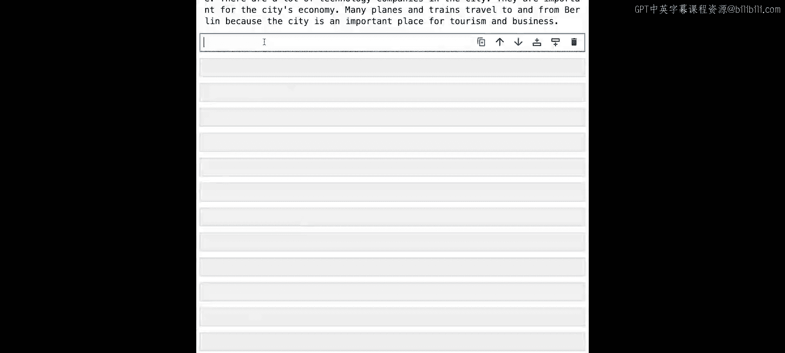
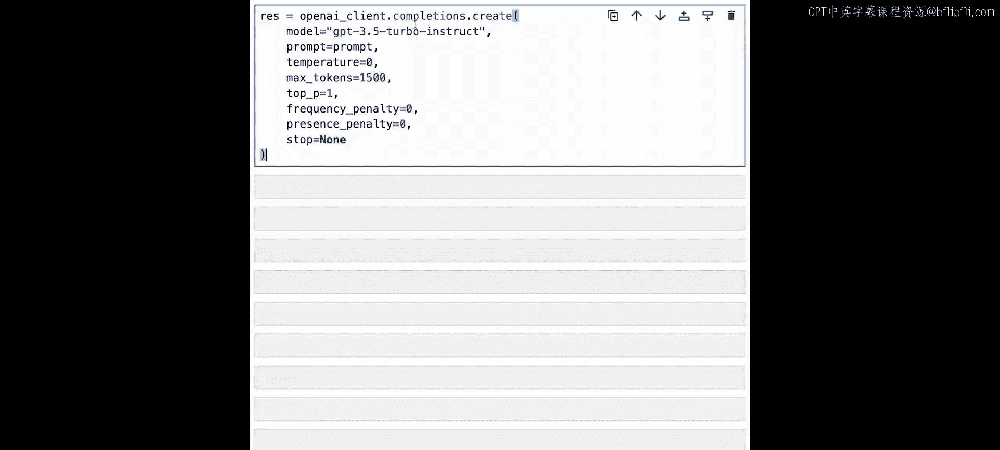

# 003：检索增强生成 (RAG) 🧠

在本节课中，我们将使用 Pinecone 和 OpenAI 构建一个 RAG（检索增强生成）系统。我们将处理一个维基百科文章样本数据集，为文章创建向量嵌入，然后从 Pinecone 进行简单的文档检索以查看搜索结果。最后，我们将利用 OpenAI 基于这些检索结果生成一篇结构清晰、内容精炼的文章。

## 概述

我们将构建一个经典的 RAG 系统。系统流程如下：用户提出一个问题（例如“柏林墙是什么？”），系统会从我们预先准备并存储在 Pinecone 中的数据集中检索相关文档。与之前课程不同，这次我们不仅会得到长文档，还会通过提示工程，将这些检索结果发送给 OpenAI，从而获得一个经过总结、书写优美的回答。这就是 RAG 的核心思想。

## 准备工作

首先，我们导入必要的包并设置环境。

```python
import warnings
warnings.filterwarnings('ignore')
```

我们导入所需的包，包括一个用于管理 OpenAI 和 Pinecone 密钥的实用工具包 `dlai_utils`。

```python
import dlai_utils
```

接下来，设置 Pinecone。我们获取 API 密钥并连接到 Pinecone 服务。

```python
# 获取 Pinecone API 密钥
pc_api_key = dlai_utils.get_pinecone_api_key()

# 连接到 Pinecone
import pinecone
pinecone.init(api_key=pc_api_key, environment='us-west1-gcp')
```

然后，我们获取索引名称，如果索引已存在则删除它，再创建一个新索引，并获取指向该索引的指针。

```python
# 获取索引名称
index_name = dlai_utils.get_index_name()

# 删除已存在的索引（如果存在）
if index_name in pinecone.list_indexes():
    pinecone.delete_index(index_name)

# 创建新索引
pinecone.create_index(name=index_name, dimension=1536, metric='cosine')

# 获取索引对象
index = pinecone.Index(index_name)
```

## 加载与查看数据

数据已预先准备好。我们下载一个包含维基百科文章的压缩 CSV 文件，解压后使用 pandas 将其加载为 DataFrame。

```python
# 下载数据文件
!wget -q -O lesson2_wiki.csv.zip https://example.com/path/to/file # 示例URL

# 解压文件
import zipfile
with zipfile.ZipFile("lesson2_wiki.csv.zip", 'r') as zip_ref:
    zip_ref.extractall(".")

# 使用 pandas 读取 CSV 文件
import pandas as pd
df = pd.read_csv("lesson2_wiki.csv")

# 查看数据前几行
print(df.head())
```

数据包含以下几列：
*   `id`: 数据的唯一标识符。
*   `metadata`: 包含文章来源和内容的元数据。
*   `values`: 向量嵌入本身，即一列浮点数。

## 准备并上传向量嵌入

现在，我们将准备数据格式并将其上传到 Pinecone 索引中。

以下是准备每条向量记录的过程：

```python
from ast import literal_eval
import tqdm

prepped = []
for i, row in tqdm.tqdm(df.iterrows(), total=len(df)):
    # 从字符串解析元数据字典
    metadata = literal_eval(row['metadata'])
    # 构建符合 Pinecone 格式的向量记录
    vector_record = (
        row['id'],           # 唯一ID
        row['values'],       # 向量嵌入值
        metadata             # 元数据
    )
    prepped.append(vector_record)
```

一个 Pinecone 向量记录本质上是一个包含三部分的元组：
1.  `id`: 唯一标识符。
2.  `values`: 向量嵌入（浮点数列表）。
3.  `metadata`: 与向量关联的元数据（例如文章信息）。

为了高效上传，我们将数据分批处理，每批 200 个向量。

```python
batch_size = 200

for i in range(0, len(prepped), batch_size):
    # 获取当前批次
    i_end = min(i + batch_size, len(prepped))
    batch = prepped[i:i_end]
    # 上传批次到索引
    index.upsert(vectors=batch)

print("数据上传完成。")
```

上传完成后，我们可以验证索引中的向量数量。

```python
# 描述索引统计信息
stats = index.describe_index_stats()
print(f"索引中共有 {stats['total_vector_count']} 个向量。")
```

## 设置 OpenAI 并执行查询

现在，我们设置 OpenAI 来生成嵌入和完成文本。

```python
# 获取 OpenAI API 密钥
openai_api_key = dlai_utils.get_openai_api_key()

# 设置 OpenAI 客户端
import openai
openai.api_key = openai_api_key

# 定义一个辅助函数来获取文本的嵌入向量
def get_embedding(texts, model="text-embedding-ada-002"):
    response = openai.Embedding.create(input=texts, model=model)
    return [data['embedding'] for data in response['data']]
```

一切就绪，我们可以开始执行查询了。让我们以“柏林墙是什么？”为例。


首先，为查询问题生成向量嵌入。



```python
query = "What is the Berlin Wall?"
query_embedding = get_embedding([query])[0]
```

接着，在 Pinecone 索引中查询最相似的文档。

```python
# 查询 Pinecone
results = index.query(
    vector=query_embedding,
    top_k=3,                # 返回最相似的3个结果
    include_metadata=True   # 在结果中包含元数据
)

# 从结果中提取文本内容
context_texts = [match['metadata']['text'] for match in results['matches']]
# 将文本用换行符连接以便查看
print("\n--- 检索到的文档片段 ---\n")
print("\n---\n".join(context_texts))
```

## 构建提示并进行总结

上一节我们介绍了如何从 Pinecone 检索相关文档。本节中，我们来看看如何利用这些文档，通过提示工程构建一个查询，并让 OpenAI 生成一篇总结性文章。

我们从 Pinecone 返回的结果中提取文本，作为生成回答的上下文。

以下是构建提示的步骤：

```python
# 构建提示工程
prompt_start = "Answer the question based on the context below.\n\nContext:\n"
prompt_end = f"\n\nQuestion: {query}\nAnswer:"

# 将上下文文本连接起来
context = "\n\n---\n\n".join(context_texts)

# 组合成完整的提示
prompt = prompt_start + context + prompt_end


print("\n--- 发送给 OpenAI 的完整提示 ---\n")
print(prompt)
```



现在，我们将这个精心构建的提示发送给 OpenAI 的完成 API，以生成最终的回答。

```python
# 调用 OpenAI API 生成回答
response = openai.Completion.create(
    model="gpt-3.5-turbo-instruct",  # 使用的模型
    prompt=prompt,
    max_tokens=1500,                  # 生成回答的最大长度
    temperature=0.7                   # 控制创造性的参数
)

# 提取并打印生成的回答
generated_answer = response.choices[0].text.strip()
print("\n" + "="*50)
print("生成的总结文章：")
print("="*50 + "\n")
print(generated_answer)
```

## 总结


在本节课中，我们一起学习了如何构建一个完整的 RAG 系统。我们首先将文档数据转换为向量嵌入并存储到 Pinecone 中。当用户提出问题时，系统会从 Pinecone 检索出最相关的文档片段。然后，我们通过提示工程，将这些片段作为上下文与问题一起组合成完整的提示，发送给 OpenAI。最终，我们获得了一篇基于检索内容、书写流畅的总结性文章。这个过程展示了如何将检索能力与大型语言模型的生成能力相结合，以产生更准确、信息更丰富的回答。在下一节课中，我们将探索如何构建一个基础的推荐系统。