# 004：推荐系统 📚


在本节课中，我们将基于之前课程所学，构建一个简单的新闻文章推荐系统。我们将使用一个新闻文章样本数据集，首先基于文章标题生成向量嵌入并构建推荐系统，然后进一步扩展到基于文章内容本身来构建推荐系统。

---


## 数据准备与导入

首先，我们需要导入必要的库并设置环境。与之前的课程类似，我们将使用DeepLearning.AI和Pinecone的相关工具包。

```python
# 导入必要的包
import warnings
warnings.filterwarnings('ignore')
from deeplearning_ai_utils import *
import pandas as pd
from tqdm.auto import tqdm
import openai
```

接下来，设置Pinecone和OpenAI的API密钥，并连接到Pinecone服务。

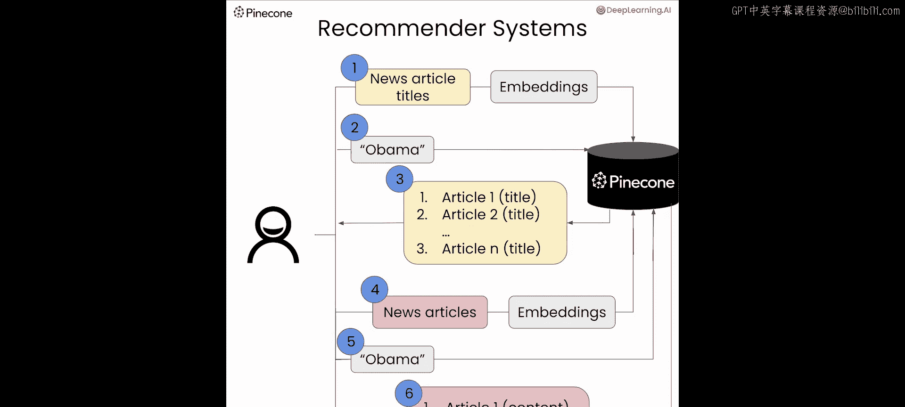

```python
# 设置Pinecone和OpenAI
dlai_tools = DLAIUtils()
PINECONE_API_KEY = dlai_tools.get_pinecone_api_key()
OPENAI_API_KEY = dlai_tools.get_openai_api_key()

openai.api_key = OPENAI_API_KEY
```

我们将使用一个名为“all-the-news-3.zip”的数据集，其中包含新闻文章。下载并解压后，我们查看其结构。

```python
# 加载数据
df = pd.read_csv('all-the-news-3.csv', nrows=99)
print(df.head())
```

数据包含日期、作者、标题和文章内容等列。我们主要关注`title`和`article`两列。

---

## 基于标题的推荐系统 🏷️

上一节我们准备好了数据，本节中我们来看看如何基于文章标题构建推荐系统。核心思路是将文章标题转换为向量嵌入，存储到Pinecone中，然后通过查询找到最相关的标题。

### 创建Pinecone索引

以下是创建和准备Pinecone索引的步骤。

```python
# 获取索引名称并连接到Pinecone
index_name = dlai_tools.get_pinecone_index('news')
pinecone.init(api_key=PINECONE_API_KEY, environment='us-west1-gcp')

# 如果索引已存在则删除，然后重新创建
if index_name in pinecone.list_indexes():
    pinecone.delete_index(index_name)
pinecone.create_index(name=index_name, dimension=1536, metric='cosine')
index = pinecone.Index(index_name)
```

### 生成嵌入并上传数据

我们需要一个函数来获取文本的嵌入向量。然后，我们将分批读取数据，为每个标题生成嵌入，并上传到Pinecone。

以下是生成嵌入的辅助函数：

```python
def get_embeddings(articles):
    response = openai.Embedding.create(
        model="text-embedding-ada-002",
        input=articles
    )
    return [data['embedding'] for data in response['data']]
```

以下是准备和插入数据的主要循环逻辑：

```python
# 分批读取数据并上传嵌入
chunk_size = 400
max_rows = 20000
prep = []
chunk_num = 0

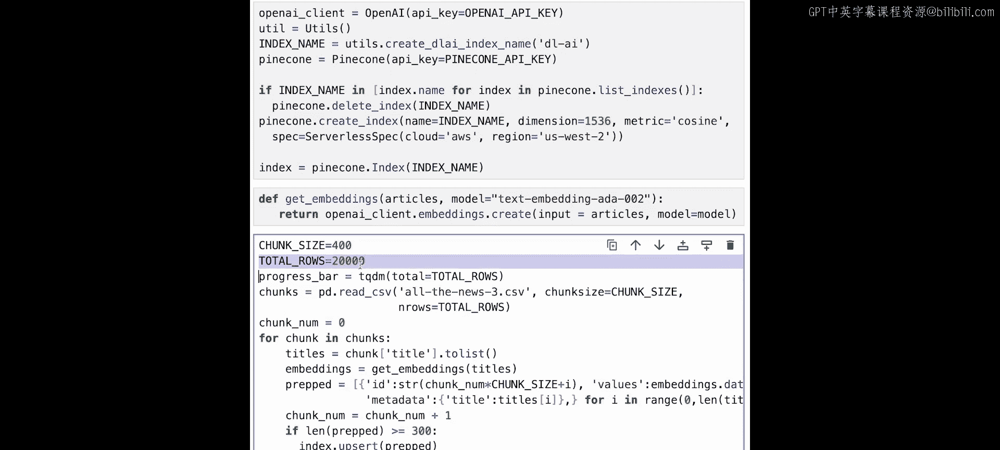

with tqdm(total=max_rows) as pbar:
    for chunk in pd.read_csv('all-the-news-3.csv', chunksize=chunk_size, nrows=max_rows):
        titles = chunk['title'].tolist()
        embeds = get_embeddings(titles)
        for i in range(len(titles)):
            prep.append((str(chunk_num), embeds[i], {'title': titles[i]}))
            chunk_num += 1
        if len(prep) >= 300:
            index.upsert(vectors=prep)
            prep = []
        pbar.update(len(chunk))
    if prep:  # 上传剩余向量
        index.upsert(vectors=prep)
```

这个过程将20,000个标题的向量嵌入上传到了Pinecone。

### 执行查询与获取推荐

现在，我们可以定义一个函数来根据查询词获取推荐。

```python
def get_recommendations(index, search_term, top_k=10):
    # 获取查询词的嵌入
    query_embedding = get_embeddings([search_term])[0]
    # 查询Pinecone索引
    results = index.query(vector=query_embedding, top_k=top_k, include_metadata=True)
    return results
```

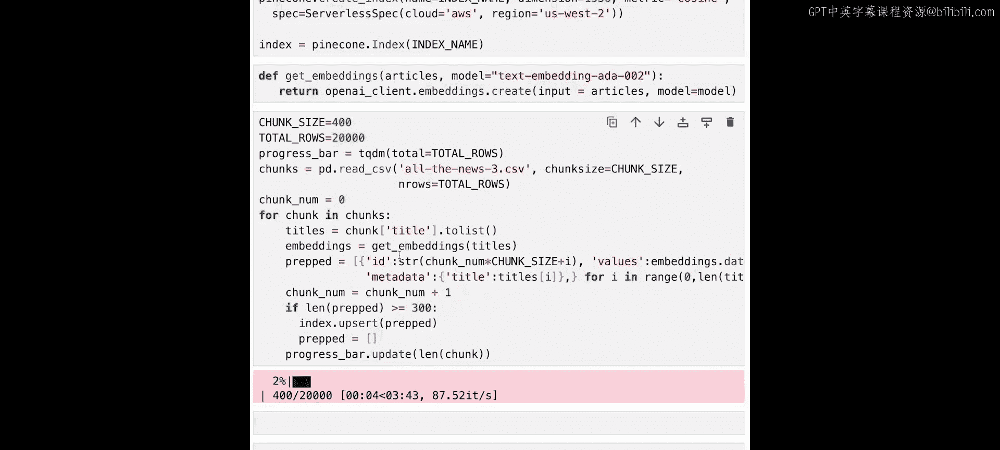

让我们搜索与“Obama”相关的文章标题。

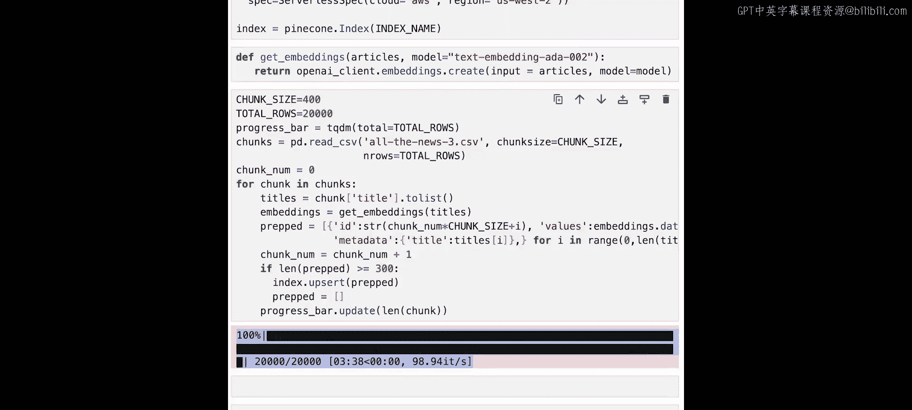

```python
# 获取关于“Obama”的推荐
recommendations = get_recommendations(index, "Obama")
for match in recommendations['matches']:
    print(f"Score: {match['score']:.4f}")
    print(f"Title: {match['metadata']['title']}")
    print()
```

系统会返回与“Obama”最相关的文章标题及其相似度分数。

---

## 基于文章内容的推荐系统 📄

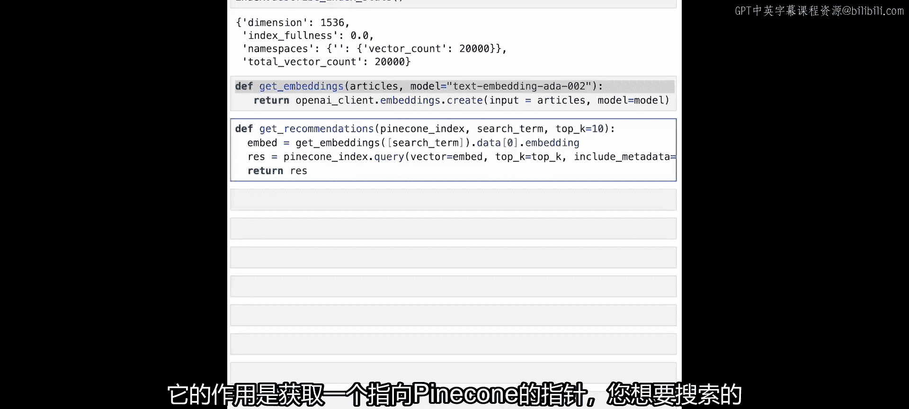

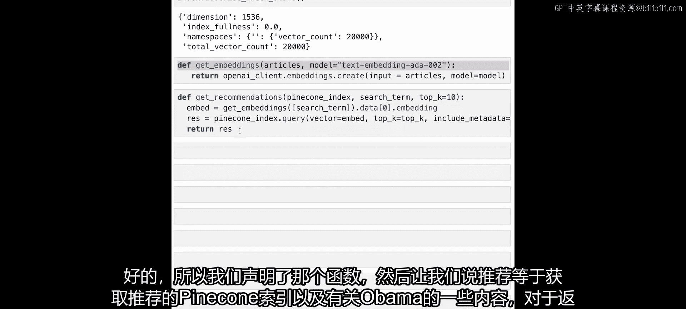

基于标题的搜索效果很好，但有时标题不能完全反映文章内容。本节中，我们将构建一个更强大的系统，基于整篇文章的内容进行推荐。

### 重新准备索引与数据

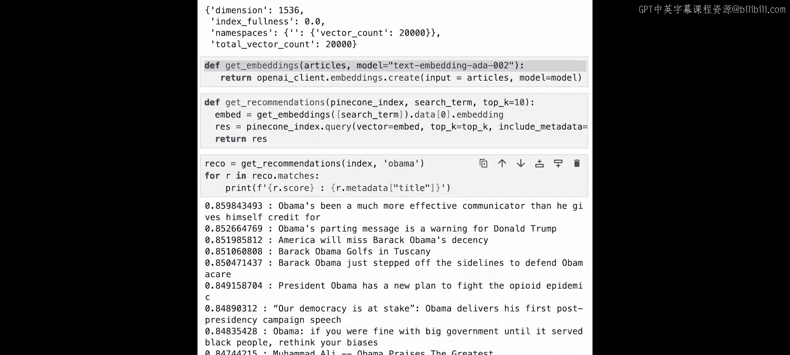

首先，我们需要清除旧的索引，并创建一个新的来存储基于内容的嵌入。

```python
# 删除旧索引并创建新索引
if index_name in pinecone.list_indexes():
    pinecone.delete_index(index_name)
pinecone.create_index(name=index_name, dimension=1536, metric='cosine')
index = pinecone.Index(index_name)
```

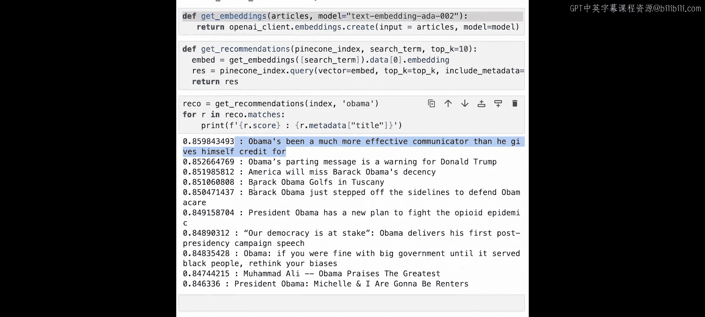

### 处理文章内容并分块

由于文章可能很长，我们需要将其分割成更小的块（chunks），然后为每个块生成嵌入。这里使用LangChain的文本分割器。

```python
from langchain.text_splitter import RecursiveCharacterTextSplitter

text_splitter = RecursiveCharacterTextSplitter(
    chunk_size=400,
    chunk_overlap=20,
    length_function=len,
)
```

接下来，我们定义一个函数来处理文章块并管理向量的上传。

```python
def embed_chunks(text_chunks, titles, prep_list, embed_counter):
    # 为文本块生成嵌入
    embeds = get_embeddings(text_chunks)
    for i in range(len(text_chunks)):
        # 准备向量数据，包含标题和原始文本块
        prep_list.append((
            str(embed_counter),
            embeds[i],
            {'title': titles[i], 'text': text_chunks[i]}
        ))
        embed_counter += 1
        # 达到批次大小时上传
        if len(prep_list) >= 300:
            index.upsert(vectors=prep_list)
            prep_list.clear()
    return embed_counter, prep_list
```

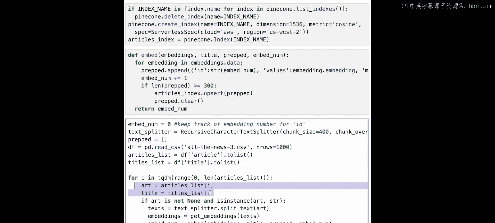

现在，遍历数据集，处理每篇文章。

```python
prep = []
embed_counter = 0
seen_titles = set()  # 用于去重

for idx, row in tqdm(df.iterrows(), total=min(1000, len(df))):  # 处理前1000行作为示例
    article = row['article']
    title = row['title']
    if pd.isna(article):
        continue
    # 分割文章内容
    chunks = text_splitter.split_text(article)
    # 为每个块生成嵌入并准备上传
    embed_counter, prep = embed_chunks(chunks, [title]*len(chunks), prep, embed_counter)

# 上传最后一批向量
if prep:
    index.upsert(vectors=prep)
```

这个过程将文章内容分块并上传了约10,500个向量嵌入。

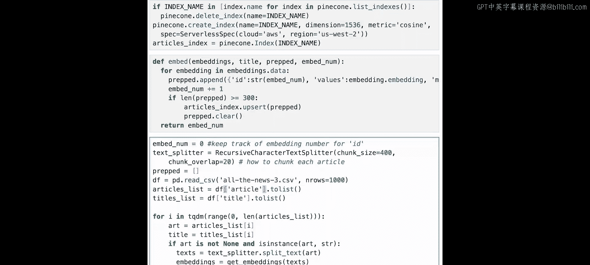

### 执行基于内容的查询

查询函数与之前类似，但返回结果后我们需要根据标题进行去重，以避免同一篇文章的不同块被重复显示。

```python
def get_content_recommendations(index, search_term, top_k=10):
    query_embedding = get_embeddings([search_term])[0]
    results = index.query(vector=query_embedding, top_k=top_k*2, include_metadata=True)  # 多查一些用于去重
    return results

# 获取基于内容的推荐
recommendations = get_content_recommendations(index, "Obama")
seen = {}
for match in recommendations['matches']:
    title = match['metadata']['title']
    if title not in seen:
        print(f"Score: {match['score']:.4f}")
        print(f"Title: {title}")
        print(f"Snippet: {match['metadata']['text'][:200]}...")  # 打印内容片段
        print()
        seen[title] = True
    else:
        print(f"Already seen: {title}")
```

这次返回的结果是基于文章内容与“Obama”的相关性，而不仅仅是标题，因此结果集会有所不同。

---

## 总结 🎯

本节课中我们一起学习了如何利用向量数据库构建两种类型的推荐系统：
1.  **基于标题的推荐**：将文章标题转换为向量，实现快速的相关标题检索。
2.  **基于内容的推荐**：将长篇文章分割成块，为每个内容块创建向量嵌入，从而实现更深入、更准确的语义搜索，并能有效去重。

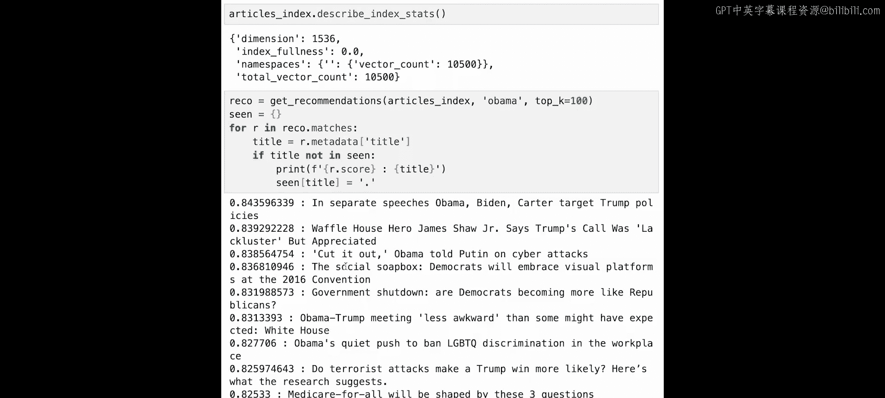

我们掌握了使用Pinecone存储嵌入、使用OpenAI生成嵌入以及使用LangChain处理文本的核心流程。在下一节课中，我们将探索**混合搜索**，结合关键词匹配和向量搜索的优势，以构建更强大的检索系统。