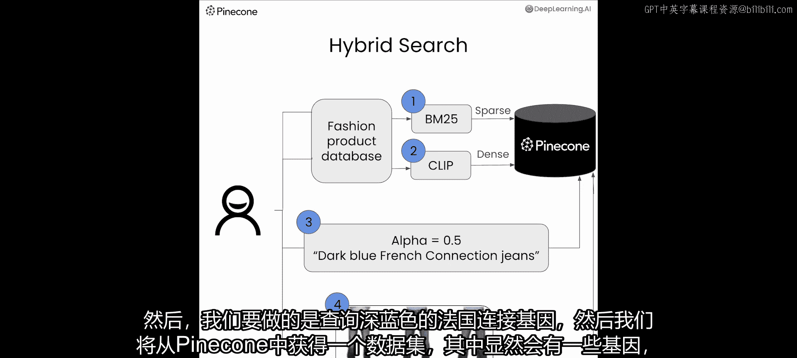
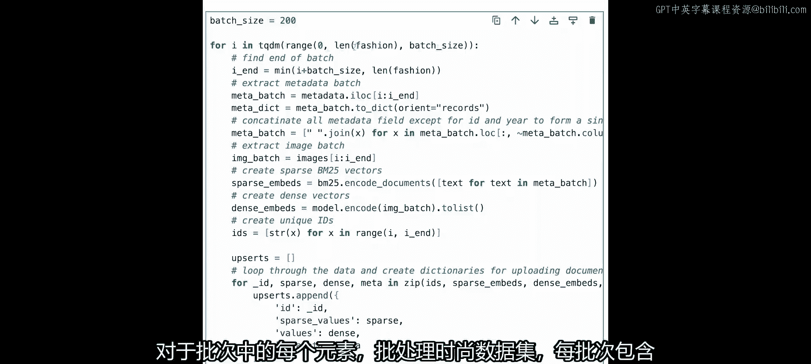
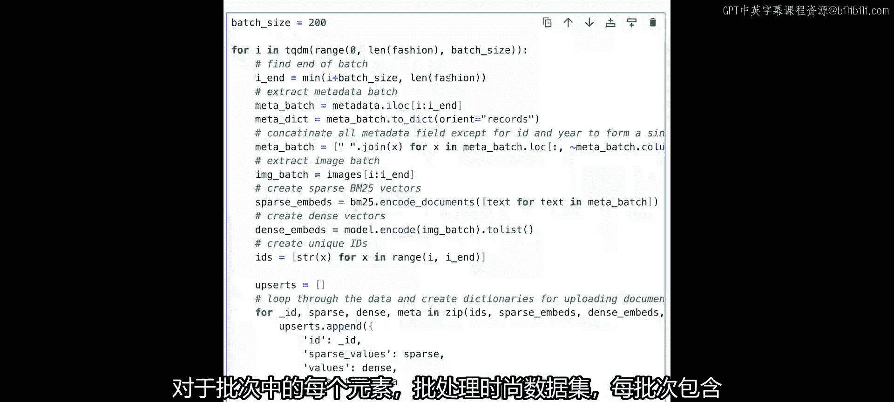
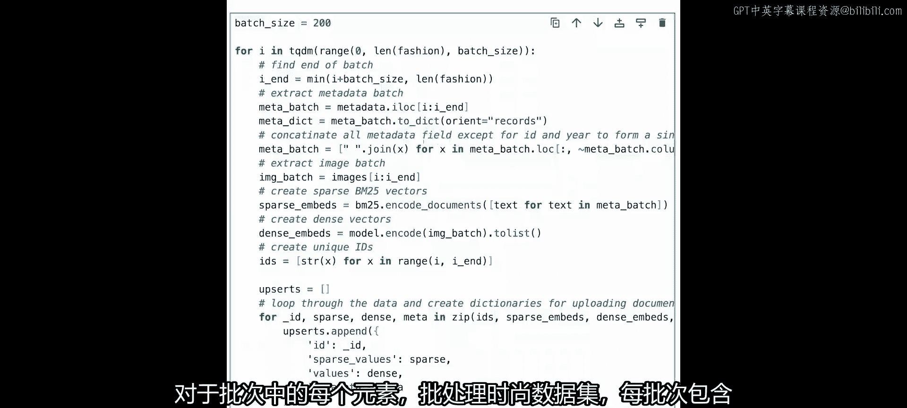
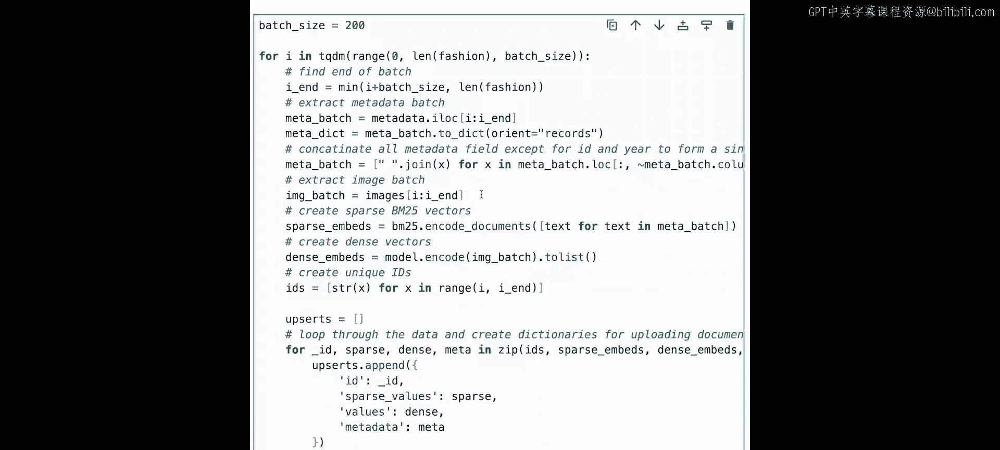
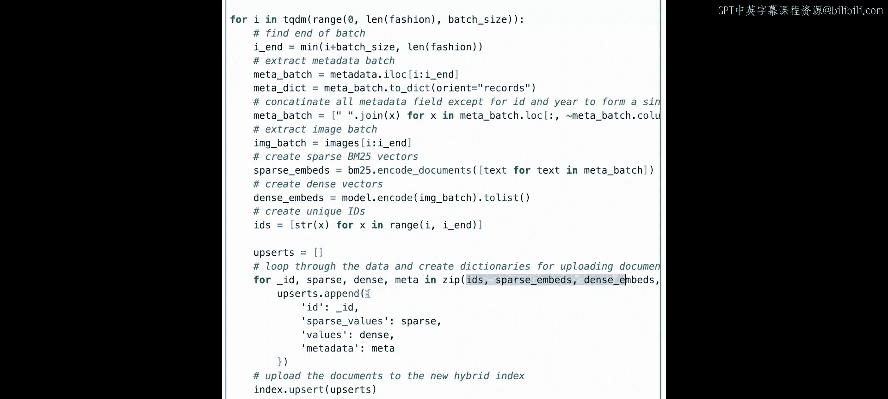
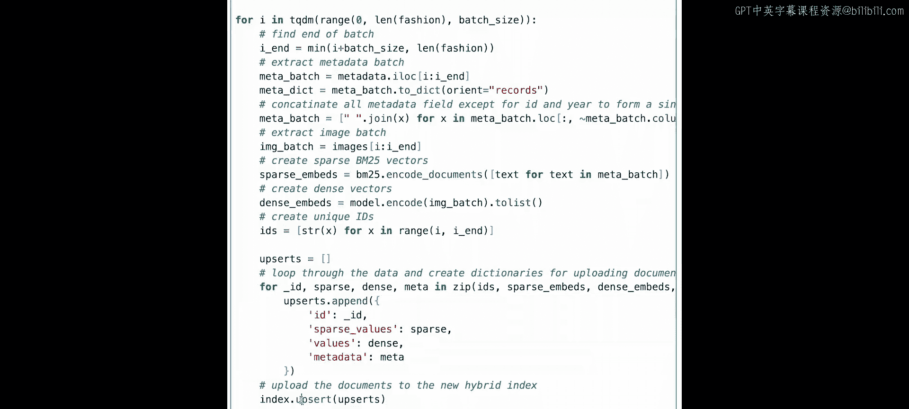
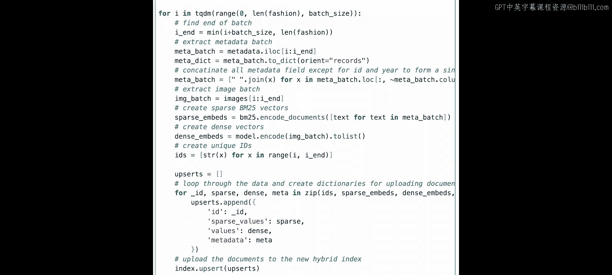
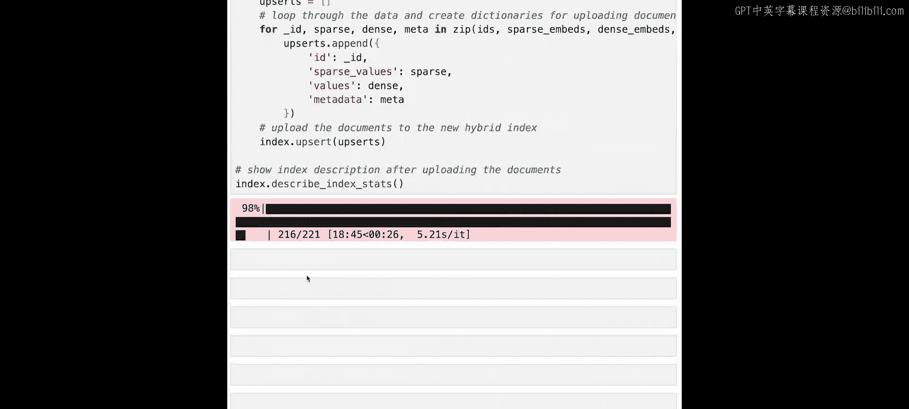
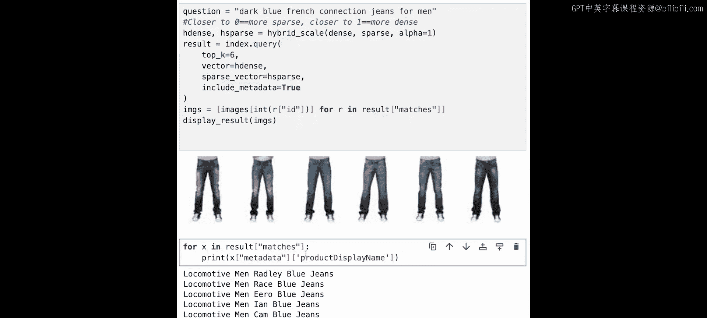

# 005：混合搜索 🔍


在本节课中，我们将学习混合搜索。你将利用Pinecone的一项功能，该功能允许索引条目同时拥有稠密向量和稀疏向量。这意味着我们可以同时对稀疏向量和稠密向量进行搜索。为此，我们将利用BM25和CLIP从时尚产品数据中生成向量，以便同时搜索文本和图像产品描述。


## 概述

上一节我们介绍了基础的向量搜索。本节中，我们将看看如何结合两种不同类型的向量表示——稀疏向量和稠密向量——来进行更强大的混合搜索。我们将使用一个时尚产品数据集，通过BM25算法生成稀疏向量，通过CLIP模型生成稠密向量，并将它们一同存储在Pinecone中。

## 环境设置与数据准备

首先，我们需要导入必要的库并设置环境。

```python
import warnings
warnings.filterwarnings(‘ignore’)
# 导入所需包，包括用于生成稀疏向量的BM25编码器
from pinecone_text.sparse import BM25Encoder
```

接着，我们获取Pinecone API密钥并连接到索引。这次，我们将相似度计算指标从余弦相似度改为点积。



```python
# 创建Pinecone索引，使用点积作为相似度度量
index_name = “hybrid-search-demo”
if index_name in pinecone.list_indexes():
    pinecone.delete_index(index_name)
pinecone.create_index(name=index_name, metric=“dotproduct”, dimension=512)
index = pinecone.Index(index_name)
```

现在，让我们载入数据集。我们使用Hugging Face上的小型时尚产品图像数据集。

```python
from datasets import load_dataset
fashion = load_dataset(“ashraq/fashion-product-images-small”, split=“train”)
# 查看数据集结构
print(fashion)
```

查看一下数据样本和元数据。

```python
# 查看一条数据样本
sample = fashion[900]
print(sample)
# 将元数据转换为Pandas DataFrame以便查看
import pandas as pd
metadata = fashion.remove_columns([‘image’]).to_pandas()
print(metadata.head())
```

我们的数据集包含产品ID、性别、主类别、子类别和文章类型等信息。

## 生成稀疏向量与稠密向量

接下来，我们将为数据生成两种向量。

### 稀疏向量：BM25编码

BM25是一种基于词频的信息检索技术，用于生成文本的稀疏向量表示。

以下是创建和训练BM25编码器的步骤：

```python
# 1. 初始化BM25编码器
bm25 = BM25Encoder()
# 2. 使用产品显示名称数据来拟合编码器
bm25.fit(metadata[‘productDisplayName’])
# 3. 编码一个示例查询
sparse_query_vector = bm25.encode_queries(“dark blue French connection jeans for men”)
print(“稀疏查询向量示例：”, sparse_query_vector)
# 4. 编码文档（产品名称）以用于索引
sparse_doc_vectors = bm25.encode_documents(metadata[‘productDisplayName’].tolist())
```

### 稠密向量：CLIP编码

CLIP是一个由OpenAI开发的神经网络，能够理解图像和文本的关联。我们将使用`sentence-transformers`库中的CLIP模型来生成图像的稠密向量。

以下是生成稠密向量的步骤：

```python
from sentence_transformers import SentenceTransformer
# 1. 加载CLIP模型
model = SentenceTransformer(‘clip-ViT-B-32’)
# 2. 为图像生成稠密向量
# 注意：模型.encode()方法可以直接处理图像
dense_vector = model.encode([fashion[0][‘image’]])
print(“稠密向量维度：”, dense_vector.shape)
```

## 上传混合向量到Pinecone

现在，我们将把生成的稀疏向量和稠密向量一同上传到Pinecone索引中。这是混合搜索的核心：每个数据条目同时拥有两种向量表示。

以下是批量上传向量的代码流程：





```python
from tqdm.auto import tqdm





batch_size = 200

for i in tqdm(range(0, len(fashion), batch_size)):
    # 获取批次数据
    i_end = min(i+batch_size, len(fashion))
    batch = fashion[i:i_end]
    # 提取元数据
    meta_batch = batch.remove_columns([‘image’])
    meta_dict = meta_batch.to_pandas().to_dict(orient=‘records’)
    # 提取图像
    image_batch = [item[‘image’] for item in batch]
    # 为批次生成稀疏向量
    sparse_embeds = bm25.encode_documents([item[‘productDisplayName’] for item in meta_dict])
    # 为批次生成稠密向量
    dense_embeds = model.encode(image_batch).tolist()
    # 创建唯一ID
    ids = [item[‘id’] for item in meta_dict]
    # 准备上传数据，同时包含稀疏和稠密向量
    upserts = []
    for _id, sparse_vec, dense_vec, metadata in zip(ids, sparse_embeds, dense_embeds, meta_dict):
        upserts.append({
            ‘id’: str(_id),
            ‘sparse_values’: sparse_vec,
            ‘values’: dense_vec,
            ‘metadata’: metadata
        })
    # 上传到Pinecone
    index.upsert(vectors=upserts)
```



## 执行混合搜索查询







数据上传完毕后，我们就可以执行混合搜索了。关键在于查询时同时提供稀疏和稠密向量表示，并通过`alpha`参数控制两者的权重。

让我们搜索“男士深蓝色French Connection牛仔裤”。

以下是执行查询的步骤：

```python
# 1. 为查询文本生成稀疏向量
query_text = “dark blue French connection jeans for men”
sparse_query_vec = bm25.encode_queries(query_text)
# 2. 为查询文本生成稠密向量（CLIP也可以编码文本）
dense_query_vec = model.encode([query_text]).tolist()[0]

# 3. 执行混合搜索查询，初始alpha设为0.5（均衡权重）
alpha = 0.5
from pinecone import HybridQueryVector
query_vector = HybridQueryVector(
    sparse=sparse_query_vec,
    dense=dense_query_vec,
    alpha=alpha
)
results = index.query(
    vector=query_vector,
    top_k=10,
    include_metadata=True
)
```

为了直观展示结果，我们创建一个辅助函数来显示返回的产品图片。

```python
from IPython.display import Image, display
import io

def display_results(query_results):
    for match in query_results[‘matches’]:
        # 从元数据中获取图像ID并找到对应图像
        img_id = match[‘metadata’][‘id’]
        # 这里需要根据你的数据结构调整获取图像的逻辑
        # 假设我们有一个根据ID获取图像的函数 get_image_by_id
        # img = get_image_by_id(img_id)
        # display(Image(img))
        print(f”ID: {img_id}, Score: {match[‘score’]:.2f}, 产品名: {match[‘metadata’].get(‘productDisplayName’, ‘N/A’)}“)
# 显示结果
display_results(results)
```

## 调整Alpha参数以平衡搜索

`alpha`参数控制着稀疏向量（关键词匹配）和稠密向量（语义匹配）在最终搜索分数中的权重比例。
*   `alpha = 1`：仅使用稠密向量（纯语义搜索）。
*   `alpha = 0`：仅使用稀疏向量（纯关键词搜索）。
*   `0 < alpha < 1`：混合两者，值越接近1，语义匹配权重越高。

以下是如何使用`alpha`参数调整搜索的示例：

```python
def hybrid_scale(dense_vec, sparse_vec, alpha: float):
    # 缩放稠密向量
    scaled_dense = [v * alpha for v in dense_vec]
    # 缩放稀疏向量
    scaled_sparse = {
        ‘indices’: sparse_vec[‘indices’],
        ‘values’: [v * (1 - alpha) for v in sparse_vec[‘values’]]
    }
    return scaled_dense, scaled_sparse

# 尝试不同的alpha值
for alpha in [0, 0.5, 1]:
    print(f”\n=== Alpha = {alpha} ===")
    scaled_dense, scaled_sparse = hybrid_scale(dense_query_vec, sparse_query_vec, alpha)
    query_obj = HybridQueryVector(dense=scaled_dense, sparse=scaled_sparse)
    results = index.query(vector=query_obj, top_k=5, include_metadata=True)
    display_results(results)
```

通过调整`alpha`，你可以观察到返回结果的变化：
*   当`alpha`较低时，结果更偏向于精确匹配“French Connection”、“jeans”等关键词的产品。
*   当`alpha`较高时，结果更偏向于在语义上与“深蓝色”、“男士牛仔裤”概念相似的产品，即使标题中没有完全相同的品牌词。

## 总结



本节课中，我们一起学习了混合搜索。我们了解了如何利用Pinecone存储同一实体的稀疏向量和稠密向量，并通过BM25和CLIP模型分别生成这两种向量。我们实践了将混合向量上传至索引，并执行查询。最关键的是，我们学会了使用`alpha`参数来灵活调整关键词搜索与语义搜索在混合查询中的权重，从而根据不同的需求优化搜索结果。混合搜索结合了两种方法的优点，能在单一查询中提供更精确、更相关的检索结果。