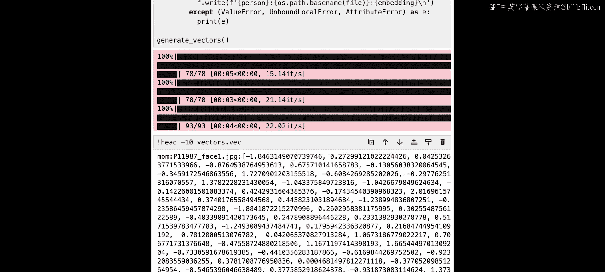
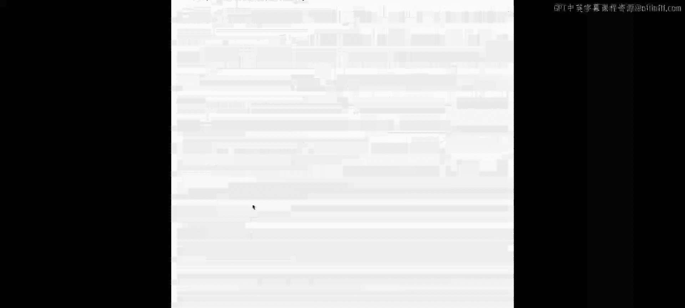
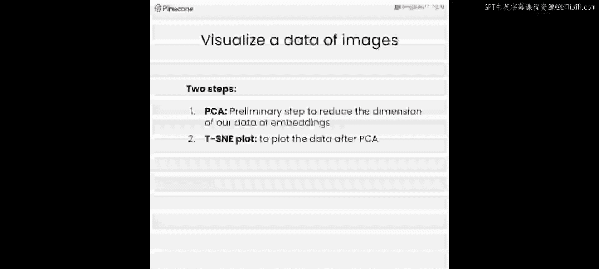
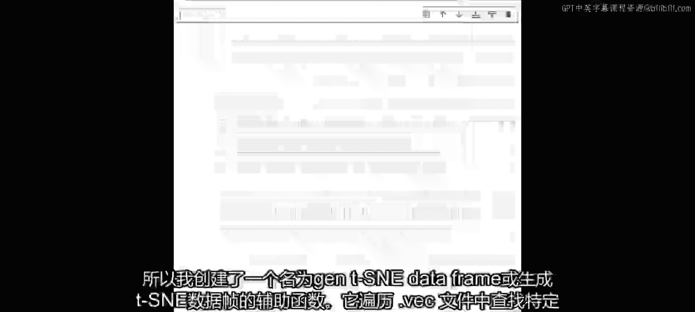
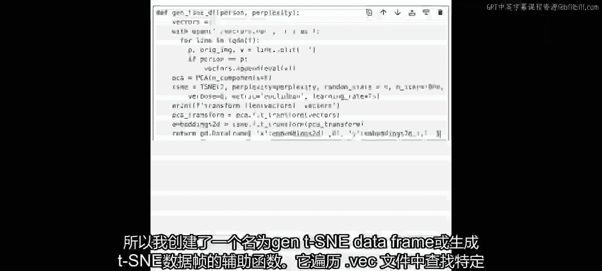
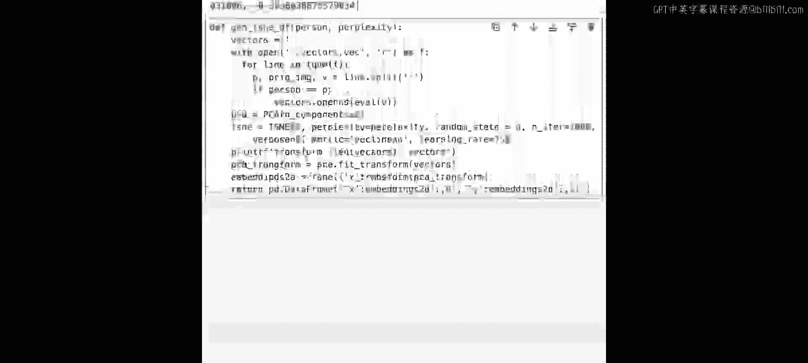
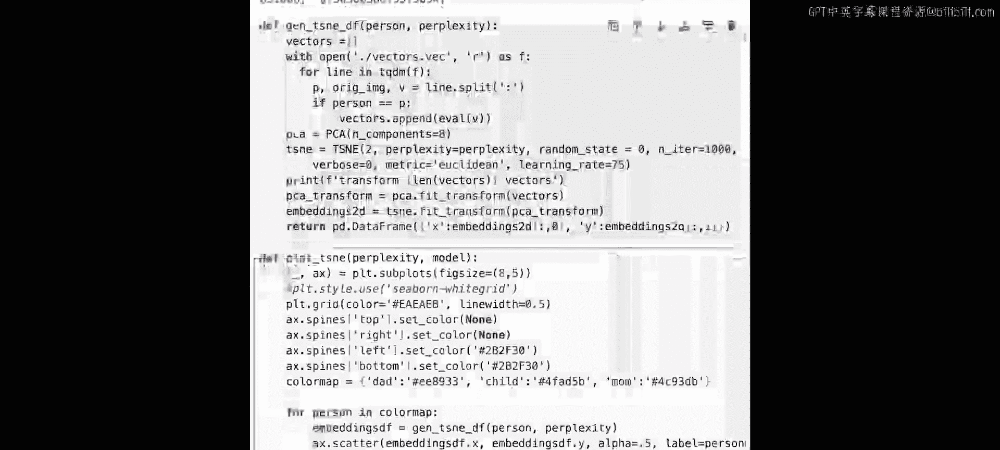
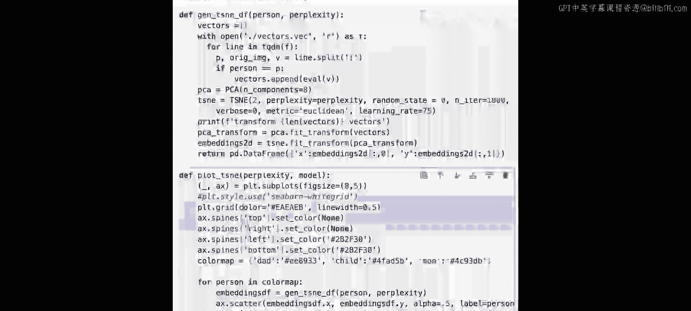
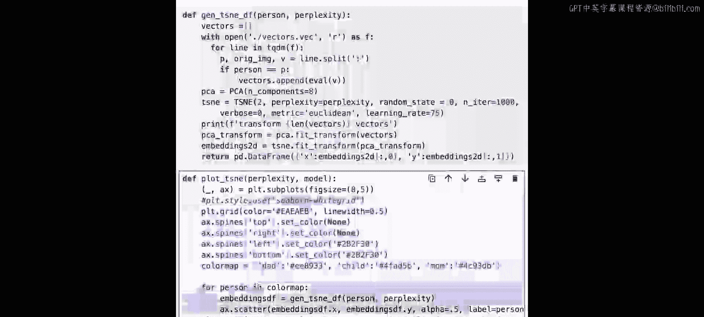
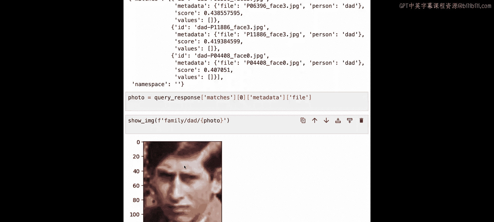

# 006：面部相似度搜索 👨‍👩‍👧

在本节课中，我们将探索一个有趣的问题：孩子看起来更像父亲还是母亲？我们将使用向量嵌入技术，通过一个公开的英国王室家庭图像数据集，科学地判断威廉王子是更像查尔斯国王还是戴安娜王妃。这个方法简单且易于扩展，你也可以尝试用于自己的家庭照片。

我们将构建一个面部相似度搜索系统，通过计算孩子与父母面部特征的平均相似度得分，来判断孩子更像谁。得分更高的一方，意味着与孩子的面部特征更相似。

我们将使用Deepface开源库，其内置的Facenet模型能生成128维的向量。我们将使用“Families in the Wild”数据集中的图像，并将生成的向量存储在Pinecone向量数据库中。相似度的计算方式是：分别计算孩子与父亲、孩子与母亲的平均相似度得分，并进行比较。

## 环境准备与数据导入

首先，我们进行标准的环境设置，导入必要的库并抑制警告信息。

```python
import warnings
warnings.filterwarnings('ignore')
# 其他必要的导入语句...
```

接下来，获取Pinecone的API密钥。我们已经提前为你准备好了数据集，并下载到了本地。

```python
# 假设数据已下载并解压到 `family_photos` 目录
```

数据集的结构如下：顶层目录是`family`，其下包含`dad`、`mom`和`child`三个子目录，分别存放对应人物的照片。

让我们先查看一些图片。这里有一个辅助函数`show_image`用于显示图片。

```python
def show_image(image_path):
    # 加载、调整大小并显示图片的代码
    pass
```

以下是随机查看的图片示例：
*   查尔斯国王（父亲）的图片
*   戴安娜王妃（母亲）的图片
*   威廉王子（孩子）的图片

## 生成并存储面部向量嵌入

现在，我们将使用Deepface模型为每个人的每张图片生成向量嵌入，并将结果存储到一个文件中，以便后续使用。

```python
def generate_vectors():
    # 遍历每个目录（dad, mom, child）中的所有图片
    # 对每张图片使用Deepface模型生成128维的向量嵌入
    # 将结果（人物标签、图片文件名、向量）写入 `vectors.vec` 文件
    pass
```

运行此函数后，`vectors.vec`文件将包含所有图片的向量数据。文件格式为：`人物标签`、`图片文件名`、`向量值`。



## 数据可视化：PCA与t-SNE降维



在将数据上传到Pinecone之前，我们先通过降维技术将高维向量可视化，以便直观地观察数据分布。

**主成分分析（PCA）** 是一种用于减少数据维度的技术，它通过将大量变量转换为一个较小的变量集，同时保留原始数据中的大部分信息。公式可以表示为将原始数据**X**投影到主成分方向上得到降维后的数据**Z**。

**t-分布随机邻域嵌入（t-SNE）** 是一种专门用于将高维数据可视化为二维或三维图形的技术，它能揭示数据点之间潜在的聚类和关系。



通常，我们会先使用PCA进行初步降维以减少计算量，然后再应用t-SNE。t-SNE中有一个重要的超参数**困惑度（perplexity）**，它控制了算法考虑每个点周围邻居的数量。

以下是生成和绘制t-SNE图的代码流程：

```python
def generate_tsne_dataframe(person):
    # 1. 从 `vectors.vec` 文件中提取指定人物的所有向量。
    # 2. 使用PCA将向量降至较低维度（例如50维）。
    # 3. 使用t-SNE将PCA结果进一步降至2维。
    # 4. 返回包含2维坐标的DataFrame。

def plot_tsne(perplexity=30):
    # 1. 为 `dad`, `mom`, `child` 分别调用 `generate_tsne_dataframe`。
    # 2. 使用matplotlib将三组数据的2维坐标绘制在同一张散点图上，用不同颜色区分。
    # 3. 显示图表。
```





通过调整`perplexity`参数（例如27或44），可以观察散点图形态的变化。理想情况下，**同一个人物的不同照片对应的点应该紧密地聚集在一起**，这表示模型能稳定地提取该人物的特征。图中父亲、母亲、孩子各自形成独立的簇，这表明我们的向量嵌入质量良好。



## 构建Pinecone向量索引并上传数据





数据可视化后，我们开始在Pinecone中建立索引并上传向量数据。



```python
# 删除已存在的索引（确保环境干净）
# 创建新的索引，指定维度为128（与Facenet模型输出一致）
# 获取索引连接
```

接下来，读取`vectors.vec`文件，将每一行解析为元数据（人物、文件名）和向量，然后上传至Pinecone索引。

```python
def upload_vectors_to_pinecone():
    with open('vectors.vec', 'r') as f:
        for line in f:
            person, filename, vec_str = line.strip().split(' ', 2)
            vector = eval(vec_str) # 注意：实际应用中应使用更安全的解析方法
            # 将 (vector, metadata) 上传到Pinecone
```

上传完成后，我们可以检查索引状态，确认向量数量（例如241个）是否正确。

## 计算面部相似度得分

现在进入核心环节：计算孩子与父母之间的平均相似度得分。

我们定义一个`test`函数，它接受一个父辈人物（“dad”或“mom”）作为输入，然后执行以下操作：
1.  从该父辈人物的所有图片中随机选择一张，获取其向量。
2.  以此向量作为查询向量，在Pinecone索引中搜索与**孩子（child）** 最相似的Top K张图片。
3.  计算这些Top K结果的相似度得分的平均值。这个平均值代表了该父辈人物与孩子的平均面部相似度。

```python
def test(parent_label, top_k=5):
    # 1. 随机获取一个父辈人物的向量作为查询向量。
    # 2. 使用Pinecone查询，寻找与孩子最相似的top_k个向量。
    # 3. 计算并返回这top_k个结果的相似度得分的平均值。
    pass
```

然后，我们分别计算父亲-孩子和母亲-孩子的平均得分。

```python
dad_child_avg_score = test('dad')
mom_child_avg_score = test('mom')
```

运行结果显示，父亲（查尔斯国王）与孩子（威廉王子）的平均相似度得分为**0.43**，而母亲（戴安娜王妃）与孩子的平均相似度得分为**0.35**。因此，根据我们的系统计算，**威廉王子在面部特征上更像他的父亲查尔斯国王**。

## 寻找最相似的特定图片

除了平均得分，我们还可以找出与孩子某张特定照片最相似的父辈照片。

我们选择一张具有代表性的威廉王子成人照片，生成其向量嵌入，然后在Pinecone中查询与**父亲（dad）** 最相似的前几张图片。

```python
# 1. 加载选定的孩子图片，生成向量 `target_vector`。
# 2. 以 `target_vector` 查询Pinecone索引，限定在`dad`的范围内，返回最相似的几个结果。
# 3. 从返回结果中获取相似度最高的图片ID和元数据。
```

查询结果是一个包含ID、元数据和得分的列表。通过元数据中的文件名，我们可以加载并显示那张被系统判定为与威廉王子最相似的查尔斯国王的照片。直观来看，这两张照片确实显示出很高的相似度。

## 课程总结 🎯

本节课中，我们一起构建了一个面部相似度搜索系统。我们首先使用Deepface模型为王室家庭成员的照片生成了向量嵌入，并通过PCA和t-SNE技术对数据进行了可视化分析。接着，我们将向量存储在Pinecone数据库中，并通过查询计算了孩子与父母之间的平均相似度得分。最终，我们的系统得出结论：威廉王子在面部特征上更像查尔斯国王。我们还演示了如何找出与孩子特定照片最相似的父辈照片。



这个方法不仅适用于这个有趣的案例，你也可以轻松地使用自己的家庭照片进行尝试。在下一节课中，我们将利用Pinecone构建一个异常检测系统，用于分析思科ASA防火墙的日志文件。