# 007：异常检测 🔍


在本节课中，我们将构建一个异常检测系统。具体来说，我们将构建一个小型机器学习模型，用于检测思科ASA日志文件中的异常日志条目。为了让课程更易于理解并缩短训练时间，我们将使用我们准备好的一个小型数据集进行监督学习来训练模型。之后，我们将使用该模型，并输入一个样本数据集来查找异常日志条目。让我们开始编码和创新。

## 概述 📋


上一节我们介绍了向量数据库的基本应用。本节中，我们将利用向量数据库Pinecone和句子转换器（Sentence Transformers）来构建一个针对日志文件的异常检测系统。我们将通过一个已标注的小型训练集训练模型，然后使用该模型分析样本日志数据，找出其中的异常条目。

## 环境设置与数据准备 ⚙️

首先，我们需要导入必要的库并设置环境。

```python
import warnings
warnings.filterwarnings('ignore')
# 导入其他依赖包，例如 pinecone, sentence_transformers, torch 等
```

接下来，获取Pinecone的API密钥并初始化索引。以下是标准操作流程：

```python
import os
from deeplearningai_utils import get_pinecone_api_key
import pinecone

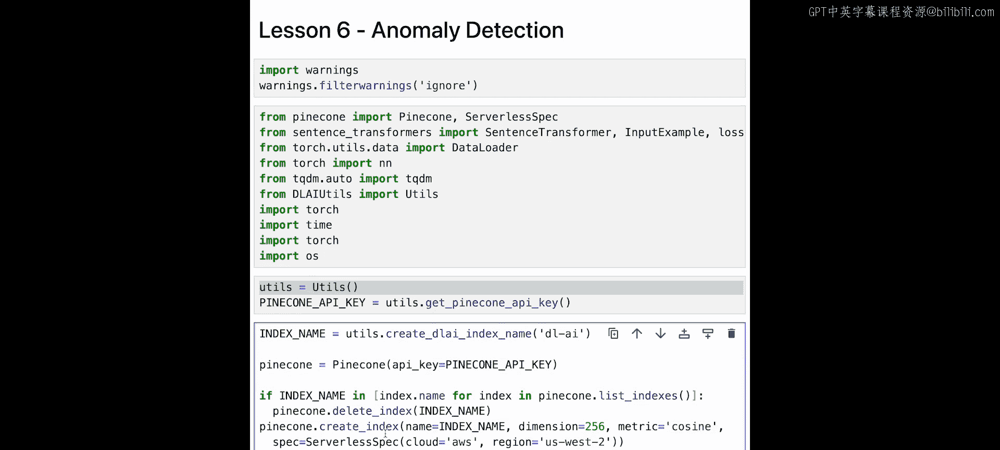

# 获取API密钥
api_key = get_pinecone_api_key()
# 初始化Pinecone
pinecone.init(api_key=api_key, environment='your-environment')
# 删除旧索引（如果存在）并创建新索引
index_name = "anomaly-detection-logs"
if index_name in pinecone.list_indexes():
    pinecone.delete_index(index_name)
pinecone.create_index(name=index_name, dimension=256, metric="cosine")
# 获取索引指针
index = pinecone.Index(index_name)
```

课程已提前下载了数据文件 `training.tar.zip`。如果离线运行，需要取消注释相应的下载代码行并解压。数据包含一个样本日志文件 `sample.log` 和一个已标注的训练集 `training.txt`。

让我们查看一下样本日志文件的前几行，了解其格式：

```
2023-10-01 08:00:00 %ASA-6-302013: Built inbound TCP connection...
2023-10-01 08:00:01 %ASA-6-302014: Teardown TCP connection...
```

这是标准的思科ASA日志格式，包含日期、时间、日志标识符和实际日志消息。

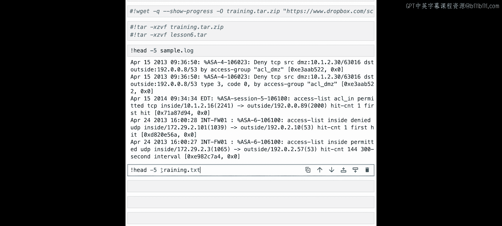

已标注的训练集 `training.txt` 格式略有不同。每一行包含两个日志条目和一个相似度标签，由插入符号 `^` 分隔。格式为：`日志A ^ 日志B ^ 相似度得分`。得分是一个0到1之间的连续值，1表示完全相同，0表示完全不同。

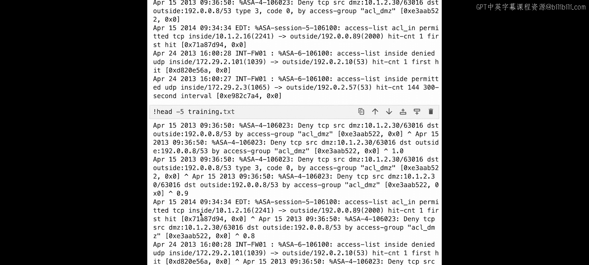

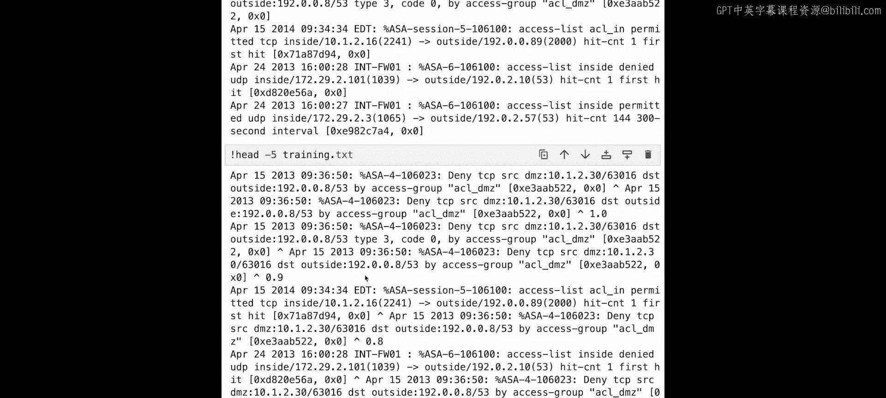

## 构建与训练模型 🤖

我们将基于句子转换器构建一个非常简单的模型。模型结构包括一个基础的词嵌入层、一个池化层和一个将维度降至256的全连接层。

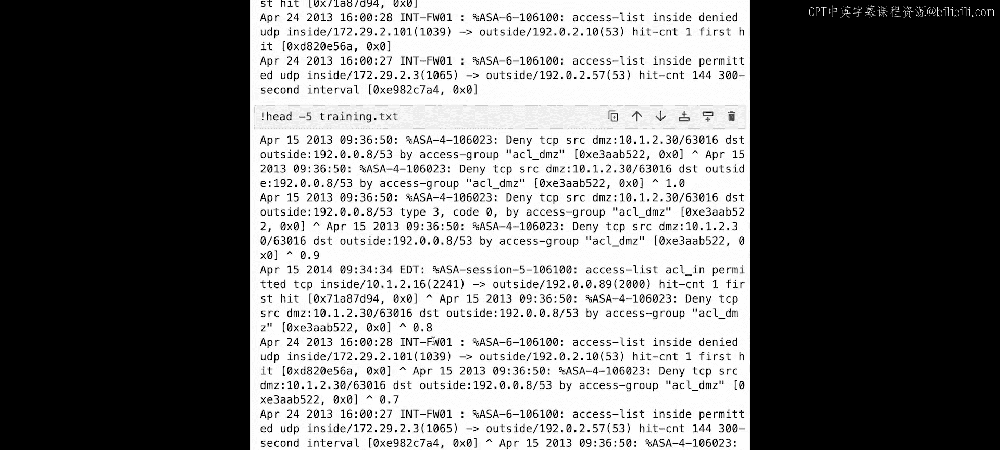

以下是模型定义的代码：

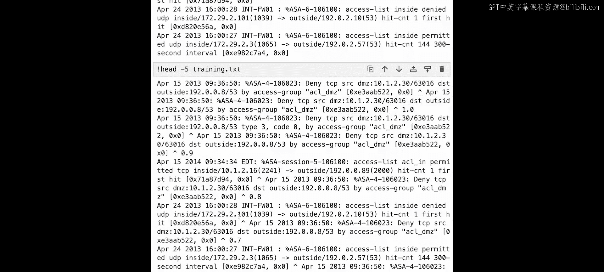

```python
from sentence_transformers import SentenceTransformer, models
import torch

# 1. 定义词嵌入层
word_embedding_model = models.Transformer('bert-base-uncased')
# 2. 定义池化层
pooling_model = models.Pooling(word_embedding_model.get_word_embedding_dimension())
# 3. 定义全连接层，将维度降至256
dense_model = models.Dense(in_features=pooling_model.get_sentence_embedding_dimension(),
                           out_features=256,
                           activation_function=torch.nn.Tanh())
# 组合成完整模型
model = SentenceTransformer(modules=[word_embedding_model, pooling_model, dense_model])
# 指定设备（CPU或GPU）
device = 'cuda' if torch.cuda.is_available() else 'cpu'
model.to(device)
print(f"Using device: {device}")
```

现在，我们准备训练数据并开始训练模型。训练数据来自 `training.txt` 文件。

以下是数据加载和训练准备的代码：

```python
from sentence_transformers import InputExample
from torch.utils.data import DataLoader

train_examples = []
# 打开训练文件
with open('training.txt', 'r') as f:
    lines = f.readlines()
for line in lines:
    line = line.strip() # 去除空白字符
    if line:
        # 按插入符‘^’分割
        a, b, label = line.split('^')
        # 将相似度得分转换为浮点数
        label = float(label.strip())
        # 创建InputExample对象
        train_examples.append(InputExample(texts=[a.strip(), b.strip()], label=label))

# 创建数据加载器
train_dataloader = DataLoader(train_examples, shuffle=True, batch_size=16)
# 定义损失函数（这里使用余弦相似度损失）
from sentence_transformers import losses
train_loss = losses.CosineSimilarityLoss(model=model)
# 设置训练参数
num_epochs = 2
warmup_steps = int(len(train_dataloader) * num_epochs * 0.1) # 10% 的数据用于预热
```

接下来，我们开始训练模型。同时，我们也加载稍后用于测试的样本日志数据。

```python
# 训练模型
model.fit(train_objectives=[(train_dataloader, train_loss)],
          epochs=num_epochs,
          warmup_steps=warmup_steps,
          show_progress_bar=True)

# 准备样本数据（用于后续生成嵌入向量并插入Pinecone）
samples = []
with open('sample.log', 'r') as f:
    samples = [line.strip() for line in f.readlines() if line.strip()]
```

模型训练完成后，我们用它为所有样本日志生成嵌入向量。

```python
# 生成嵌入向量
embeddings = model.encode(samples, convert_to_tensor=True, show_progress_bar=True)
print(f"Generated {len(embeddings)} embeddings of dimension {embeddings.shape[1]}")
```

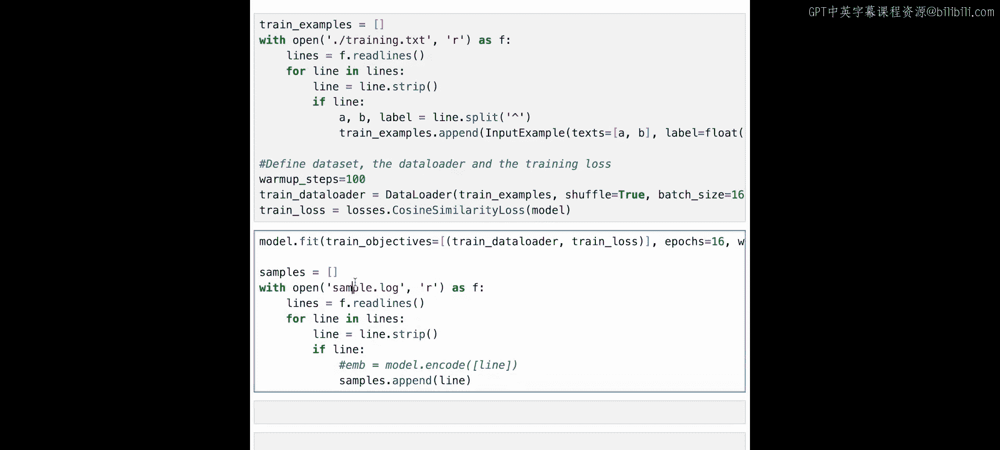

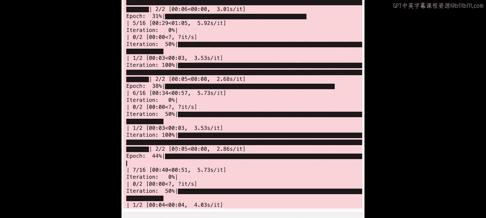

## 将数据存入向量数据库并查询 🗃️

现在，我们将生成的嵌入向量存入Pinecone向量数据库。

以下是插入数据的代码：

```python
# 准备数据以便插入Pinecone
vectors_to_upsert = []
for i, (log_line, emb) in enumerate(zip(samples, embeddings)):
    # 每条数据需要一个唯一ID和对应的向量
    vectors_to_upsert.append((f"log_{i}", emb.tolist(), {"text": log_line}))

# 分批插入数据
batch_size = 100
for i in range(0, len(vectors_to_upsert), batch_size):
    batch = vectors_to_upsert[i:i+batch_size]
    index.upsert(vectors=batch)
print("Data inserted into Pinecone.")
```

数据插入后，我们可以进行查询。我们选取一条已知的正常日志条目作为查询向量。

```python
# 选择一条已知的正常日志（例如第一条）
good_log_line = samples[0]
print(f"Querying with good log line: {good_log_line}")

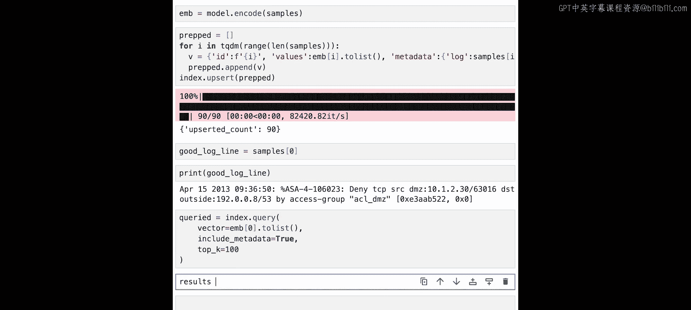

# 生成这条日志的嵌入向量
query_embedding = model.encode([good_log_line], convert_to_tensor=True).tolist()[0]

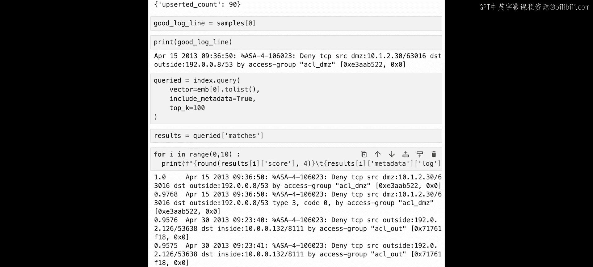

# 在Pinecone中查询最相似的100条记录
query_results = index.query(vector=query_embedding, top_k=100, include_metadata=True)
```

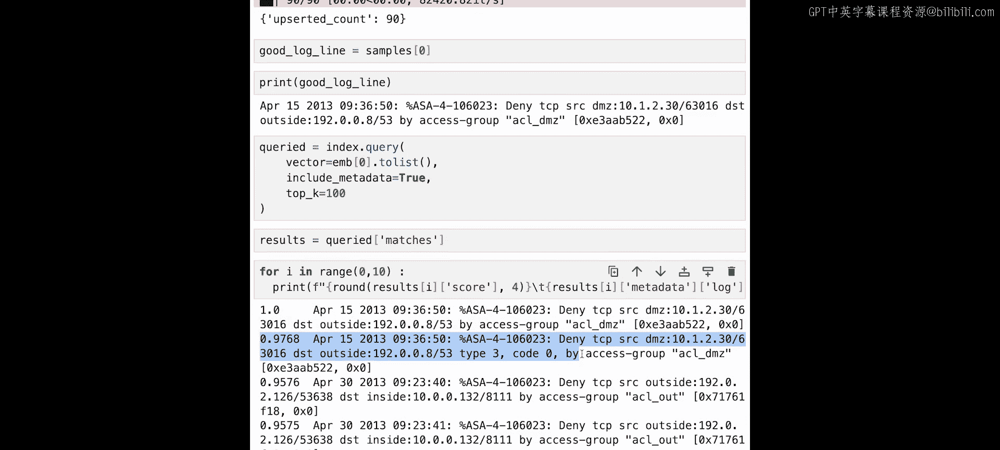

## 分析与识别异常 🔎

查询结果返回了与正常日志最相似的条目列表。相似度得分最高为1（即完全相同的日志），得分越低表示相似度越低。

以下是查看和解析结果的代码：

```python
# 打印相似度最高的前10条结果
print("Top 10 most similar log entries:")
for match in query_results.matches[:10]:
    print(f"Score: {match.score:.4f} | Text: {match.metadata['text']}")

# 我们的假设是：得分最低的条目最有可能是异常
# 获取结果中得分最低的一条（即列表中的最后一条，因为结果默认按得分降序排列）
if query_results.matches:
    worst_match = query_results.matches[-1]
    print("\nPotential anomaly found (lowest similarity score):")
    print(f"Score: {worst_match.score:.4f}")
    print(f"Log Text: {worst_match.metadata['text']}")
```

在我们的示例中，得分最低的日志条目（例如得分0.32）其消息内容为 `sig fault detected in the matrix`，这与典型的思科ASA日志模式明显不同，因此被识别为异常。

## 总结 🎯

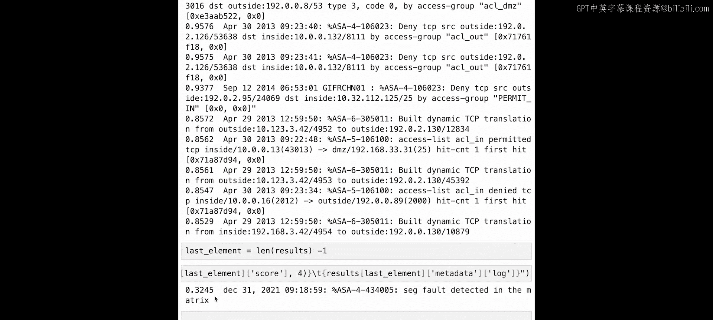

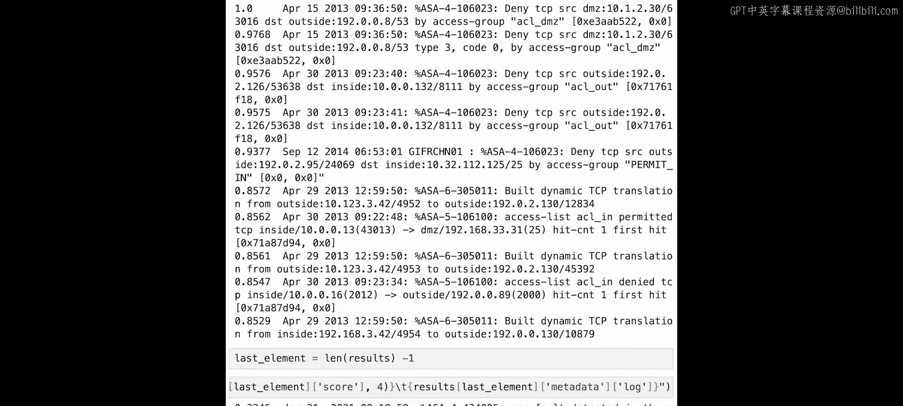

本节课我们一起学习了如何构建一个基于向量数据库的异常检测系统。我们首先利用已标注的小型数据集训练了一个句子嵌入模型。然后，我们使用该模型将样本日志数据转换为向量，并存储到Pinecone中。最后，通过查询一条已知的正常日志，我们根据返回结果的相似度得分成功识别出了潜在的异常日志条目。

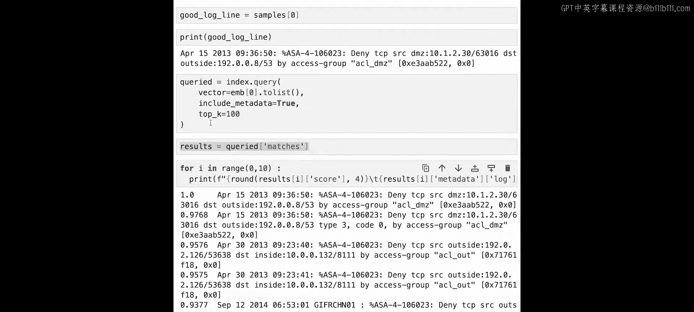

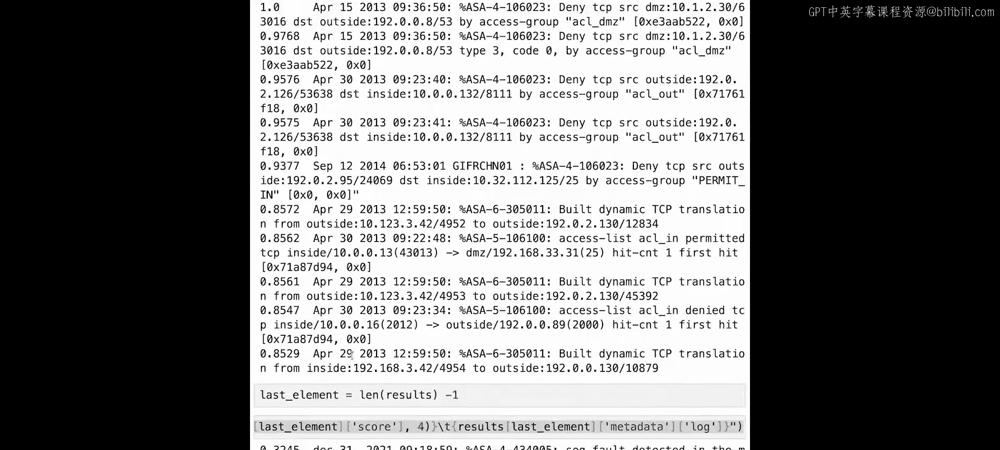

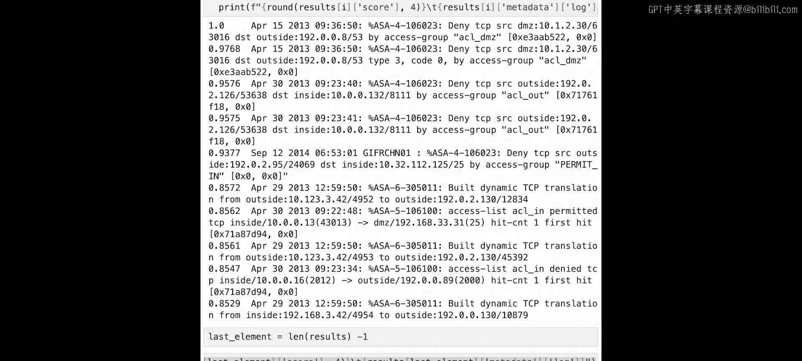

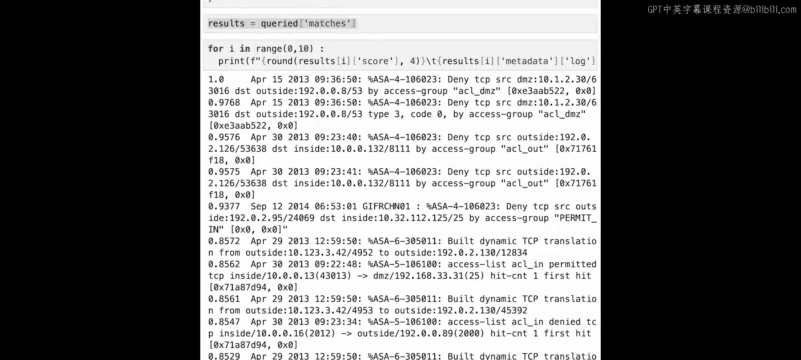

这种方法的核心思想是：**正常数据点在向量空间中彼此靠近，而异常点则远离主要集群**。通过计算查询点与数据库中所有点的相似度，并寻找得分最低的（即最不相似的）点，我们就可以有效地发现异常。

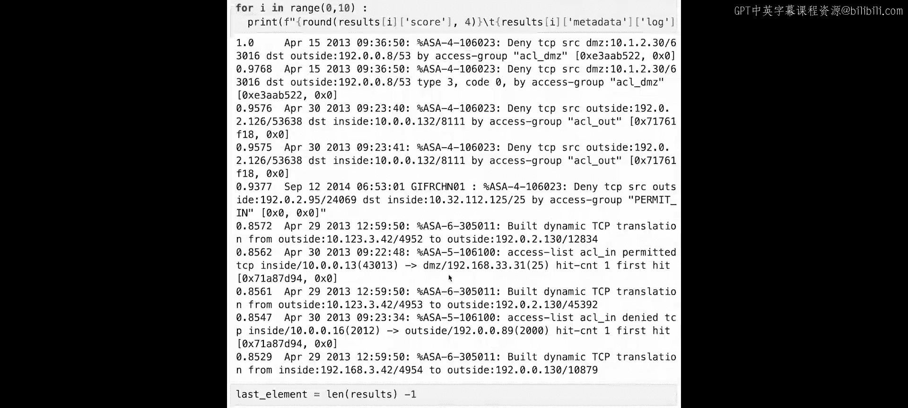


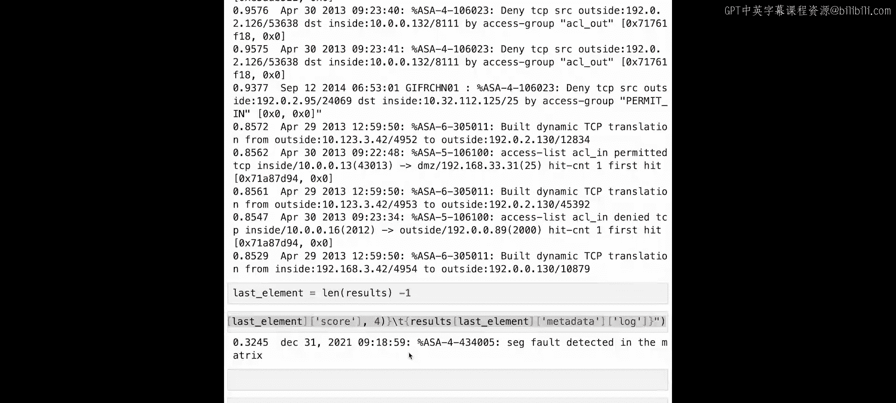

你可以尝试将这种方法应用于其他类型的数据，利用句子转换器的强大能力来探索和发现数据中的异常模式。