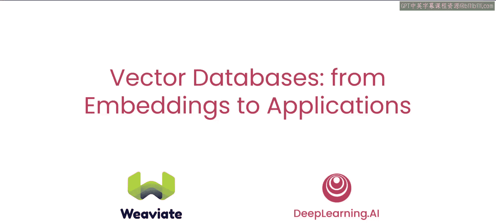

# 001：Weaviate简介

在本节课中，我们将要学习向量数据库的基础概念及其在现代人工智能应用中的核心作用，特别是它在检索增强生成技术中的关键地位。

大型语言模型催生了许多令人兴奋的新应用。然而，语言模型的一个短板是，一个训练好的模型不具备对近期事件的了解，也无法获取其训练数据之外的专有文档信息。

为了解决这个问题，可以使用**检索增强生成**技术。RAG的一个关键组件就是向量数据库。专有或最新的数据首先被存储在这个向量数据库中。当用户提出涉及这些信息的查询时，该查询会被发送到向量数据库。数据库随后检索出相关的文本数据，最后，这些检索到的文本可以被包含在给语言模型的提示中，为其提供回答问题的上下文。

向量数据库实际上早于最近的生成式AI热潮。它们长期以来一直是语义搜索应用的重要组成部分。这类应用基于词或短语的含义进行搜索，而不是寻找精确匹配的关键词搜索。向量数据库也常用于推荐系统中，用于寻找相关物品推荐给用户。

作为一名AI开发者，理解向量数据库的工作原理、其内部机制，将有助于你在自己的项目中更有效地使用它。例如，你将知道何时应用稀疏搜索（如关键词搜索）、密集搜索（即通过向量相似性实现）或结合两者的混合搜索。理解不同的相似度计算方法将帮助你选择最佳的距离算法。理解向量数据库和搜索的扩展挑战，将帮助你在不同的嵌入搜索算法之间做出选择。

本课程的讲师是Sebastian Vitas，他是Weaviate的开发者关系负责人，在指导用户构建和使用向量数据库方面拥有丰富的经验。

感谢Andrew。能与你合作这门课程，我感到非常荣幸。

在本课程结束时，你将理解并实现构成向量数据库的许多要素。例如，**嵌入**——代表短语含义的密集向量；**距离度量**，如点积或余弦距离；不同类型的**向量搜索**，如查看数据库中所有条目的线性搜索，或通过允许近似结果来加速搜索的近似搜索；以及不同的**搜索范式**，如稀疏搜索、密集搜索和混合搜索。最后，你将构建向量数据库的真实世界应用，创建一个具备混合搜索和多语言搜索功能的RAG系统。

内容非常丰富。希望我们通过Weaviate介绍的一些想法，能激励你继续自己的语言模型和机器学习之旅，在向量数据库的基础上进行构建。许多人参与了本课程的贡献，我们感谢Zen Hasan。

Weaviate团队，以及来自DeepLearning.AI的Jeff Ludwig和Ismail Ggari。

希望本短期课程中涵盖的一些示例能激励你继续自己的大语言模型之旅，在向量数据库的基础上进行构建。

让我们进入下一个视频，开始学习。

