# 002：嵌入向量从何而来？🔍

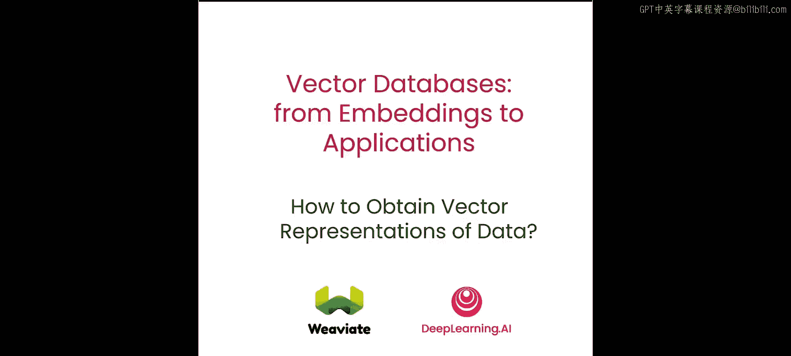

在本节课中，我们将学习向量数据库中的向量是如何产生的。我们将从神经网络如何将数据表示为数字（即嵌入）开始，并动手构建一个自编码器架构，将图像嵌入为向量。接着，我们将探讨数据对象之间相似或相异的含义，以及如何利用数据的向量表示来量化这种关系。

## 自编码器的工作原理 🤖

上一节我们概述了学习目标，本节中我们来看看自编码器是如何工作的。为了说明其原理，我们将使用MNIST手写数字数据集。当我们输入一张数字图像（例如一个数字“0”的图像，其尺寸为28x28像素，即784维）时，编码器会将其压缩，然后解码器会将其解压缩，最终输出另一张图像。

你可以看到，输入图像和输出图像并不完全一致。这就是为什么我们需要在多个训练样本上运行此过程。每次运行时，内部的权重都会得到调整，每次匹配都会越来越好，直到模型训练完成，我们对输入输出的结果感到满意。

这里需要注意的关键点是，输出仅由中间的那个向量生成。因此，该向量包含了该图像的“含义”，我们称之为**嵌入向量**。稍后我们将进行编码实现，但这就是模型内部的结构。

## 构建自编码器模型 🏗️

上一节我们介绍了自编码器的概念，本节中我们来构建其具体结构。我们可以看到一组密集连接层。当图像通过密集层时，它被压缩到256维和128维，直到我们到达2维的瓶颈层。同样地，解码器会将这个2维的嵌入向量扩展到128维、256维，直到最终输出。

我们选择让中间的嵌入向量只有2维，纯粹是为了在本课程中便于可视化。实际上，向量嵌入的维度通常远不止于此，经常达到100维或更多。

这是一个很好的例子，展示了我们如何获取任何类型的数据（例如一张图像或一整段文本），并将其转换为机器可以理解的向量嵌入。**向量嵌入捕捉了底层数据的含义**，你可以将其视为数据的机器可理解格式。

## 代码实现：数据准备与模型设置 💻

现在，让我们看看这一切在代码中是如何工作的。首先，我们需要加载一些库，我们将使用TensorFlow。如前所述，我们将使用MNIST加载数据集。这将为我们提供一个训练集和一个测试集。

接下来，我们需要对数据进行归一化处理。实际上，我们是将28x28的图像展平成一个结构。如果我们打印处理前后的形状，会看到训练数据从60000个28x28的对象，变成了60000个784维的对象，测试数据同理。

现在，为我们的模型设置一些参数：批量大小设为100，训练50个周期。隐藏状态的初始维度为256，目标是生成2维的向量嵌入。

让我们看一个输入图像的示例，它看起来很像数字“0”。接下来，我们需要构建一个采样函数，以便在训练阶段抓取一定数量的图像。

## 构建编码器与解码器 ⚙️

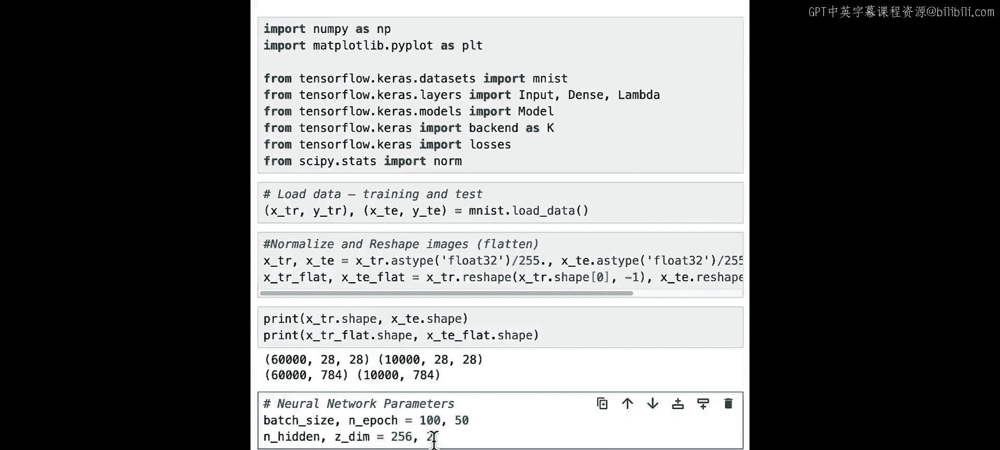

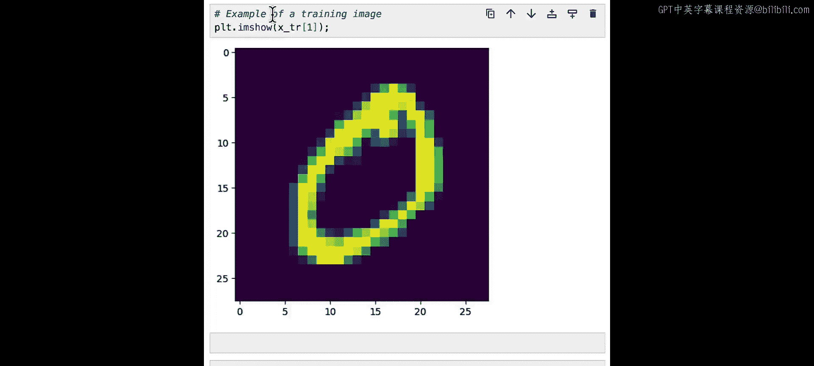

现在，我们来构建编码器。正如之前提到的，它将有两个密集层：第一层256维，第二层128维。

接着，我们需要构建一个匹配的解码器。以类似的方式，这次从2维开始，扩展到128维，再到256维。最终，我们可以创建解码器函数。

这是用于训练自编码器（也称为变分自编码器）的损失函数。其基本思想是优化模型，使其能很好地匹配输入和输出。

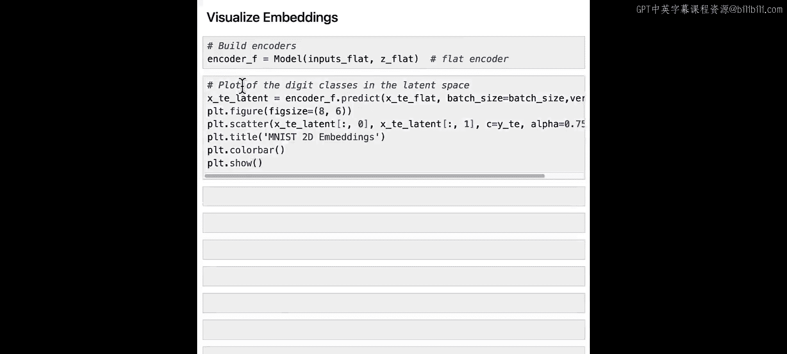

## 模型训练与可视化 📊

现在我们有了所有组件，可以开始训练了。训练将运行50个周期，每次训练100个对象，这需要几分钟时间。

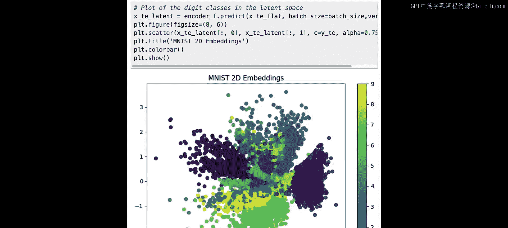

训练完成后，我们可以可视化我们的数据。首先构建一个扁平化的编码器，然后添加一段代码将我们的向量嵌入绘制到图表上。

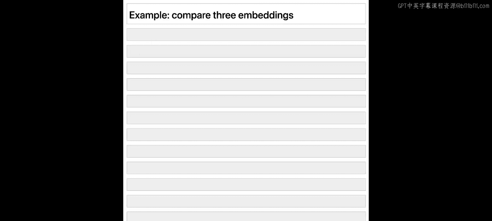

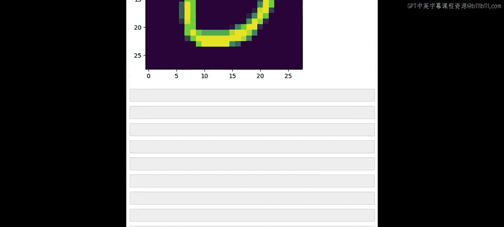

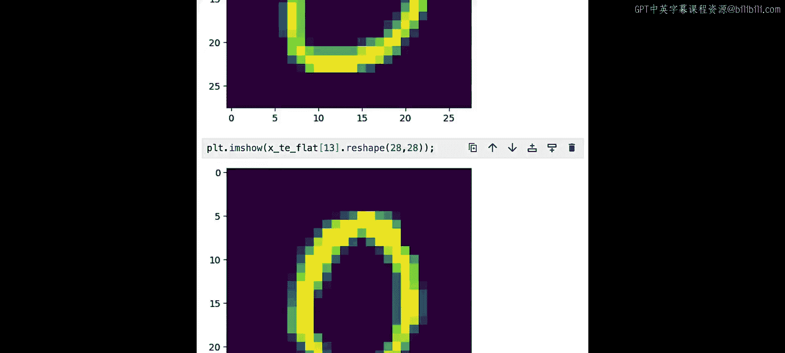

你可以看到，相似的向量在向量嵌入空间中聚集在一起。例如，所有的“0”聚集在这里，所有的“1”聚集在那里。整个空间在二维中展示，这两个维度就是我们嵌入向量内部的维度。

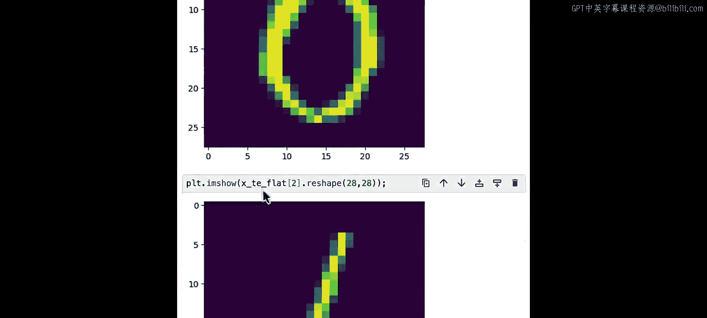

## 比较向量嵌入：距离度量 📏

现在我们可以进入比较向量嵌入的阶段。让我们选取三张不同的图像：一张“0”（0_a），另一张“0”（0_b），和一张代表数字“1”的图像。

如果我们获取这三个对象，并调用函数生成向量嵌入，那么0_a、0_b和1将包含我们需要的向量值。打印它们，你可以看到两个“0”的向量彼此相似，而代表数字“1”的向量则相当不同。

我们也可以对文本嵌入做类似的事情。使用一个句子转换器，抓取几个句子，就可以为每个句子生成向量嵌入。每个向量有384维。

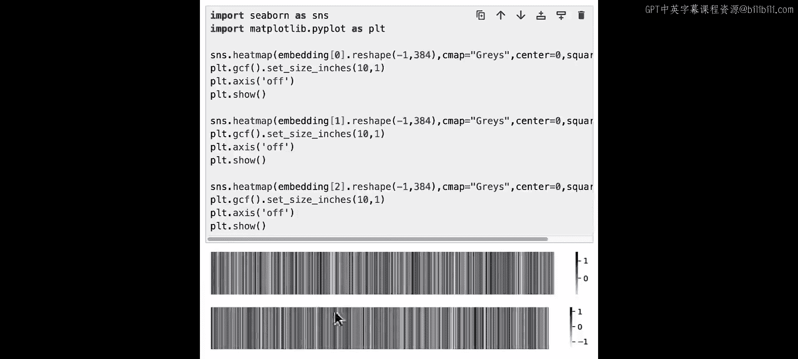

为了以视觉方式表示这些向量，我将把它们绘制成条形码。可以看到，前两个向量彼此相似，而第三个向量则相当不同。

现在，我们将讨论距离度量，以及如何计算不同图像或句子（即代表它们的向量嵌入）之间的距离。我们将看四种不同的方法：**欧几里得距离**、**曼哈顿距离**、**点积**和**余弦距离**。

以下是四种距离度量的核心概念：

*   **欧几里得距离**：计算两点之间的最短直线距离。
    *   公式：`distance = sqrt(sum((vector_a - vector_b)^2))`
*   **曼哈顿距离**：计算两点在网格状路径上，只能沿轴移动的距离之和。
    *   公式：`distance = sum(abs(vector_a - vector_b))`
*   **点积**：衡量一个向量在另一个向量上投影的大小。
    *   公式：`dot_product = sum(vector_a * vector_b)`
*   **余弦距离**：通过计算两个向量之间夹角的余弦值来衡量方向相似性。
    *   公式：`cosine_similarity = dot_product / (norm(vector_a) * norm(vector_b))`

让我们从欧几里得距离开始。计算0_a和0_b之间的欧几里得距离，结果约为0.6。NumPy也有内置方法可以计算。计算所有距离后，我们可以看到两个“0”之间的距离很小，而它们与数字“1”的距离则很远。这从数学上证明了两张“0”的图像非常相似。

接下来看曼哈顿距离。计算0_a和0_b之间的距离，得到这个值。同样，NumPy提供了简便的计算方法。比较所有距离后，再次看到0_a和0_b非常接近，但与数字“1”相距甚远。

然后看点积。0_a和0_b的点积是3.6。计算所有三个向量的点积，可以看到0_a和0_b的点积是3.6，而“0”与“1”比较的值是负数。与之前例子中“距离越小匹配越好”不同，对于点积，**值越高通常意味着匹配越好**，而负值通常意味着它们相距甚远。

最后看余弦距离。其思想是相似的向量彼此之间的夹角会很小。对于两个“0”，余弦值非常接近1，这表明匹配度非常高。如果我们观察0_a除以0_b的幅度，会发现它们非常接近，这意味着两个向量沿着非常相似的方向延伸。

让我们将余弦距离计算封装成一个函数。计算所有距离后，可以看到0_a和0_b之间的夹角很小，而0_a与1之间的余弦值则低得多，这再次证明了我们的观点。

## 应用于文本嵌入 📝

现在回到句子嵌入的例子。有趣的是，在所有距离度量中，**点积和余弦距离在自然语言处理领域非常常用**。

例如，我们可以尝试使用点积来比较所有这些向量。可以看到前两个句子之间的点积非常高，这表明前两个句子非常相似，而其他句子则不那么相似。

如果用余弦距离做同样的计算，我们再次可以看到前两个句子之间的夹角指示器非常接近，而其他的则相距较远。但同时，前两个句子也并非完美匹配。

## 总结 🎯

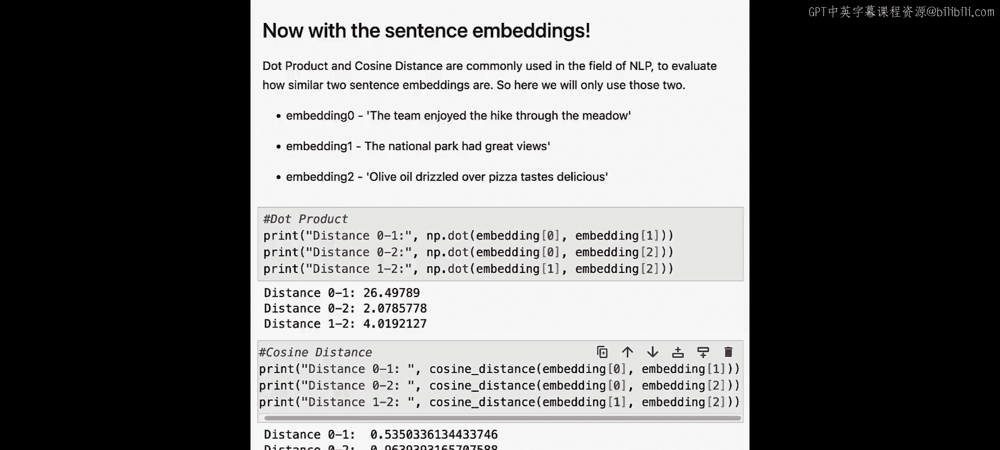

本节课中，我们一起学习了向量数据库的核心基础——嵌入向量的生成与比较。我们首先了解了自编码器如何将高维数据（如图像）压缩成低维的向量表示，并动手实现了这一过程。接着，我们深入探讨了如何量化向量之间的相似性，介绍了欧几里得距离、曼哈顿距离、点积和余弦距离这四种关键的距离度量方法，并通过代码示例展示了它们在图像和文本数据上的应用。理解这些向量表示和距离度量，是后续在向量数据库中进行高效搜索和检索的基石。在下一课中，我们将运用这里学到的知识，学习如何在大量向量中进行搜索。