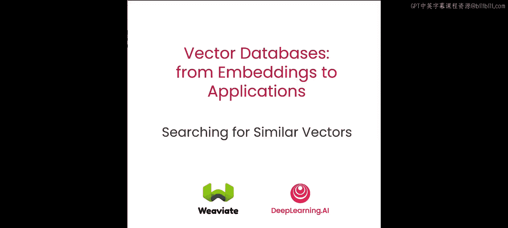
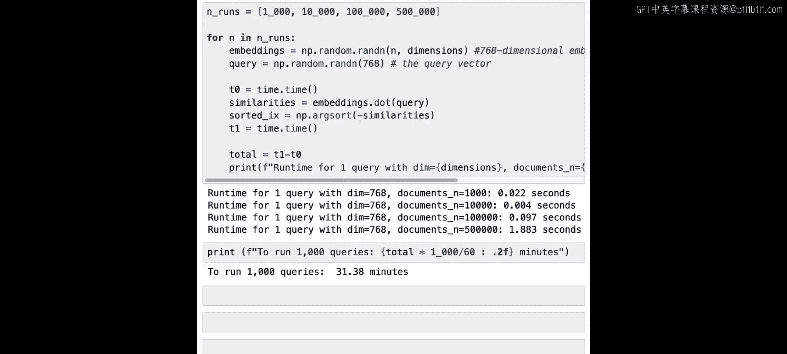

# 003：暴力kNN算法




在本节课中，我们将通过暴力K最近邻算法，直观地理解向量搜索或语义搜索的原理。你将编写一个暴力KNN算法的实现，并了解如何用它来准确获取嵌入空间中与查询向量最接近的向量。然后，我们将探讨暴力KNN算法在时间复杂度方面存在的问题。这将引导我们认识近似最近邻算法，这类算法是向量数据库技术的核心。现在，让我们开始学习。

向量能够捕捉数据背后的含义。因此，为了找到在含义上与我们的查询相似的数据点，我们可以在向量空间中搜索并检索最接近的对象，然后返回它们。这个过程被称为语义搜索或向量搜索。这里的语义搜索，指的是利用词语或图像本身含义进行的搜索。


## 暴力搜索的原理与步骤

寻找相似向量的一种方法是暴力搜索，它遵循以下步骤：

1.  **计算距离**：给定一个查询，计算所有向量与查询向量之间的距离。
2.  **排序距离**：对所有计算出的距离进行排序。
3.  **返回结果**：返回距离最小的前K个最佳匹配对象。

这种方法在经典机器学习中被称为K最近邻算法。然而，暴力搜索伴随着巨大的计算成本。可以看到，总体查询时间随着我们存储中对象数量的增加而增长。如果数据量随时间翻倍或增至三倍，查询时间也会相应翻倍或增至三倍。

## 代码演示与规模扩展

接下来，我们将在代码中演示这个算法，并尝试在数据点数量和维度上进行扩展。

我们已经将一些库加载到笔记本中，其中值得关注的是 `nearest neighbor` 库，我们将用它来演示暴力搜索算法及其工作原理。

首先，我们生成20个二维的随机点。

```python
# 生成20个二维随机点示例代码
import numpy as np
points = np.random.rand(20, 2)
```

然后，我们可以将它们漂亮地绘制在图表上，以便观察它们在屏幕和向量空间中的分布情况。

现在，让我们将所有数据点添加到最近邻索引中。可以看到，这里我们使用的是暴力算法。运行后，它会返回一个可供查询的索引。

现在，我们执行一个查询，寻找最近的4个向量（因为K设置为4）。这是我们正在寻找的查询向量。运行后，我们会看到向量10、4、19和15是最近的四个，并附有相应的距离。

尽管我们只有20个对象，但我们已经可以测量这次查询花费了多长时间。如果我们运行这段代码并记录查询前后的时间，会发现搜索20个向量只需要极短的时间。

## 测试大规模数据集的时间复杂度

现在，让我们看看对于比20个对象大得多的数据集，暴力搜索的时间复杂度如何。为此，我们有一个方便的函数 `speed_test`，它接收要测试的对象数量作为参数。

它分三步工作：
1.  首先，根据数量随机生成相应数量的对象。
2.  然后，再次使用最近邻方法构建索引。
3.  最后，我们测量实际查询的时间，并将其作为结果返回。

让我们在20，000个对象上测试一下，可以看到运行速度相当快。但为了真正测试其极限，让我们在更大的数据集上运行：200，000、2百万、2千万、2亿个对象。你已经可以看到，随着对象数量的增加，查询时间越来越长。即使在2百万到2千万之间（增加了10倍），时间也显著增长。对于2亿个对象，查询耗时12秒。可以想象，如果我们实际有十亿或更多对象，情况会很快变得难以处理。

我们刚刚看到的复杂度仅针对二维情况。那么，如果增加向量嵌入的维度会发生什么？让我们将维度增加到768，看看结果如何。

## 高维向量下的性能挑战

首先，我们生成1000个768维的文档向量。在这里，我们生成这些向量并进行归一化处理。同时，我们有一个用于测试性能的查询向量。

现在，我们运行一个查询：开始时启动计时器，然后使用点积计算查询向量与所有一千个向量嵌入之间的距离。最后，得到结果后，我们对所有距离进行排序，然后停止计时器。这将给出找到前五个最近结果所需的时间。我们可以看到，搜索1000个向量嵌入花费了大约0.5毫秒，并得到了最近的匹配项。

现在，让我们真正测试一下在768维下，对1000、1万、10万、50万个对象运行一次向量查询需要多长时间。可以看到，直到10万个对象，返回速度都相当快，但50万个对象需要的时间稍长。一次针对50万个向量的查询就花费了近2秒。如果我们要对50万个对象运行1000次查询，总共将花费大约半小时，这并不理想。

## 总结

本节课中，我们一起学习了向量数量如何影响查询时间。向量越多，查询完成所需的时间就越长。当我们接近现实场景时，问题变得尤为棘手：在我们的例子中，向量维度为768。在这种情况下，一旦对象数量达到50万，暴力搜索就无法胜任了，因为每次查询需要近2秒。而在现实场景中，你可能需要处理数千万甚至数亿个对象。在下一课中，我们将介绍不同的方法，教你如何在查询大量向量时，仍然能在合理的时间内返回结果。



