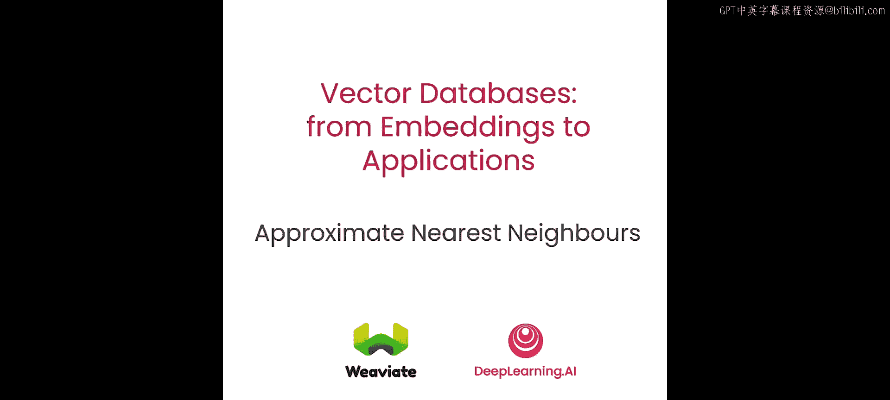
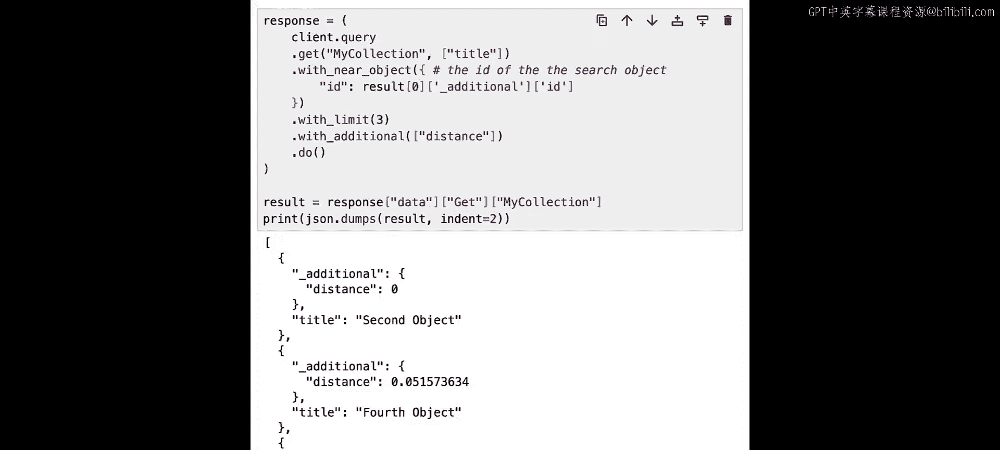

# 004：近似最近邻算法 🧠

在本节课中，我们将学习近似最近邻算法的理论与实践。你将理解ANN算法如何通过牺牲少量精度来换取巨大的性能提升。我们将重点探讨分层可导航小世界算法，并了解它如何驱动世界上最强大的向量数据库。我们还将演示HNSW的可扩展性，以及它如何解决暴力KNN算法的时间复杂度问题。

## 理论：从精确到近似

上一节我们介绍了向量搜索的基本概念。本节中，我们来看看当数据量变大时，精确搜索面临的问题。

观察一个包含20个向量的例子，搜索最近邻可能不是大问题。然而，一旦数据量达到数千或数百万，这就变成了一个巨大的难题，精确搜索变得不可行。

许多算法可以让我们以更高效的方式找到近似最近邻向量。解决此问题的算法之一是HNSW，它基于人类社会网络中的“小世界现象”。其核心思想是，平均而言，我们之间都通过“六度分隔”理论相连。

因此，你可能有一个朋友的朋友的朋友……最终连接到目标人物。整个想法是，你可能认识一个认识所有人的人，而那个人可能也认识一个社交广泛的人。通过这种方式，你实际上可以在六步之内找到与目标人物的联系。我们可以将同样的概念应用到向量嵌入上，如果我们能建立这种连接。

## 构建可导航小世界

现在，让我们看看可导航小世界算法，它允许我们在不同节点之间构建这些连接。

以下是构建过程的步骤：
*   从向量0开始，尚无连接。
*   添加向量1，唯一可能的连接是到向量0。
*   添加向量2，可以建立到向量1和0的两个连接。
*   继续此方法，为向量3建立到向量2和0的连接。
*   为向量4建立到向量2和0的连接。
*   为向量5建立到向量2和0的连接。
*   为向量6建立到向量2和4的连接。
*   最后，为向量7建立到向量5和3的连接。

就这样，我们构建了一个可导航小世界。请注意，在此示例中，我们仅为每个向量尝试建立两个连接，但在现实中，根据向量数量，你可以有8个、32个甚至更多连接。

## 在NSW中进行搜索

现在让我们看看如何在这个可导航小世界中进行搜索。

在这个例子中，我们有一个位于左侧的查询向量。我们大致可以猜到向量6将是最近的向量。通常，使用NSW进行搜索时，我们从一个随机入口节点开始，并尝试朝着最近邻的方向移动。

搜索路径如下：
*   从节点7开始，它连接到节点3和5。可以看到节点5比节点7更近，因此移动到节点5。
*   从节点5，可以看到我们还连接到节点0和2，而节点2明显更近，因此移动到节点2。
*   从节点2，有多个候选节点，最佳选项是节点6，因此移动到节点6。
*   在节点6，不再有更好的候选节点，因此查询在此结束。

这就是我们找到最佳匹配（恰好是我们寻找的最近邻向量）的方式。

## 近似结果与分层结构

然而，使用NSW的搜索并不总是能找到最佳匹配。让我们看另一个例子。

如果从节点0开始：
*   潜在的候选节点是这些，此步骤的最佳选择是向量1。
*   从向量1开始，不再有任何更好的候选节点，因此搜索在此结束。

在这种情况下，我们没有找到最佳可能结果，但我们找到了近似最近邻，这仍然是一个相当好的结果，但不一定是完美结果。

现在是时候学习分层可导航小世界了，它在彼此之上放置了多层可导航小世界。你可以这样想象：如果你要去世界上的某个地方，首先你可能会乘飞机到离目的地最近的机场，然后可能换乘火车到达你想去的城镇，最后，一旦到了底层，你会步行或乘出租车前往最终目的地。

需要指出的是，HNSW每一层的构建方式与NSW非常相似，因此我们不再深入探讨。HNSW的查询方式同样是：从一个随机节点开始，我们只能从最高层可用的节点中选择，然后在该层内移动到最近的一个。一旦到达那里，我们可以在下一层找到最佳匹配。最终，一旦我们到达底层，我们就可以前往最接近查询向量的对象，这将帮助我们完成搜索的“最后一公里”。

节点被分配到不同层的方式是通过随机生成一个数字，该数字将该节点分配到该层及以下所有层。值得注意的是，节点出现在较高层的概率对数性地低于出现在较低层的概率。因此，顶层的节点数量将远少于底层的节点数量。

例如：
*   如果随机数是0，则该节点仅存在于底层（第0层）。
*   如果随机数是2，则该节点存在于第0、1和2层。

## HNSW的特性

以下是HNSW的一些特性：
*   如前所述，节点存在于更高层的可能性要低得多。
*   查询时间呈对数增长，这意味着随着数据点数量的增加，执行向量搜索所需的比较次数仅呈对数增长。在计算机科学中，这被称为 **O(log n)** 时间复杂度。
*   这种特性可以很好地可视化：随着数据点数量的增长，速度并不会随时间受到太大影响。从图中可以看出，如果向量数量从50万增加到100万，运行时间的增加是最小的。

## 代码实践：构建与搜索

现在让我们看看这一切在代码中是如何工作的。

在这个笔记本中，我们将从40个二维向量开始，并将最近邻连接数设置为2。我们可以随机构建这些向量。

首先，添加一个位于 `[0.5, 0.5]` 的查询向量。我们创建一个包含该查询向量的节点列表，然后使用`networkx`库进行可视化。接着，我们打印节点并为后续绘图块创建查询向量的位置。

接下来，我们将运行暴力算法来找到我们搜索的最佳可能向量嵌入，并将其绘制在图表上。在这种情况下，我们可以看到我们的查询在这里，而最佳匹配就在它旁边。

在这一步，我们构建HNSW层，然后在循环中逐一打印层ID，并显示每一层的所有节点和连接。让我们看一下：
*   在顶层，我们可以看到节点20、34、28和39已经相互连接。
*   当我们到达第2层时，有更多节点和更多连接。
*   在第1层，几乎所有节点都已重新连接。
*   最后在第0层，所有节点都存在并连接到它们的最近邻。

## 执行HNSW搜索查询

现在我们已经建立了跨所有层的整个网络，可以运行实际的HNSW搜索查询。

首先，我们得到一个搜索路径图数组，其中包含跨所有层的旅行路径图。接下来，我们有一个入口图数组，它为我们提供了图的入口点。然后，我们在循环中遍历所有层，逐层绘制所有结果以进行可视化。

搜索过程如下：
*   从顶层节点39开始。从39，我们可以移动到节点20，这使我们更接近查询。一旦我们在20，不再有任何20的邻居节点能使我们更接近查询。
*   然后我们移动到第2层。从第2层的节点20，可以带我们到节点16。但节点16没有其他能使我们更接近查询的候选节点，这使我们进入下一层。
*   从第1层，我们可以从节点16移动到2。从节点2，不再有任何其他候选节点能使我们更接近查询。
*   所以我们最终移动到底层。然后从节点2，我们可以一路走到节点25，而它恰好是我们查询的完美匹配。

就这样，我们跨所有层执行了HNSW查询，并返回了最接近的匹配。

## 使用向量数据库进行搜索

现在让我们看看如何使用向量数据库执行向量搜索，它几乎包含了所有这些功能。

为此，我们将使用Weaviate，一个开源向量数据库。Weaviate提供的模式之一是嵌入式选项，允许我们在笔记本内运行向量数据库。

第一步，我们需要创建数据模式（或我称之为数据集合）。我们将它命名为“my_collection”，向量化器设置为“none”，这基本上意味着我们只想使用纯向量搜索，并且我们希望使用的距离度量设置为“cosine”。

运行后，我们将在数据库中获得一个新的空集合。如果你想稍后重新运行相同的示例并需要重新创建集合，我留给你一段代码，允许你在集合存在时删除它然后重新创建，但你不必觉得必须一遍又一遍地重新运行它。

现在是时候将一些数据导入向量数据库了。假设我们有这五个具有标题、完整值和向量嵌入的随机对象。

以下代码将帮助我们获取数据对象并将其加载到数据库中。我们设置了批量加载过程，这是一种最佳实践，尽管我们只处理五个对象，但通常如果你加载成千上万或数百万对象，使用批量加载过程实际上是有益的。然后，我们实际运行一个循环遍历所有数据项，构建一个属性对象，然后运行`client.batch.add_data_object`，将对象插入数据库。

我们需要添加集合名称（称为“my_collection”），数据对象是我们拥有的属性，向量实际上存在于`item.vector`中。这就是我们如何将向量传递到数据库中的方式。

现在让我们检查数据库中有多少个对象。我们可以在集合上运行此查询，然后只询问内部对象的计数。运行后，我们可以看到我们的集合包含五个对象。

## 查询数据库

现在让我们实际查询数据库。查询如下：我们想说，嘿，我想从“my_collection”中搜索，我想取回标题，我想用这个向量运行它。这只是一个跨越六个维度的随机向量，以匹配我们的原始数据。通过这样说，我们告诉Weaviate只获取两个最佳匹配。如果我运行这个，它会告诉我们第二个对象和第四个对象匹配我们的结果。

如果你想查看所有匹配对象的向量嵌入，可以复制此代码并添加这一行，它基本上告诉我们也获取距离、向量和数据的ID。现在我们可以看到第一个对象的距离计算为0.65，这是匹配的向量，第二个匹配向量也是如此。

由于我们使用的是向量数据库，我们可以做所有额外的事情，比如对特定属性进行过滤。

在这种情况下，我们可以添加一点额外的代码，告诉数据库只搜索`full_value`大于44的对象，并且只搜索预过滤的对象。像这样，你可以看到我唯一匹配到的对象是那些`full_value`确实大于44的对象。

我们可以在向量搜索中做的另一件事是，基于提供的对象ID查找其他相似对象。在这里，我们只是从前一个查询中获取第一个结果，并寻找三个匹配此对象的对象。在这种情况下，你当然会找到它自己以及第四个和第一个对象。

## 总结

本节课中，我们一起学习了HNSW的工作原理，如何构建HNSW层并在所有层中进行搜索，同时也学习了如何在生产就绪的数据库中使用类似算法。下一节课，你将学习如何将向量数据库与像OpenAI这样的机器学习模型一起使用，如何向量化数据以及如何向量化查询，并且还将深入探讨用于创建、读取、更新和删除对象的CRUD操作。