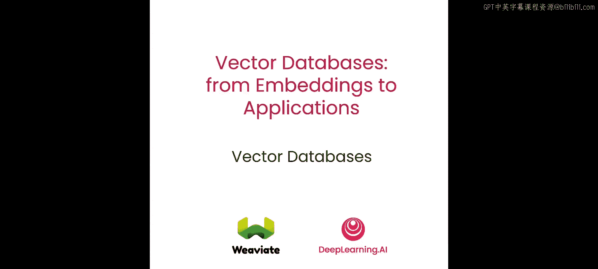
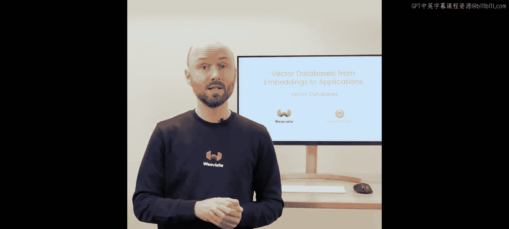
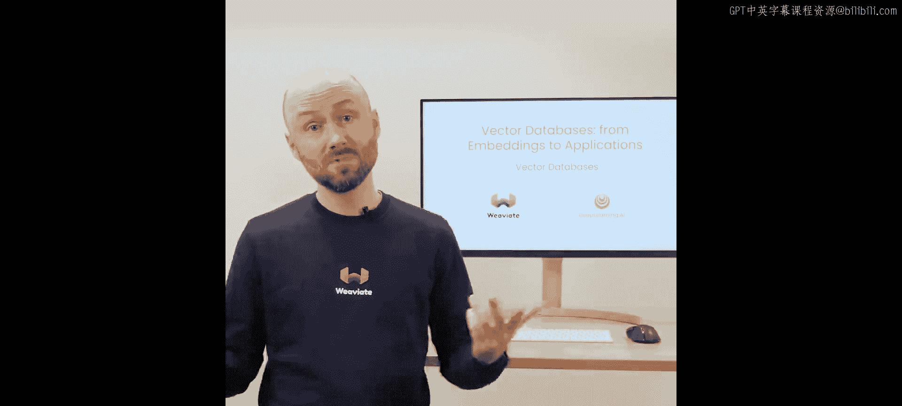
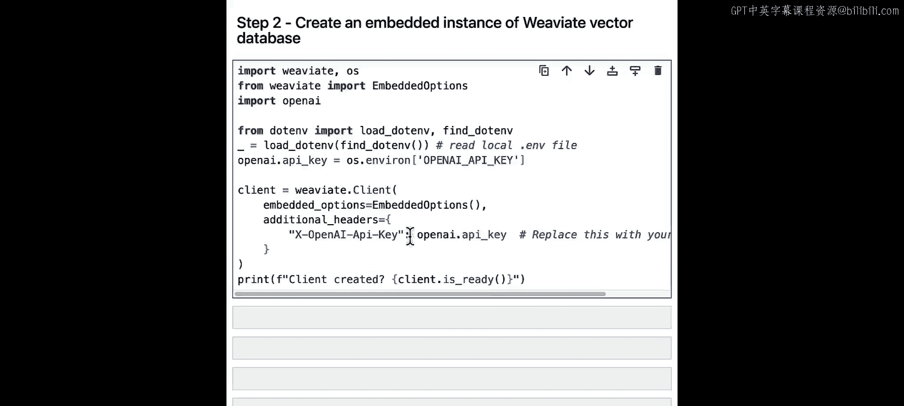
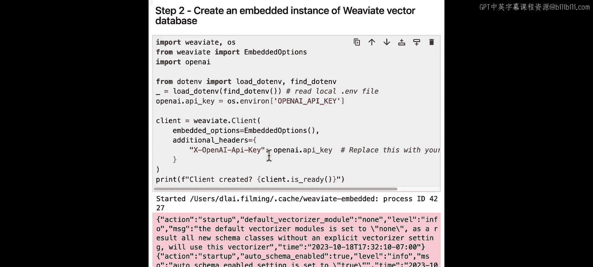
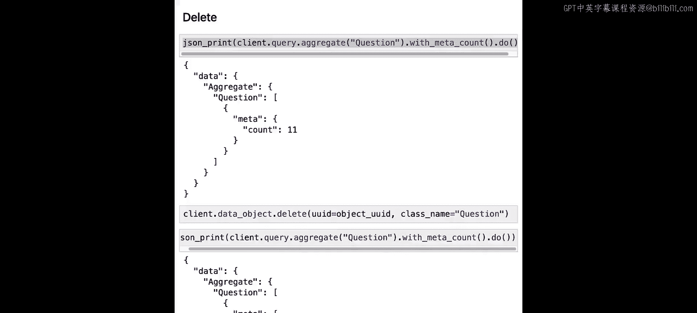

# 005：L4_对象与向量

在本节课中，我们将介绍 Weaviate，一个开源的向量数据库，并讨论如何使用它执行语义搜索，以及它如何支持 CRUD 操作（即创建、读取、更新和删除）。我们还将检查存储在数据库中的对象和向量。本节课将为你提供向量数据库入门的基础知识，甚至包括一些高级主题，例如执行过滤搜索。

在这个项目中，我们将使用一个包含一组《危险边缘》问答的示例数据集。我们的想法是，我们将拥有类似“类别”、“问题”和“答案”的数据，并将其加载到向量数据库中，然后对其执行语义搜索查询。

与上一课类似，我们将设置一个 Weaviate 的嵌入式实例，但这里的一个不同之处是，我们将使用 OpenAI 来生成我们的向量嵌入。为此，我们需要加载一个 OpenAI API 密钥。如果你在自己的环境中运行此项目，可能需要将其替换为你自己的 API 密钥。但出于本教程的目的，你可以保持原样。如果你看到此类警告信息，不必担心，这纯粹是信息性的，一切工作正常。

如果你好奇嵌入式实例内部有哪些可用功能，基本上 Weaviate 提供了这个模块化系统。它允许你使用诸如与 OpenAI 的生成式搜索，或者通过 Cohere、Hugging Face 或 OpenAI 运行文本向量化等功能。这就像是其背后的强大动力，因为它允许你跳过手动向量化，让数据库为你处理。这就是我想在接下来的步骤中向你展示的。

与上一课一样，我们需要从创建一个新的集合开始。我们将其命名为 `question`。这次，我们将使用 `text2vec-openai` 向量化器。这是一个非常强大的模块，允许你在导入数据时以及每次查询时自动生成向量嵌入。向量数据库将获取必要的输入，然后将其发送给 OpenAI 进行向量化。

作为提醒，让我们打印一个数据对象，以便了解其数据结构。然后，我们可以将该数据对象导入到我们的 `questions` 集合中。这就是我们将要做的：我们将以每批 5 个的方式导入数据，基本上对于每个对象，我们会说“嘿，我们正在导入这个问题”，用答案、问题和类别构建我们的对象，然后将其传递到数据库中。

请注意，我们这次没有传递向量嵌入，因为这正是 `text2vec-openai` 模块应该做的事情，它将为每个对象生成向量嵌入。如果你运行此代码，向量化就完成了。

为了验证，我们可以在 `question` 集合上运行这个快速的聚合查询，可以看到我们确实有 10 个对象。

现在，我们可以做的是，也许从我们的 `question` 集合中获取一个对象。让我们看看它有什么类别、问题和答案。但更重要的是，让我们看看为该特定对象生成了什么向量嵌入。如果我们运行此代码，可以看到一个完整的向量嵌入，它相当长，应该是一个大约 1500 维的嵌入。

现在，让我们尝试使用语义搜索运行一个向量查询。我们将使用 `nearText` 操作符，并将我们的查询作为概念传入。查询本身是“biology”，这就是我们要找的。为了添加一些额外信息，我们还显示一个附加属性，即“距离”。然后，如果我们运行此查询，应该会得到两个与“biology”查询匹配的对象。

这就是我们的结果。由于底层模型使用余弦距离，较小的数字表示更好的匹配。因此，在这种情况下，0.19 和 0.2 实际上表明与我们的“biology”查询有很强的匹配度。

我们还可以运行一个查询来返回数据库中所有的对象，然后查看这里所有可用的距离。你可以看到，随着我们向下滚动，距离会增加。由于我们使用余弦距离度量，这基本上意味着最差的匹配在底部，最好的匹配在顶部。

现在，让我们再次尝试运行相同的查询。但问题是，我们并不总是知道有多少对象是最佳匹配。也许我们可以做的一件事是说，比如“我接受特定距离内的任何东西”。这次我可以说我的距离是 0.24，任何高于该距离的对象都应该被拒绝。这是一个很好的方法，可以说“我对结果质量有特定要求，任何超出该要求的都应该被忽略”。

就像你在这里看到的，最终结果在 0.23 处被截断。

由于我们正在使用向量数据库，这意味着我们还可以执行各种 CRUD 操作，如创建、读取、更新或删除。

要创建单个对象，我们需要做的就是调用 `client.data_object.create()`，然后我们可以在其中传入数据对象，并提供要插入的集合名称。同样，`text2vec-openai` 模块会为此对象生成向量嵌入。让我们添加这个对象，现在我们可以打印它的 UUID。

现在，让我们看一个读取示例，以读取我们在上一个代码块中刚刚创建的对象。我们将通过这个对象 ID 来获取它。然后，如果我们打印它，这就是我们的对象。如果你好奇想看看为它生成了什么向量嵌入，我们所要做的就是添加 `include_vector=True`，然后运行该命令将为我们提供包含所有信息及其向量嵌入的对象。

现在，让我们获取该对象并可能更新它。之前答案只是“Italy”，但让我们将其设置为“Florence in Italy”。如果我们运行此代码，对象将被更新。然后，我们可以再次通过其 ID 获取它，可以看到答案确实被更新了。

最后，我们到了只想删除示例对象的阶段。在这种情况下，我们首先要做的是检查之前有多少个对象。然后，我们可以根据其 ID 删除该对象。最后，我们将打印聚合结果，以验证我们只剩下一个对象。之前我们有 11 个，现在回到了 10 个。

本节课到此结束。在这里，你学习了如何使用向量数据库通过 OpenAI 自动向量化所有数据，并使用相同的机制向量化查询并执行各种搜索，包括向量搜索和过滤搜索。我们还介绍了如何使用各种 CRUD 操作，以便在应用程序的整个生命周期中维护数据。在下一课中，我们将介绍稀疏向量和稠密向量的概念，并了解混合搜索，它允许我们结合这两种方法来提供更好的结果。

