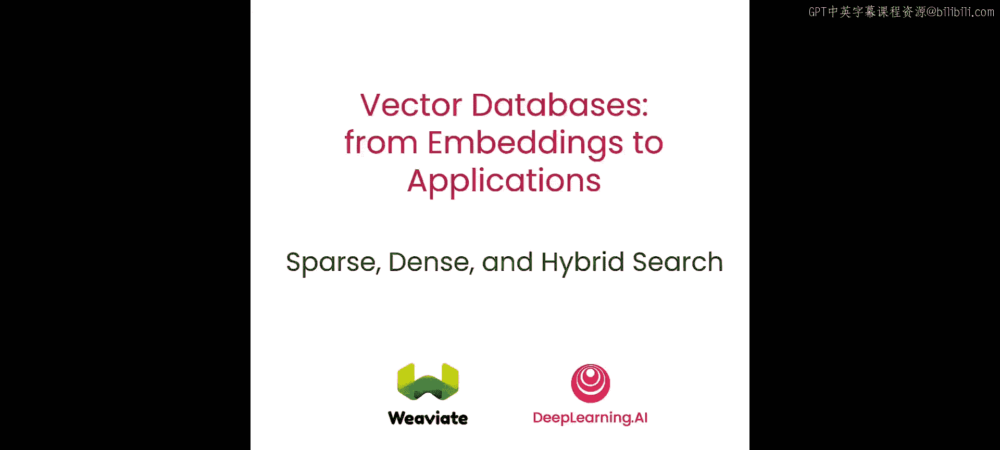
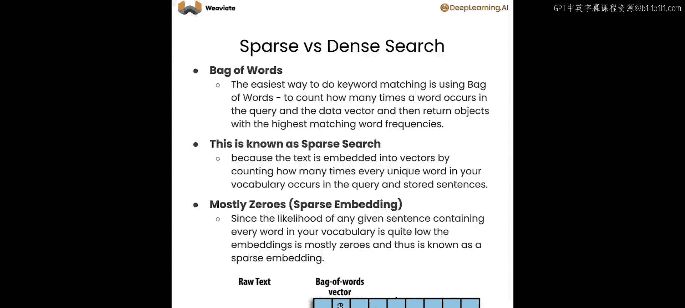
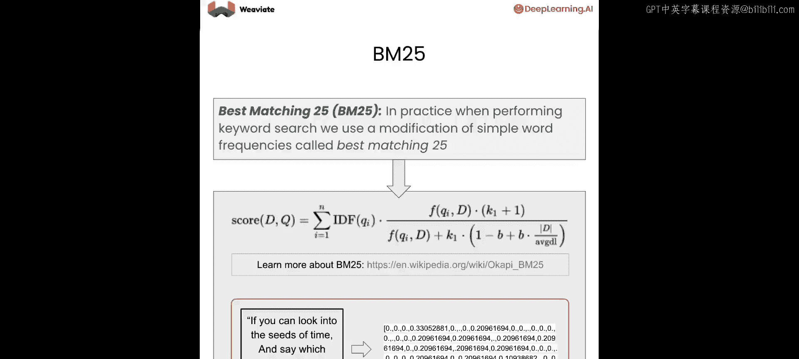
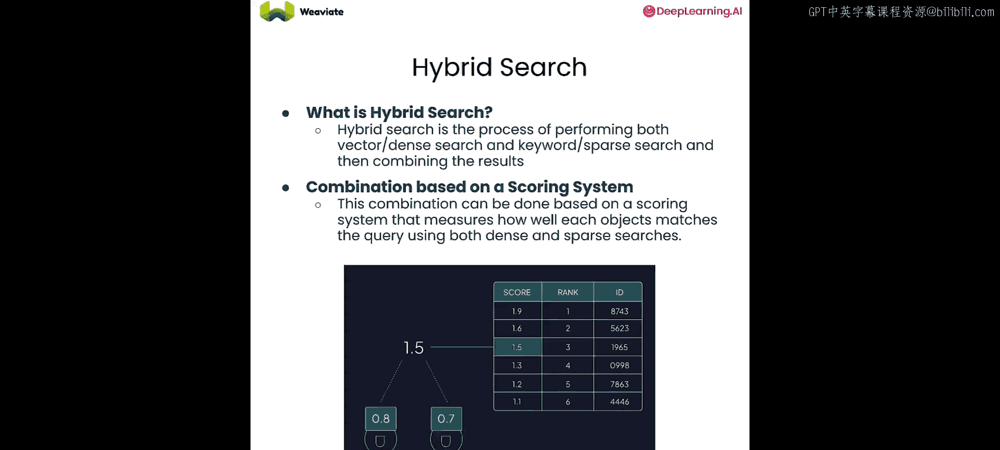
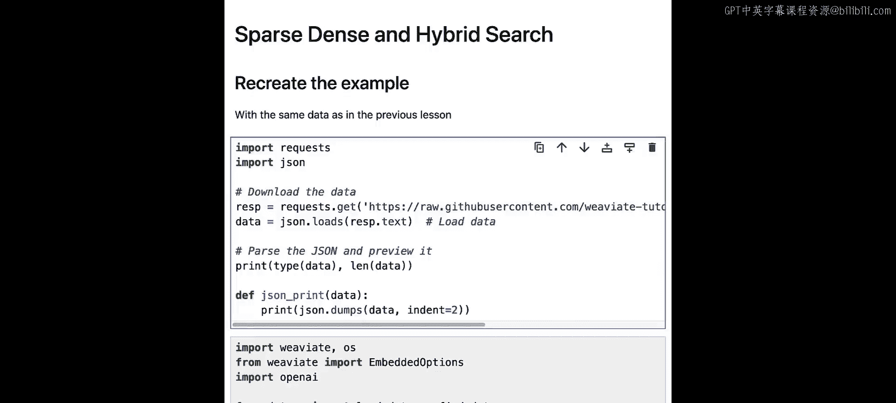
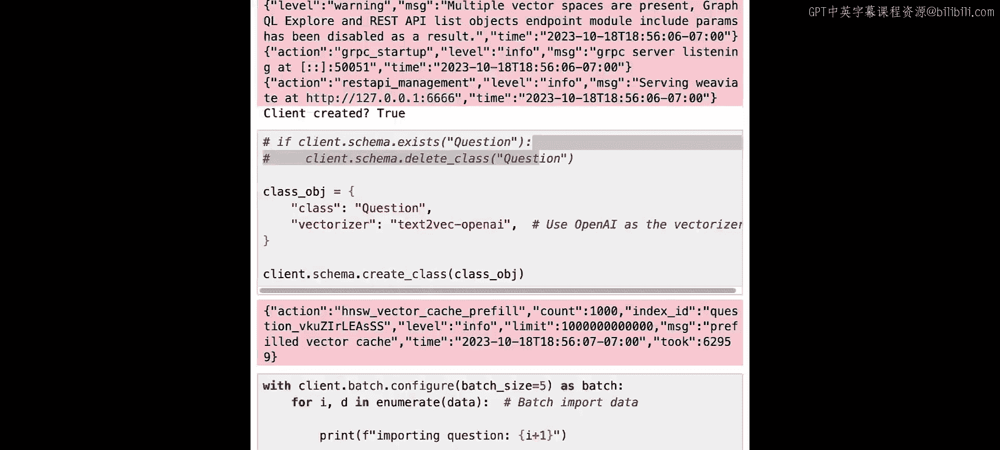
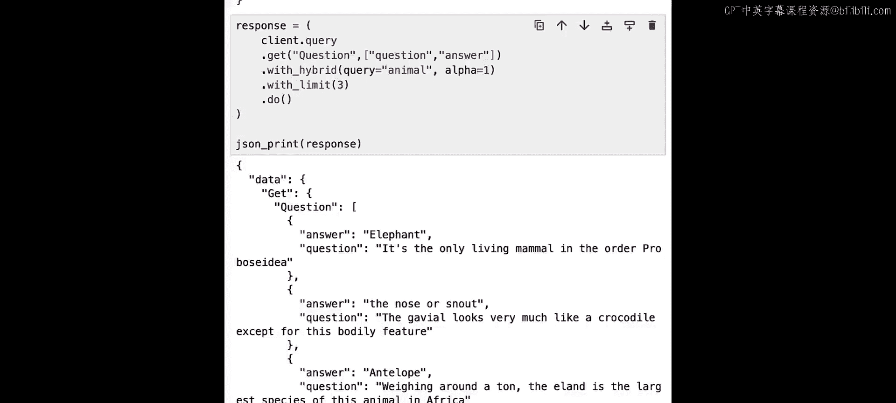

# 006：混合搜索 🔍



在本节课中，我们将学习两种不同的搜索技术：密集向量搜索和稀疏向量搜索。我们将介绍它们各自的概念、实现方式以及优缺点。随后，我们将探讨如何通过**混合搜索**将两者结合，从而充分利用各自的优势，获得更优的搜索结果。

---


## 密集搜索与稀疏搜索的区别

上一节我们介绍了向量搜索的基本概念，本节中我们来看看两种主要的搜索方法。

**密集搜索**使用数据的向量嵌入表示来执行搜索。它依赖于数据的语义含义来匹配查询。例如，搜索“小狗”可能会返回关于“幼犬”的信息。然而，这种方法有其局限性。如果使用的模型是在完全不同的领域上训练的，查询的准确性就会很差。这就像问一位医生如何修理汽车引擎，医生很可能无法给出好答案。另一个例子是处理序列号或看似随机的文本字符串时，像“43300”这样的代码本身没有太多语义含义，使用语义搜索引擎可能无法返回高质量的结果。

因此，我们需要为这类情况寻找不同的方向，尝试使用**关键词搜索**，也称为**稀疏搜索**。

稀疏搜索允许你利用关键词在所有内容中进行匹配。一个例子是使用**词袋模型**。其核心思想是，对于数据中的每一段文本，提取所有单词并不断扩展可用词汇表。例如，在一个句子中，“extremely”出现一次，“word”出现两次，我们就可以为这个对象构建一个稀疏嵌入向量。之所以称为“稀疏”，是因为在整个数据集中，词汇量可能非常大，但代表某段具体数据的向量中，绝大多数位置（对应未出现的词）的计数都是0。

一个优秀的关键词搜索算法是**最佳匹配25**，也称为 **BM25**。它在处理大量关键词搜索时表现优异。其核心思想是：统计查询短语中每个词的出现频率，出现频率高的词在匹配时权重较低，而罕见的词如果匹配成功，则得分会高得多。

我们不必在两者中选择其一，这就是**混合搜索**的用武之地。

---

## 混合搜索的工作原理

混合搜索是一种在单次查询中同时运行稀疏向量搜索和密集向量搜索的方法。对于每种搜索，我们会得到不同的得分和结果。然后，我们可以将这些得分组合成一个综合得分，并据此对所有结果进行重新排序，最后返回给用户。

让我们看看如何在代码中实现这一切。

---

## 代码实践

我们将使用与上一课完全相同的数据集，因此不再赘述数据细节。让我们快速加载数据，创建一个新的Vectara实例。

```python
# 创建Vectara实例
client = vectara_client

# 创建集合并导入数据
collection = client.create_collection()
collection.import_data(data)
```

现在，我们可以开始执行搜索查询了。

首先，执行一个你已经熟悉的查询，使用 `near_text` 进行密集向量搜索，我们搜索与“动物”相关的概念。

```python
# 密集向量搜索
results_dense = collection.search(
    query="animal",
    search_type="near_text"
)
```





我们可以看到，语义上我们匹配到了像“哺乳动物”和“鳄鱼”这样的内容，当然也精确匹配到了“动物”本身。

接下来，尝试使用关键词搜索执行相同的查询。我们将添加 `with_bm25` 参数。

```python
# 稀疏向量搜索 (BM25)
results_sparse = collection.search(
    query="animal",
    search_type="bm25"
)
```





这次，我们只得到一个结果，即精确匹配“动物”关键词的对象。



现在，进入最精彩的部分：执行**混合搜索**。

```python
# 混合搜索
results_hybrid = collection.search(
    query="animal",
    search_type="hybrid",
    alpha=0.5
)
```

这里有一个特殊参数 `alpha`，它决定了倾向于哪种搜索方式。`alpha` 越接近1，表示越倾向于密集向量搜索的得分；`alpha` 越接近0，则表示越倾向于关键词搜索的得分。

运行后，我们可以看到得到的结果与之前类似，但有趣的是，内部包含“animal”关键词的对象被排到了最前面，这使它进入了我们的首要关注区域，可以优先返回给用户。

让我们再尝试用不同的 `alpha` 值进行搜索。

```python
# 纯关键词搜索倾向 (alpha=0)
results_hybrid_keyword = collection.search(
    query="animal",
    search_type="hybrid",
    alpha=0
)

# 纯密集向量搜索倾向 (alpha=1)
results_hybrid_dense = collection.search(
    query="animal",
    search_type="hybrid",
    alpha=1
)
```

当 `alpha=0` 时，我们只得到基于关键词搜索的有用响应，密集向量搜索的结果未被返回。当 `alpha=1` 时，这基本上就是纯粹的密集向量搜索。

这就是密集搜索、稀疏搜索以及通过混合搜索将两者结合起来的强大之处。

---

## 总结

本节课中，我们一起学习了：
1.  **密集向量搜索**：基于语义相似性进行匹配，擅长处理有丰富含义的查询。
2.  **稀疏向量搜索（如BM25）**：基于关键词精确匹配，擅长处理术语、代码或特定名称的查询。
3.  **混合搜索**：通过 `alpha` 参数平衡两者，结合了语义理解和关键词精确匹配的优势，能够提供更全面、更准确的搜索结果。



在下一节课中，我们将深入探讨多语言搜索和检索增强生成。