# 007：多语言检索增强生成搜索 🔍

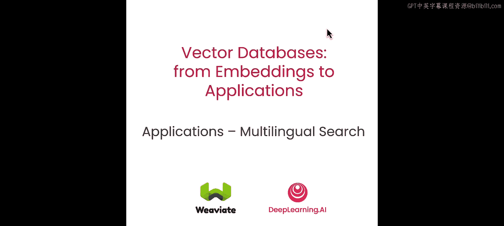

在本节课中，我们将探索多语言模型与向量数据库结合的灵活性，它允许你加载和查询多种语言的数据。我们还将介绍检索增强生成的概念，并探索如何在一个简单的查询中实现检索、推理和生成这个多步骤过程。

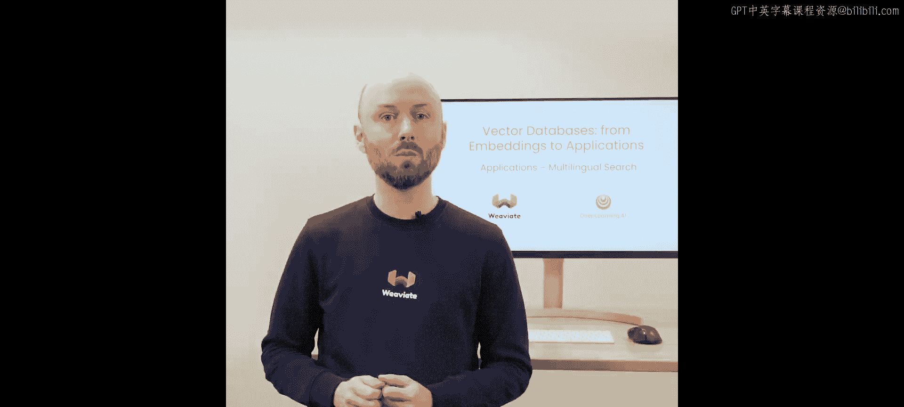

---

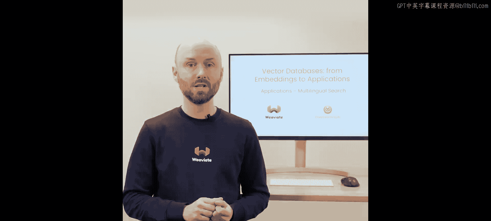

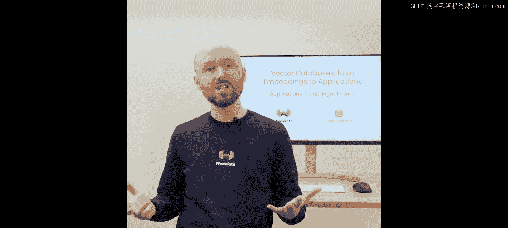

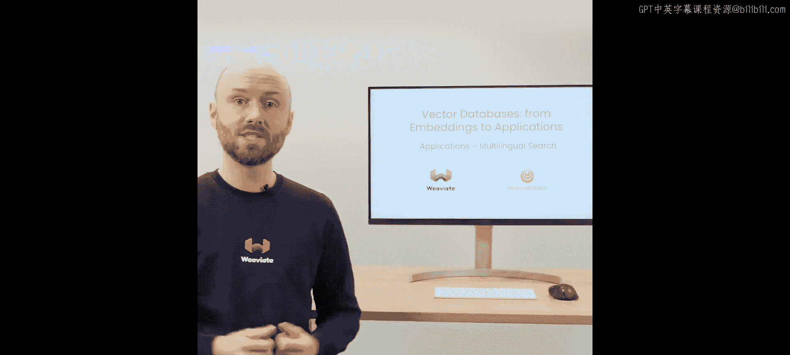

## 多语言搜索与RAG概述

上一节我们介绍了语义搜索的基本原理。本节中，我们来看看多语言搜索以及检索增强生成是如何工作的。

多语言搜索的原理与语义搜索非常相似。在语义搜索中，我们可以比较“狗”和“小狗”并找到高度匹配的结果。在多语言搜索中，你可以拥有不同语言的相同文本，这些文本会生成非常相似（即使不完全相同）的嵌入向量。通过这种方法，我们可以使用相同的技术来搜索任何语言的内容。

检索增强生成的基本思想是，它允许我们将向量数据库用作外部知识库。它不仅能检索相关信息并提供给大语言模型，还能与向量数据库中的数据协同工作。使用RAG的一个好处是，我们可以在自己的数据上运行应用，而无需重新训练或微调大语言模型。

你可以将RAG想象成去图书馆查阅资料。如果有人在你没有任何参考资料的情况下提问，你可能只能编造答案。但如果你去图书馆，你可以阅读书籍然后提供回答。这基本上就是RAG结合向量数据库所做的事情。

以下是RAG的一些关键优势：
*   它有助于减少大语言模型的“幻觉”（即生成不准确或虚构信息）。
*   它使大语言模型能够引用信息来源。
*   它可以解决知识密集型任务，特别是对于那些在公开数据中很难找到的信息。

---

## RAG查询流程与代码示例

一个完整的RAG查询工作流程如下：
1.  首先，向向量数据库发送查询，获取所有相关的源对象。
2.  然后，将这些信息组合成一个提示。
3.  最后，将提示发送给大语言模型，由其生成我们感兴趣的响应。

以下是一个执行RAG的快速代码示例：

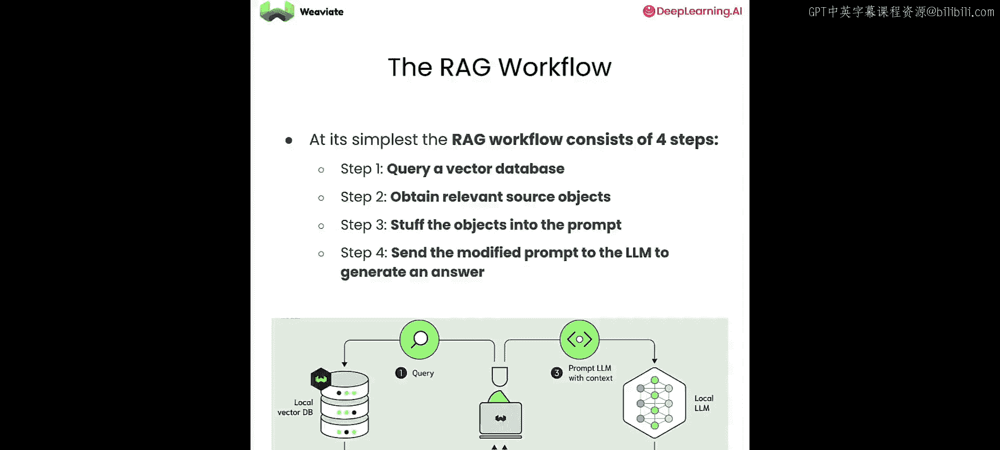

```python
# 这是一个RAG查询的简化示例
results = vector_db.query(
    query_text="你的查询问题",
    top_k=5
)
prompt = construct_prompt(results, user_query)
response = llm.generate(prompt)
```

可以看到，这与我们过去执行的查询非常相似，只是这次我们增加了 `generate` 部分。不过，我们更倾向于在具体代码中实践它。

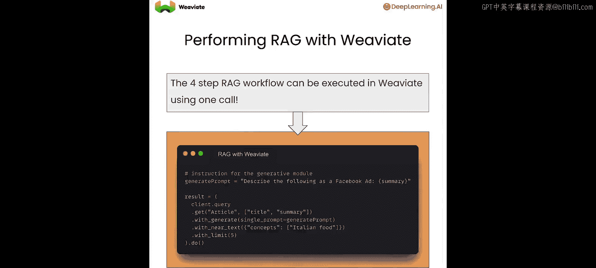

---

## 实战准备：环境与数据

现在，让我们开始动手构建。首先准备我们的环境。本次演示我们将使用一个已部署在云端的Weaviate实例，它利用了Cohere的多语言模型。

在这里，我们可以看到我们提供了两种类型的API密钥：
*   **Cohere API密钥**：用于多语言搜索。
*   **OpenAI API密钥**：用于生成式搜索。

让我们快速查看一下数据库中处理的对象数量。我们拥有大约430万篇维基百科文章可供使用，这非常棒。

---

## 多语言搜索实战

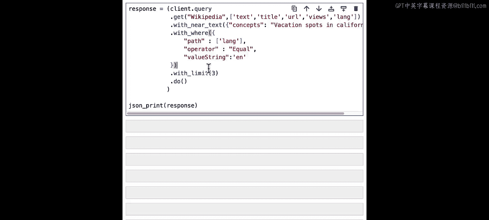

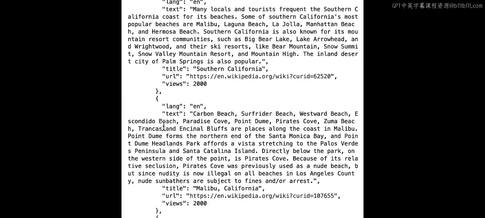

现在，让我们用这个大数据集进行一些有趣的查询。

首先，我们尝试搜索加利福尼亚州的度假胜地。运行这个查询并返回5个对象，你可以立即看到返回了几个英文对象，一个法语结果，一个西班牙语结果（实际上是两个）。你可能还注意到，我们在眨眼之间就完成了对430万个对象的查询。

为了让结果更清晰，我们添加一个过滤器，使返回的下一个结果都是英文的，并且只返回3个对象。查询本身仍然是多语言的。

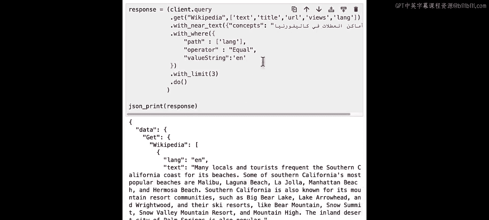

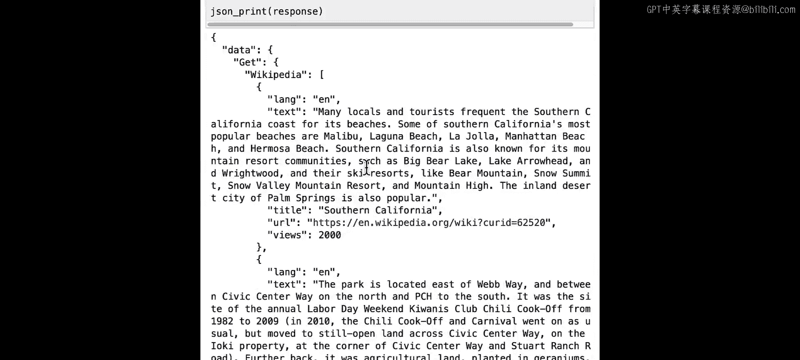

那么，我们还能用这个系统做什么呢？我们尝试用不同的语言发送查询。例如，我们用波兰语询问“加利福尼亚州的度假胜地”。运行这个查询，我们仍然得到与之前相同的结果。

你可能会认为，用使用相似字母表的波兰语搜索并不那么令人印象深刻。那么，我们尝试用完全不同的字母表进行查询。我们可以用阿拉伯语运行相同的查询，它仍然表现得非常好，并且返回了谈论加利福尼亚州度假胜地的对象。

---

## 检索增强生成实战

现在，让我们做一些RAG示例。起点与我们之前所做的非常相似，是一个直接的语义查询。现在，我们可以添加一个提示。

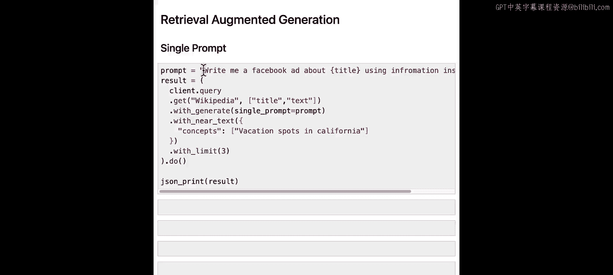

我们构建一个提示，例如：“为我写一篇关于 `{query_title}` 的Facebook帖子，使用 `{result_text}` 内的信息。” 通过这样做，我们基本上根据查询结果构建了提示。

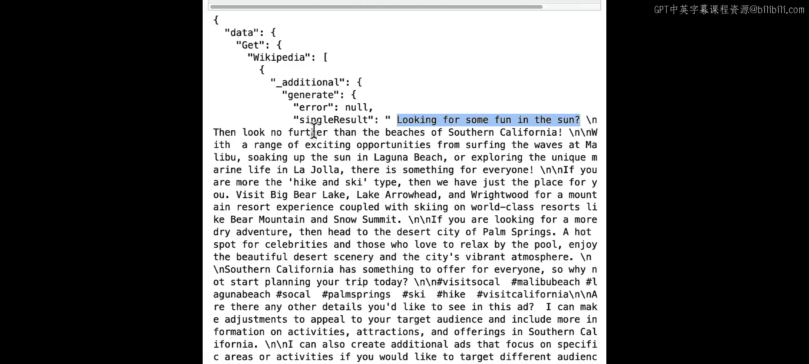

为了执行实际的生成查询，我们需要添加 `.with_generate()` 方法，并传入我们构建的单个提示。这样做，我们基本上是要求向量数据库为每个单独的对象传入相同的提示，因此我们应该得到三个不同的生成响应。

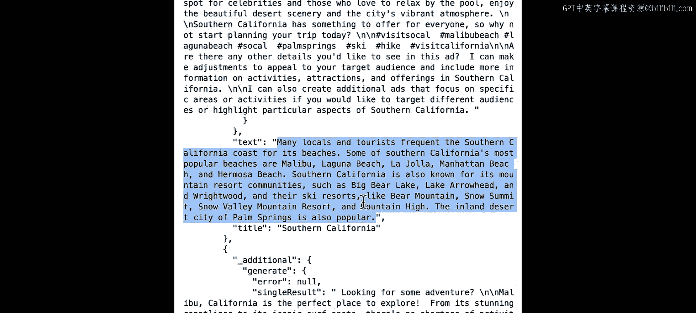

在这里，我们可以看到生成的结果，这是由GPT生成的全新内容。例如，“寻找阳光下的乐趣？不用再找了……” 这是它所基于的文本，同样的情况也发生在另外两个响应中。

另一种类型的RAG查询是分组任务，它基本上接受一个提示，然后运行查询，接着将所有结果作为单个查询发送给GPT。然后我们运行它，并期望只得到一个生成结果。例如，在这种情况下，我们想用两段话来总结这些帖子是关于什么的。

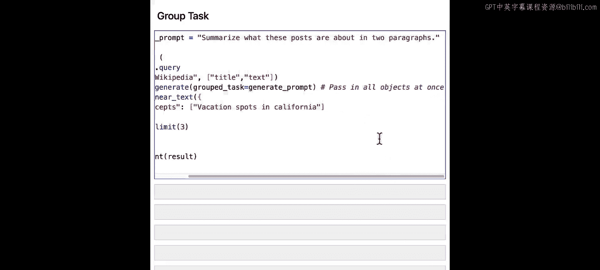

结果，我们得到了对原始查询返回的所有三个帖子的总结。

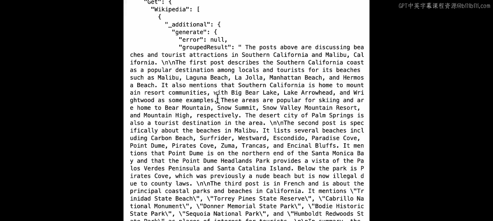

---

## 课程总结

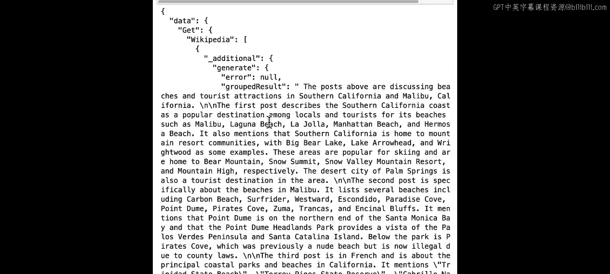

本节课到此结束。在本节课中，你学习了如何使用多语言搜索，能够跨任何语言编写的内容进行搜索，并且可以用你需要的任何语言提供查询。我们还介绍了几个RAG查询的例子，在这些例子中，我们使用单个提示和分组任务，基于单个对象或生成集体响应来生成回答。