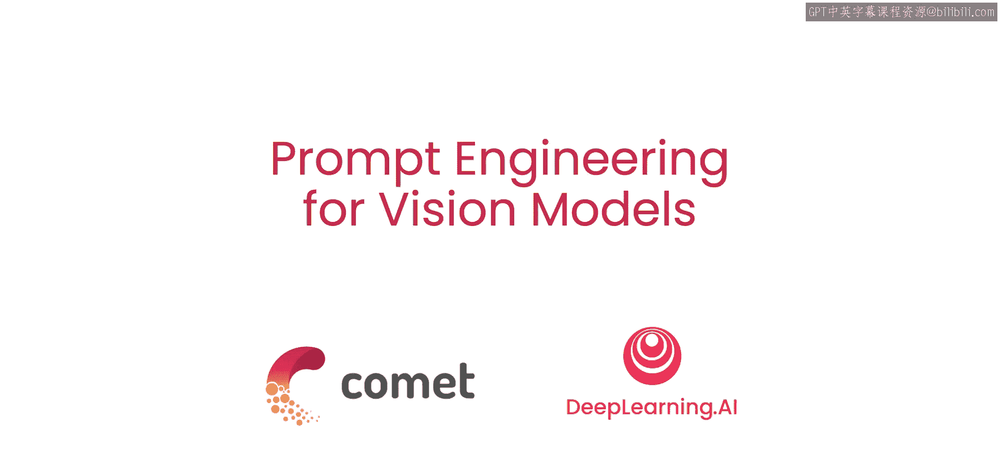
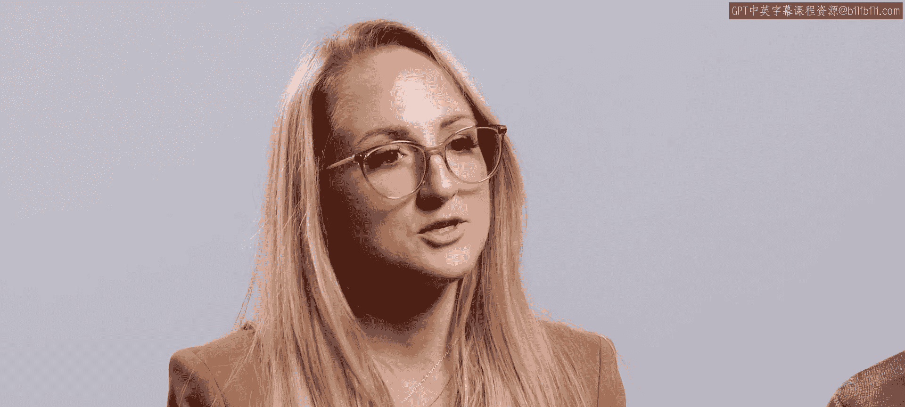
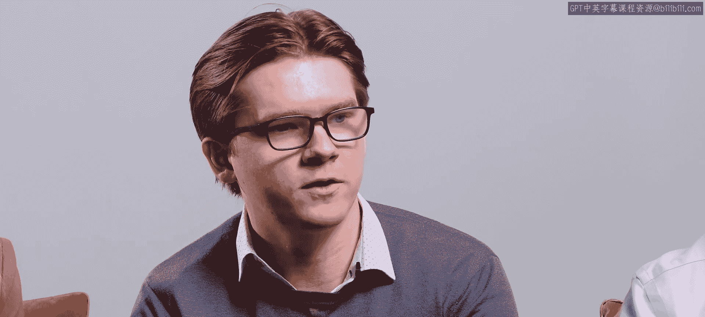
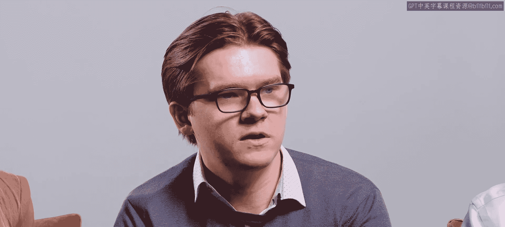
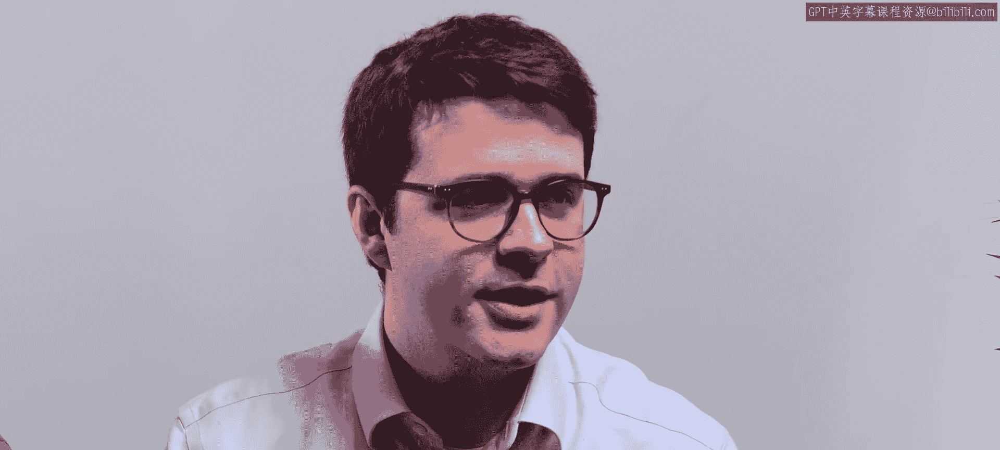
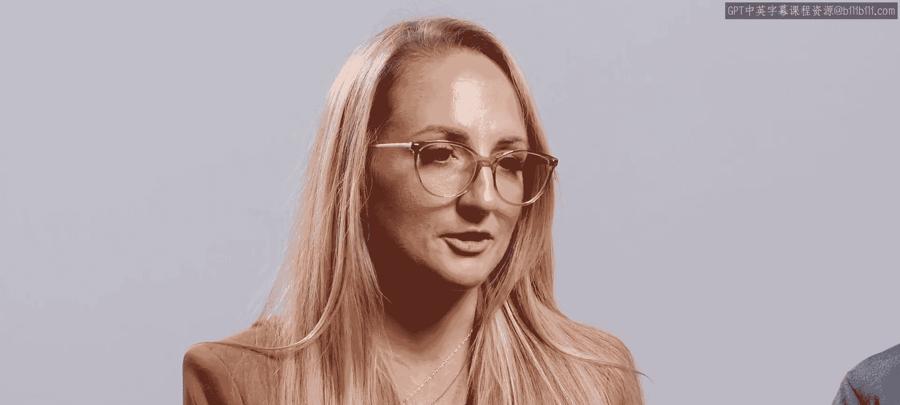
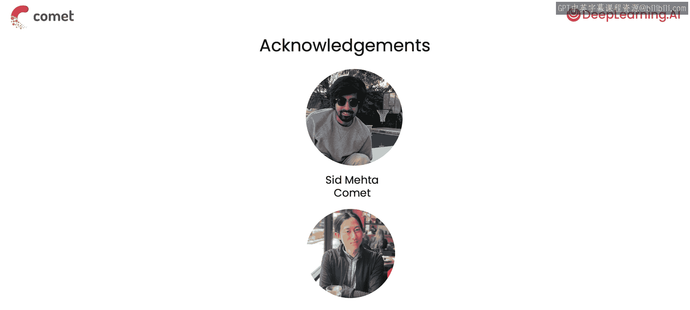

# 001：课程介绍 🎯

在本课程中，我们将学习视觉模型的提示工程。提示工程不仅适用于文本模型，也适用于视觉模型，包括图像分割、目标检测和图像生成模型。根据视觉模型的不同，提示可以是文本，也可以是像素坐标、边界框或分割掩码。

## 视觉提示概述

上一节我们介绍了课程的整体目标，本节中我们来看看视觉提示的具体应用。

在课程中，你将使用提示来引导“分割一切模型”（Segment Anything Model，简称 **SAM**），通过提供坐标、点或边界框来帮助模型识别物体的轮廓。例如，识别一只狗穿着的T恤。你还将应用**负向提示**来告诉模型在识别物体时应排除哪些区域。结合使用正向和负向提示，有助于你精确分离出感兴趣的区域或物体，比如狗穿着的T恤上的特定图案。

## 图像生成与迭代

但提示SAM只是一个例子。你将学习更多工具，以及用于分析（理解图像）和生成（或修改图像）的最佳提示实践。

以下是本课程将涉及的核心内容：

*   **图像生成**：例如，你可以向Stable Diffusion模型提供文本提示“一条龙”来生成龙的图像。
*   **提示迭代**：你可以迭代提示，例如改为“一条写实的绿龙”，以获得不同的图像。
*   **图像修复**：你将引导扩散模型用生成的龙替换照片中的猫，同时保持照片其余部分完好。这被称为**图像修复**，即通过移除一个分割出的物体并用生成的图像替换它来编辑图片。

对于图像修复，你的提示不仅包括文本“一条写实的绿龙”，还包括龙将要替换的猫的轮廓（掩码）。你将通过图像分割获得这个轮廓。此外，你将通过提示一个目标检测模型（例如使用文本提示“穿着粉色夹克的可爱小狗”）来生成围绕该狗的边界框，这个边界框将作为SAM的输入。

## 模型超参数调优

你将在这个图像修复流程中，对提示和模型超参数进行迭代调优。

扩散模型的工作原理是将来自简单分布（如高斯噪声）的样本，转化为复杂的已学习分布（如图像）。以下是几个关键超参数：

*   **引导尺度**：该参数决定了在反向扩散过程中，文本输入对目标分布的影响程度。公式可表示为：`引导尺度越高，输出与文本提示的匹配度越高`。较低的引导尺度允许模型从其学习的图像分布中自由采样，而较高的引导尺度会引导模型生成更贴近文本输入的样本。
*   **推理步数**：该参数控制模型将噪声分布逐步转换回清晰样本的渐进程度。通常，更多的步数允许更详细和准确的生成，因为模型有更多机会细化数据。然而，更多的步数也意味着更长的计算时间。
*   **强度**：在Stable Diffusion的背景下，该参数决定了在修复过程中初始分布的噪声程度，即用于擦除初始图像部分区域的添加噪声量。强度本质上决定了在扩散过程中保留多少初始图像。

## 模型个性化：DreamBooth

此外，如果你想个性化扩散模型，让它生成的不是普通的龙、猫或人，而是特定的龙、你特定的宠物猫或你最好的朋友，该怎么办？

你将使用一种由Google Research开发的微调方法——**DreamBooth**，来调整Stable Diffusion模型，使其将文本标签与特定对象（如你的好友）关联起来。在课程中，你将使用DreamBooth微调过程，让模型仅用六张Andrew的照片就将“AndrewNg”这个词与之关联。微调后，你可以用“一幅梵高风格的Andrew画作”这样的文本来提示模型，模型就能生成相应的图像。

## 工作流程与评估

视觉模型开发工作流程的一个独特之处在于，评估指标并不总能告诉你全部情况。通常，你需要可视化你的图像输出并手动检查，以了解模型在哪些地方做得好，哪些地方做得不好。我们也将讨论高效进行此类迭代的最佳实践。

假设你的目标检测模型突然表现不佳，而输入数据分布没有变化。你打开一些错误预测结果，发现图像中引入了一个新物体，你的模型将其误判为目标物体。这时就需要针对这个新物体进一步训练你的模型。仅靠评估指标很可能无法完整描述这里发生的情况，因此可视化输出非常重要。

同样，在对不同超参数集进行迭代时，有时你需要查看输出图像，才能理解超参数值如何影响它。实验跟踪工具可以帮助你并排比较这些输出图像，并跟踪和组织哪些输入导致了哪些输出，以便日后复现。

计算机视觉工作流程是高度迭代的，因此跟踪你的每一次实验运行非常有价值。

## 课程团队与启动

许多人共同努力创建了这门课程。我要感谢Comet团队的成员，以及DeepLearning.AI的Eddie Shu对本课程的贡献。

在第一课中，你将概览本课程将用到的、用于图像分割、目标检测和扩散模型的视觉提示。这听起来很棒，让我们开始吧！完成本课程后，我相信你在提示工程方面能成为一个真正的远见者。

---

**本节课总结**：本节课我们一起学习了视觉模型提示工程的课程介绍，涵盖了从图像分割（SAM）、图像生成与修复（Stable Diffusion），到模型个性化微调（DreamBooth）以及工作流程迭代与评估的核心概念和应用场景。