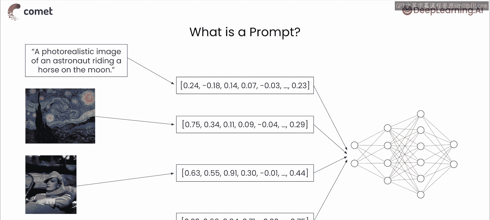
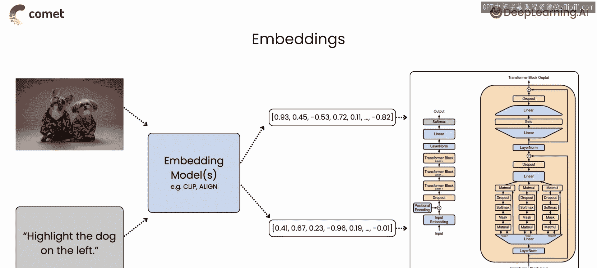
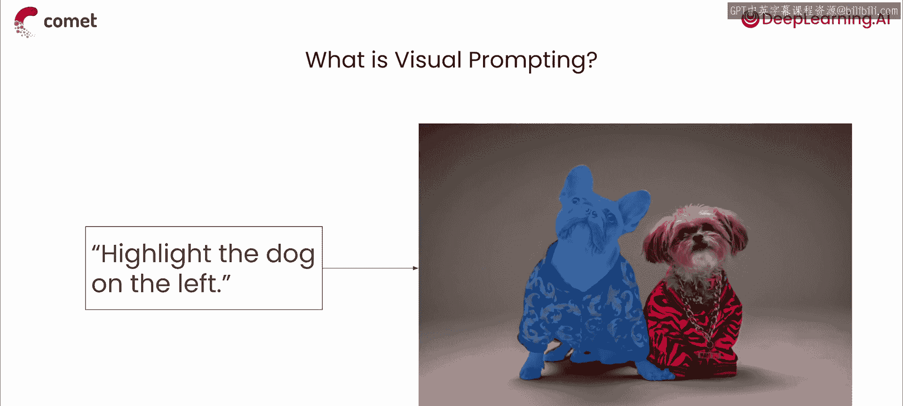
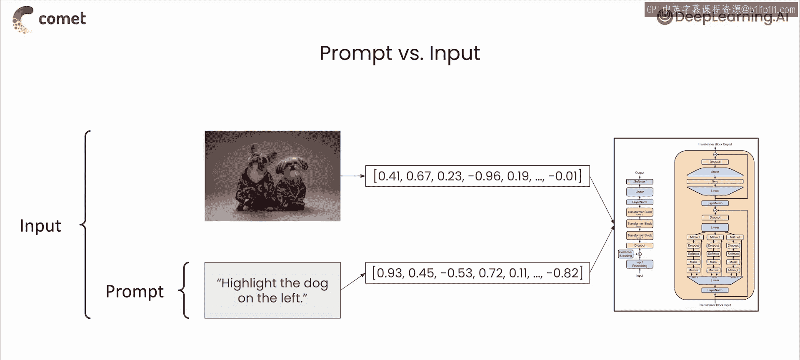
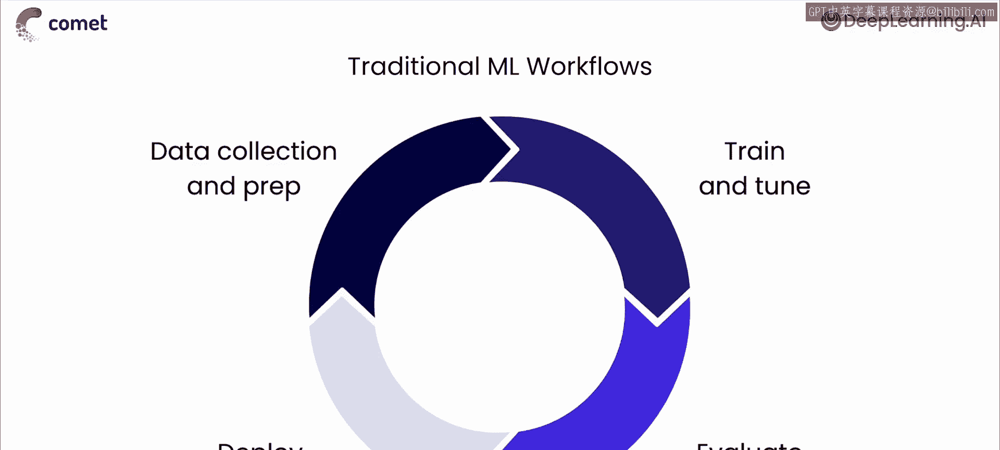
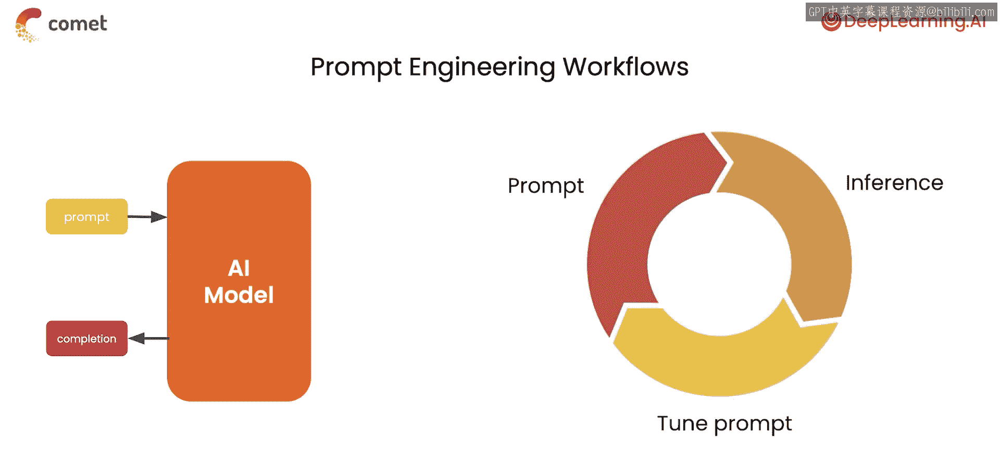
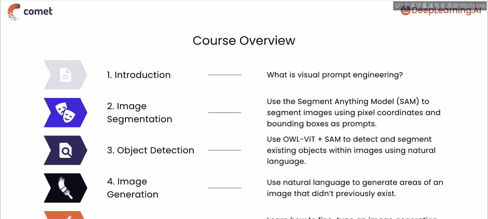

# 002：课程概述 🎯

在本节课中，我们将学习提示工程的基本概念，这些知识将为后续的代码实践打下基础。我们将探讨什么是提示、视觉提示与语言模型提示的区别，以及提示工程与传统机器学习工作流程的不同之处。

## 什么是提示？💡

上一节我们介绍了课程目标，本节中我们来看看提示的基本定义。你可能最熟悉用于大型语言模型的文本提示，但提示并不仅限于文本或大型语言模型。理论上，任何类型的数据都可以作为提示，包括文本和图像，也包括音频和视频。

一个提示就是一个输入，它引导着输出的分布。视觉输入对于扩散模型而言正是起到了这种作用。

以下是几种提示的示例：
*   **文本提示**：例如，“一张宇航员在月球上骑马的逼真图像”。如果你使用过大型语言模型，对此会很熟悉。
*   **图像提示**：正如我们提到的，提示是引导输出采样分布的输入。例如，你可以指示一个视觉模型，以我们提供的这幅梵高画作的风格来重新创作一张图像。
*   **视频提示**：同理，视频也可以作为提示，因为视频本质上就是一系列图像的组合。
*   **音频提示**：一段某人说出“一张宇航员在月球上骑马的逼真图像”的音频片段，可以作为音频模型的提示。

最终，这些数据类型在被输入到机器学习模型之前，都会被转换成数值表示。通常，这些输入会被进一步处理成**嵌入**，以节省空间和计算资源。

一个**嵌入**就是一个相对低维的空间，你可以将高维向量转换到这个空间中。一些流行的文本和图像嵌入技术包括 **CLIP** 或 **ALIGN**，本课程中你将使用的模型都集成了这些技术。

## 视觉提示与输入 🔄

视觉提示与语言模型提示类似，是一种与预训练模型交互以完成特定任务的方法，而这个任务可能并非模型被明确训练过的。这通常涉及传递一组描述你希望模型做什么的指令，有时会附带一些图像数据。

如前所述，这些指令可以有多种形式，包括文本和其他图像，也包括**像素坐标**和**边界框**，这两种形式我们都将在本课程中使用。

现在我们来澄清一下**提示**和**输入**之间的区别。提示是一组描述模型应执行任务的指令。因此，提示是输入到模型的总输入数据的一部分，总输入数据可能还包括额外的上下文数据。

在这个例子中，提示是“高亮左边的狗”这个指令，但总输入是包含狗的输入图像与提示的组合。同样重要的是要注意，模型的输入不一定包含提示。

## 提示工程工作流程 🛠️

提示工程工作流程与传统机器学习工作流程有着本质的不同，后者侧重于训练、测试和迭代。

事实上，在提示工程工作流程中，你完全不需要进行任何训练。相反，你将使用一个预训练模型，并专注于设计模型设置、输入数据和提示的最佳组合，以获得期望的输出。请注意，在这个工作流程中，我们从不更新模型权重，我们只是改变传递给模型的输入。

在本课程的大部分时间里，我们都不会进行模型训练。因此，我们需要使用一个针对我们特定用例微调过的模型，或者一个能很好地泛化到它可能从未见过的任务和概念的模型。我们将在本课程的最后一课中了解微调，以及一些用于跟踪和可视化训练过程的最佳实践，以确保其易于复现。

## 实验跟踪与课程实践 📊

无论你是构建传统的机器学习系统还是进行提示工程，跟踪所有数据、模型和超参数配置都将帮助你复现结果并更快地迭代。这被称为**实验跟踪**。

你可以使用诸如 **Comet** 这样的可观测性工具，来自动化跟踪应用程序生命周期中模型训练阶段和生产监控阶段的所有这些组件。在本课程中，你将利用 Comet 来跟踪你的微调数据（使用其数据集版本控制功能），以及其可视化能力来帮助你查看将要生成的图像。你运行的所有代码也将保存在 Comet 中，确保你可以随时回顾每张图像，并确切知道它是如何生成的。

在本课程中，你将通过创建一个在 Comet 中跟踪的文本到图像修复管道，来探索几种提示大型视觉模型的不同方法。

以下是本课程的主要实践内容：
1.  首先，你将使用 Meta 的 **Segment Anything Model**（简称 **SAM**）来创建并选择图像区域的分割掩码。
2.  接着，你将探索如何使用像素坐标、边界框甚至文本来指示 SAM 生成哪些掩码。
3.  然后，你将进行**图像修复**。在非 AI 语境中，修复是指修复部分褪色或受损的艺术品的方法。在 AI 语境中，图像修复指的是使用一系列视觉模型来编辑图像部分区域的动作：首先识别要编辑的图像区域，然后生成其替换内容。
4.  你将使用的图像生成模型是 Stability AI 的 **Stable Diffusion**。你将亲眼看到提示的细微不同如何导致截然不同的结果。
5.  你还将使用 Comet 跟踪所有这些输入和输出，以便可以并排检查所有结果，并选择最佳生成的图像。

拥有一个实验跟踪工具作为助手，将使你以及任何与你协作的人，能够在未来遵循完全相同的步骤来创建完全相同的图像。

## 课程目标与总结 🎓

提示工程通常是优化大型语言或视觉模型输出的最经济、最快捷的方法。但有时你可能会发现，仅靠提示工程不足以完成你的特定任务，这时对模型进行微调以执行该特定操作可能会获得更好的结果。因此，你还将探索如何基于你自己的自定义图像数据集，通过 Google 的 **DreamBooth** 训练技术来微调 Stable Diffusion。

本节课中我们一起学习了：
*   视觉提示的基本概念及其与输入的区别。
*   提示工程工作流程与传统机器学习工作流程的差异。
*   实验跟踪的重要性以及 Comet 工具的作用。
*   本课程将涵盖的实践内容，包括使用 SAM 进行分割、使用 Stable Diffusion 进行图像修复和微调。

到本课程结束时，我们的目标是让你能够理解什么是视觉提示；能够使用像素坐标、边界框、嵌入和自然语言来提示大型视觉模型；能够用少量图像微调扩散模型；并且知道如何跟踪、组织和可视化你所有的输入和输出，以便日后能够复现你的结果。

在下一课中，你将提示 Segment Anything 模型，使用像素坐标和边界框来生成掩码。让我们进入下一课。