# 003：图像分割模型（SAM）入门教程 🖼️

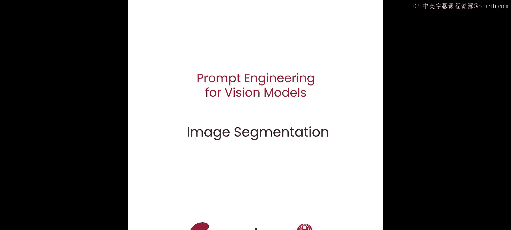

在本节课中，我们将学习如何使用“Segment Anything Model”（SAM）进行图像分割。我们将探索如何通过点坐标、边界框以及正负提示来引导模型生成精确的分割掩码。这些掩码是后续图像编辑等高级视觉任务的重要输入。

## 什么是图像分割？🔍

上一节我们介绍了课程概述，本节中我们来看看图像分割的基本概念。

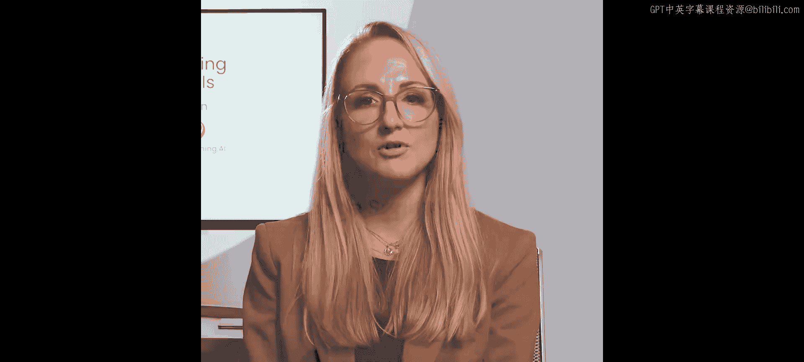

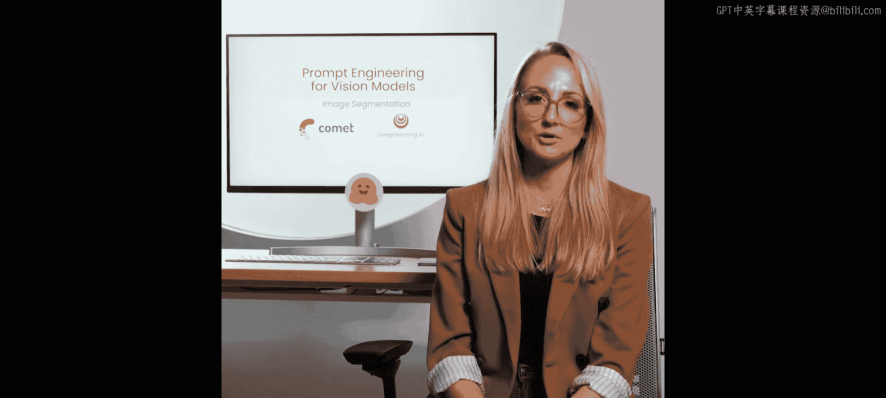

图像分割是一种计算机视觉技术，它将数字图像划分为离散的像素组或图像片段。这项技术通常用于定位图像中的物体和边界，并广泛应用于物体检测、三维重建和图像编辑等工作流程中。

更精确地说，图像分割是为图像中的每个像素分配一个标签的过程，使得具有相同标签的像素共享某些特征。

## 探索SAM模型 🚀

了解了基础概念后，我们来看看本课的核心工具：Segment Anything Model（SAM）。

原始的Segment Anything Model是计算机视觉领域的一个里程碑，它已成为许多高级下游任务（如图像分割、图像描述和图像编辑）的基础步骤。但其高昂的计算成本有时会阻碍其在工业场景（如边缘设备）中的更广泛应用。

SAM的计算成本主要来自其Transformer架构。如下图所示，SAM接受边界框坐标或单像素坐标以及输入图像。这些输入分别由图像编码器和提示编码器编码，然后馈送到掩码解码器中。最终，SAM会为该点或边界框输出前三个有效的掩码。

**Fast SAM** 是一个基于CNN的Segment Anything模型，仅使用原作者发布数据集的2%进行训练。它在32x32像素的图像上实现了可比的性能，但运行速度提高了50倍。

提示Fast SAM与提示原始SAM略有不同，它会自动检测图像中所有高于可配置置信度阈值的掩码，然后根据用户提供的提示过滤所有生成的掩码。

## 环境设置与图像准备 ⚙️

我们已经在此环境中安装了必要的包。如果您在自己的环境中跟随操作，需要先安装几个包。

首先，我们将打开本课全程使用的示例图像并查看它。

```python
# 示例：打开图像
from PIL import Image
image_path = "example.jpg"
image = Image.open(image_path)
image.show()
```

在创建第一个掩码之前，您需要将图像调整为1024像素宽，因为这是SAM模型期望的输入尺寸。为此，我们编写了一个自定义函数，您可以从实用工具库中导入。

```python
# 示例：调整图像大小
def resize_image(image, target_width=1024):
    # 计算缩放比例
    ratio = target_width / image.width
    target_height = int(image.height * ratio)
    resized_image = image.resize((target_width, target_height), Image.Resampling.LANCZOS)
    return resized_image

resized_image = resize_image(image)
```

调整后，图像看起来与之前完全相同，只是尺寸发生了变化。

## 使用点坐标提示生成掩码 🎯

本节我们将学习如何使用点坐标来提示模型。我们将从使用SAM模型隔离左侧的狗开始。为此，您需要在图像上定义一个点，模型将以此作为分割的起点。

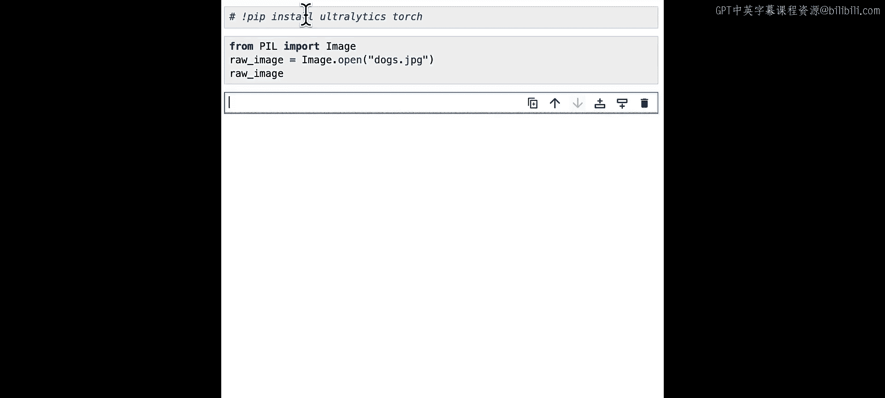

首先，导入一个我们为您创建的实用函数，用于检查您指定的点在图像上的位置。

```python
# 导入可视化点函数
from utils import show_points_on_image
```

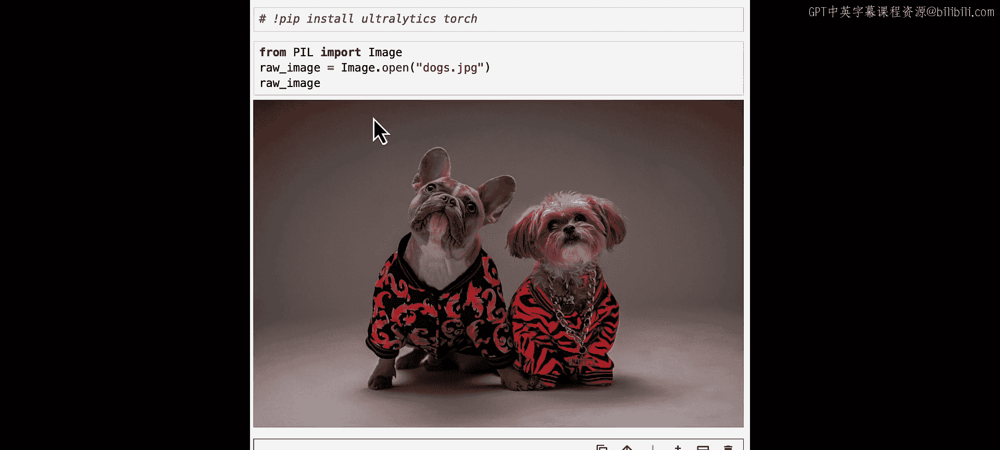

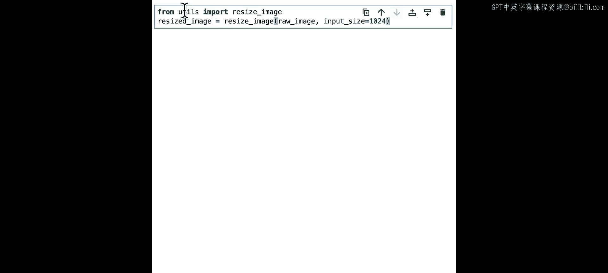

由于在提示SAM模型时可以指定多个点，我们将使用嵌套列表来定义输入点。第一个坐标指X轴，第二个坐标指Y轴。我们还可以将输入标签定义为正或负。正点包含在掩码中，负点则从掩码中排除。

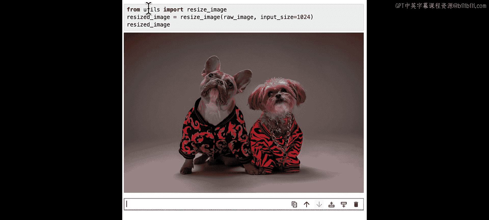

对于第一个示例，让我们使用一个正点。

```python
# 定义点坐标和标签
input_point = [[500, 300]]  # 示例坐标，需根据实际图像调整
input_label = [1]  # 1 表示正提示
```

使用上面的自定义函数，我们可以可视化该点在图像上的位置。

```python
show_points_on_image(resized_image, input_point, input_label)
```

现在您已经定义了点提示并调整了输入图像的大小，让我们将这些信息传递给模型以生成您的第一个掩码。

以下是生成掩码的步骤：

1.  在图像上运行模型。这将把整个图像分割成多个掩码，然后我们可以使用点提示进行过滤。
2.  根据上面定义的点，过滤上一步生成的掩码。

```python
# 步骤1：运行模型生成所有掩码
# 假设使用 Fast SAM
from fastsam import FastSAM
model = FastSAM('FastSAM-s.pt')
everything_results = model(resized_image, device='cpu', retina_masks=True, imgsz=1024, conf=0.4, iou=0.9)

# 步骤2：根据点提示过滤掩码
from fastsam import FastSAMPrompt
prompt_process = FastSAMPrompt(resized_image, everything_results, device='cpu')
masks = prompt_process.point_prompt(points=input_point, pointlabel=input_label)
```

生成掩码后，您可以在原始图像上可视化它们以确保生成正确。

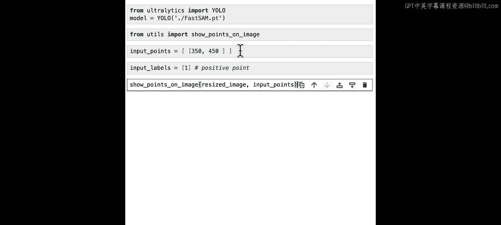

```python
# 可视化掩码
from utils import show_masks_on_image
show_masks_on_image(resized_image, masks)
```

## 使用多点与正负提示 ✨

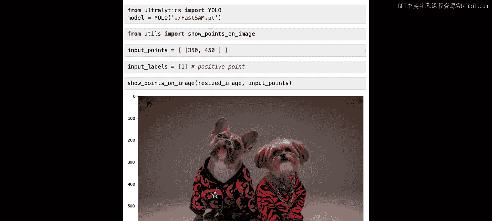

不过，您不必只选择一个点。如果您想获得更大的掩码，也可以指定两个点。让我们尝试为两只狗创建一个掩码，这被称为语义掩码。

和之前一样，您首先需要指定两个点作为SAM模型的提示。

```python
# 为两只狗定义点
input_point_multi = [[500, 300], [800, 350]]  # 两个点的坐标
input_label_multi = [1, 1]  # 两个都是正提示
```

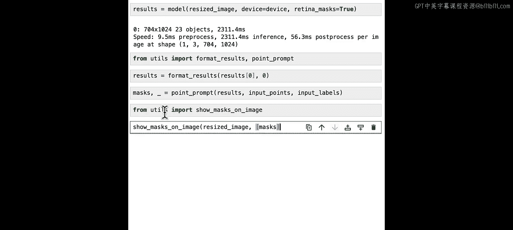

再次可视化这些点以确保位置正确。

```python
show_points_on_image(resized_image, input_point_multi, input_label_multi)
```

然后，您可以执行与之前相同的过程来获取掩码。

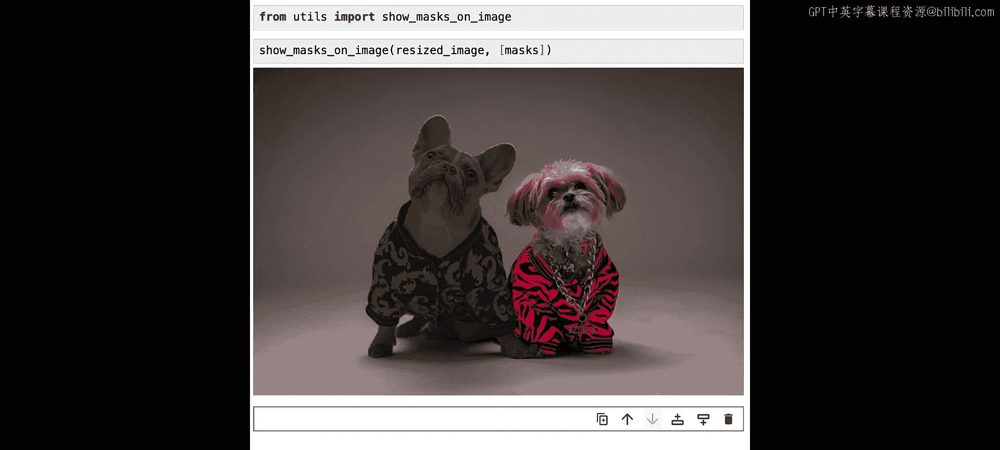

```python
# 使用多点提示生成掩码
masks_multi = prompt_process.point_prompt(points=input_point_multi, pointlabel=input_label_multi)
show_masks_on_image(resized_image, masks_multi)
```

到目前为止，我们只使用了正提示，即告诉模型我们想要分割什么。为了指定物体的子部分，使用负提示（即告诉模型我们不希望分割什么）也可能很有帮助。

这次，让我们在狗的夹克上选择一个带有正标签的2D坐标，在狗身上选择一个带有负标签的2D坐标，以向模型表明我们只想分割狗身上的夹克。

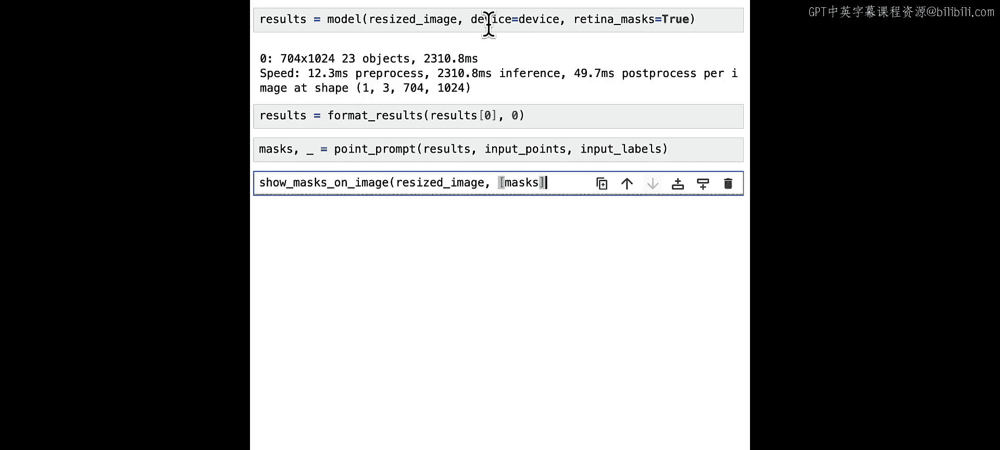

为此，我们将像之前一样传递一个2D坐标列表，但这次我们将为负标签指定0。

```python
# 使用正负提示
input_point_pos_neg = [[600, 320], [550, 400]]  # 第一个点是夹克（正），第二个点是狗身体（负）
input_label_pos_neg = [1, 0]  # 1为正，0为负
show_points_on_image(resized_image, input_point_pos_neg, input_label_pos_neg)
```

如您所见，绿色星表示正提示，红色星表示负提示。希望这能向模型表明我们只想分割夹克。

您将使用与之前相同的步骤来创建掩码。

```python
masks_jacket = prompt_process.point_prompt(points=input_point_pos_neg, pointlabel=input_label_pos_neg)
show_masks_on_image(resized_image, masks_jacket)
```

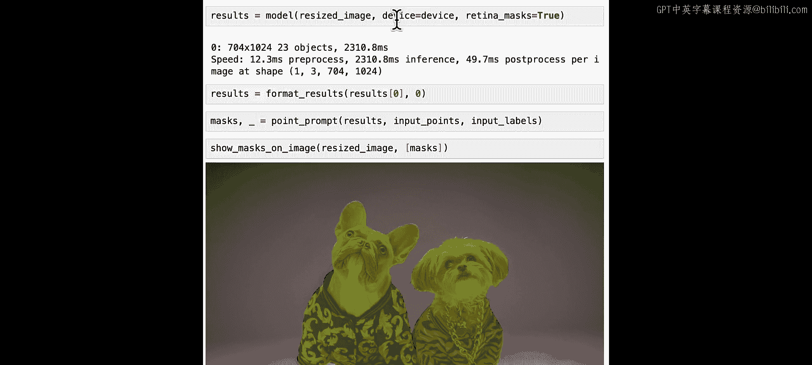

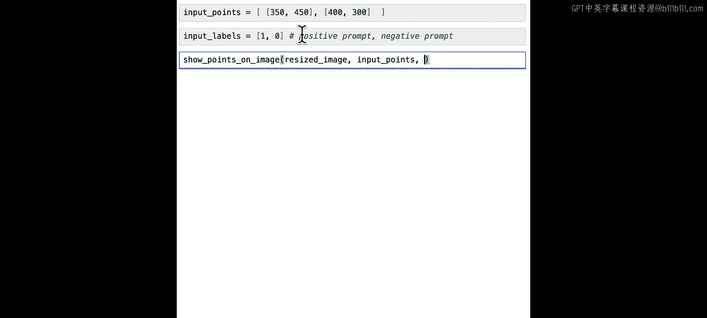

## 使用边界框提示 📦

在使用机器学习模型时，通常使用边界框。边界框是叠加在图像上的矩形，用于突出显示对象，常用于物体检测工作流。

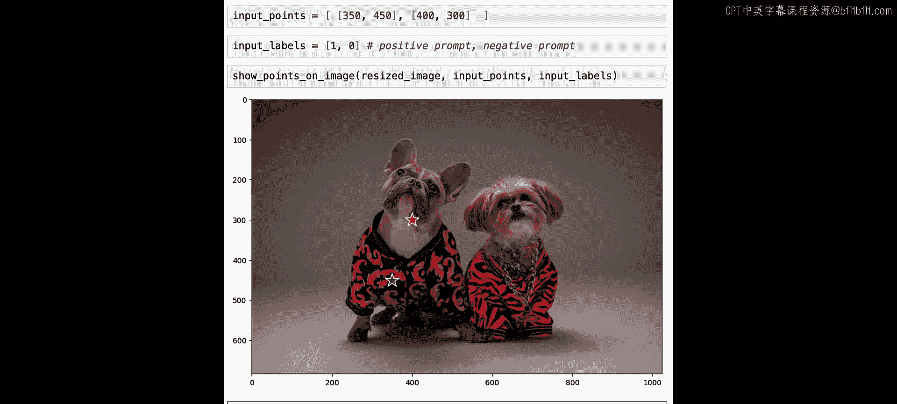

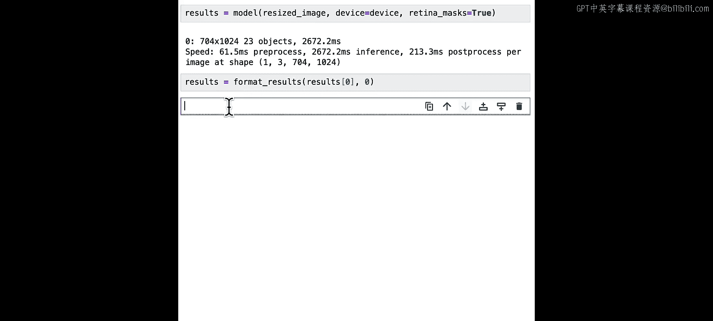

这次，我们将指定一个边界框提示来突出显示右侧的狗，而不是指定一个提示点。

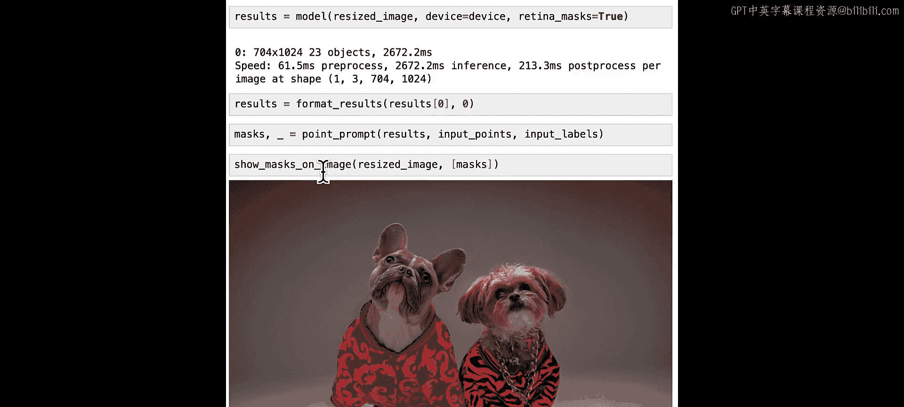

边界框的格式为 `[x_min, y_min, x_max, y_max]`，前两个坐标代表框的左上角，后两个坐标代表右下角。

```python
# 定义边界框坐标 [x_min, y_min, x_max, y_max]
input_box = [[700, 250, 950, 500]]  # 围绕右侧狗的示例框
```

我们将从模型的总输出中隔离出掩码。

```python
# 使用边界框提示生成掩码
masks_box = prompt_process.box_prompt(bbox=input_box)
```

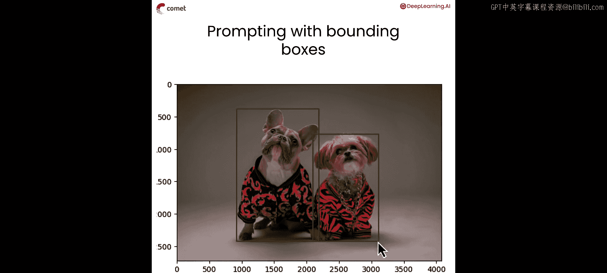

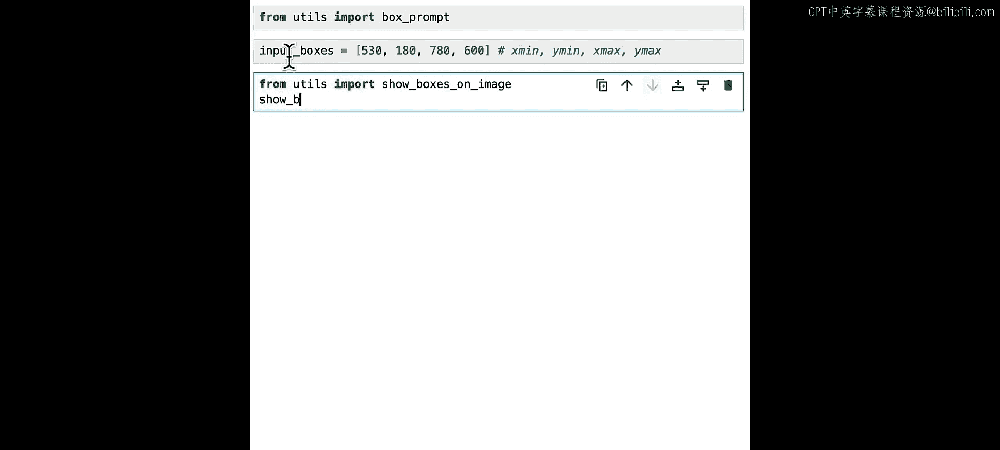

然后，我们将掩码转换为布尔值（而不是0和1），因为这是边界框提示函数所期望的。

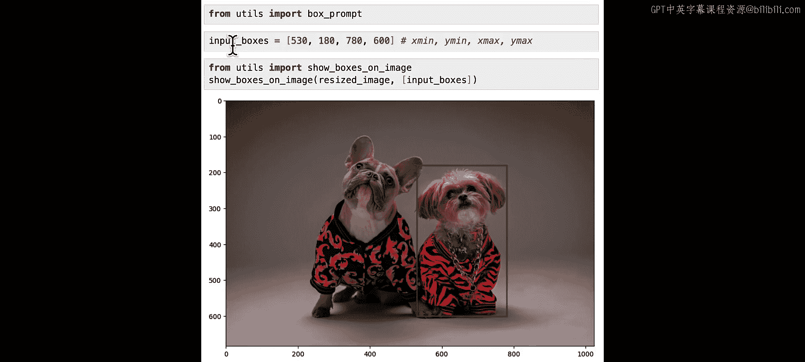

```python
# 转换掩码格式以便可视化
# 注意：具体转换取决于模型输出格式，此处为示例
final_masks = [mask.cpu().numpy().astype(bool) for mask in masks_box]
```

最后，我们在原始图像上显示掩码。

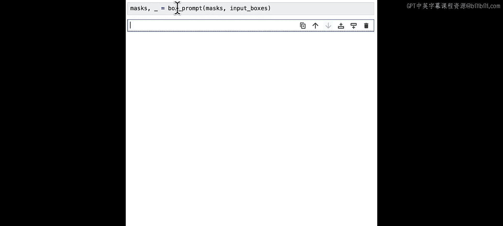

```python
show_masks_on_image(resized_image, final_masks)
```

效果并非完美，但考虑到我们使用的是如此小的模型，它已经做得非常好了。如果您有GPU，我们建议您尝试使用完整版的SAM（如 `facebook/sam-vit-large` 或 `facebook/sam-vit-huge`）来完成本教程。

## 理解掩码输出与二进制格式 💾

需要指出的是，在上面的示例中，我们定义了自己的自定义函数来将分割掩码覆盖在原始图像上。然而，模型的实际输出是包含相关元数据（如分数和标签）的二进制掩码。

二进制掩码是由0和1（或True和False）组成的数组，其中1或True表示掩码所在位置，0或False表示掩码不在的位置。

让我们看一下上面创建的分割掩码，但这次以其原始格式——二进制掩码的形式查看。同时，将这个二进制掩码可视化为图像。

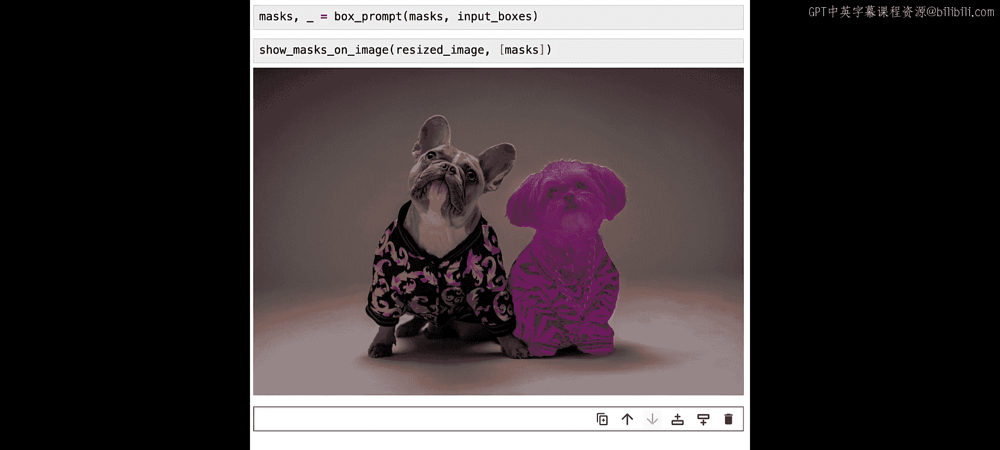

```python
# 查看第一个掩码的原始二进制格式
binary_mask = masks[0].cpu().numpy()  # 假设masks是张量列表
print("二进制掩码形状:", binary_mask.shape)
print("唯一值:", np.unique(binary_mask))

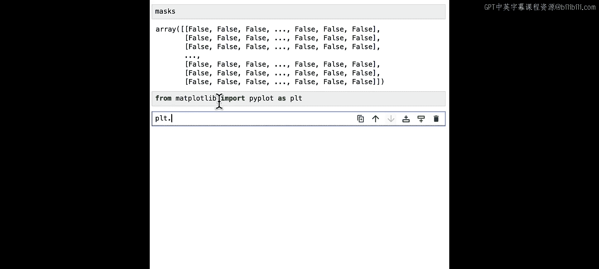

# 使用matplotlib可视化二进制掩码
import matplotlib.pyplot as plt
plt.imshow(binary_mask, cmap='gray')
plt.title("二进制掩码（白色为True/1）")
plt.axis('off')
plt.show()
```

在这张图像中，您可以看到白色区域指的是1或True值，黑色区域指的是0或False值。这些二进制掩码将作为下一节课“稳定扩散修复管道”的输入。

## 尝试您自己的图像 🖼️

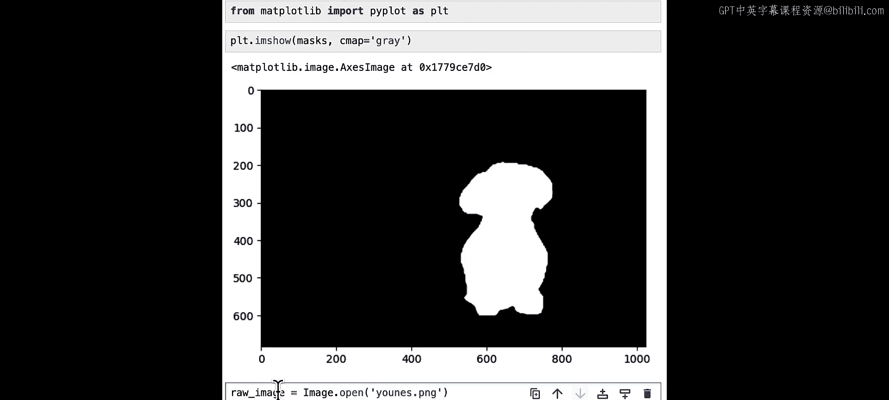

现在，在您自己的图像上试试吧。您可以将自己的图像（如JPG或PNG文件）上传到此笔记本的文件目录，并使用PIL的`Image.open`函数打开它。

```python
# 上传并处理自己的图像
from PIL import Image
import os

# 假设您上传了名为'my_image.jpg'的文件
custom_image_path = 'my_image.jpg'
if os.path.exists(custom_image_path):
    custom_image = Image.open(custom_image_path)
    custom_image_resized = resize_image(custom_image)
    # 在此图像上重复上述提示步骤...
else:
    print("请先上传图像文件。")
```

## 总结与展望 🎓

在本节课中，我们一起学习了如何使用Segment Anything Model（SAM）进行图像分割。我们涵盖了以下核心内容：
*   **图像分割**的基本概念。
*   **SAM及其轻量版Fast SAM** 的工作原理。
*   使用**单点、多点、正负提示**以及**边界框**来生成分割掩码。
*   理解并可视化模型输出的**二进制掩码**。

那么，这些方法如何转化为实际应用呢？
*   **2D点提示** 在您使用交互式UI（如照片编辑软件）时可能相关，但对于此类提示，您很可能需要某种与模型的人工交互，这对于现实生活中的用例并不总是现实的。
*   使用**边界框**作为SAM输入真正令人兴奋的是，我们可以开始考虑自动化物体检测和物体分割环节。为此，我们需要创建一个模型管道，并将物体检测模型的输出作为SAM的输入。

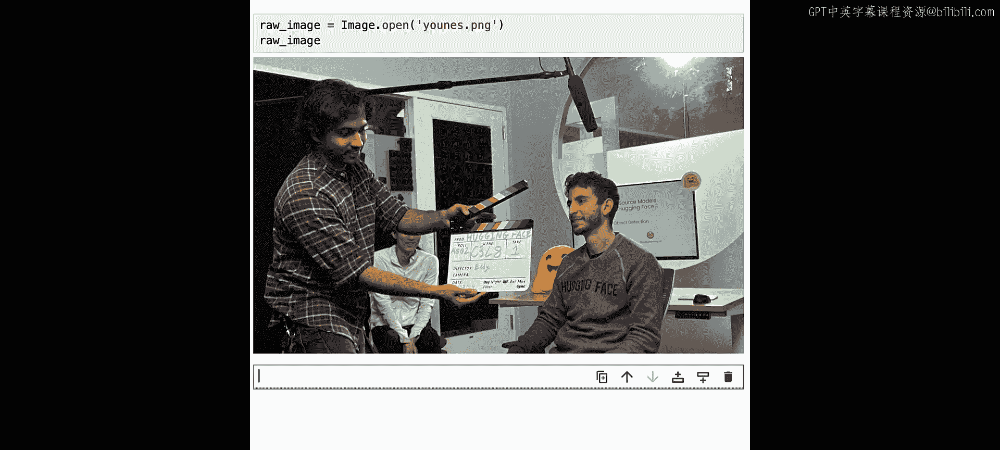

在下一节课中，您将学习如何使用OWL-ViT模型进行零样本物体检测，并将其与Segment Anything模型链接在一个管道中。让我们继续下一课的学习。