# 004：零样本目标检测与图像编辑流水线 🚀

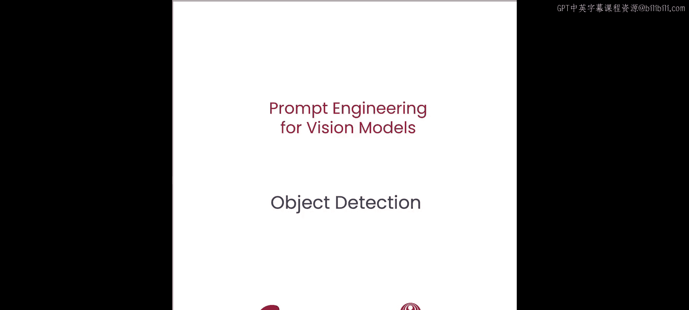

在本节课中，我们将学习如何利用自然语言提示，构建一个从文本描述到图像分割掩码的完整流水线。我们将使用零样本目标检测模型 OWL-ViT 来定位图像中的目标，然后将其输出的边界框作为输入，传递给 Mobile SAM 模型以生成精确的分割掩码。最后，我们将利用生成的掩码对图像进行编辑（例如模糊人脸）。

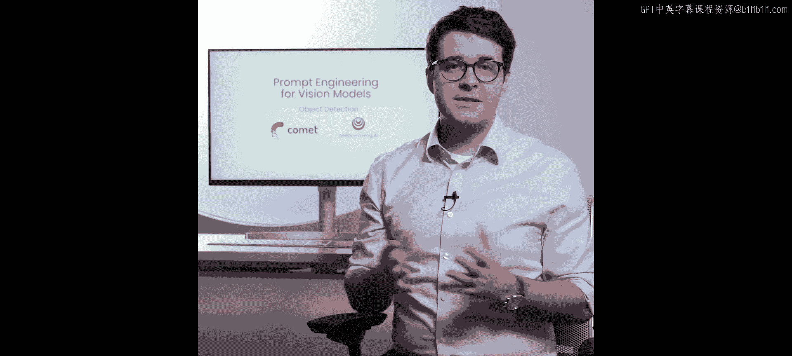

## 概述

上一节我们介绍了如何使用点提示或边界框来创建掩码。本节中，我们将探索如何用自然语言文本来生成这些掩码。为了实现这一点，我们将构建一个模型流水线：第一个模型（OWL-ViT）的输出将作为第二个模型（Mobile SAM）的输入。

## 1. 理解 OWL-ViT 模型 🦉

OWL-ViT 是一个零样本目标检测模型，这意味着它无需针对特定目标进行训练，就能根据简单的文本提示检测图像中的物体。

该模型的训练分为两个阶段：
1.  **预训练阶段**：模型通过一种利用**对比损失**的技术，学习将图像与文本片段关联起来。
2.  **微调阶段**：模型被专门训练用于目标检测任务，学习识别物体并将其与特定词语或字符串关联。

现在，让我们进入代码实践，看看如何实际使用它。

## 2. 设置环境与加载图像

首先，我们创建一个 Comet 实验来跟踪和比较本流水线最终生成的掩码。即使没有 Comet 账户，你也可以使用匿名实验功能。

```python
# 初始化 Comet ML（匿名实验）
import comet_ml
experiment = comet_ml.AnonymousExperiment(project_name="vision-pipeline")
```

我们将使用与上一课相同的图像：两只并排坐着的狗。我们通过 Comet Artifacts 下载所需图像，并使用 `PIL` 库显示它。

```python
from PIL import Image
# 假设 image_path 是从 Artifacts 下载的图像路径
image = Image.open(image_path)
image.show()
```

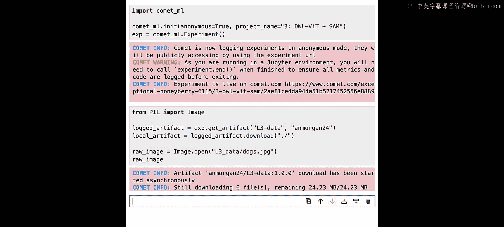

## 3. 使用 OWL-ViT 进行目标检测

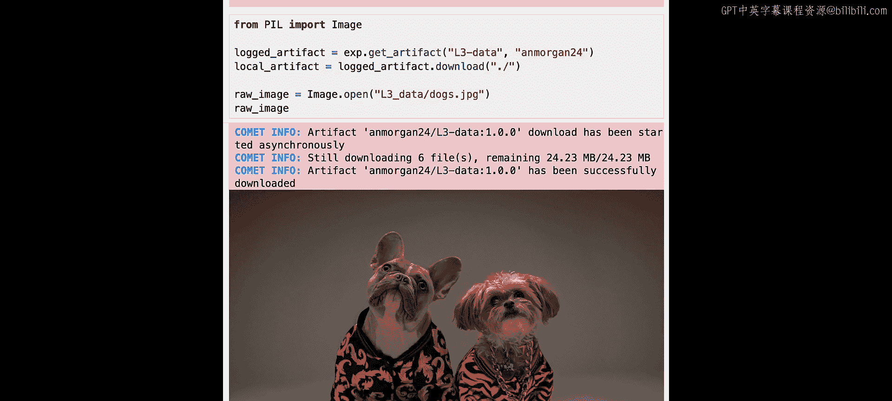

接下来，我们从 Hugging Face 加载 OWL-ViT 模型。我们将使用 Transformers 库的 `pipeline` 方法，并选择基础模型 `owlvit-base-patch32`。

```python
from transformers import pipeline

# 加载零样本目标检测管道
detector = pipeline(model="google/owlvit-base-patch32", task="zero-shot-object-detection")
```

现在，我们指定想要在图像中识别的物体（例如“狗”），并将文本提示传递给检测器模型以生成边界框。`candidate_labels` 参数接受一个文本提示列表，因此可以同时检测多个类别。

```python
# 定义文本提示并执行检测
text_prompt = ["dog"]
predictions = detector(image, candidate_labels=text_prompt)
```

检查输出变量，模型应该为标签“狗”检测到两个位于不同位置的边界框。我们使用工具函数将这些边界框绘制在原始图像上。

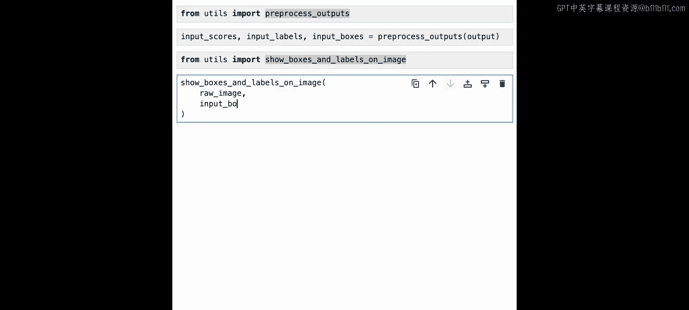

```python
# 预处理输出以便绘图
processed_outputs = pre_process_outputs(predictions)
# 在图像上显示边界框和标签
show_boxes_and_labels_on_image(image, processed_outputs)
```

结果显示，OWL-ViT 模型成功根据文本输入“狗”生成了两个边界框，高亮标出了图像中的每只狗。

## 4. 使用 Mobile SAM 生成分割掩码

成功识别出狗之后，流水线的下一步是利用这些边界框为每只狗创建分割掩码。方法与前一次课程类似，但这里我们将使用 **Mobile SAM** 模型。

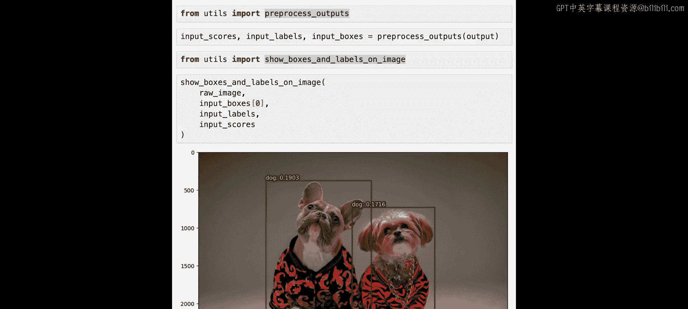

Mobile SAM 通过**模型蒸馏**技术，将大型 SAM 模型的知识转移到一个小得多的模型中，从而能在没有 GPU 的设备上高效运行，同时保持相近的性能。

```python
from ultralytics import SAM

# 加载 Mobile SAM 模型
sam_model = SAM('mobile_sam.pt')
```

现在，我们使用加载的 SAM 模型和从 OWL 模型得到的边界框来生成分割掩码。我们需要定义标签来指定每个边界框是属于要分割的目标（标签为 1）还是背景（标签为 0）。在我们的案例中，所有边界框都对应目标。

```python
import numpy as np

# 根据边界框数量生成标签数组（全为1，表示目标）
bounding_boxes = [box['box'] for box in processed_outputs] # 假设 processed_outputs 包含边界框坐标
labels = np.ones(len(bounding_boxes))
```

然后，使用原始图像、边界框和标签通过 Mobile SAM 模型生成分割掩码。

```python
# 使用 SAM 模型预测掩码
results = sam_model.predict(image, bboxes=bounding_boxes, labels=labels)
```

`predict` 函数返回一个结果对象，其中包含掩码、原始图像和其他元数据。我们可以从中提取布尔掩码数组。

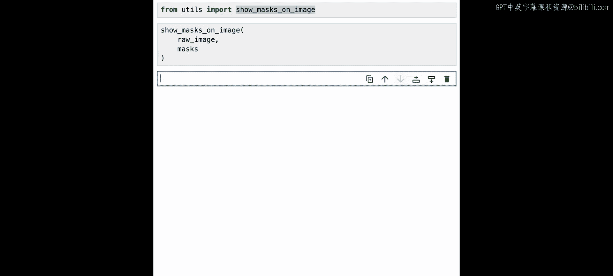

```python
# 从结果中提取掩码
masks = results[0].masks.data
```

最后，使用工具函数可视化生成的掩码。

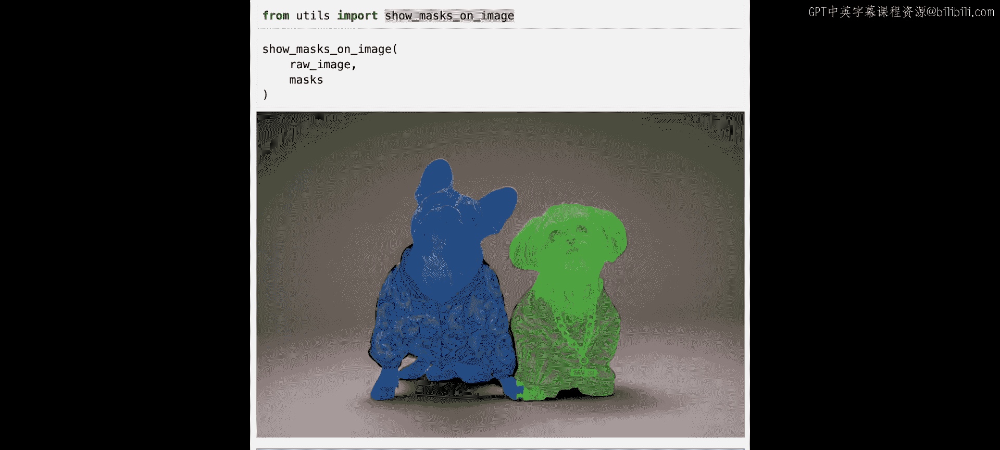

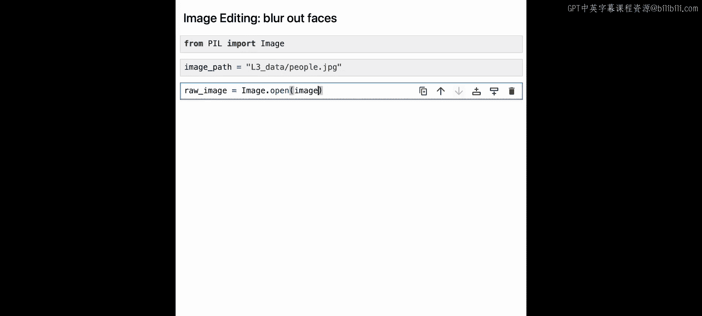

```python
# 在图像上显示掩码
show_masks_on_image(image, masks)
```

Mobile SAM 模型成功为左右两只狗创建了非常精确的掩码。至此，我们已成功构建了一个从文本提示到边界框，再到生成掩码的完整流水线。

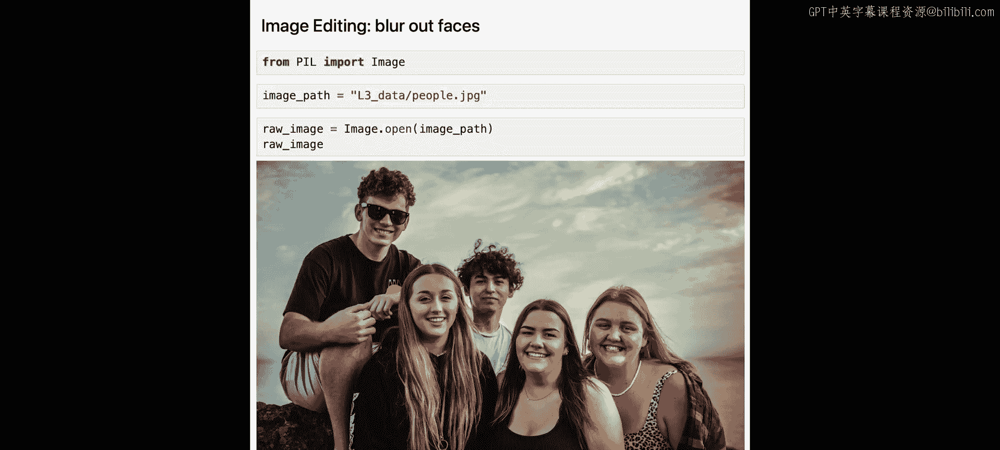

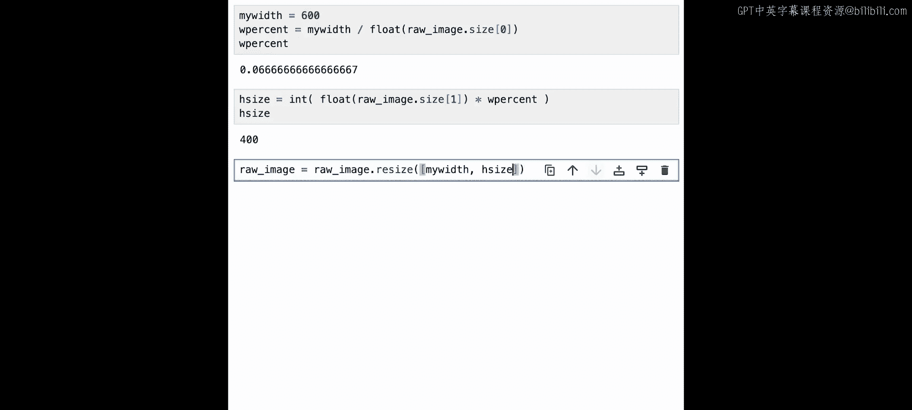

## 5. 应用流水线进行图像编辑：模糊人脸

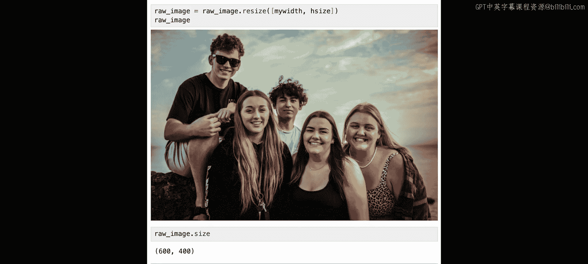

现在，让我们尝试一个不同的用例：模糊图像中的人脸。我们将使用包含五个人的新图像。

首先，加载并显示新图像。为了提高处理效率，我们将图像宽度调整为 600 像素。

```python
# 加载新图像并调整大小
new_image = Image.open(people_image_path)
new_image_resized = new_image.resize((600, int(new_image.height * 600 / new_image.width)))
```

我们创建一个新的 Comet 实验来跟踪这个新流水线的各个步骤，并记录原始图像。

接下来，使用文本提示“human face”和 OWL-ViT 模型来创建图像中人脸的边界框。

```python
# 使用 OWL-ViT 检测人脸
face_predictions = detector(new_image_resized, candidate_labels=["human face"])
```

检查生成的边界框，模型应该找到了五个，与图中人数相符。我们将图像和边界框记录到 Comet 平台。

然后，使用 Mobile SAM 模型，以边界框作为提示，生成人脸的分割掩码。

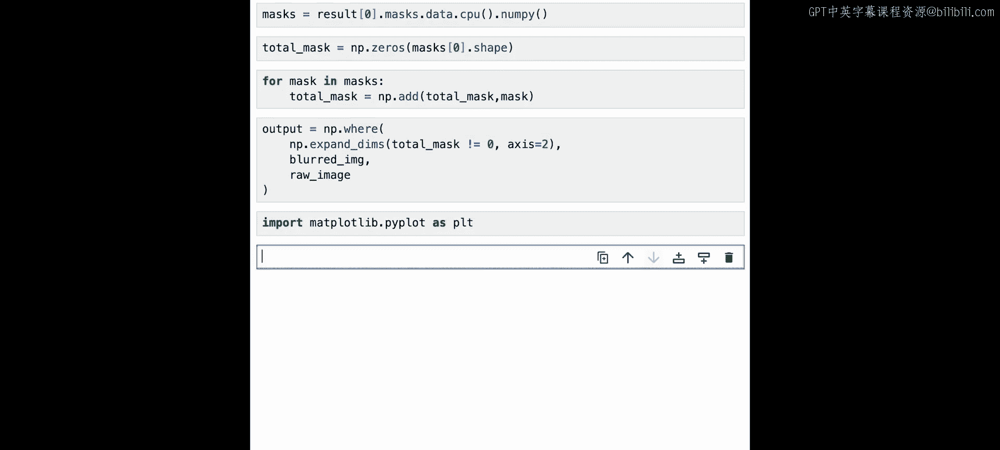

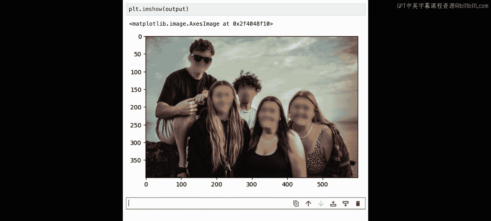

```python
# 提取边界框坐标
face_boxes = [pred['box'] for pred in face_predictions]
face_labels = np.ones(len(face_boxes))

# 使用 Mobile SAM 生成人脸掩码
face_results = sam_model.predict(new_image_resized, bboxes=face_boxes, labels=face_labels)
face_masks = face_results[0].masks.data
```

现在，我们利用生成的掩码来模糊原始图像中的人脸。方法是：先创建整个图像的模糊版本，然后仅将掩码覆盖区域替换为模糊图像。

```python
from PIL import ImageFilter

# 创建图像的模糊版本
blurred_image = new_image_resized.filter(ImageFilter.GaussianBlur(radius=15))

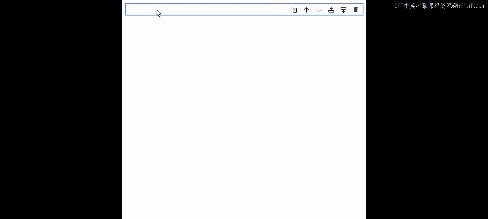

# 将多个掩码合并为一个综合掩码
combined_mask = combine_masks(face_masks)

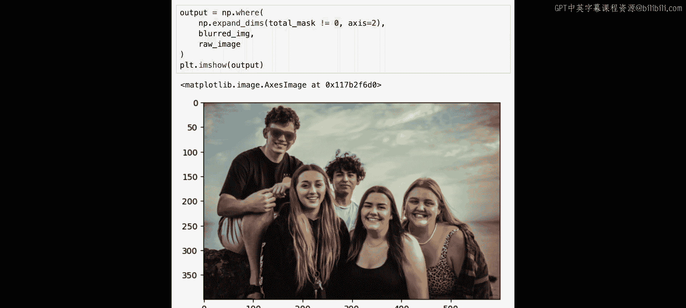

# 使用掩码，将原图中对应区域替换为模糊图像
final_image = apply_mask_to_image(new_image_resized, blurred_image, combined_mask)
```

结果显示，图像中所有人脸都已被成功模糊。我们将最终图像记录到 Comet 平台。

## 6. 调试与优化提示词

如果我们只想模糊没有戴太阳镜的人脸呢？我们可以尝试将候选标签改为“a person without sunglasses”。

```python
new_prompt = ["a person without sunglasses"]
new_predictions = detector(new_image_resized, candidate_labels=new_prompt)
```

运行后发现，模型只生成了一个边界框（指向了太阳镜本身），而不是四个未戴太阳镜的人脸。这导致后续步骤错误地模糊了太阳镜。

通过切换到 Comet 平台对比两次实验，我们可以清晰地看到问题所在：
*   第一次提示“human face”：OWL-ViT 成功识别了所有人脸，Mobile SAM 正确分割并模糊了它们。
*   第二次提示“a person without sunglasses”：OWL-ViT 将边界框定位在了太阳镜上，导致最终模糊了错误区域。

Comet 平台允许我们可视化图像、边界框，并可以基于模型置信度分数过滤边界框，这有助于我们分析和调试模型表现。

## 7. 尝试更多图像

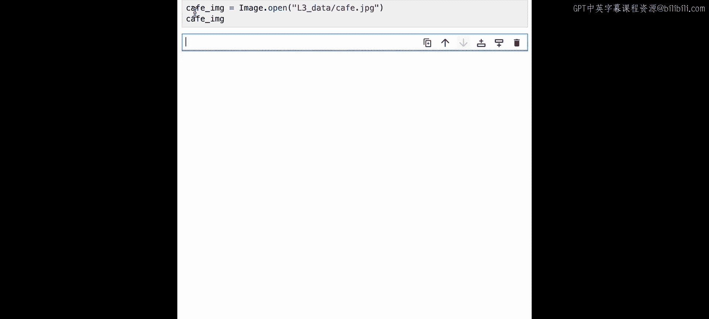

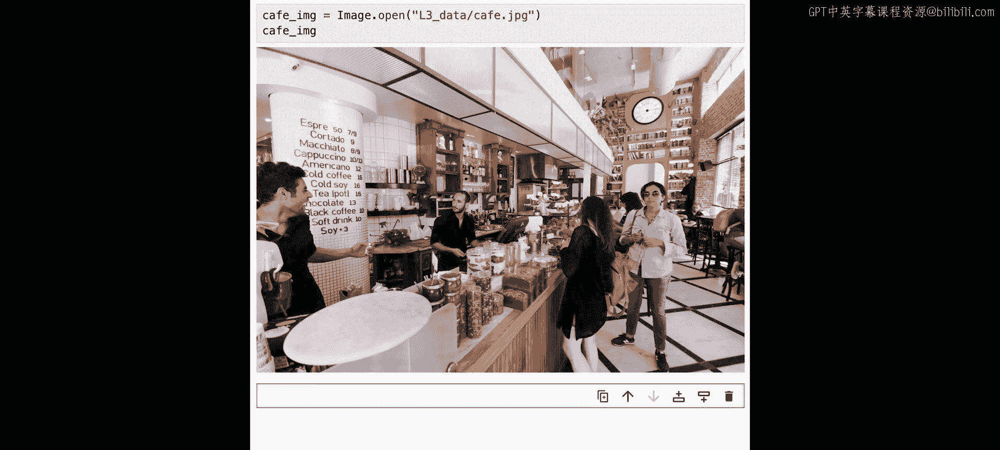

你可以尝试调整文本提示，或者使用笔记本中提供的其他图像（如咖啡馆、街道、地铁中的人群）来练习所学技术，构建自己的图像编辑流水线。

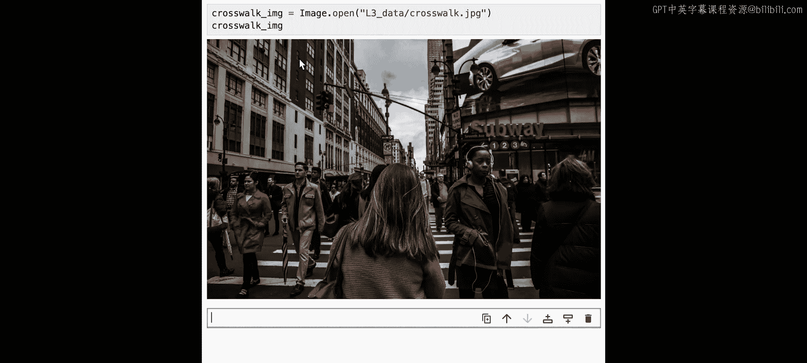

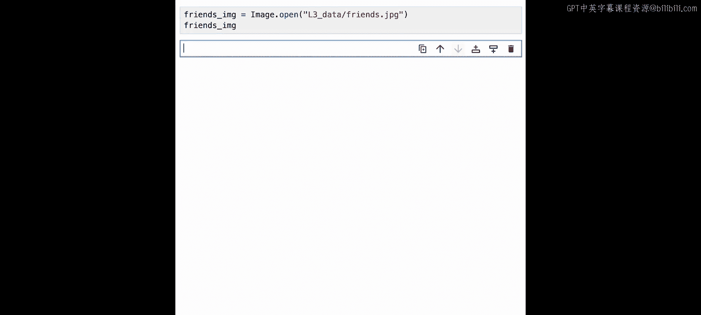

## 总结

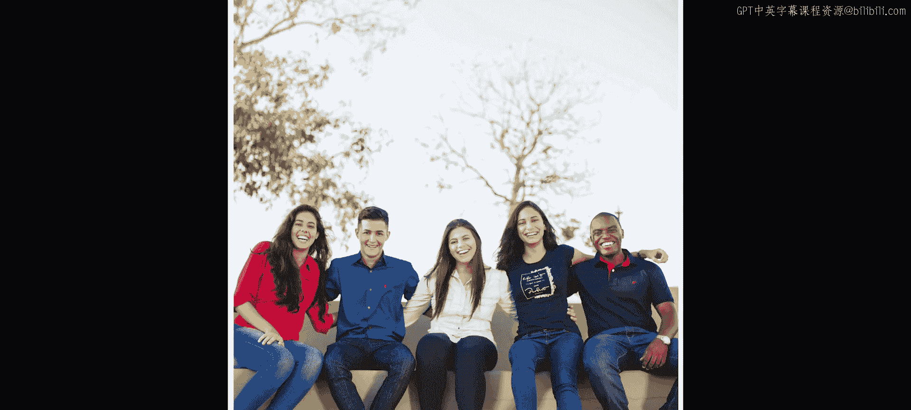

在本节课中，我们一起学习了如何构建一个视觉模型流水线。我们首先使用零样本目标检测模型 **OWL-ViT**，根据自然语言文本提示（如“狗”或“人脸”）在图像中定位目标并生成边界框。接着，我们将这些边界框作为输入，传递给经过优化的 **Mobile SAM** 模型，以生成精确的图像分割掩码。最后，我们利用生成的掩码实现了具体的图像编辑功能，例如模糊特定区域。这个从 **文本 -> 边界框 -> 分割掩码 -> 图像编辑** 的完整流程，展示了如何将不同的视觉模型串联起来解决复杂的实际任务。在下一节课中，我们将探索如何使用稳定扩散模型进行图像修复。