# 005：图像生成

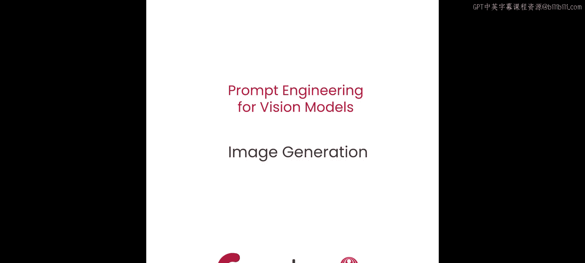

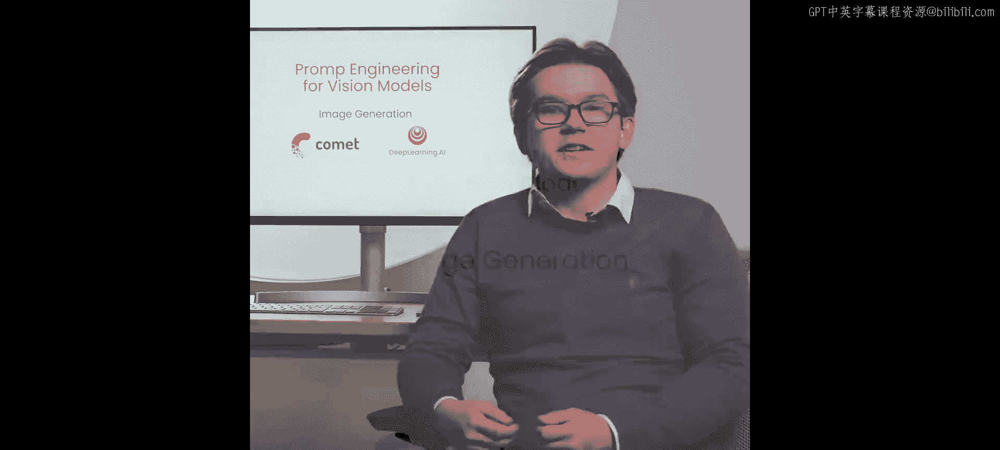

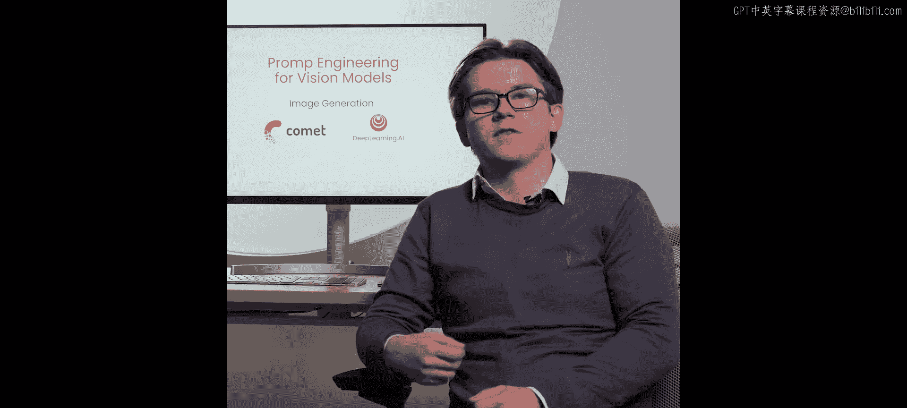

在本节课中，我们将学习如何使用扩散模型，特别是Stable Diffusion，来生成和编辑图像。我们将探讨如何结合文本提示、图像和遮罩，并通过调整超参数来精细控制生成过程。

## 扩散模型概述

在之前的课程中，我们学习了如何使用计算机视觉模型以边界框和分割遮罩的形式从图像中提取信息。接下来的课程中，我们将学习如何使用扩散模型为图像添加信息。

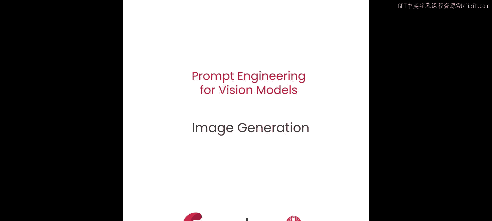

在深入之前，我们先简要回顾一下扩散模型的工作原理。如果你希望深入了解，建议学习DeepLearning.AI的扩散模型入门课程。请注意，本课程不涉及扩散模型的数学细节，我们的目标是提供一个高层次概述，以便你能高效地完成练习。

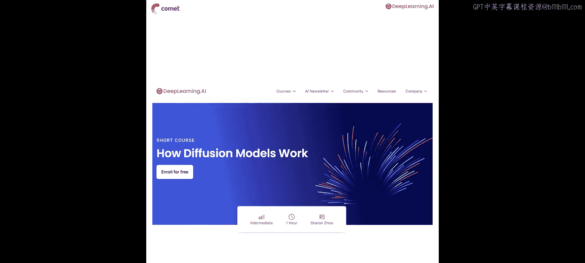

## 扩散模型如何工作

本节课中使用的扩散模型非常出色，它们能够根据文本提示生成细节惊人的图像。这个过程称为“扩散”，其高级工作原理如下：

1.  模型首先生成一张纯高斯噪声的图像。
2.  然后，模型逐步、一次一步地对图像进行去噪。
3.  最终，模型去除足够的噪声，留下一张精美的图像。

从某种意义上说，我们是在“欺骗”模型。我们给它一张纯噪声的图像，却告诉它在噪声之下实际上有一张狗的图片。直观地看，你可以认为模型是在从噪声中“雕琢”出图像。从数学上讲，模型是将来自简单分布（如高斯噪声）的样本，转换到复杂的学习分布（如图像）。我们的文本提示会改变目标分布，引导模型雕琢出满足提示的图像。

实际执行去噪任务的模型是一个U-Net模型，我们使用文本编码器来生成提示嵌入，以指导生成过程。

## 超越文本提示：图像、遮罩与超参数

然而，你将使用的模型不仅能接受文本提示。你还可以为它提供图像、遮罩和各种超参数，以更好地控制扩散过程。你甚至可以引导模型以一张初始图像为基础，通过一种称为“修复绘画”的技术，仅编辑图像的特定部分。本节课，你将学习如何做到这一点。

让我们开始第一个练习。

## 练习：使用修复绘画编辑图像

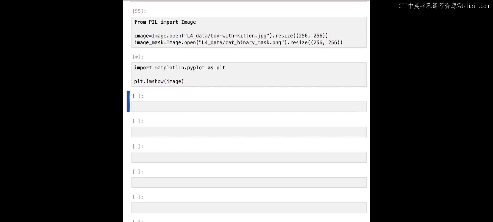

为了激发这个练习，想象一下你的一位不太懂电脑的朋友请你编辑一张他们的照片。他们给你一张他们俯身靠近一只猫的照片，并要求你将猫替换成一条龙。你可以花几天时间用Photoshop编辑图像，或者使用扩散模型在几分钟内完成。

我们将从Comet下载遮罩和图像作为工件。你之前已经了解过工件，简单回顾一下，工件是版本控制的资产，可以是模型、数据集，或者在本例中是你朋友的照片和猫的分割遮罩。

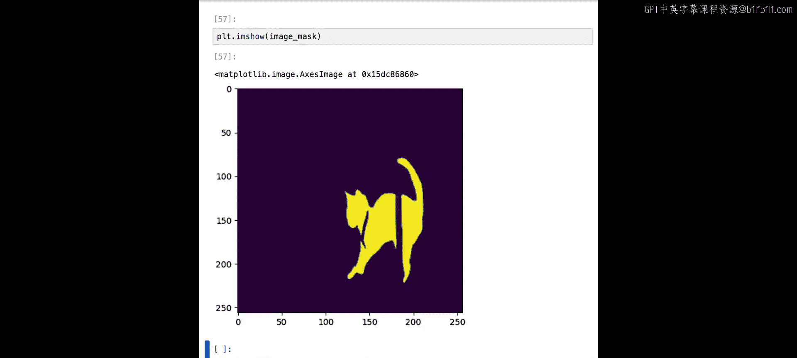

下载工件后，我们可以从中提取图像并使用Matplotlib查看。

现在，我们有了朋友俯身靠近猫的图像，以及猫的分割遮罩。这就是我们开始扩散编辑过程所需的全部内容。

在初始化模型之前，我们需要导入`torch`并正确设置设备。如果我们有GPU，就使用GPU，否则就使用CPU。

设备设置好后，我们可以从`diffusers`库初始化一个Stable Diffusion修复绘画管道。

请注意，我们使用的是`stable-diffusion-2-inpainting`模型，这是一个专门为修复绘画任务训练的扩散模型。我们还根据硬件情况使用了不同的浮点精度格式，这可以节省一些内存。

管道初始化后，我们需要开始考虑用于生成图像的参数。

## 关键参数：种子与推理步数

最重要但也可能最容易被忽视的参数是**种子**。我们需要手动设置种子编号，以便我们的结果在以后可以复现。

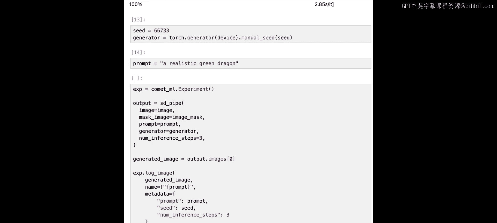

此外，我们还需要：
*   **提示词**：描述我们想要生成的内容。
*   **图像**：原始图像。
*   **遮罩图像**：指定要编辑的区域。
*   一个我们尚未讨论的超参数：**推理步数**。

在扩散管道中，你可以控制在图像去噪过程中管道执行的推理步数。当允许管道执行更多推理步数时，去噪过程会更渐进。这通常可以带来更高质量的图像。然而，存在一个收益递减点，超过这个点你只是在浪费计算资源。你也可能得到一个看起来有点过度处理的图像，其特征过于平滑或颜色不真实。

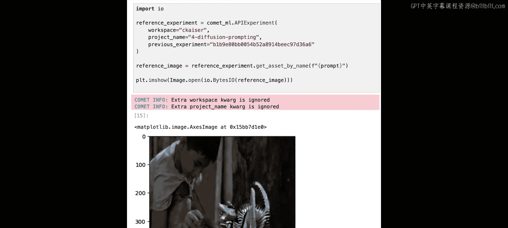

回到我们的代码，让我们准备生成一些图像。首先，初始化一个新的Comet实验，用于记录我们的图像、元数据和参数。然后，将参数传入我们的Stable Diffusion管道并生成输出。之后，我们可以提取图像，并将图像、提示词、种子和推理步数全部记录到Comet。完成后，结束实验并分析结果。

我们不会在这个环境中实际运行此代码，因为在CPU上运行需要很长时间。但我们提前在另一个环境中运行了此代码，并将结果记录到了一个Comet实验中，现在可以查看。

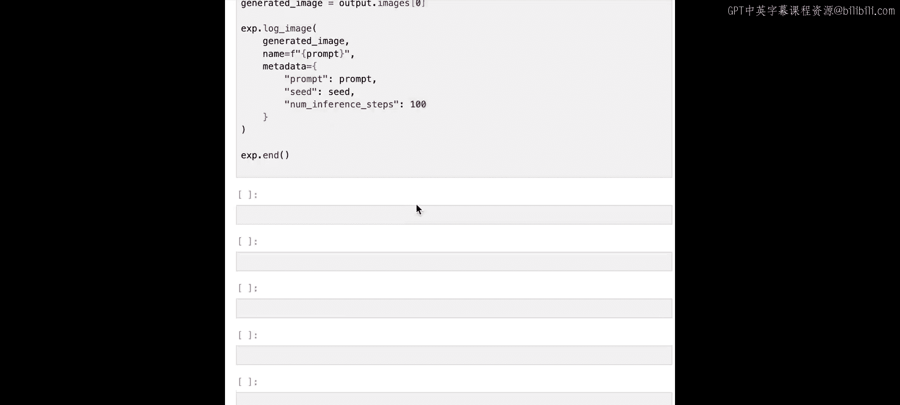

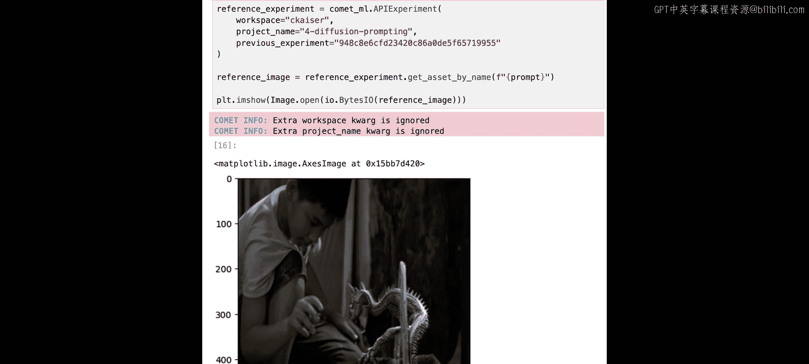

这张图像是使用与上述完全相同的代码生成的，只是在有GPU的系统上运行，所以速度更快一些。如你所见，结果还不完美。我们确实覆盖了猫，但得到的不是龙，而是一个看起来有点吓人、像骨骼的蜥蜴状东西。

在这种情况下，我们首先尝试的可能只是将推理步数大幅增加，比如增加到100步。

如果你看，这和之前的代码完全相同，我们只是将推理步数从3改为了100。和之前一样，我们不会运行这段代码，但我们有另一个使用完全相同代码运行的Comet实验，现在可以查看它的输出。

好的，现在看起来好多了。然而，我们仍然有一些看起来有点奇怪的特征，我认为我们可以做得更好。

## 调整引导尺度

接下来我们可以尝试调整另一个称为**引导尺度**的超参数。引导尺度是一个数值，决定了模型应遵循提示词的紧密程度。基本上，你可以将其视为在去噪过程中缩放文本输入对目标分布的影响程度。

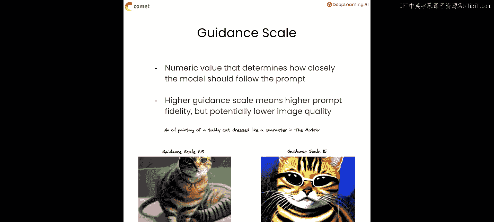

更高的引导尺度意味着更高的提示词保真度，但可能降低图像质量。你可以看这个例子：我给一个扩散模型一个提示词：“一幅虎斑猫的油画，打扮得像《黑客帝国》里的角色”。当引导尺度设置较低时，我们得到一张相当不错的猫的油画，但其中没有太多《黑客帝国》的元素。当引导尺度设置较高时（这里是两倍高），我们得到一张戴着《黑客帝国》风格太阳镜的猫的图像，但猫本身的图像质量不是很好。

关于引导尺度需要知道的一点是，每个扩散模型的默认值都不同，整个领域没有统一标准。例如，Stable Diffusion 1.5（一个你可以在CPU上使用的较小模型）的默认值是7.5，而其他模型可能是5。你真的需要查看模型规格说明才能知道正确的值。

回到我们的代码，接下来要做的是运行一个实验，尝试几个不同的引导尺度值。首先，创建一个包含我们将要在管道中使用的不同引导尺度值的NumPy数组。设置好引导尺度后，我们将运行一些与之前编写的代码非常相似的代码。不同之处在于，这次我们运行多个实验，并且我们还将引导尺度参数传递到我们的管道中。

同样，我们不会在这里运行这段代码，在CPU上运行需要很长时间。但我们有另一个Comet实验，已经运行了相同的代码并记录了其输出。

通过调用`display_experiment`并传入`tab=“Images”`参数，我们实际上可以看到真正的Comet应用程序的图像仪表板。在这里，你可以看到所有的图像元数据。这里我们可以看到不同的输出。

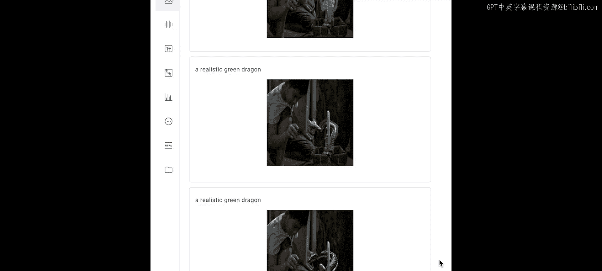

这两张图像似乎是最好的，至少在引导尺度为10和20时。所以我们知道，当引导尺度在10到20之间时，我们得到了最好的输出。我们可能会做进一步的实验，尝试10到20之间更多的引导尺度值，直到找到完美的数字。

现在，让我们继续尝试另一个超参数。

## 调整强度参数

接下来我们要看的超参数是扩散模型在图像到图像应用中独有的一个，称为**强度**超参数。当我们使用扩散模型编辑图像（就像我们在修复绘画中所做的那样）时，我们必须为其添加大量噪声以删除我们想要替换的部分。我们添加多少噪声决定了有多少信息被移除。如果我们添加少量噪声，图像看起来与原始图像非常相似。如果我们添加大量噪声，我们想要替换的部分将被完全移除。

**强度**决定了添加多少噪声。让我们运行一个关于强度的实验，类似于我们的引导尺度实验，遍历一系列可能的值。

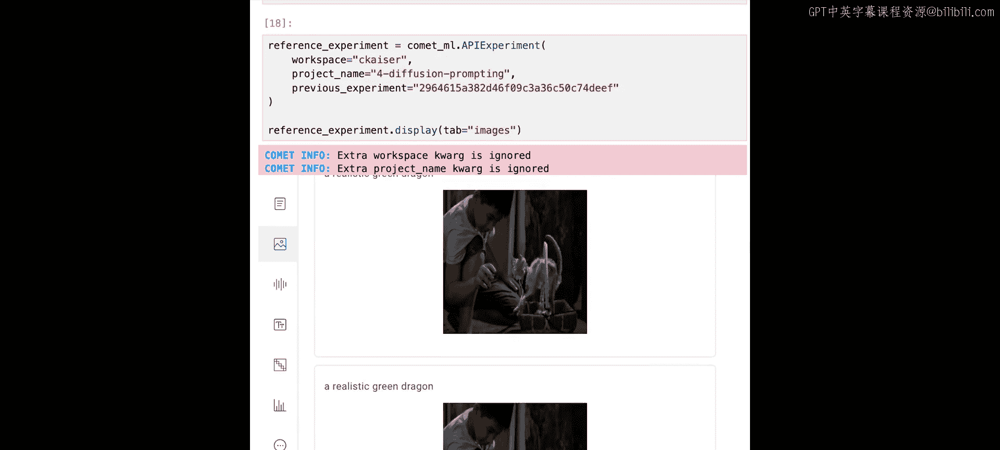

如你所见，代码大体相同。我们为强度创建一组可能的值。我们遍历它们，并将它们全部传递到我们的Stable Diffusion管道中。对于每个输出，我们将图像和元数据记录到Comet，以便稍后分析。和之前一样，我们不会在这里运行这个实验，而是通过Comet实验查看这段代码的结果。

我们可以看到，当强度非常低时，猫几乎没有变化。随着强度增加，越来越多的猫被移除。不幸的是，改变强度似乎并没有为我们带来更好的图像。这没关系，这是实验过程的一部分。

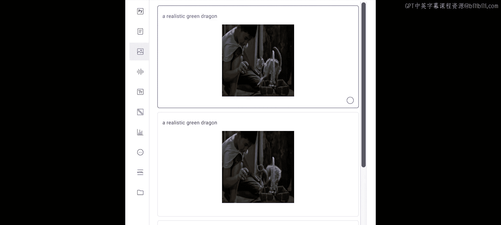

## 使用负面提示词

我们想要探索添加到Stable Diffusion管道中的最后一个输入是**负面提示词**。

负面提示词应该非常直观。它只是一个告诉模型图像**不应该**是什么样子的提示词。因此，因为我们使用了“一条逼真的绿色龙”作为提示词，我们可能会给它一个负面提示词，比如“卡通”。这应该会增强我们输出的真实感。

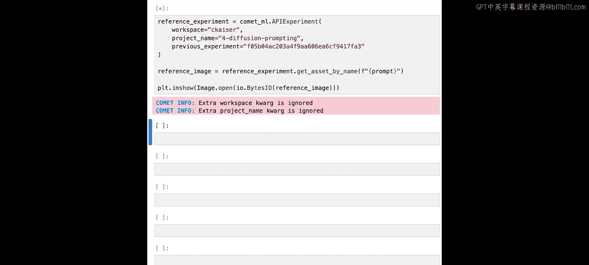

再次，你可以看到我们的代码基本没有变化。我们使用了之前实验的最佳结果，将引导尺度设置为10，如果我们有GPU则使用100个推理步，并且我们还传入了这个负面提示词。同样，我们不会在这里运行代码，但我们在其他地方运行了这段代码，并将输出记录到了一个Comet实验中，现在可以查看。

看，我们优化了我们的龙，去除了前几代中我们不喜欢的一些特征，同时用负面提示词增强了好的品质。利用你在这里学到的所有知识以及我们在其他课程中涵盖的内容，你应该能够构建一个管道：获取图像、生成遮罩、使用修复绘画进行编辑，并以一种流线型的方式完成所有工作，有点像由Stable Diffusion驱动的Photoshop。

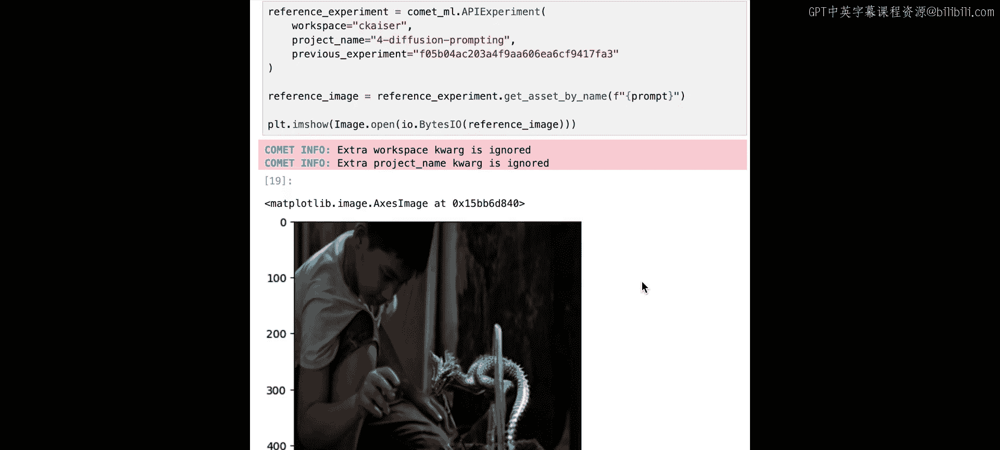

本节课就到这里。在下一课中，我们将进一步深入扩散模型，学习如何教一个扩散模型生成它从未见过的东西的图像。