# 006：微调扩散模型 🎨

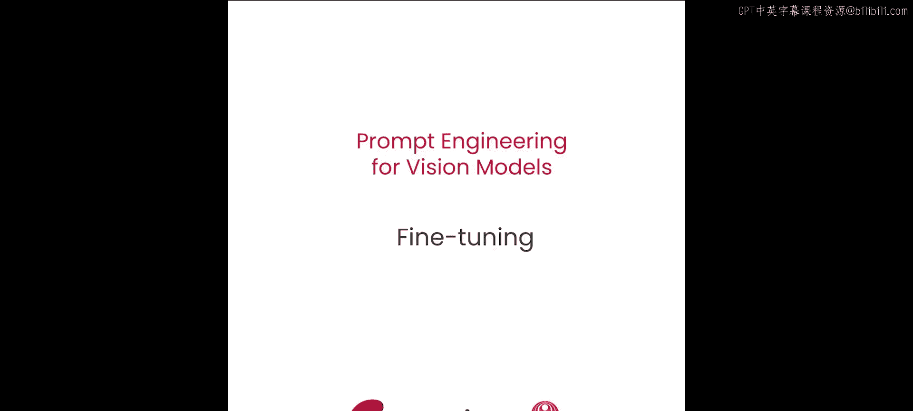

在本节课中，我们将要学习当提示工程不足以实现特定图像生成目标时，如何对扩散模型进行微调。我们将重点介绍两种资源需求相对较低的微调技术：DreamBooth和LoRA。

---

## 扩散模型与微调的必要性

扩散模型是强大的图像生成工具。但有时，无论进行多少提示工程或超参数优化，都无法得到期望的结果。当提示工程不够用时，可以选择进行微调。

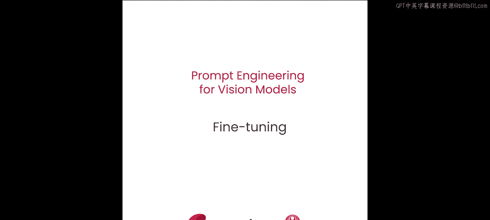

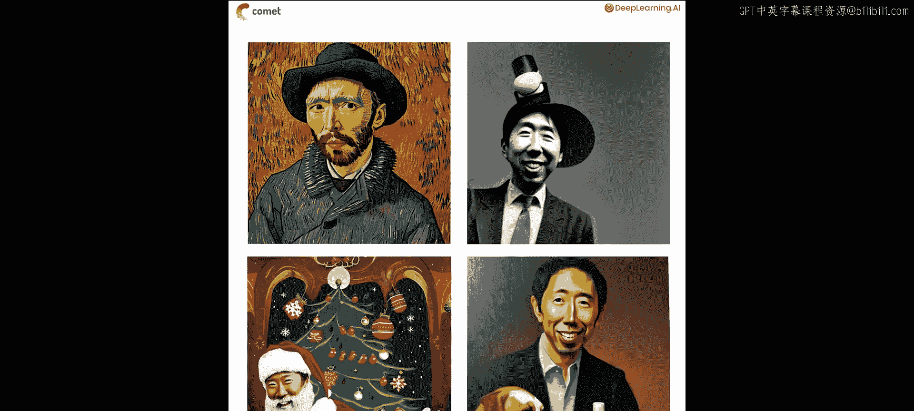

微调通常需要大量计算资源。幸运的是，有一种名为DreamBooth的微调方法，可以显著减少资源消耗。本节课程将学习如何使用少量图像对Stable Diffusion模型进行微调，以生成自定义内容。

上一节我们介绍了通过提示和参数控制模型输出。本节中，我们将探索如何教会模型生成它从未见过的主体图像。

## 两种微调技术简介

为了实现这一目标，我们将学习两种新的扩散模型微调技术。

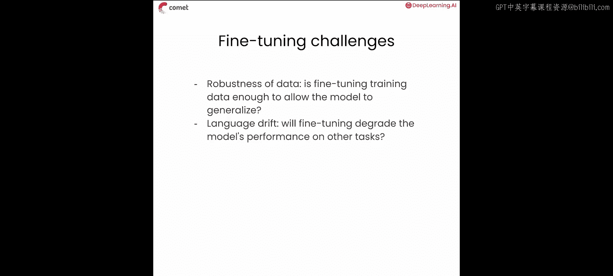

第一种技术是**DreamBooth**。DreamBooth旨在使用极少的示例数据教会扩散模型新的主体。例如，本项目仅使用六张Andrew的图像。

第二种技术是**LoRA**，全称为低秩适应。我们稍后将更详细地介绍LoRA。现在，让我们从DreamBooth开始。

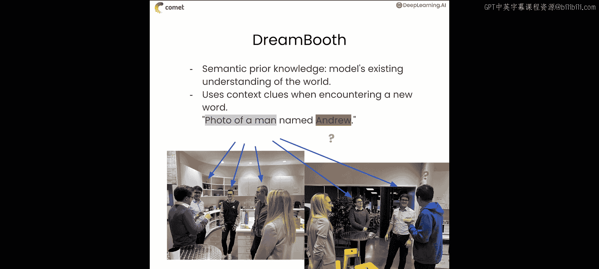

## DreamBooth的挑战与核心思想

在探讨DreamBooth背后的数学原理之前，首先思考为何用如此小的数据集微调扩散模型会很困难。这会导致哪些问题？

第一个也是最明显的问题与数据的鲁棒性有关。六张Andrew的头像可能足以让模型生成不错的头像，但模型很可能无法在其他情境下生成Andrew的图像。

第二个问题与语言漂移有关。微调模型时，我们总是在提升模型在下游任务上的性能与损害模型在其他任务上的性能之间走钢丝。换句话说，如果我们用六张Andrew的照片对模型进行激进地微调，每张照片都配有“一张名为Andrew的男人的照片”这样的提示，那么模型对“照片”和“男人”的嵌入定义很可能开始漂移，以匹配我们小型、狭窄数据集的分布。这将损害模型后续生成除Andrew照片以外任何内容的质量。

DreamBooth在很大程度上通过利用扩散模型对世界的现有理解来解决这两个问题。DreamBooth论文的作者称之为**先验语义知识**。你可以将其类比为阅读新单词时使用上下文线索。当模型看到“一张名为Andrew的男人的照片”这样的提示时，它可能不知道Andrew长什么样，但它通常知道“男人的照片”是什么样子。然后它可以在训练中利用这些信息，使我们能够用更小的示例数据集完成任务。

## DreamBooth的具体实践方法

更具体地说，这是DreamBooth的实际操作步骤。

首先，选择一个模型很少见到的标记，例如带括号的`[V]`。训练循环将覆盖模型与此标记关联的信息。这与你可能遇到的其他修改扩散模型的技术类似。

然后，将这个稀有标记与另一个描述主体所属类别的通用标记配对。例如，对于Andrew，我们可能选择标记对`[V] man`。

接着，将包含此标记对的提示与我们的Andrew图像关联起来。例如，如果数据集中有一张Andrew打篮球的图像，我们可能会将其与提示“一张`[V] man`打篮球的照片”关联起来。模型应该能够利用其对句子中所有其他词语的先验理解来指导生成。因此，即使我们没有给模型一个非常鲁棒的数据集，因为它通常知道“男人打篮球的照片”应该是什么样子，它有望识别出区分Andrew打篮球照片与普通男人打篮球照片的具体差异。

微调后，模型应将标记对`[V] man`专门与Andrew关联起来。这或许解决了数据集小的问题，但并未解决我们之前讨论的语言漂移问题。事实上，根据我们目前的描述，你可能会觉得在训练过程中几乎肯定会破坏模型对“男人”的定义。

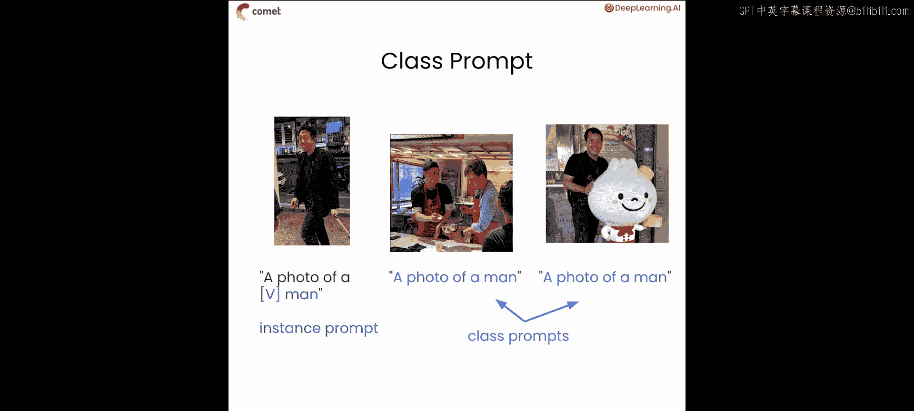

DreamBooth以一种非常巧妙的方式解决了这个问题。论文作者创建了一个自定义损失度量，他们称之为**先验保留损失**，它实现了一种有趣的正则化形式。先验保留会惩罚模型偏离其对世界的现有理解太远的情况。

## 先验保留损失的工作原理

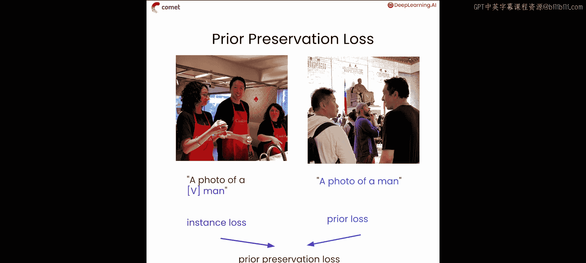

一般来说，它的工作原理如下。

你创建一个图像与提示配对的数据集。在本例中，你可能有六张Andrew的照片，配文如“一张`[V] man`的照片”。在DreamBooth术语中，我们称这些为**实例图像**和**实例提示**。在本项目中，你将为每张图像使用单一提示。但你应该尝试为每张图像编写自定义提示。你甚至可以使用像BLIP这样的模型自动为图像生成标题，这在处理大量图像时非常有用。

然后，你选择一个能代表所有你担心模型在微调过程中会丢失的概念的提示。在DreamBooth文献中，我们称之为**类别提示**。例如，如果你的实例提示是“一张`[V] man`的照片”，你的类别提示就简单地是“一张男人的照片”。

使用类别提示，从扩散管道生成100到200张图像。利用这些图像，你可以构建一个鲁棒的分布，代表模型对这些提示概念的先验理解。

在训练过程中，你计算两种损失。首先，计算针对实例数据的损失。基本上，就是当我们给出修改后的标记对时，模型在重建这些Andrew图像方面表现如何。其次，计算类别数据的损失。换句话说，当使用类别提示时，模型生成的图像与先验分布的接近程度如何。

因为类别分布是在你进行任何微调之前直接从模型中采样的，它为你衡量模型漂移了多远提供了一个具体基准。基本上，如果给定相同的提示，模型在微调前后生成的图像差异巨大，我们就知道发生了一些漂移。然后，你可以将这两个项（我们称之为实例损失和类别损失）结合起来，得到一个综合的损失度量。

## 代码实现准备

现在我们已经从理论角度熟悉了DreamBooth，让我们尝试实际实现它。本节中将使用的大部分代码改编自Hugging Face的DreamBooth训练脚本，你可以在本笔记本底部找到链接。鼓励你探索这些示例，以了解所有可用的复杂优化。

在这个例子中，我们已尽最大努力简化代码以突出高级概念。你还将使用Comet在整个练习中记录训练指标。Comet自动与你在整个项目中将要使用的许多库集成，因此在导入任何其他库之前导入并初始化Comet非常重要。

我们在整个项目中的大部分重点将放在超参数上，以及如何调整它们以控制扩散模型的输出。我们将把超参数存储在一个简单的字典中，以便在整个课程中更新。

这些术语大部分你应该已经熟悉，但这里有几件事需要指出。首先，你应该注意到我们根据你是否能访问GPU来导入不同的模型。如果你有GPU，我们将使用Stable Diffusion XL。这是较大的Stable Diffusion模型之一，能生成非常高质量的图像。如果你在CPU上运行，我们将使用Stable Diffusion版本1.5，这是一个较早的模型，仍然可以生成高质量图像，只是功能不那么强大。

我们有实例提示和类别提示。我们还设置了一个手动种子，以确保结果可重现。你可以看到，如果我们有GPU，我们将分辨率设置为1024像素，否则设置为512像素。这是因为不同的Stable Diffusion模型在不同尺寸下表现更好。此外，我们将推理步骤数设置为50，引导尺度设置为5.0。默认情况下，我们将生成200张类别图像，并将先验损失权重设置为1.0。先验损失权重是在计算先验保留损失时缩放类别损失的数值。如果我们只关心确保模型学习新概念，可以将其设置为0。如果我们非常担心模型在训练过程中不发生漂移，可以将其增加到更高的值。

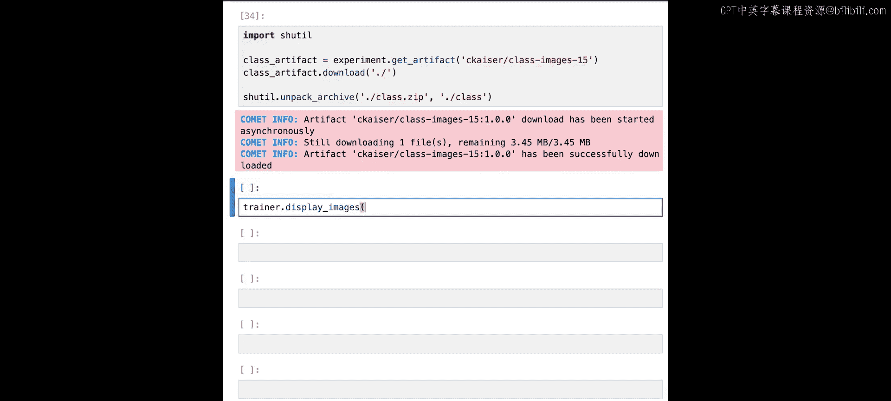

接下来，我们想要初始化一个可以在整个项目中使用的Comet实验。

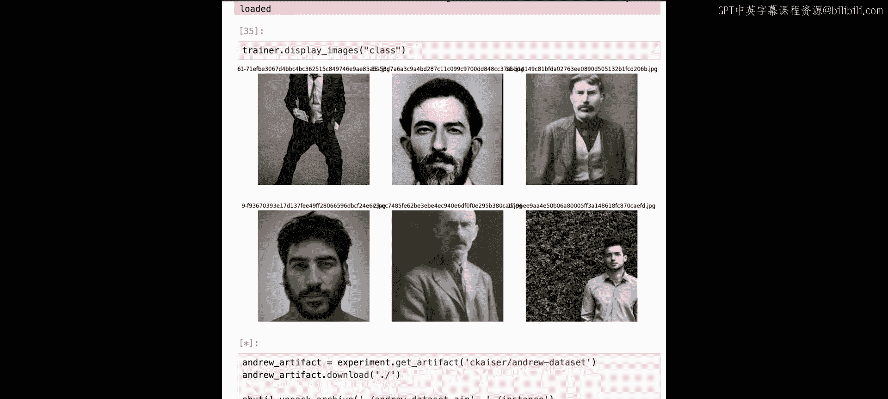

在开始训练模型之前，你需要生成类别图像。我们将编写生成类别图像的代码，但实际上不会运行它，因为在CPU上运行需要相当长的时间。相反，我们已经将整个类别图像数据集作为Comet工件提供，可以立即下载。作为复习，Comet工件是存储在Comet中并进行版本控制的资产。生成类别图像最简单的方法是使用我们提供的这个DreamBooth训练器实用程序类。我们将在整个项目中大量使用它，以抽象出运行训练管道所需的一些样板代码。现在，如果你在任何时候对这些实用方法内部的实际操作感到好奇，你总是可以使用双问号运算符查看源代码。

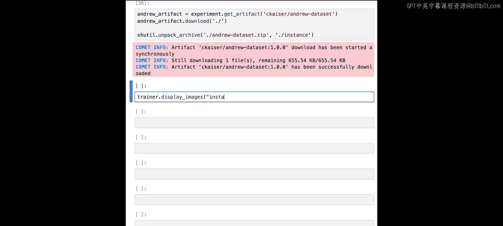

要从Comet下载我们的类别数据，我们将利用之前初始化的实验。数据集下载后，我们可以使用训练器上的`display_images`方法查看一下。

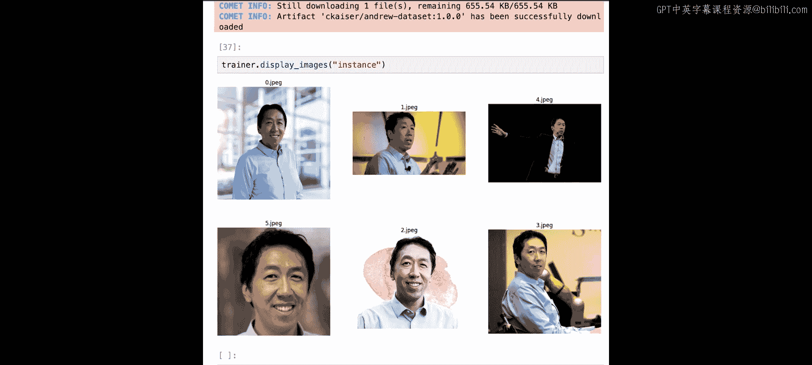

正如你所见，Stable Diffusion 1.5在生成男人图像方面做得不错，尽管它似乎对黑白照片和小胡子情有独钟。

接下来，我们需要下载我们的实例数据集，其中包含Andrew的图像。我们也将其保存为Comet工件，可以使用非常相似的代码下载。

下载完成后，我们可以使用之前使用的相同`display_images`方法查看一下。

查看此数据集时，有两件非常重要的事情需要注意。第一，注意图像尺寸不同，质量也不同。这不是我们做了大量预处理的数据集。这说明使用DreamBooth，你可以利用现成的数据非常有效地微调模型。第二件重要的事情是，Andrew有很多蓝色衬衫。

## 初始化模型与引入LoRA

现在我们的数据集已下载，可以继续初始化模型。回想一下，扩散管道由一个文本编码器模型、一个变分自编码器和一个用于实际去噪过程的U-Net模型组成。我们可以使用训练器的`initialize_models`方法初始化所有这些模型以及分词器。

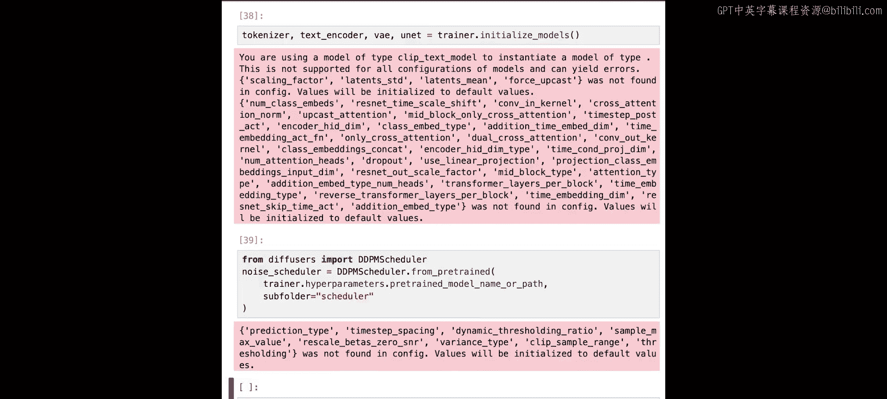

在不同时间步向图像添加随机噪声是扩散过程的重要组成部分。因此，我们需要一个噪声调度器来生成噪声。Hugging Face的Diffusers库为访问这类调度器提供了许多非常好的抽象。

现在，我们几乎准备好开始训练模型了。但首先，我们需要谈谈LoRA，我们将用它来实际微调模型。

微调大型模型背后的一个关键挑战是，权重矩阵（听起来可能很明显）非常大。如果你的权重矩阵大小为M x N，那么你可能需要为每次更新计算一个同样大小为M x N的梯度矩阵。对于许多优化器（如带动量的Adam），你实际上会计算多个这样的矩阵，导致内存占用非常大。然而，在微调过程中生成的更新矩阵也往往具有非常低的秩。这意味着矩阵的秩（或线性无关列的数量）往往远小于矩阵的实际列数。直觉上，这告诉我们，我们可能可以在更小的矩阵中捕获更新权重所需的大量重要信息。这基本上就是LoRA所做的。LoRA不是计算一个完整的M x N更新矩阵来在训练过程的每一步更新权重，而是训练一组新的更小的权重，我们称之为适配器，然后将其添加到原始权重中。

从数学上看，这是LoRA的样子。在正常的训练更新中，下一时间步的权重等于当前时间步的权重加上一个更新矩阵，其中权重和更新矩阵都是大小为M x N的矩阵。在LoRA中，时间步T的权重等于原始权重加上两个矩阵A和B在时间步T的乘积。现在，矩阵A是一个M x R矩阵，而矩阵B是一个R x N矩阵，且R小于M和N中的较小者。本质上，我们取两个较小的矩阵，并训练它们，而不是训练原始权重。这些较小的权重然后可以添加到初始权重中，以达到微调的效果。

除了减少内存占用，LoRA的一个优点是你可以拥有许多不同的LoRA适配器集，并且可以轻松切换。例如，如果你以后想为另一个人的照片微调一个LoRA适配器，你可以非常轻松地换掉你的Andrew适配器。

在这个例子中，我们只微调U-Net模型，所以它是我们唯一需要为LoRA准备的模型。此外，我们还需要初始化优化器并提取将要优化的参数。最后，我们需要初始化训练数据、训练数据加载器和学习率调度器。然后，我们将把所有相关模型以及数据集加载到Accelerator中，这是一个Hugging Face库，允许我们更高效地进行训练。

## 训练循环详解

现在，让我们进入实际的训练循环。首先，我们需要计算总批次大小。我们将在这个管道中使用梯度累积。这是一种我们每隔几步才更新一次权重的技术。因此，我们需要将总批次大小设置为梯度累积步数乘以单步批次大小。

对于训练循环本身，首先我们想设置进度条来跟踪训练。

扩散过程有几个步骤。首先，我们希望将图像转换为其潜在表示。为此，我们将图像的像素表示传递到变分自编码器中，然后从潜在分布中采样。一旦将图像转换为其潜在表示，我们接下来需要在训练时采样要添加到潜在表示中的噪声。最后，为了完成前向扩散过程，我们需要在随机时间步将噪声添加到潜在表示中。

现在，如果前向扩散过程完成，我们需要执行反向扩散。为此，我们需要获取提示的嵌入，并使用U-Net模型预测图像中的噪声。一旦有了预测，我们就可以计算先验损失和实例损失，并将它们与先验损失权重相加，以计算先验保留损失。

损失计算完成后，我们可以像在任何其他训练循环中一样进行反向传播并更新优化器。

在每个周期结束时，我们希望将损失指标记录到Comet。训练结束时，我们希望保存LoRA权重，将参数记录到Comet，并添加一个小标签，以便我们记住这是一个DreamBooth训练项目。然后，我们可以在加速器上调用结束训练，就完成了。同样，我们不会在这个环境中实际运行此训练代码，因为在CPU上这将花费相当长的时间。

## 结果分析与视觉验证

然而，我们确实有一个来自完全相同的模型训练运行的现有Comet实验，可以用来分析结果。我们可以调用此实验的显示功能，查看它记录到Comet的指标。现在，我们可以编辑布局以更好地查看最重要的指标。特别是，我们希望看到损失、先验损失和实例损失如何比较。

在本课程中，我们强调了动手处理图像数据并目视检查模型输出的重要性。这个项目真正强调了这一点，因为如果我们查看这些损失指标，你会注意到一些非常有趣的数据。首先，你可以看到损失似乎在先验损失和实例损失之间来回过度校正。先验损失的峰值往往对应于实例损失的谷值，反之亦然。这种跷跷板效应可能会让你认为先验保留损失度量没有真正起作用，因为模型似乎没有收敛。

然而，如果我们查看模型的输出，会看到一个非常不同的故事。为了说明这一点，我们将使用模型生成一堆不同的Andrew图像，以及一堆不包含Andrew的图像。

首先，让我们设置一些提示和一些验证提示。你可以看到，我们有几个旨在生成看起来像Andrew的男人的图像的提示，然后有几个移除了`[V]`标记的等效提示。提示就位后，我们想从刚刚训练完的模型创建一个扩散管道。请注意，我们使用Stable Diffusion 1.5模型初始化了一个预训练的扩散管道，然后将LoRA权重加载到该模型上。使用我们的管道，我们遍历每个提示，生成图像并将其记录到Comet。同样，我们不会在这里运行此代码，因为在CPU上需要一些时间。但我们已经将其运行在Comet上，并将结果存储在一个实验中，我们可以在下面可视化。

我们可以像这样加载现有的实验，然后通过将`tab=images`参数传递给实验的显示方法来查看记录的图像。这就是Comet仪表板中实际图像选项卡的样子。在其中，我们可以看到管道记录的图像。如果我们点击其中一张，可以看到这是我们的验证提示之一，因为这里没有`[V]`标记。看这张图像，它看起来像一个正常的男人。

然而，如果我们找到其等效的实例提示，我们会看到，当我们添加`[V] man`时，生成的壁画看起来很像Andrew。同样，这张“`[V] man`打篮球”的图像看起来很像Andrew，而这张“男人打篮球”的图像看起来一点也不像Andrew。尽管损失曲线不会告诉我们模型有所改进，但通过查看输出，我们可以清楚地看到它正在学习。

## 总结与后续探索

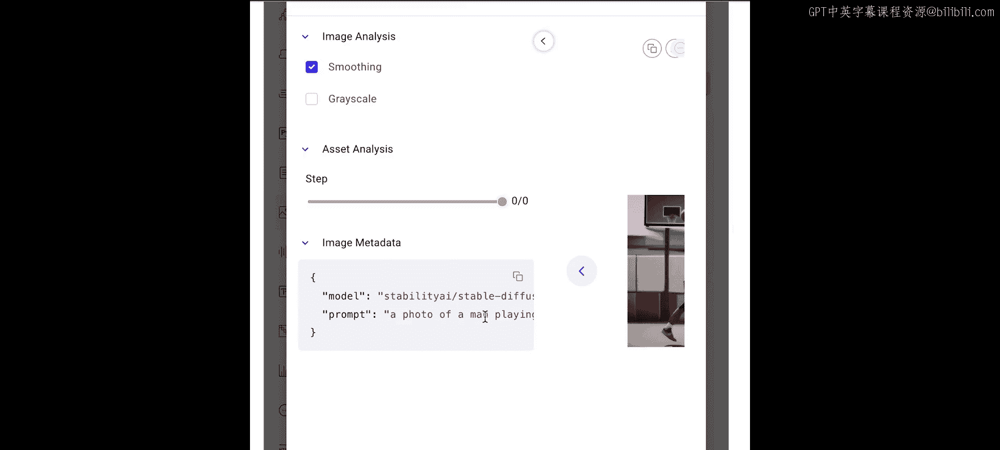

对我们来说，关键是要目视检查模型的输出，无论损失曲线显示什么。很多时候，结果会让我们感到惊讶。

这把我们带到了本课的结尾。鼓励你更进一步，尝试实验其他一些超参数。你也可以尝试使用像Google Colab这样的GPU环境来微调更大的Stable Diffusion模型。你甚至可以自己收集数据集，或尝试使用此处提供的代码定位不同的标记。你应该能够承担各种不同的项目。

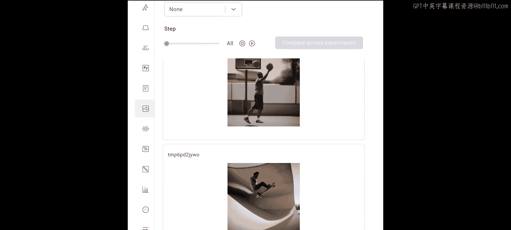

在本节课中，我们一起学习了当提示工程不足时，如何使用DreamBooth和LoRA技术对扩散模型进行微调。我们探讨了微调面临的挑战，如数据鲁棒性和语言漂移，并了解了DreamBooth如何利用先验语义知识和先验保留损失来解决这些问题。我们还简要介绍了LoRA的低秩适应原理及其在高效微调中的优势。最后，我们强调了目视检查模型输出对于评估微调效果的重要性。