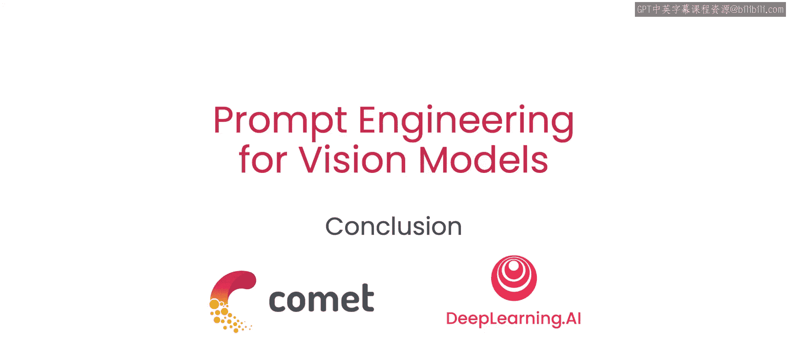
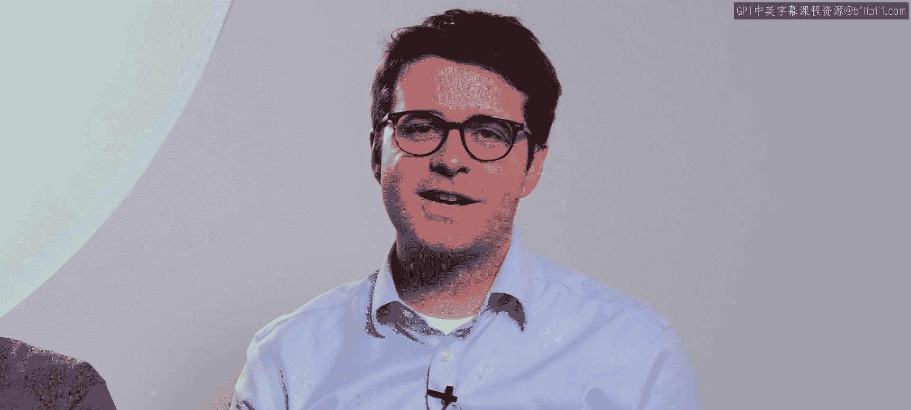

# 007：总结 🎉



在本节课中，我们将回顾并总结整个课程的核心内容。我们一起学习了如何利用先进的视觉模型进行图像分割、目标检测和图像生成，并探索了如何通过提示工程和微调技术来定制模型以满足特定需求。

---

上一节我们介绍了如何结合多种技术生成全新图像，本节中我们来看看整个课程的要点总结。

首先，我们掌握了使用**SAM**模型来精准分割图像中任意部分的方法。其核心在于通过提示（如点或框）来引导模型识别特定区域。

其次，我们学习了如何仅用文本提示**OL VIT**模型，以完成图像中的对象分割。这展示了自然语言指令控制视觉模型的能力。



接着，我们探索了将目标检测、图像分割与引导扩散模型相结合的流程。以下是该流程的一个简化表示：

```python
# 伪代码示例：结合多种技术生成图像
detected_objects = object_detection(image)
segmented_mask = image_segmentation(detected_objects)
new_image = guided_diffusion_model.generate(segmented_mask)
```

此外，我们还深入了解了使用**Dreambooth**方法对**Stable Diffusion**模型进行微调的技术。这使得模型能够生成包含用户自定义对象（如特定宠物或个人物品）的图像。其核心公式可以概括为在原有模型参数 `θ` 上进行针对性调整：

`θ' = θ + Δθ`，其中 `Δθ` 代表通过少量自定义图像学习到的参数更新。

如果你能访问**GPU**计算资源（例如通过**Google Colab**），你将有机会进行以下尝试：

以下是你可以进一步探索的方向：
*   迭代优化你自己的文本提示，以获得更理想的生成结果。
*   利用GPU加速，对模型进行更深入的微调。
*   将本课程中学习的图像处理流程扩展到视频编辑领域。

随着更多基础模型的发布，你将拥有更多机会将提示工程技术应用于你的计算机视觉项目中。我们期待看到你接下来构建的作品。

---

本节课中我们一起学习了视觉提示工程的关键技术：从图像分割与目标检测的基础操作，到结合引导扩散模型进行程序化图像生成，再到使用Dreambooth方法微调模型以生成定制化内容。掌握这些工具和方法，将为你打开计算机视觉应用创新的大门。