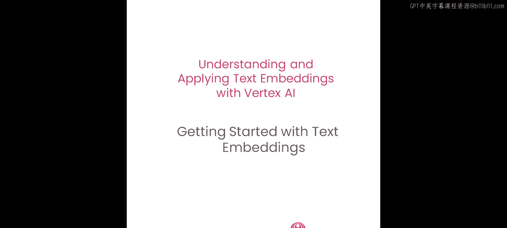
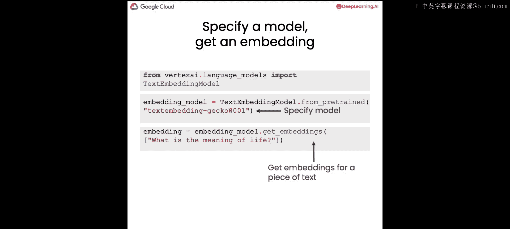
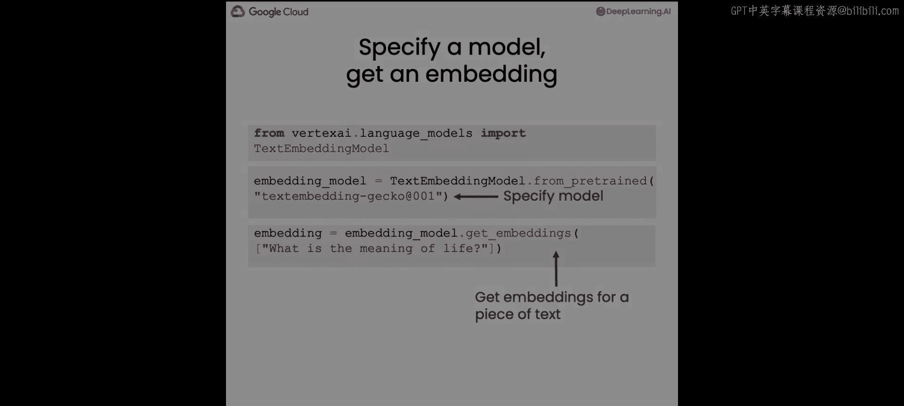

# 002：动手实践文本嵌入




在本节课中，我们将通过实际代码示例，学习如何使用Google Cloud的Vertex AI平台来计算和探索文本嵌入。我们将从环境设置开始，逐步计算单词和句子的嵌入，并比较不同文本之间的相似性。

## 环境设置与认证

上一节我们介绍了文本嵌入的基本概念，本节中我们来看看如何在代码中实际使用它。首先，我们需要设置环境并完成身份验证。

以下是设置步骤：

1.  **安装必要的库**：如果在本地计算机上运行，需要安装Google Cloud AI平台库。命令为 `pip install google-cloud-aiplatform`。
2.  **身份验证**：使用特定函数加载项目凭据和项目ID。
3.  **初始化Vertex AI**：指定项目ID、服务运行区域以及身份验证凭据。

```python
# 导入Vertex AI库并初始化
import vertexai
vertexai.init(project=PROJECT_ID, location=LOCATION, credentials=CREDENTIALS)
```

## 计算文本嵌入

环境设置好后，我们就可以开始计算文本的嵌入向量了。

以下是计算单个单词嵌入的步骤：

1.  **导入文本嵌入模型**：从Vertex AI库中导入 `TextEmbeddingModel`。
2.  **加载特定模型**：指定要使用的模型，例如 `textembedding-gecko@001`。
3.  **调用模型获取嵌入**：对目标文本字符串调用模型的 `get_embeddings` 方法。

```python
from vertexai.language_models import TextEmbeddingModel

# 加载嵌入模型
model = TextEmbeddingModel.from_pretrained(“textembedding-gecko@001“)

# 计算单词“life”的嵌入
embedding = model.get_embeddings([“life“])
vector = embedding[0].values
print(f“向量维度: {len(vector)}“)
print(f“前10个元素: {vector[:10]}“)
```
执行上述代码会得到一个768维的向量，它代表了单词“life”的数值化特征。

## 比较句子相似性

嵌入的一个核心应用是衡量不同文本片段之间的语义相似性。我们通过计算嵌入向量之间的余弦相似度来实现。

让我们计算三个句子的嵌入并比较它们的相似性：

1.  **计算多个句子的嵌入**：将多个句子作为列表传递给嵌入模型。
2.  **提取向量值**：从返回的嵌入对象中提取数值向量。
3.  **计算余弦相似度**：使用 `sklearn.metrics.pairwise.cosine_similarity` 函数计算向量两两之间的相似度。

```python
from sklearn.metrics.pairwise import cosine_similarity
import numpy as np

sentences = [
    “What is the meaning of life? Is it 42 or is it something else?“,
    “How does one spend their time well on earth?“,
    “Would you like a salad?“
]

# 获取所有句子的嵌入向量
embeddings = model.get_embeddings(sentences)
vectors = [e.values for e in embeddings]

# 计算并打印相似度矩阵
similarity_matrix = cosine_similarity(vectors)
print(similarity_matrix)
```
运行结果会显示，语义相近的句子（如关于生命意义的两个问题）其相似度得分会高于语义无关的句子（如关于生命意义和沙拉的问题）。这证明了嵌入模型能够理解文本的深层含义，而不仅仅是表面词汇。

## 词嵌入与句嵌入的对比

为了理解句级嵌入的强大之处，我们将其与一种简单的词嵌入平均方法进行对比。

考虑以下两个句子：
- A: “The kids play in the park.“
- B: “The play was for kids in the park.“

如果去除“停用词”（如 the, in, for, was），两个句子都剩下相同的三个词：`[“kids“, “play“, “park“]`。

以下是两种方法的对比：

1.  **词嵌入平均法**：
    *   分别计算每个单词的嵌入。
    *   将三个单词的嵌入向量求平均，作为整个句子的表示。
    *   对于上述两个句子，由于词汇完全相同，得到的平均向量也会相同。

    ```python
    # 假设已获得单词列表的嵌入数组 embedding_array1 和 embedding_array2
    sentence_embedding_avg1 = np.mean(embedding_array1, axis=0)
    sentence_embedding_avg2 = np.mean(embedding_array2, axis=0)
    # sentence_embedding_avg1 将等于 sentence_embedding_avg2
    ```

2.  **句嵌入模型法**：
    *   直接将整个原始句子输入给 `TextEmbeddingModel`。
    *   模型会考虑词序、语法结构和上下文，为每个句子生成一个独特的嵌入向量。
    *   对于上述两个句子，尽管词汇相似，但生成的句嵌入向量会截然不同，准确反映其语义差异（“孩子们在公园玩耍” vs “戏剧是为公园里的孩子们上演的”）。

    ```python
    embedding_A = model.get_embeddings([“The kids play in the park.“])
    embedding_B = model.get_embeddings([“The play was for kids in the park.“])
    # embedding_A[0].values 将不等于 embedding_B[0].values
    ```

这个对比清晰地展示了现代句嵌入模型能够捕捉更丰富、更精确的语义信息。

## 核心语法总结

本节课中我们一起学习了使用Vertex AI进行文本嵌入的核心操作。

以下是关键语法回顾：

*   **初始化Vertex AI**：
    ```python
    vertexai.init(project=PROJECT_ID, location=LOCATION, credentials=CREDENTIALS)
    ```

*   **加载模型与获取嵌入**：
    ```python
    from vertexai.language_models import TextEmbeddingModel
    model = TextEmbeddingModel.from_pretrained(“textembedding-gecko@001“)
    embeddings = model.get_embeddings([“Your text here“])
    vector = embeddings[0].values
    ```





建议你暂停视频，在Jupyter笔记本中尝试输入不同的文本（例如关于编程、爱好或日常生活的句子），观察生成的嵌入和相似度结果，从而更直观地感受文本嵌入的工作原理和效果。完成实验后，我们将在下一个视频中深入探讨嵌入背后的概念和工作机制。