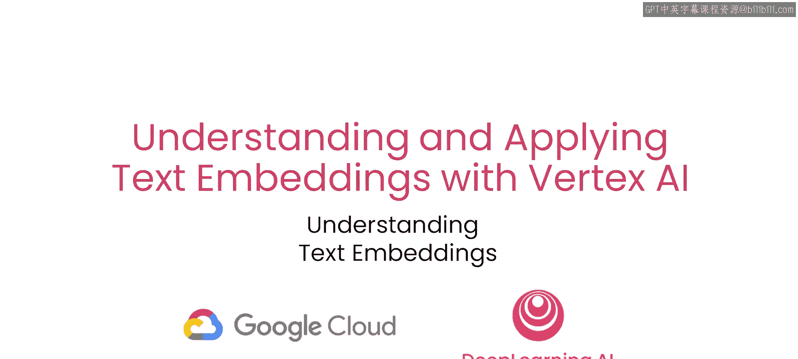
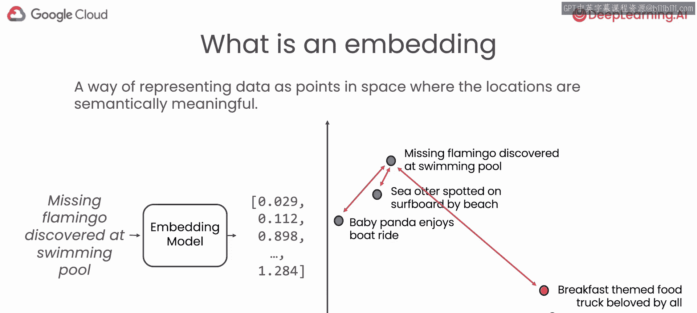
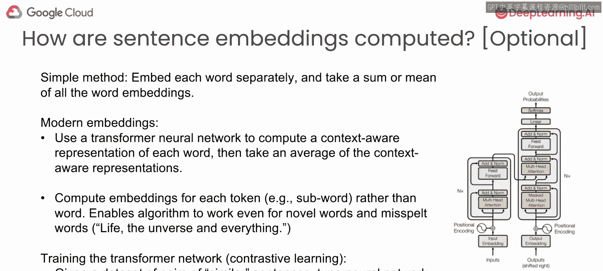
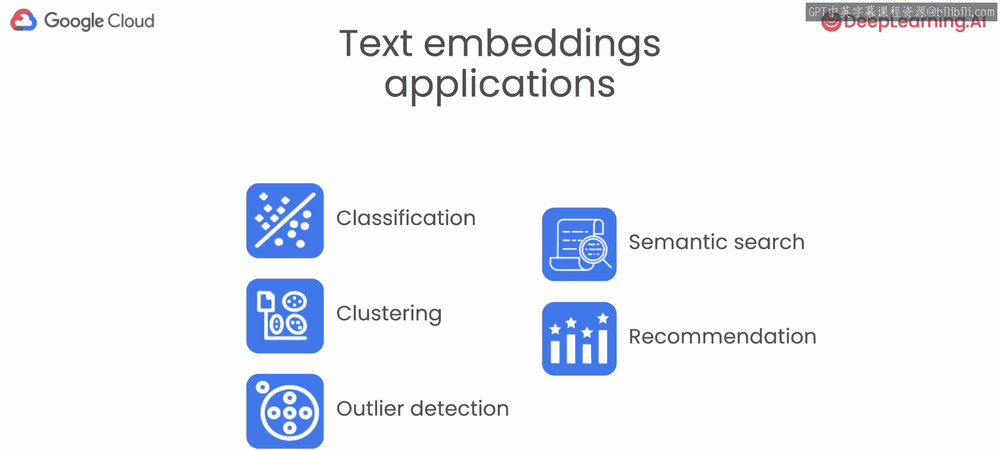
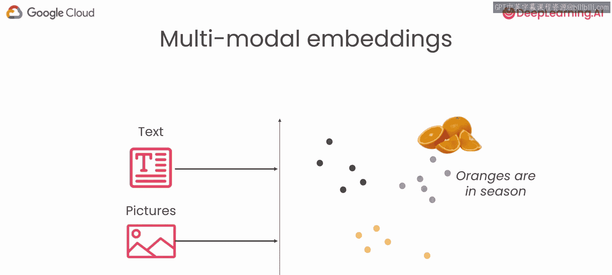

# 003：理解文本嵌入的工作原理 🧠

在本节课中，我们将要学习文本嵌入的核心概念和工作原理。我们将探讨嵌入如何表示文本的语义，以及现代技术是如何计算这些嵌入的。通过本教程，你将理解嵌入的基本机制及其在多种应用中的潜力。

---

## 嵌入的语义表示

上一节我们介绍了嵌入的基本概念，本节中我们来看看嵌入是如何在空间中表示数据点的，其中位置具有语义意义。“语义”一词指的是含义。这意味着嵌入的位置捕获了一段文本的某些含义。

例如，你可能会输入句子“失踪的火烈鸟在游泳池中被发现”，并输出一个嵌入向量。如果你嵌入多个句子，例如“失踪的火烈鸟在海滩上被冲浪板发现”或“熊猫宝宝喜欢划船”，那么这些句子在嵌入空间中的位置可能会彼此更接近。

相比之下，像“早餐主题餐车深受大家喜爱”和“新咖喱餐厅很美味”这样的句子，其嵌入位置则会距离较远。与动物和水相关的句子之间的成对距离，会远大于火烈鸟句子与早餐主题句子之间的距离。

---

## 嵌入是如何计算的？🔧

在接下来的内容中，我们将更深入地探讨技术细节。请注意，本节内容是可选的，跳过不会影响后续课程的学习。但如果你有兴趣了解嵌入的构建方式，请继续阅读。

一种简单的嵌入计算方法是分别嵌入句子中的每个单词，然后对所有单个词嵌入取和或平均值。长期以来，计算嵌入的主流方法是：列出一个最常见英语单词的列表，为每个单词单独训练一组参数以获得该单词的嵌入，然后对于一个句子，取所有这些词嵌入的平均值。

然而，正如上一课所看到的，这意味着句子级别的嵌入无法理解单词的顺序。因此，现代嵌入技术采用了更复杂的方法。

我们转而使用**Transformer神经网络**来计算每个单词的上下文感知表示，然后对这些上下文感知嵌入取平均值。如果你不理解这个示意图，不必担心。简单来说，Transformer神经网络会处理每个单词，并计算该单词的嵌入，同时考虑句子中出现的其他单词。

举个例子，单词“play”在“孩子们在玩耍”和“一场戏剧演出”中含义不同。Transformer网络通过查看周围单词的上下文，可以区分这两种含义，从而为同一个单词“play”生成不同的向量表示。这种方法使得句子嵌入能更准确地捕捉每个单词的含义。

此外，现代嵌入技术还有一个更强大的改进：它不再使用预定义的单词列表，而是为每个**令牌**计算嵌入。令牌通常对应于**子词**。这样做的好处是，即使对于新词或拼写错误的词，算法也能正常工作。

例如，如果我拼写错误地输入“life the unverse and everything”（一部我喜爱的小说），它仍然能为这个句子计算出一个相当不错的嵌入。相比之下，如果使用传统的嵌入技术，拼写错误的“unverse”将无法映射到与“universe”接近的嵌入。

现代大语言模型将句子分解为称为令牌的子词，通过学习令牌的嵌入，你可以输入任何字符串，它仍然能生成一个有意义的嵌入。

---

## 嵌入是如何学习的？📚

用于训练Transformer神经网络参数的技术称为**对比学习**。不同的研究团队仍在尝试不同的嵌入计算技术。

大致流程是：首先在大量文本数据上对Transformer网络进行**预训练**（大语言模型就是这样训练的，使用互联网或其他来源的大量未标记文本数据）。然后，你会找到一个包含相似句子对的数据集，并调整神经网络，使更相似句子的嵌入在空间中更接近，而使不相似句子的嵌入更远离。

如何判断两个句子是否相似呢？相似句子的定义可以根据你的目标来定。例如，如果你要构建一个问答系统，你可以声明“问题”和其对应的“答案”是相似的，这将促使神经网络将答案的嵌入推近问题的嵌入。不相似的句子通常只是随机采样的句子对，因为随机挑选的两个句子在含义上很可能并不相似。

目前，研究人员仍在探索这个基本方法的不同变体，这也是为什么嵌入算法每隔几个月就会有所改进。这是一个令人兴奋的研究领域，但现有的嵌入技术已经足够好，可以立即投入使用。

---

## 嵌入的应用与多模态扩展

在本短期课程的后半部分，Nikkita将介绍如何在各种应用中使用文本嵌入，包括：

以下是文本嵌入的主要应用场景：
*   **文本分类**
*   **聚类**
*   **异常检测**
*   **语义搜索**

虽然本课程不会过多讨论产品推荐，但我们也可以想象：如果你购买了产品X、Y和Z，那么通过使用嵌入，基于产品描述找到与你喜欢的产品相似的其他产品，这对于产品推荐也非常有用。

我还想分享一个有趣的概念：**多模态嵌入**。我们不会在本课程中深入探讨，但它代表了嵌入技术的前沿。

多模态嵌入是指能够将文本和图片都嵌入到同一个（例如768维）空间中的算法。“多模态”指的是它可以处理文本或图片等不同形式的数据（研究人员也在研究音频）。

例如，一段文本“橘子正当季”可以被嵌入到一个点。同样的算法，也可以将一张橘子的图片嵌入到空间中一个靠近关于橘子的文本嵌入的位置。这些能将文本和图片嵌入到同一空间的多模态嵌入，是另一个令人兴奋的发展，正在逐步开启更多能够同时理解文本和图片的应用。

---

## 总结

本节课中我们一起学习了文本嵌入的工作原理。我们了解到嵌入如何在向量空间中表示文本的语义，探讨了从简单的词平均到基于Transformer的上下文感知嵌入的演进过程，并简要介绍了嵌入是如何通过对比学习进行训练的。最后，我们展望了嵌入在分类、搜索等领域的应用以及多模态嵌入的未来潜力。理解这些基本原理，将帮助我们更好地在后续课程中应用文本嵌入技术。