# 004：可视化文本嵌入


在本节课中，我们将学习如何可视化文本嵌入，以直观地理解嵌入模型如何将语义相似的文本映射到向量空间中相近的位置。我们将使用主成分分析（PCA）和热力图两种方法进行可视化。

上一节我们介绍了如何计算文本嵌入，本节中我们来看看如何将这些高维向量可视化，以便更好地理解它们之间的关系。

## 概述与准备


首先，我们需要像之前一样，在Vertex AI平台上进行身份验证并设置环境。

```python
# 身份验证与初始化代码示意
# 此处为示意，实际代码需在对应平台环境中运行
```

接下来，我们将使用以下七个句子作为示例数据：
1.  Must St flamingo discover that swimming pool.
2.  See all the spots who have bought baby panda.
3.  Boat ride.
4.  Breakfast steamed food truck.
5.  New curry restaurants.
6.  Python developers are wonderful people.
7.  Typescript flips as a Java.

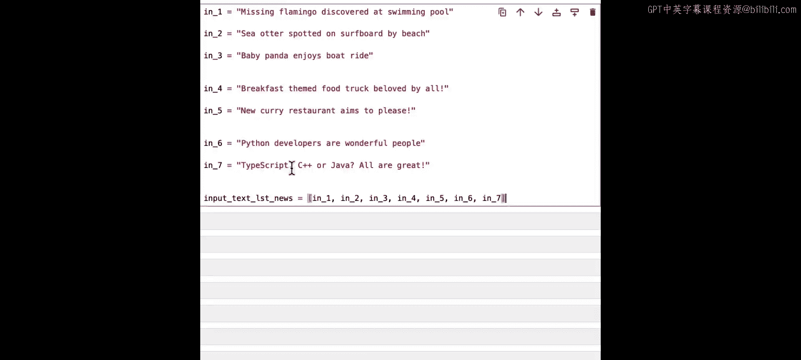

以下是导入必要库和设置嵌入模型的代码：

```python
import numpy as np
# 设置嵌入模型（此处为示意）
embedding_model = setup_embedding_model()
```

## 计算嵌入向量

我们将循环处理这七个句子，为每一个计算其嵌入向量。

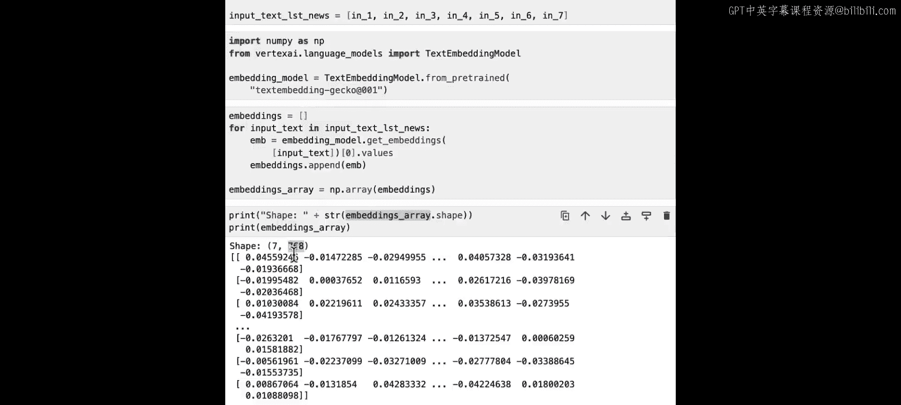

```python
sentences = [sentence1, sentence2, sentence3, sentence4, sentence5, sentence6, sentence7]
embeddings = []

for sentence in sentences:
    embedding = embedding_model(sentence).values
    embeddings.append(embedding)

embeddings_array = np.array(embeddings)
print(embeddings_array.shape)  # 输出应为 (7, 768)
```

现在，我们得到了一个形状为 `(7, 768)` 的数组，表示7个句子，每个句子被编码成一个768维的向量。

## 使用PCA进行降维可视化

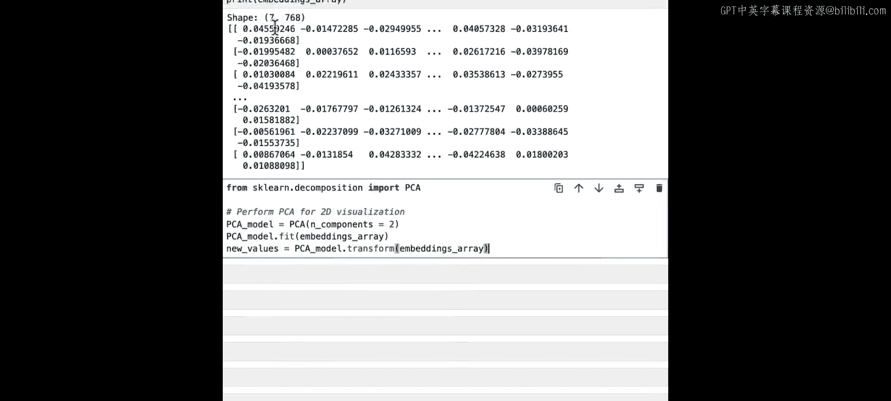

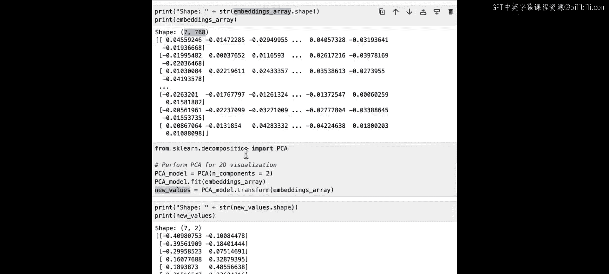

由于我们无法直接在二维屏幕上绘制768维的数据，因此需要使用主成分分析（PCA）技术将其压缩到二维。

> **PCA** 是一种用于将高维数据降维的技术，它通过找到数据中方差最大的方向（主成分）来实现。对于本视频的目的，你只需知道它能将768维数据压缩到2维以便绘图。

以下是使用PCA的代码：

```python
from sklearn.decomposition import PCA

pca = PCA(n_components=2)
embeddings_2d = pca.fit_transform(embeddings_array)
print(embeddings_2d.shape)  # 输出应为 (7, 2)
```

现在，每个句子对应一个二维坐标点，我们可以将其绘制在散点图上。

```python
import matplotlib.pyplot as plt

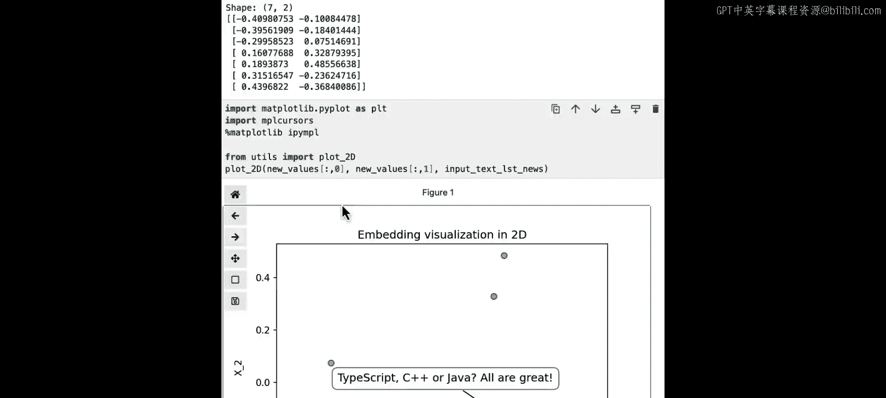

plt.figure(figsize=(8, 6))
plt.scatter(embeddings_2d[:, 0], embeddings_2d[:, 1])

# 为每个点添加标签
for i, sentence in enumerate(sentences):
    plt.annotate(f'In{i+1}', (embeddings_2d[i, 0], embeddings_2d[i, 1]))

plt.xlabel('PCA Component 1')
plt.ylabel('PCA Component 2')
plt.title('2D Visualization of Sentence Embeddings')
plt.grid(True)
plt.show()
```

观察生成的图表，你会发现：
*   关于动物的句子（如“baby panda”、“flamingo”）在图中位置接近。
*   关于食物的句子（如“food truck”、“curry restaurant”）也聚集在一起。
*   关于编程的句子（如“Python developers”、“Typescript”）则位于另一区域。

这直观地展示了嵌入模型将语义相似的句子映射到向量空间相近位置的能力。

> **重要提示**：在实际应用中，我们**不会**使用二维嵌入来计算相似度。为了可视化，PCA丢弃了大量信息。测量相似度时，应始终在原始的768维（或模型输出的原始维度）空间中进行，例如使用**余弦相似度**公式：`similarity(A, B) = (A·B) / (||A|| * ||B||)`，这样结果才更准确。

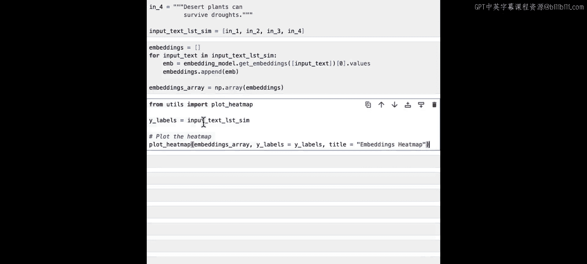

## 使用热力图分析嵌入向量

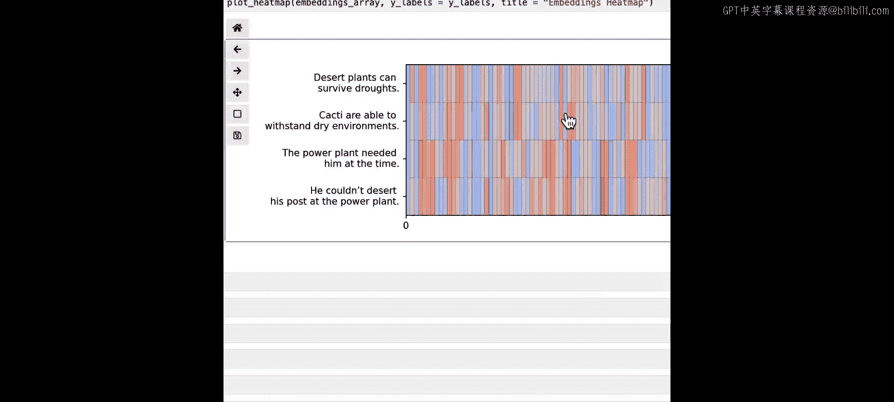

接下来，我们看另一个例子，使用热力图来观察嵌入向量各个维度的数值。

我们使用以下四个句子：
1.  He couldn‘t desert his post at a power plant.
2.  The power plant needed him at the time.
3.  Cacti are able to withstand dry environments.
4.  Desert plants can survive droughts.

使用相同的代码计算这四个句子的嵌入向量。

```python
# 计算四个新句子的嵌入向量
new_sentences = [sentence1, sentence2, sentence3, sentence4]
new_embeddings = compute_embeddings(new_sentences) # 假设的封装函数
```

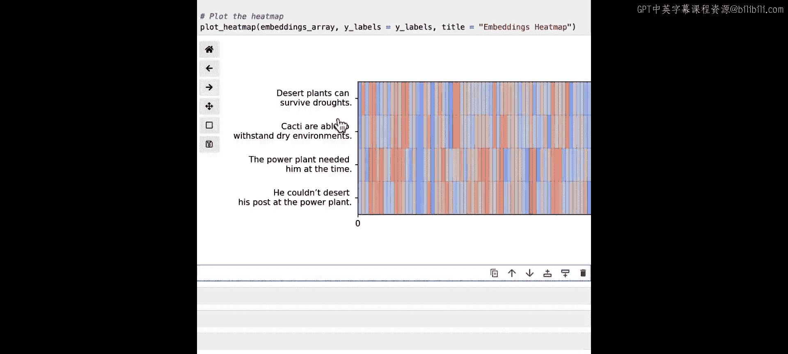

以下是绘制热力图的代码：

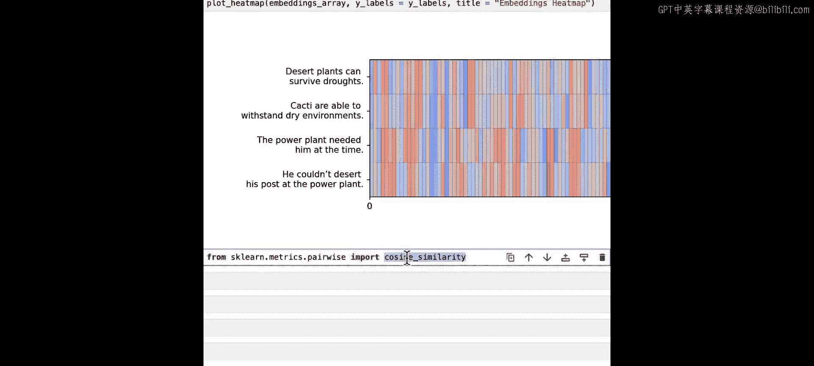

```python
import seaborn as sns
import matplotlib.pyplot as plt

plt.figure(figsize=(12, 3))
sns.heatmap(new_embeddings, cmap='RdBu', center=0)
plt.xlabel('Embedding Dimension (768 total)')
plt.ylabel('Sentence')
plt.title('Heatmap of Embedding Vectors')
plt.show()
```

在热力图中，颜色表示每个嵌入向量在不同维度上的数值大小。你可以观察到，句子1和句子2的图案模式看起来更相似，句子3和句子4的图案模式也更相似。这再次印证了嵌入模型对相似语义的编码具有一致性。

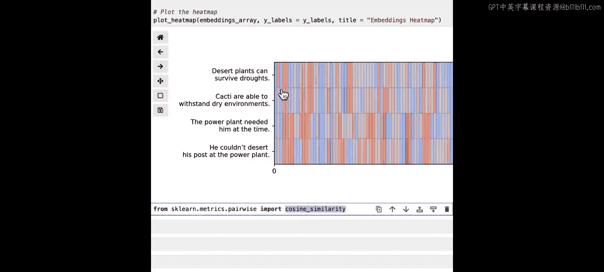

> **技术说明**：这种基于单个维度数值的可视化（如热力图或查看第一个主成分）在数学上并不完全严谨，因为嵌入空间的坐标轴方向具有一定的任意性（例如，可能发生随机旋转）。因此，它主要是一种帮助建立直觉的非正式可视化方法。可靠的操作是计算嵌入向量之间的**成对相似度**（如余弦相似度）。

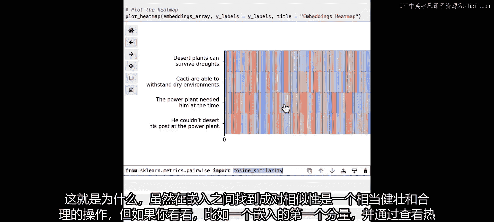

## 总结

本节课中我们一起学习了两种可视化文本嵌入的方法：
1.  **PCA散点图**：通过降维将高维嵌入绘制在二维平面上，直观展示不同文本在语义空间中的相对位置。
2.  **向量热力图**：展示每个嵌入向量在各个维度上的数值，用于观察不同向量之间的模式相似性。

这些可视化工具能帮助我们建立对嵌入模型的直觉理解，即**它将语义相似的文本映射到高维空间中彼此靠近的点**。请记住，在实际构建应用（如测量相似度、进行聚类或检索）时，应使用原始高维嵌入向量进行计算，以获得最准确的结果。

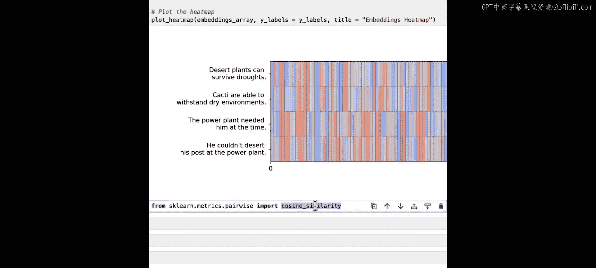

在下一节课中，我们将开始深入探讨如何利用这些嵌入向量来构建各种实际应用。