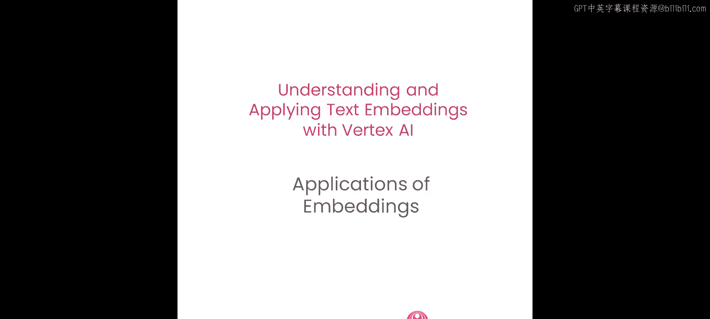
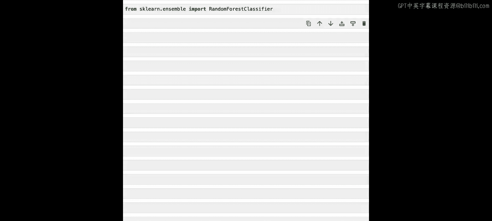
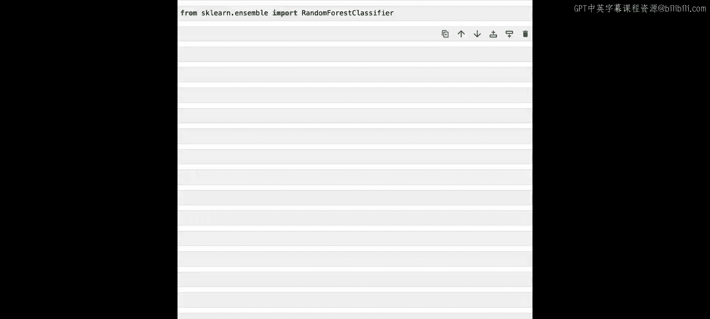
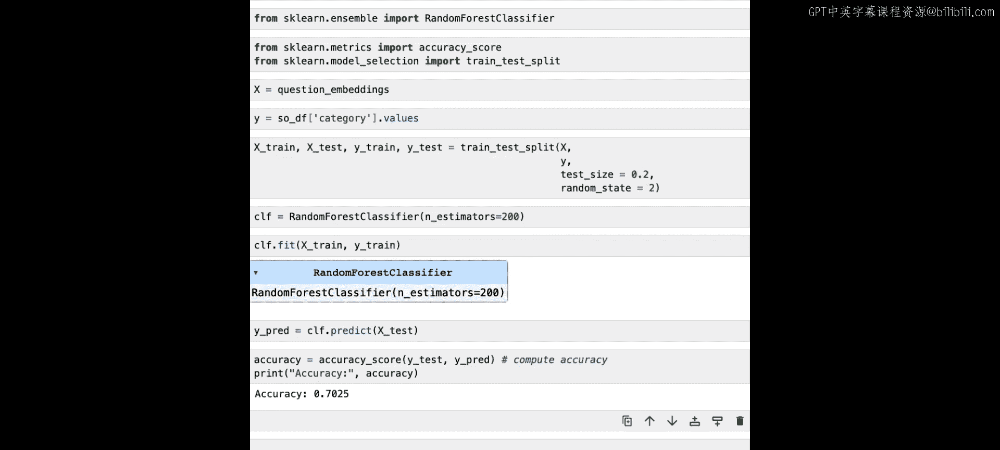

# 005：文本嵌入的实际应用




在本节课中，我们将学习如何将文本嵌入应用于实际场景，包括数据聚类、异常检测和作为监督学习的特征。我们将使用Stack Overflow数据集作为示例，通过Vertex AI的文本嵌入模型来处理和分析数据。

## 概述

上一节我们介绍了文本嵌入的基本概念和直觉。本节中，我们将探索文本嵌入在几个不同机器学习任务中的具体应用。我们将使用Google Cloud的Vertex AI平台和BigQuery服务来获取和处理数据。

## 设置环境与获取数据

首先，我们需要设置环境并获取数据。我们将使用BigQuery中的Stack Overflow问答数据集。

以下是设置步骤：

1.  配置凭据并进行身份验证。
2.  指定运行服务的区域。
3.  导入Vertex AI Python SDK并初始化。

完成设置后，我们开始加载数据。我们将从BigQuery中提取特定编程语言标签下的Stack Overflow帖子。

```python
# 导入BigQuery客户端
from google.cloud import bigquery

# 定义执行SQL查询的函数
def run_query(query):
    client = bigquery.Client()
    query_job = client.query(query)
    results = query_job.result()
    return results.to_dataframe()
```

由于数据集很大，我们只查询几种编程语言标签下的前500个帖子，以避免内存问题。

```python
# 定义要查询的语言标签列表
languages = [‘python‘, ‘javascript‘, ‘java‘, ‘html‘]

# 创建空DataFrame，用于存储所有数据
all_data = pd.DataFrame()

# 循环查询每种语言的数据
for lang in languages:
    query = f“““
        SELECT title, body, tags
        FROM `bigquery-public-data.stackoverflow.posts_questions`
        WHERE tags LIKE ‘%{lang}%‘
        LIMIT 500
    “““
    df = run_query(query)
    all_data = pd.concat([all_data, df], ignore_index=True)
```

如果执行BigQuery代码时遇到错误，或者不想使用BigQuery，可以直接从CSV文件加载数据。

现在，我们有了一个包含2000行（每种语言500个帖子）和3列的数据框。这三列分别是：
*   `input_text`：帖子标题与问题的拼接。
*   `output_text`：社区对该帖子的采纳答案。
*   `category`：编程语言标签。

## 生成文本嵌入

接下来，我们需要为这些文本数据生成嵌入向量。我们将使用Vertex AI的`textembedding-gecko`模型。

由于数据量较大，并且API对每次请求的文本实例数量有限制（最多5个），我们需要编写辅助函数来分批处理数据。

以下是辅助函数：

```python
# 定义分批函数，每批5个实例
def generate_batches(data, batch_size=5):
    for i in range(0, len(data), batch_size):
        yield data[i:i + batch_size]

# 定义嵌入生成函数（包装了get_embeddings）
def encode_text_to_embeddings(text_instances):
    embeddings = []
    for instance in text_instances:
        emb = get_embeddings(instance)
        embeddings.append(emb)
    return embeddings
```

此外，Google Cloud服务有速率限制。因此，我们使用一个更完善的批处理函数`encode_text_to_embeddings_batched`，它同时处理分批和速率限制。

```python
# 处理分批和速率限制的嵌入生成函数
def encode_text_to_embeddings_batched(data):
    # 分批逻辑
    batches = generate_batches(data)
    all_embeddings = []
    for batch in batches:
        # 调用API并处理速率限制
        embeddings = encode_text_to_embeddings(batch)
        all_embeddings.extend(embeddings)
        time.sleep(0.1)  # 简单的速率控制示例
    return np.array(all_embeddings)
```

考虑到在线课堂的速率限制，我们不会现场为所有2000行数据生成嵌入，而是加载预先计算好的嵌入向量。

```python
# 加载预先计算好的嵌入向量
import pickle
with open(‘stackoverflow_embeddings.pkl‘, ‘rb‘) as f:
    embeddings_array = pickle.load(f)

print(embeddings_array.shape)  # 输出应为 (2000, 768)
```

现在，我们有了一个形状为`(2000, 768)`的嵌入数组，代表2000个帖子，每个帖子由768维的向量表示。

## 应用一：数据聚类

第一个应用是使用K-means算法对帖子进行聚类。我们将使用Python和HTML标签的帖子进行演示。

以下是聚类步骤：

1.  导入必要的库：`KMeans`和`PCA`。
2.  为了便于可视化，我们只使用前1000行数据（Python和HTML帖子）。
3.  定义聚类数量为2。
4.  创建并拟合K-means模型。
5.  使用PCA将768维数据降为2维以便可视化。

```python
from sklearn.cluster import KMeans
from sklearn.decomposition import PCA
import matplotlib.pyplot as plt

# 使用前1000行数据进行聚类
clustering_data = embeddings_array[:1000]

# 定义K-means模型
kmeans = KMeans(n_clusters=2, random_state=42)
kmeans.fit(clustering_data)
labels = kmeans.labels_

# 使用PCA降维
pca = PCA(n_components=2)
reduced_data = pca.fit_transform(clustering_data)

# 可视化聚类结果
plt.scatter(reduced_data[:, 0], reduced_data[:, 1], c=labels, cmap=‘viridis‘)
plt.title(‘Stack Overflow Posts Clustering‘)
plt.show()
```

可视化结果会显示两个明显的簇。左侧的红色点代表HTML帖子，右侧的蓝色点代表Python帖子。聚类模型仅基于嵌入向量就能很好地将数据分为两个不同的类别。

## 应用二：异常检测

嵌入向量不仅能找到相似的数据点，还能帮助识别异常或分布外的数据点。我们将使用Isolation Forest算法进行异常检测。

以下是异常检测步骤：

1.  在数据集中添加一个与编程无关的问题（例如关于烘焙的问题）。
2.  为这个新问题生成嵌入向量。
3.  将新嵌入向量添加到原始嵌入数组中。
4.  使用Isolation Forest模型拟合数据并预测异常。

```python
from sklearn.ensemble import IsolationForest

# 添加一个异常问题（关于烘焙）
anomaly_text = “I‘m making cookies, but I don‘t remember the correct ingredient proportions. I‘ve been unable to find anything on the web.”
anomaly_embedding = get_embeddings(anomaly_text)

# 将异常嵌入添加到数组中
all_embeddings = np.vstack([embeddings_array, anomaly_embedding.reshape(1, -1)])

# 创建并拟合Isolation Forest模型
iso_forest = IsolationForest(contamination=0.01, random_state=42)
predictions = iso_forest.fit_predict(all_embeddings)

# 找出被预测为异常的数据点（标签为-1）
outliers = np.where(predictions == -1)[0]
print(“Detected outlier indices:“, outliers)
```

模型会成功地将烘焙问题识别为异常。同时，它可能还会识别出一些关于R语言的编程问题作为异常，这可能是因为这些帖子被错误标记或内容特殊。

完成异常检测后，我们从数据中移除烘焙问题，以便进行下一个应用。

## 应用三：监督学习分类

嵌入向量可以作为监督学习模型的输入特征。我们将尝试使用嵌入向量来预测帖子的类别（编程语言）。

以下是分类步骤：

1.  导入必要的库：`RandomForestClassifier`, `accuracy_score`, `train_test_split`。
2.  定义特征`X`（嵌入向量）和标签`Y`（帖子类别）。
3.  将数据随机打乱并分割为训练集和测试集（80%-20%）。
4.  创建并训练随机森林分类器。
5.  在测试集上进行预测并计算准确率。

```python
from sklearn.ensemble import RandomForestClassifier
from sklearn.metrics import accuracy_score
from sklearn.model_selection import train_test_split





# 定义特征和标签
X = embeddings_array
Y = df[‘category‘].values  # 假设df是包含类别的DataFrame

# 分割数据集
X_train, X_test, y_train, y_test = train_test_split(X, Y, test_size=0.2, random_state=42)

# 创建并训练随机森林分类器
clf = RandomForestClassifier(n_estimators=200, random_state=42)
clf.fit(X_train, y_train)

# 预测并评估
y_pred = clf.predict(X_test)
accuracy = accuracy_score(y_test, y_pred)
print(f“Classification Accuracy: {accuracy:.2f}“)
```

经过非常简单的预处理，模型可以达到约0.70的准确率，这是一个不错的结果。

## 总结

本节课中，我们一起学习了文本嵌入在三个实际机器学习任务中的应用：
1.  **数据聚类**：我们使用K-means算法和PCA可视化，成功将Stack Overflow帖子按编程语言分成了不同的簇。
2.  **异常检测**：我们使用Isolation Forest算法，成功识别出与编程无关的异常问题。
3.  **监督学习分类**：我们将嵌入向量作为特征输入随机森林分类器，有效预测了帖子的类别。



这些应用展示了文本嵌入作为通用、强大的文本表示方法，能够服务于多种下游任务。在下一个教程中，我们将暂时离开嵌入的话题，简要探讨文本生成。