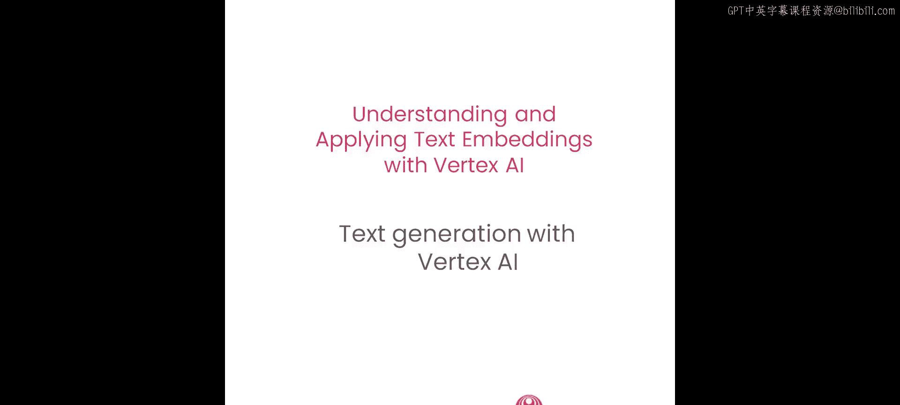
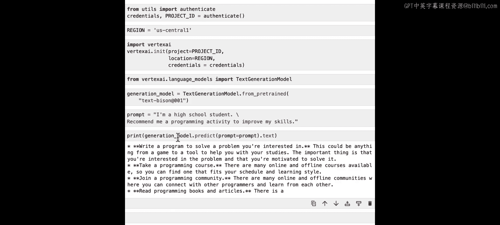
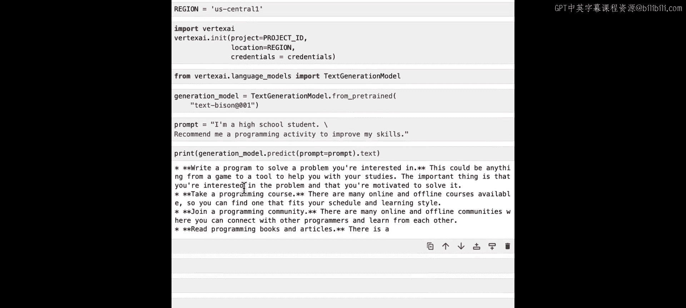
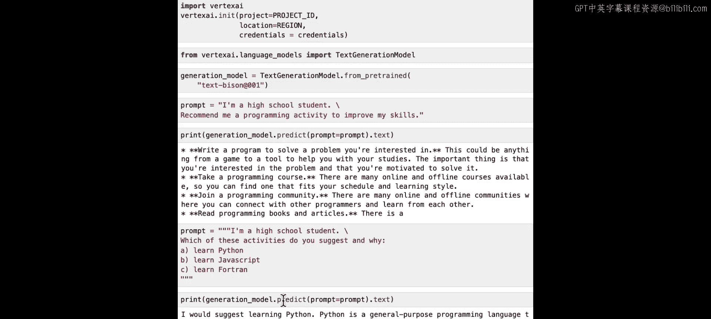
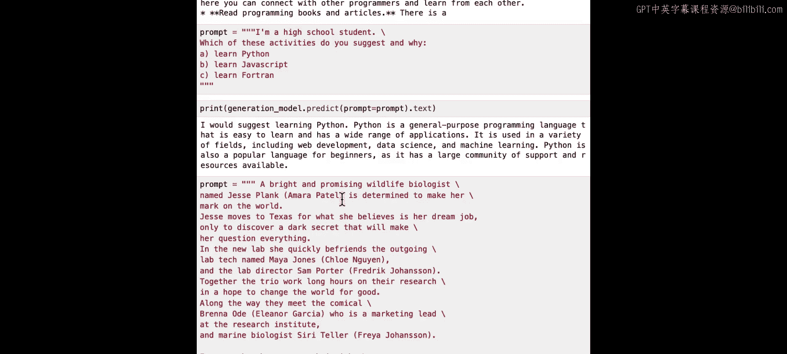
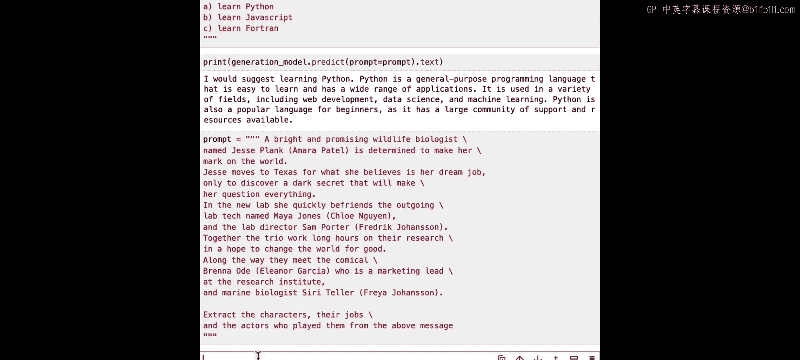
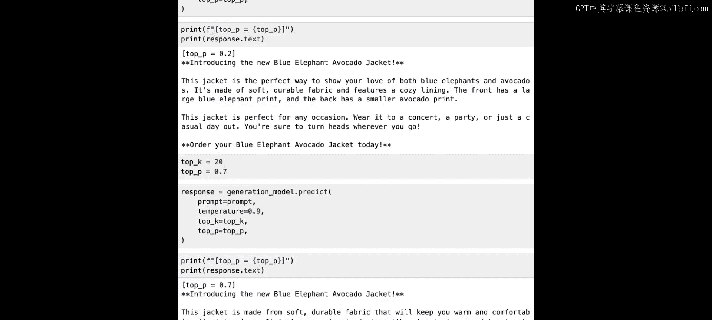
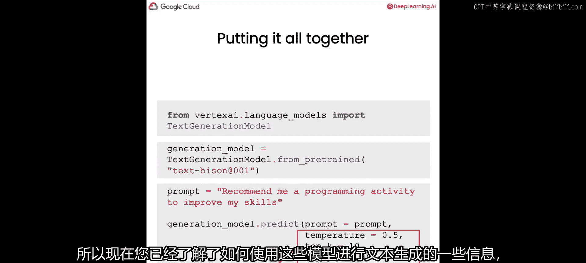

# 006：结合文本生成模型构建问答系统




## 概述

在本节课中，我们将学习如何利用大型语言模型的文本生成能力，并结合之前学习的嵌入技术，构建一个更强大的问答系统。我们将从基础开始，介绍如何使用Vertex AI的文本生成模型，并探讨如何通过调整参数来控制模型的输出。

---

## 导入与设置

首先，我们需要导入必要的凭证并进行身份验证，以便使用Vertex AI服务。这包括设置区域、导入Vertex AI库并初始化SDK。

完成这些必要的设置后，我们就可以开始了。

```python
# 导入Vertex AI并初始化
import vertexai
from vertexai.language_models import TextGenerationModel

# 设置项目ID和区域
PROJECT_ID = "your-project-id"
REGION = "us-central1"

vertexai.init(project=PROJECT_ID, location=REGION)
```

---

## 加载文本生成模型

上一节我们介绍了嵌入模型，本节中我们来看看文本生成模型。我们将从Vertex AI加载一个名为`text-bison`的模型。这个模型针对多种自然语言任务进行了微调，例如情感分析、分类、摘要和提取。





需要注意的是，`text-bison`模型适用于可以通过单次API响应完成的任务，而不是持续的对话。如果需要来回交互，可以使用另一个名为`chat-bison`的模型。

```python
# 加载文本生成模型
generation_model = TextGenerationModel.from_pretrained("text-bison@001")
```

---



## 理解提示词与生成文本

在大型语言模型的语境中，文本生成是指模型接收一段输入文本（称为**提示词**），并生成一段可能接续的文本作为输出。

让我们从一个开放式的生成任务开始。我们将定义一个提示词，然后查看模型的响应。

```python
# 定义一个开放式提示词
prompt = "I'm a high school student. Recommend me a programming activity to improve my skills."





# 调用模型生成文本
response = generation_model.predict(prompt=prompt)
print(response.text)
```

模型可能会建议：“编写一个解决你感兴趣问题的程序”，或者“参加编程课程”等。这是一个相当开放且多变的回答。

---

## 通过提示词工程控制输出

我们可以通过编写策略性的输入文本来引导模型产生不同的行为。例如，如果我们想要一个限制性更强的答案，可以将开放式生成任务转化为分类任务，以减少输出的可变性。

以下是重新表述的提示词：

```python
# 定义一个更具限制性的提示词
prompt = """
I'm a high school student. Which of these activities do you suggest and why?
A. Learn Python
B. Learn JavaScript
C. Learn Fortran
"""

response = generation_model.predict(prompt=prompt)
print(response.text)
```

这次，模型可能会明确建议学习Python，并给出理由。这种为特定用例寻找最佳提示词的艺术和科学，被称为**提示词工程**。

---

## 使用模型提取与转换信息

大型语言模型一个有趣的应用是信息提取，即将一种格式的数据重新格式化为另一种格式。

假设我们有一段关于一部虚构电影的冗长描述，其中包含角色、他们的职业以及扮演他们的演员。我们可以指示模型提取所有这些字段。

```python
# 定义包含信息的文本和提取指令
synopsis = """
[此处是一段虚构的电影剧情简介，描述了角色、职业和演员。]
"""
prompt = f"""
{synopsis}
Extract all characters, their jobs, and the actors who played them from the above message.
"""

response = generation_model.predict(prompt=prompt)
print(response.text)
```

模型将提取出结构化的信息。我们甚至可以要求它以表格形式输出：

```python
prompt = f"""
{synopsis}
Extract this information from the above message as a table.
"""
response = generation_model.predict(prompt=prompt)
print(response.text)
```

这样，我们就得到了一个格式良好的Markdown表格。

---

## 控制模型输出的关键参数

除了调整提示词的措辞和顺序，我们还可以设置一些超参数来影响模型的输出结果。

### 理解解码策略

从本质上讲，模型接收输入文本后，会输出一个可能的下一个**令牌**的概率数组。令牌是大型语言模型处理文本的基本单位，可能是单词、子词或其他文本片段。

我们需要一个策略从这个数组中选择下一个令牌，这被称为**解码策略**。

*   **贪婪解码**：每次都选择概率最高的令牌。这可能导致答案单调或重复。
*   **随机采样**：根据概率分布随机选择令牌。这可能导致不寻常的响应。

### 温度参数

**温度**参数用于控制这种随机性程度。

*   **低温度值**（接近0）：模型输出更确定、更可预测。适用于分类、提取等任务。
    *   `temperature = 0` 时，模型总是选择最可能的令牌，输出是完全确定的。
*   **高温度值**（接近1）：模型输出更具创造性、更多样化。适用于头脑风暴、创意写作等开放式任务。

在数学上，温度通过修改Softmax函数的输入来工作：
`softmax_with_temperature(z_i) = exp(z_i / T) / sum(exp(z_j / T))`
其中 `z_i` 是逻辑值，`T` 是温度。

```python
# 使用温度参数
prompt = "Complete the sentence: As I prepared the picture frame, I reached into my toolkit to fetch my"

# 温度 = 0 (确定性)
response_deterministic = generation_model.predict(prompt=prompt, temperature=0)
print(f"Temperature 0: {response_deterministic.text}")

# 温度 = 1 (更具创造性)
response_creative = generation_model.predict(prompt=prompt, temperature=1)
print(f"Temperature 1: {response_creative.text}")
```

### Top-K 和 Top-P 采样

以下是两种更高级的采样方法：

*   **Top-K采样**：仅从概率最高的K个令牌中采样。
*   **Top-P采样（核采样）**：从累积概率超过P的最小令牌集合中采样。这能动态适应概率分布。

参数协同工作的顺序是：先按Top-K过滤，再按Top-P过滤，最后使用温度采样选择最终令牌。

```python
# 同时设置温度、Top-P和Top-K
prompt = "Write an advertisement for jackets that involves blue elephants and avocados."

response = generation_model.predict(
    prompt=prompt,
    temperature=0.9,  # 高创造性
    top_p=0.8,        # 使用累积概率80%内的令牌
    top_k=20          # 仅考虑前20个最可能的令牌
)
print(response.text)
```

---

## 核心语法总结

本节课我们一起学习了使用Vertex AI文本生成模型的核心步骤：

1.  **导入并加载模型**：
    ```python
    from vertexai.language_models import TextGenerationModel
    model = TextGenerationModel.from_pretrained("text-bison@001")
    ```
2.  **定义提示词**：这是输入给模型的文本。
3.  **调用预测并设置参数**：
    ```python
    response = model.predict(
        prompt="你的提示词",
        temperature=0.2,
        top_p=0.95,
        top_k=40
    )
    ```

---

## 总结与下一步



在本节课中，我们一起学习了：
*   如何加载和使用Vertex AI的文本生成模型（`text-bison`）。
*   如何通过**提示词工程**引导模型行为。
*   如何利用模型进行**信息提取和格式转换**。
*   控制模型输出随机性的三个关键参数：**温度**、**Top-K**和**Top-P**，以及它们的工作原理和协同方式。

现在，你已经掌握了文本生成的基础知识。我鼓励你打开笔记本，尝试不同的温度、Top-P和Top-K值，并试验各种提示词，看看能让这些大型语言模型展现出哪些有趣的行为。



当你准备好后，我们将在下一课中，将你学到的文本生成知识与嵌入技术结合起来，构建一个完整的问答系统。