# 007：构建基于嵌入的问答系统


在本节课中，我们将综合运用之前学到的关于嵌入、语义相似度和文本生成的知识，构建一个完整的问答系统。该系统将接收用户关于Python编程的问题，并基于Stack Overflow帖子的数据库返回答案。

## 概述

大型语言模型（LLM）虽然强大，但其知识通常局限于训练数据。为了回答特定领域（如公司内部文档）或最新信息的问题，我们需要将LLM连接到外部知识库。直接将这些文档全部放入提示词中是不现实的，因为会很快超出上下文长度限制。此外，将回答与具体文档来源关联，有助于验证答案的准确性，避免模型“幻觉”。本节课将展示如何利用嵌入和提示工程，无需微调模型，即可构建这样的系统。

## 数据准备与嵌入

上一节我们介绍了文本嵌入的基本概念，本节中我们来看看如何为我们的问答系统准备数据。

首先，我们进行常规的身份验证、区域设置，并初始化Vertex AI Python SDK。

完成设置后，我们开始准备数据。与之前的实验类似，我们将使用BigQuery中的Stack Overflow数据集。但这次我们不直接运行BigQuery代码，而是使用一个预先准备好的CSV文件。我们使用Pandas导入这个数据。

```python
import pandas as pd
so_database = pd.read_csv('stack_overflow_data.csv')
print(so_database.shape)
print(so_database.head())
```

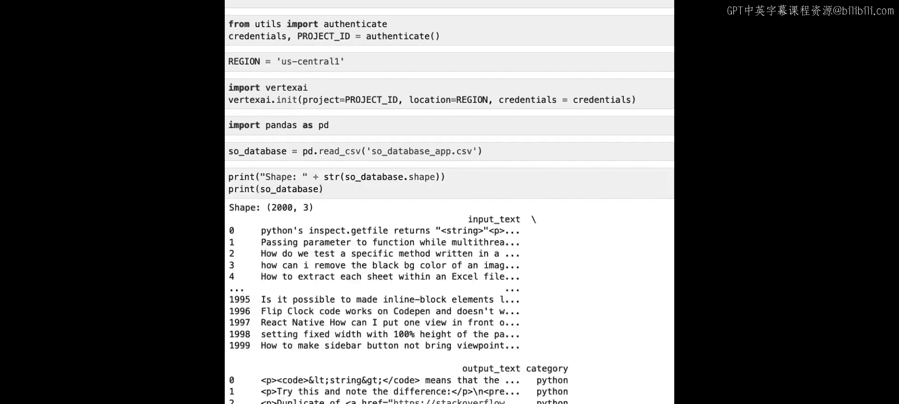

这个数据框包含2000行，代表2000个不同的Stack Overflow帖子。它有三列：
*   `input_text`：帖子的问题和标题的拼接。
*   `output_text`：社区对该问题的采纳答案。
*   `category`：帖子标记的编程语言。

现在，我们可以为这些数据生成嵌入。我们导入文本嵌入模型并加载`text-embedding-gecko`模型。

处理大量数据时，需要注意批处理和速率限制。`encode_text_to_embeddings_batched`这个工具函数会为我们处理这些细节。以下是生成嵌入的代码示例：

```python
from vertexai.language_models import TextEmbeddingModel
model = TextEmbeddingModel.from_pretrained("textembedding-gecko")
# 实际项目中运行此代码来生成嵌入
# embeddings = model.encode_text_to_embeddings_batched(texts=so_database['input_text'].tolist())
```

为了节省API调用，我们直接加载预先计算好的嵌入数据，这些数据保存在一个pickle文件中。

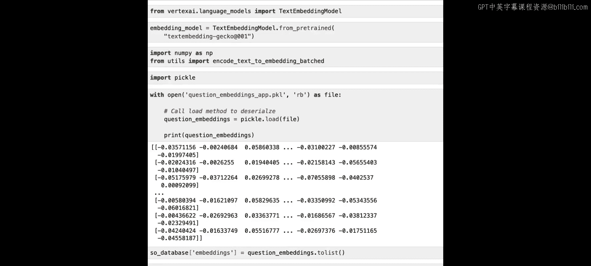

```python
import pickle
with open('precomputed_embeddings.pkl', 'rb') as f:
    embeddings_array = pickle.load(f)
print(embeddings_array)
```

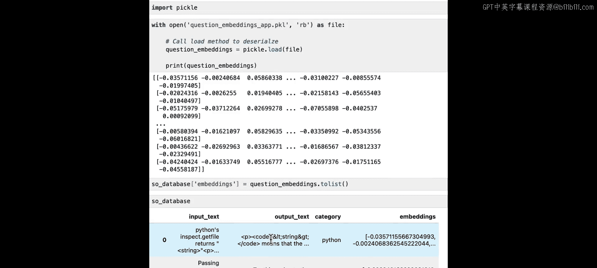

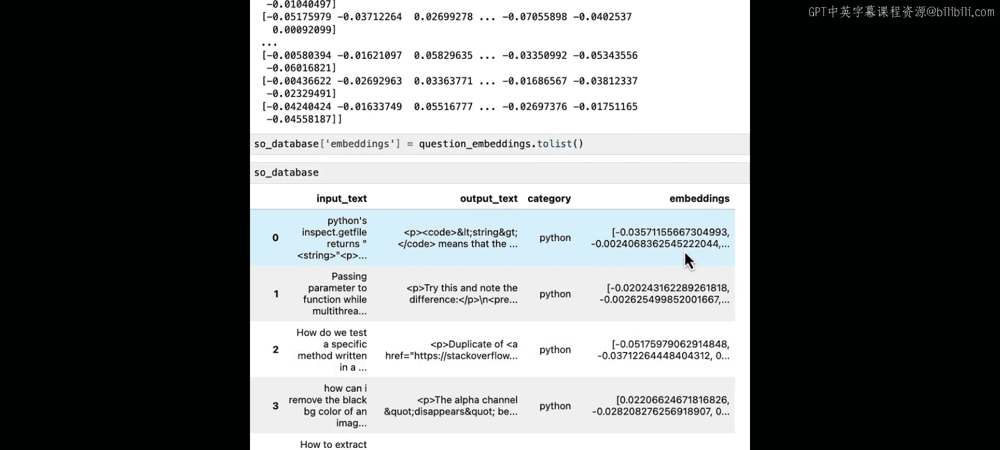

最后，我们将这些嵌入向量作为新的一列添加到数据框中，便于后续构建问答系统。

```python
so_database['embeddings'] = list(embeddings_array)
```

## 核心原理：相似度搜索与最近邻


我们为何要嵌入所有数据？我们的Stack Overflow数据包含问题和答案。系统目标是：接收用户查询，在数据库的所有Stack Overflow问题中寻找语义相似的问题。如果找到，我们就获得了对应答案，从而可以回答用户。

之前我们讨论过，嵌入可以帮助我们找到相似的数据点。我们可以使用距离度量来量化两个嵌入向量的相似度。以下是几种常见的度量方式：

*   **欧几里得距离（L2距离）**：计算两个向量端点之间的直线距离。公式为：`distance = sqrt(∑(Ai - Bi)^2)`。
*   **余弦相似度**：计算两个向量之间夹角的余弦值。其值在-1到1之间，值越接近1表示越相似。公式为：`similarity = (A·B) / (||A|| * ||B||)`。
*   **点积**：计算两个向量的点积，等于余弦相似度乘以两个向量的模长。公式为：`dot_product = A·B = ∑(Ai * Bi)`。点积同时考虑了向量的角度和大小。

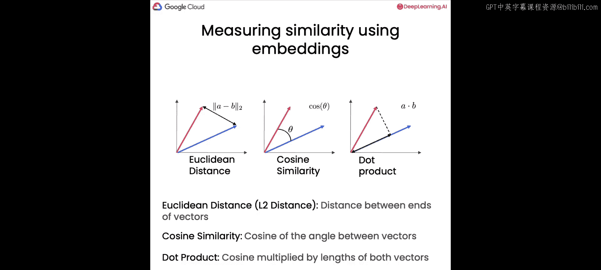

在我们的例子中，我们将使用**余弦相似度**。当向量被归一化为单位长度（模长为1）时，余弦相似度和点积是等价的。

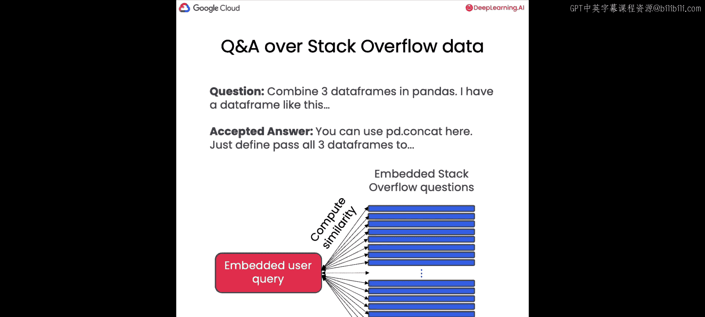

接下来，我们将用户查询进行嵌入，然后计算该查询嵌入与数据库中每一个Stack Overflow问题嵌入之间的余弦相似度。完成计算后，我们可以找出哪些问题嵌入最为相似，这些被称为**最近邻**。

## 实现问答流程

让我们在代码中实现上述流程。首先导入必要的库。

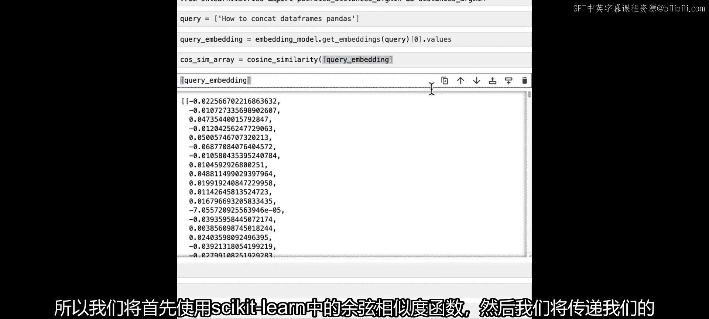

```python
import numpy as np
from sklearn.metrics.pairwise import cosine_similarity
from sklearn.metrics import euclidean_distances
```

假设用户提问：“how to concatenate data frames in pandas”。我们首先嵌入这个查询。

```python
user_query = "how to concatenate data frames in pandas"
query_embedding = model.get_embeddings([user_query])[0].values
```

接着，计算查询嵌入与数据库中所有嵌入的余弦相似度。

```python
# 将数据库中的嵌入列表转换为二维数组
db_embeddings_list = list(so_database['embeddings'])
similarities = cosine_similarity([query_embedding], db_embeddings_list)
print(similarities.shape) # 输出 (1, 2000)
```

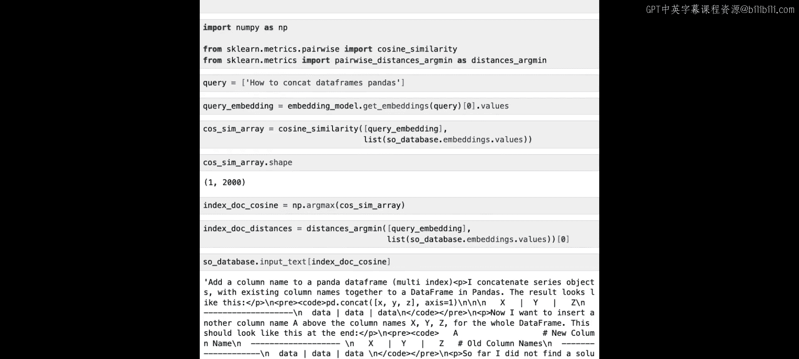

这个数组的形状是1x2000，意味着我们计算了查询与2000个Stack Overflow嵌入中每一个的相似度得分。我们需要从中找出相似度最高的索引。

```python
most_similar_idx = np.argmax(similarities)
```

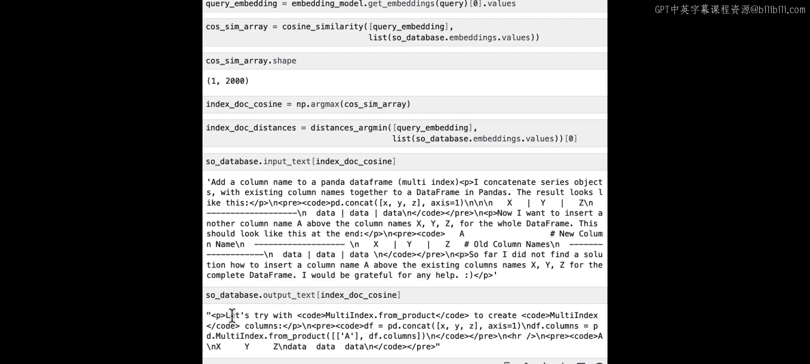

现在，我们可以查看这个索引对应的问题和答案。

```python
similar_question = so_database.iloc[most_similar_idx]['input_text']
similar_answer = so_database.iloc[most_similar_idx]['output_text']
print(f"最相似的问题：{similar_question}")
print(f"对应的答案：{similar_answer}")
```

如果直接将这个原始答案返回给用户，体验可能不佳（格式混乱，缺乏上下文）。因此，我们将使用一个大语言模型，以上述信息为相关上下文，生成一个更友好、更对话式的回答。

## 使用LLM生成友好回答

为了实现这一点，我们导入并加载文本生成模型（例如`text-bison`）。

```python
from vertexai.language_models import TextGenerationModel
generation_model = TextGenerationModel.from_pretrained("text-bison")
```

接下来，我们构建一个提示词（Prompt）。首先创建上下文信息。

```python
context = f"""
问题：{similar_question}
答案：{similar_answer}
"""
```

然后，将上下文和用户查询整合到提示词中。

```python
prompt = f"""
以下是上下文信息：
{context}
请根据上下文中的相关信息，回答以下查询。如果上下文中的信息不相关，请回复：“我在文档数据库中找不到与您查询匹配的良好答案。”
查询：{user_query}
答案：
"""
```

最后，调用模型生成回答。

```python
response = generation_model.predict(
    prompt=prompt,
    temperature=0.2,
    max_output_tokens=256
)
print(response.text)
```

这样，我们就得到了一个基于Stack Overflow答案、但表述更流畅、更用户友好的回答。

## 处理无关查询与优化搜索

当前的流程返回嵌入数据库中最相似的问题。但如果用户查询与数据库信息完全无关呢？除了生成对话式回答，我们还可以利用文本生成模型来处理这种情况。

让我们尝试一个不同的查询：“how to make the perfect lasagna”。这显然不在Python编程的Stack Overflow数据库中。

我们重复之前的步骤：嵌入查询、计算余弦相似度、找到最相似的文档。然后，使用相同的提示词模板，将最相似的（尽管不相关的）Stack Overflow问答作为上下文输入。

由于我们在提示词中明确指示模型在信息不相关时返回特定语句，模型应该会输出“我在文档数据库中找不到与您查询匹配的良好答案。”这演示了系统如何处理超出知识范围的查询。

在结束之前，需要指出：我们计算了查询嵌入与数据库中**每一个**嵌入的相似度，这种**穷举搜索**在数据库有数亿甚至数十亿向量时是不可行的。在生产环境中，通常会使用执行**近似匹配**的算法。

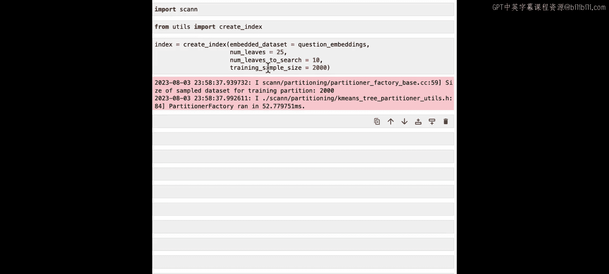

如果你使用向量数据库，这个功能可能已经内置。如果你想尝试这种近似最近邻算法，一个可用的开源库是`ScaNN`（可扩展最近邻）。它能大规模高效地进行向量相似性搜索。

以下是使用`ScaNN`的简要示例：

```python
# 安装： pip install scann
import scann
import time

# 1. 构建索引
db_embeddings_array = np.array(db_embeddings_list)
searcher = scann.scann_ops_pybind.builder(db_embeddings_array, 10, "dot_product").tree(
    num_leaves=1000, num_leaves_to_search=100).score_ah(2).reorder(100).build()

# 2. 近似搜索
query = "how to concatenate data frames in pandas"
start_time = time.time()
query_embedding = model.get_embeddings([query])[0].values
neighbors, distances = searcher.search(query_embedding, final_num_neighbors=1)
latency_approx = time.time() - start_time
print(f"近似搜索找到的最近邻ID：{neighbors[0]}, 相似度：{distances[0]}")
print(f"近似搜索耗时：{latency_approx*1000:.2f} 毫秒")

# 3. 对比穷举搜索
start_time = time.time()
similarities = cosine_similarity([query_embedding], db_embeddings_list)
most_similar_idx = np.argmax(similarities)
latency_exhaustive = time.time() - start_time
print(f"穷举搜索找到的最近邻ID：{most_similar_idx}")
print(f"穷举搜索耗时：{latency_exhaustive*1000:.2f} 毫秒")
```

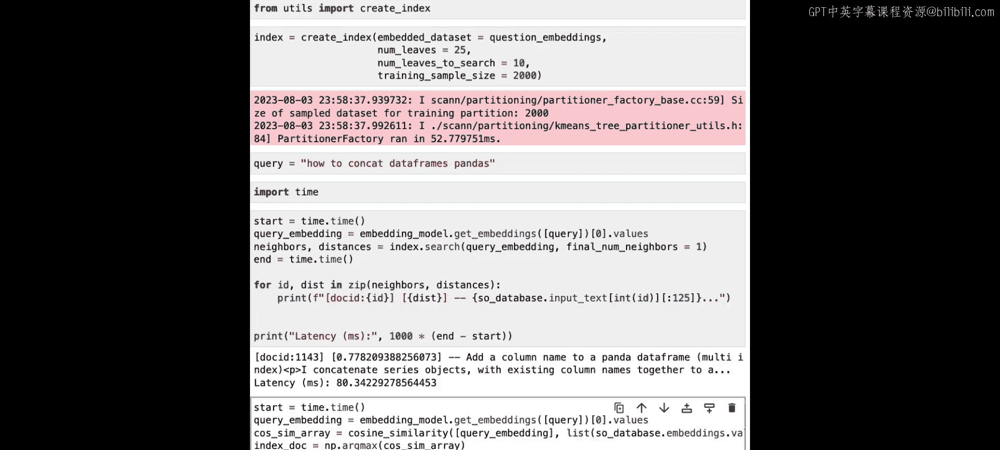

在小数据集上，速度差异可能不明显，但在海量数据集中，近似搜索的速度优势将非常显著。

## 总结

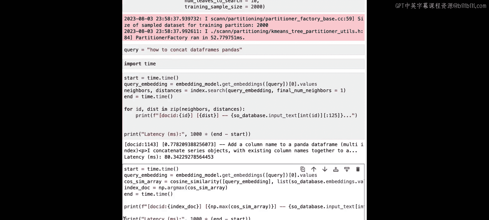

本节课中我们一起学习了如何构建一个基于嵌入的问答系统。我们回顾一下完整的流程：

1.  **数据嵌入**：将外部知识库（如Stack Overflow问答对）通过嵌入模型转化为向量，并存储。
2.  **查询处理**：将用户查询同样转化为嵌入向量。
3.  **相似度匹配**：计算查询向量与知识库中所有向量之间的余弦相似度，执行最近邻搜索，找到最相关的文档。
4.  **答案生成**：将找到的相关文档（问题和答案）作为上下文，与原始用户查询一起构建提示词，输入到文本生成模型（LLM）中，生成一个流畅、准确且可追溯来源的最终答案。
5.  **边界处理**：通过设计提示词，让LLM能够判断上下文是否相关，并妥善处理无关查询。
6.  **性能优化**：对于大规模向量数据库，可以采用近似最近邻算法（如ScaNN）来加速搜索过程。

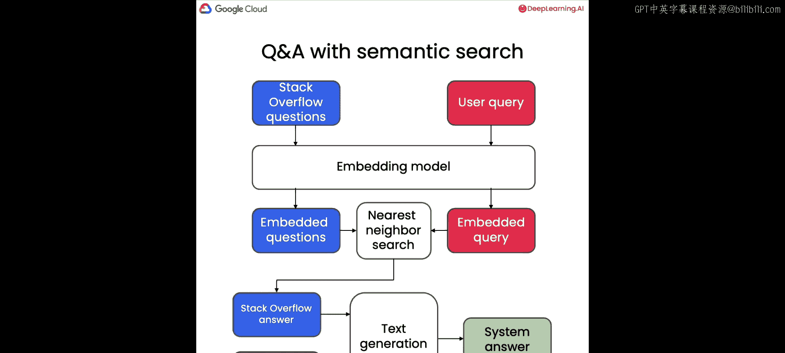

通过本教程，你不仅构建了一个小型的Stack Overflow问答系统，更重要的是掌握了将LLM与外部知识库结合的核心模式。你可以将这套方法应用于你自己的数据集，构建定制化的问答、客服或知识检索系统。