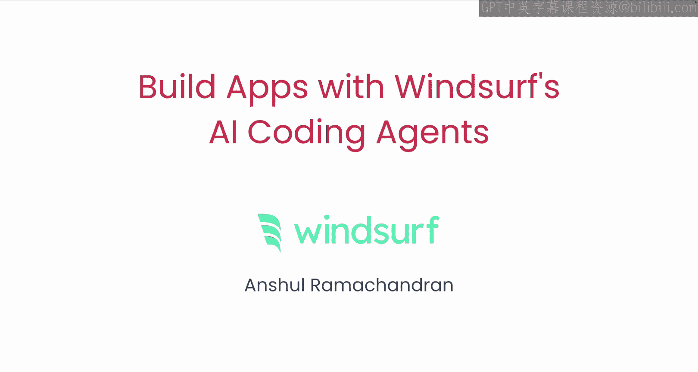
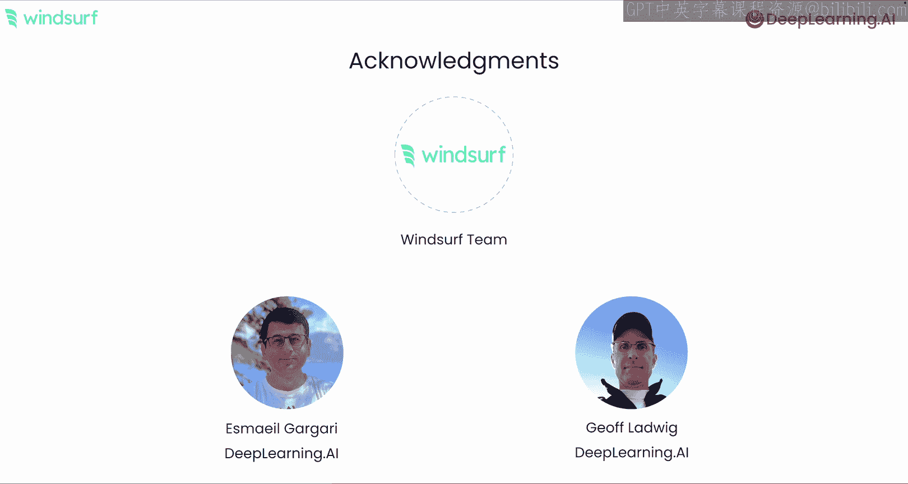

# 001：课程介绍 🚀

在本节课中，我们将要学习如何利用 Windsurf 的 AI 编程代理来构建应用程序。Windsurf 是一个协作式的智能代理集成开发环境，它提供了一个可以与 AI 代理协同工作的空间。通过本课程，你将掌握使用 Windsurf 构建多个有趣应用的技能，并深入了解基于大语言模型的编程代理是如何构建的。

## 课程概述

欢迎来到“使用 Windsurf 的 AI 编程代理构建应用程序”课程。本课程由 Windsurf 合作开发，并由 Anhu Ramachandran 讲授。Windsurf 是一个协作式代理 IDE，它提供了一个可以与 AI 代理协同工作的空间。

我知道许多人在编码工作中使用 AI，例如代码补全作为一项基础功能。但许多用户，即使是那些使用 AI 辅助编程的用户，也尚未充分利用 AI 的全部潜力。本课程将使你熟练掌握当今最前沿的最佳实践，并有望彻底改变你的编程方式。

讲师 Aishha Ramasandran 是 Windsurf 的创始团队成员，也是 AI 编程代理领域的专家。感谢 Andrew，Windsurf 让使用 AI 编程变得更加有趣和轻松。

## AI 编程工具的发展现状

目前，开发者可用的 AI 编程工具范围很广。在一端，是简单的编码辅助工具，它们通常只对大语言模型进行一次调用。在另一端，是旨在完全自动化编码体验的自主代理。我们构建 Windsurf 的初衷，是让它作为一个协作式代理，来弥合简单编码辅助与完全自主代理之间的差距。

我一直认为，当我了解一个工具是如何构建的时，我就能更好、更强大地使用它。这正是我对这门课程感到特别兴奋的原因。你将学习像 Windsurf 这样的代理 AI 工具的内部工作原理，同时使用它来构建游戏、修复单元测试、更新大型代码库，并从零开始构建一个完整的维基百科主题分析应用程序。

## Windsurf 的核心优势

不同 AI 编程工具之间的一个主要区别在于它们如何在流程中使用大语言模型来规划和执行操作。一个有效的编码代理能够维护代码库的上下文，跟踪你的开发意图，并使用正确的工具来执行任务，这赋予了它一个优秀结对编程伙伴的感觉。

使 Windsurf 成为一个成功的 AI 编程代理的主要因素之一，是其强大的搜索和发现能力。这使它能够采取多个步骤来扫描多个文件，甚至在线搜索文档，然后识别与任务最相关的代码或文档，并最终执行一系列代码编辑来实现编程意图。

这是一个比简单调用模型更复杂、更离散的流程管道，Anho 将详细讲解所有这些细节。

## 致谢与展望

许多人共同努力创建了这门课程，我要感谢整个 Windsurf 团队。来自 Deep Bta AI 的 Ema Gagari 和 Jeff Ladwwickig 也为本课程做出了贡献。这门课程将会非常有趣。我认为是的，让我们进入下一个视频开始学习吧。

---

本节课中我们一起学习了本课程的总体介绍、AI 编程工具的现状、Windsurf 作为协作式代理的核心设计理念及其优势。在接下来的章节中，我们将动手实践，深入探索如何使用 Windsurf 构建具体的应用程序。