# 002：快速入门 🚀

在本节课中，你将学习如何开始使用 Windsurf，并借助 AI 代理在几分钟内构建你的第一个应用程序。

---

## 概述

本节我们将完成 Windsurf 的安装与初步设置，并利用其核心 AI 代理 **Cascade** 来创建一个简单的贪吃蛇游戏。通过这个过程，你将直观地体验到 AI 辅助编程的强大与便捷。

---

## 下载与安装 Windsurf

首先，你需要下载并安装 Windsurf 应用程序。

以下是具体步骤：
1.  打开浏览器，在谷歌中搜索 **Windsurf AI download**。
2.  根据你的操作系统（例如 Mac 或 Windows），点击相应的下载链接和按钮。
3.  下载完成后，打开应用程序。

安装完成后，你将看到类似下图的界面，这就是 Windsurf 的主界面。

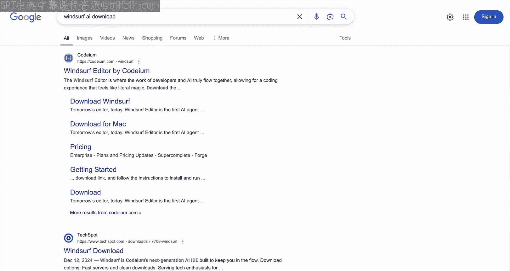

接下来，你需要登录并进行身份验证，之后就可以开始使用了。

Windsurf 是基于 Visual Studio Code 的一个分支版本。因此，如果你使用过 VS Code，会发现很多界面元素看起来很相似。不过，本课程将重点探索其集成的众多 AI 功能。

由于它是 VS Code 的分支，在安装过程中，你还可以选择导入现有 VS Code 的所有设置。

---

## 认识核心 AI 代理：Cascade

Windsurf 界面中首先要注意的是右侧的面板，名为 **Cascade**。这是我们将在本课程中频繁使用的 AI 协作代理。


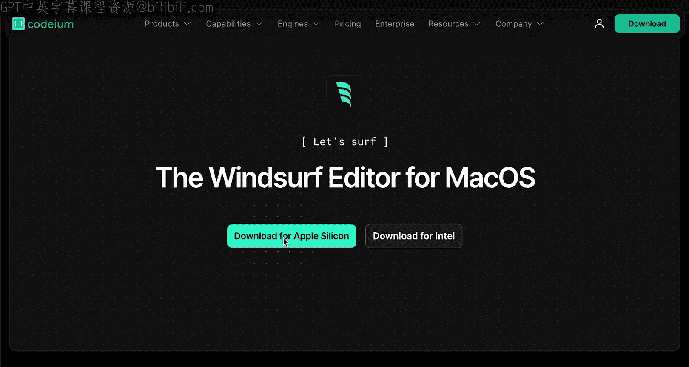


如果 Cascade 面板没有显示，你可以使用键盘快捷键 `Command + L`（在 Mac 上）来打开或关闭它。

---

## 使用 Cascade 构建第一个应用

现在，让我们使用 Cascade 来构建我们的第一个应用程序。如图所示，我启动了一个完全空白的项目。

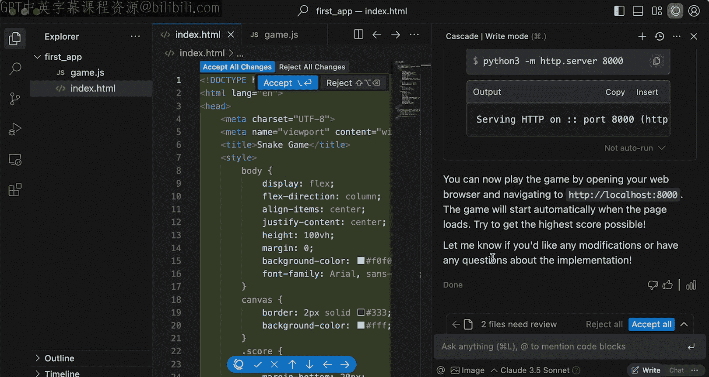

我将直接向 Cascade 发出指令来创建应用。我选择创建一个贪吃蛇游戏。

**具体指令如下：**
```
create a snake game in JavaScript and HTML
```

发出指令后，你会立即看到 Cascade 开始执行一系列操作。它会自动创建并编写多个代码文件来完成手头的任务。

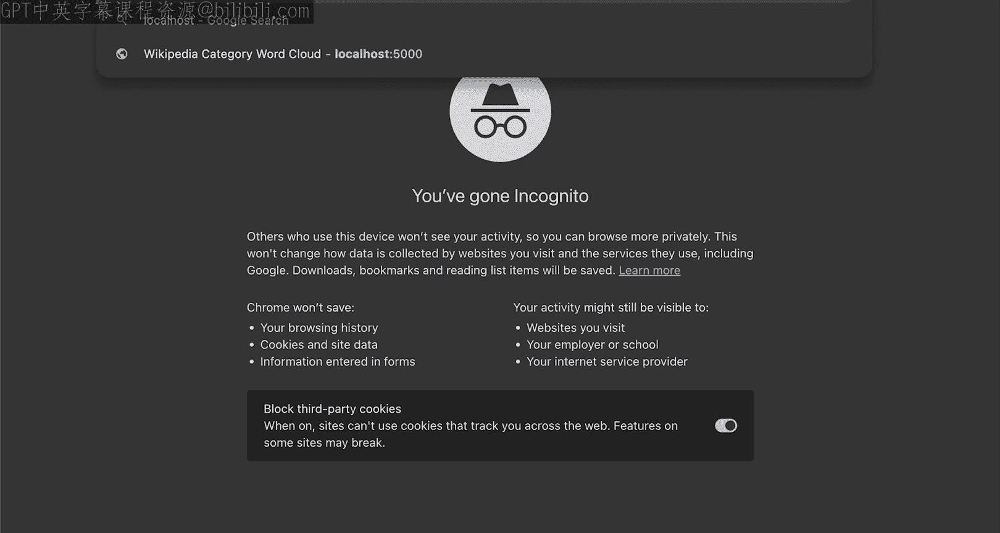

Cascade 甚至能建议终端命令。我可以直接运行它生成的命令来启动应用。

应用似乎已准备就绪，我可以在浏览器中访问 `localhost:8000` 来查看我的游戏。


游戏运行成功！我可以控制蛇移动，游戏结束后也能重新开始。


---

## 与 AI 代理协作迭代功能

但这就是与 AI 代理协作的魅力所在：我们可以轻松地进行修改和迭代。让我们回到 Windsurf，对游戏做一些有趣的修改。

例如，我想让背景颜色在每次蛇吃到食物方块时都发生变化。

**我给 Cascade 的新指令是：**
```
change the background color every time a food square is consumed
```

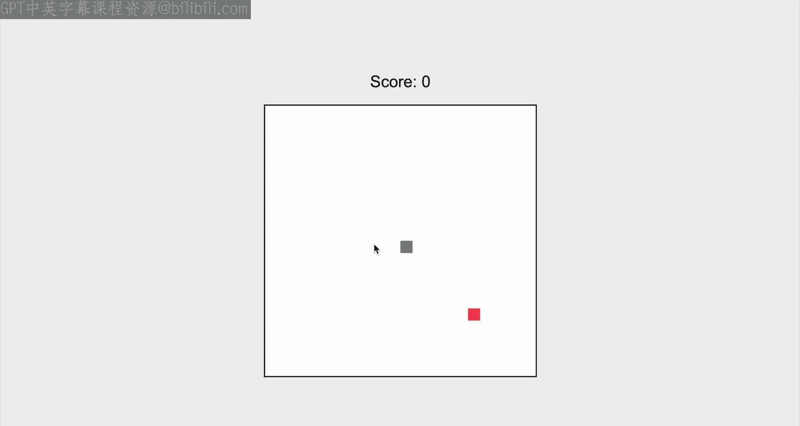

Cascade 接受了这个任务并开始修改代码。

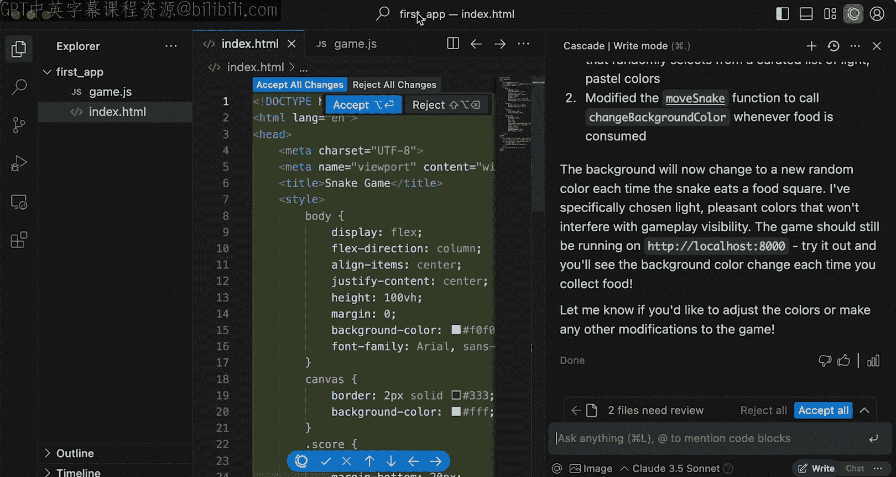


修改完成后，我刷新浏览器页面，检查效果。太棒了！现在每次吃到食物，背景颜色都会改变，完全符合我的要求。

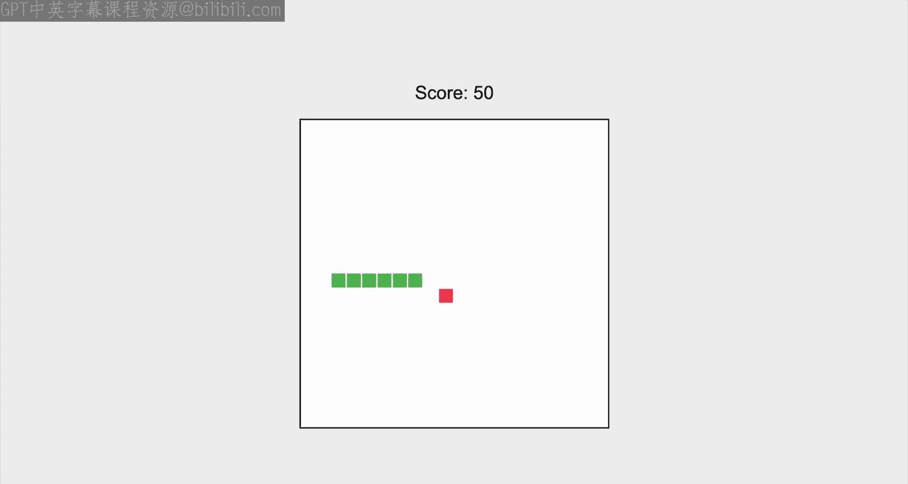

这就是 AI 代理的威力：你可以尽情发挥创意，用它来构建任何你想要的东西。

---


## 持续迭代与功能增强

让我们再添加一个功能，让游戏更像经典的贪吃蛇。我想把食物方块变成一个苹果表情符号。

**指令如下：**
```
change the food square to be an apple emoji
```

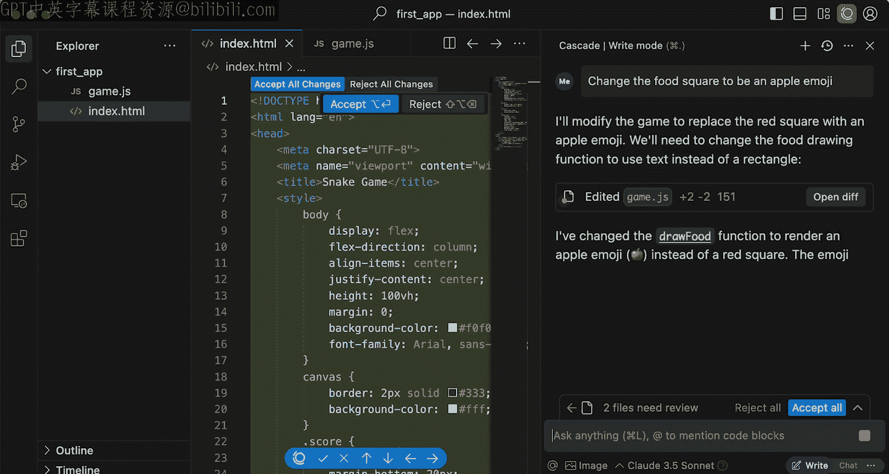

Cascade 再次执行了修改。


刷新游戏后，我们看到食物已经变成了 🍎 表情，同时背景变色功能依然有效。

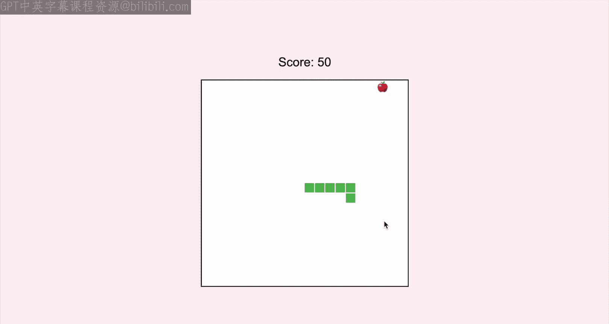

我们可以一直这样迭代下去。让我们再添加一个效果：在食物被吃掉的位置产生一个小型粒子爆炸。

**指令如下：**
```
add a little explosion where the food square is consumed every time it is successful
```

Cascade 处理了这条指令。


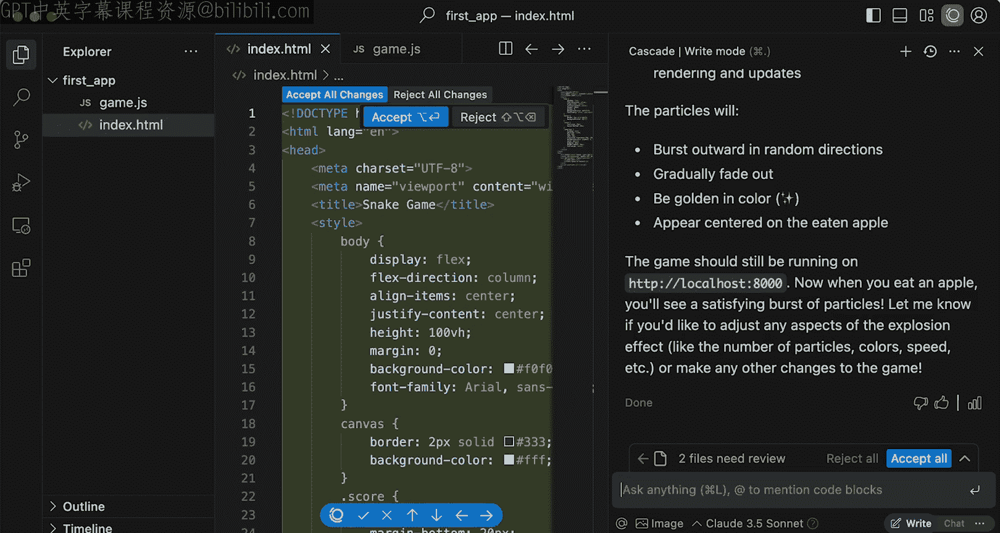

刷新游戏并重新开始，现在我们看到，每次蛇吃到苹果时，除了背景变色，还会出现粒子爆炸效果。


我们甚至可以“打破规则”。让我们回到 Windsurf，让苹果也动起来，变成一个移动的目标，但移动速度比蛇慢。

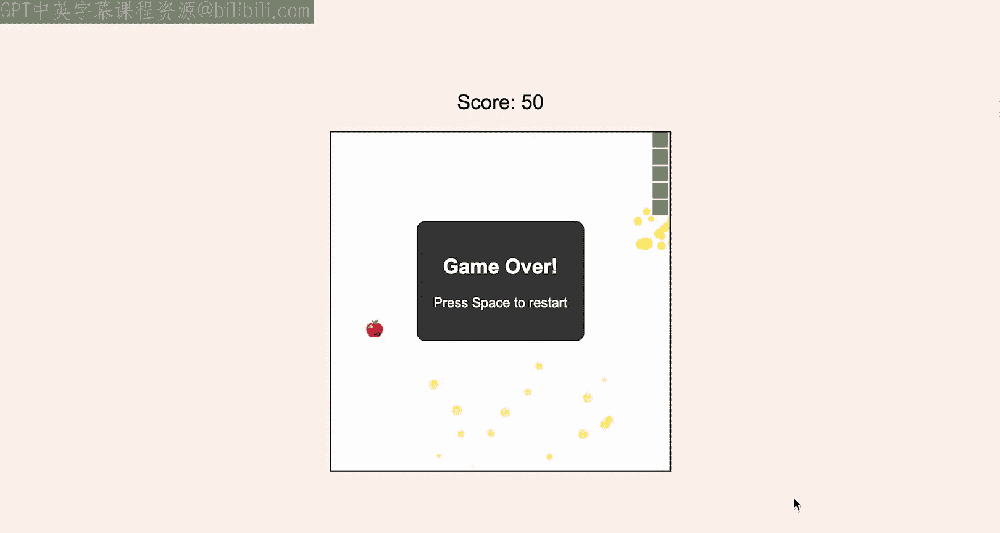

**指令如下：**
```
make the apple also move, make the apple into a moving target that moves slower than the snake
```

Cascade 实现了这个改动。


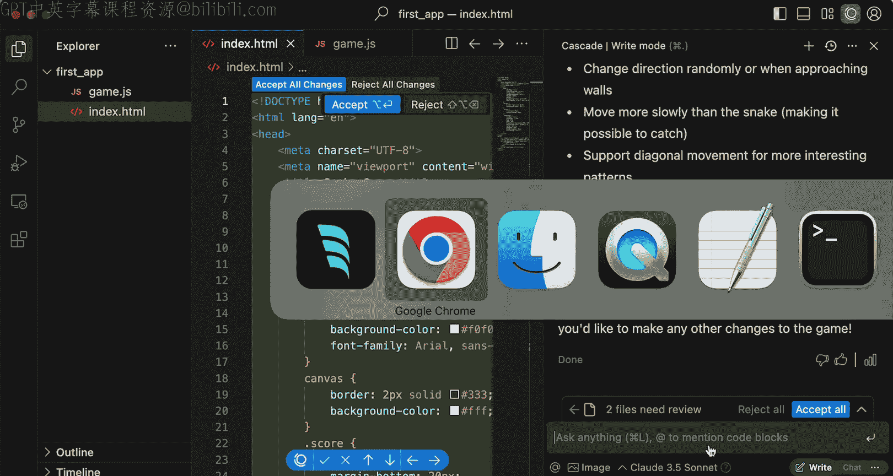

现在刷新游戏，可以看到苹果开始缓慢移动，虽然比蛇慢，但仍然可以捕捉到。


---

## 总结

本节课，我们一起学习了如何快速入门 Windsurf。我们完成了软件的下载、安装与设置，并重点认识了其核心的 AI 协作代理 **Cascade**。

通过指令 `create a snake game in JavaScript and HTML`，我们见证了 Cascade 如何自动生成代码文件并构建出一个可运行的基础应用。随后，我们通过一系列自然语言指令（如修改背景色、替换食物图标、添加爆炸效果、让食物移动）与 Cascade 互动，快速地对应用进行了迭代和功能增强，最终创建出了一个个性化的贪吃蛇游戏。

这个过程展示了 AI 辅助编程的核心优势：将你的创意快速转化为现实。虽然 AI 的输出具有一定的不确定性，你可能需要对其结果进行微调，但这极大地扩展了你的创造边界。

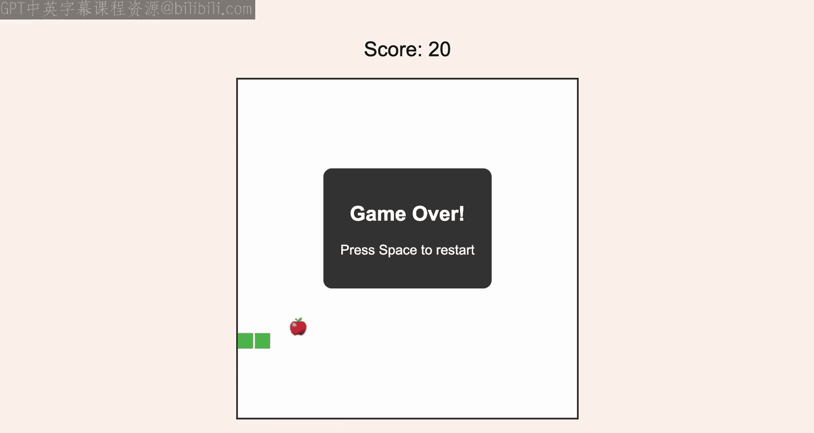

现在，你应该去尝试构建属于自己的应用程序，尽情探索你的创意。


