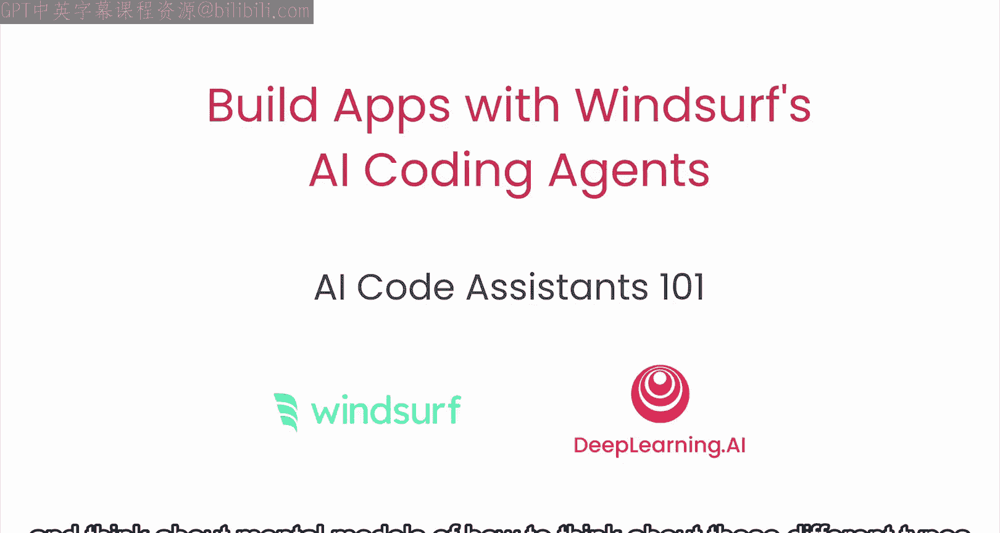
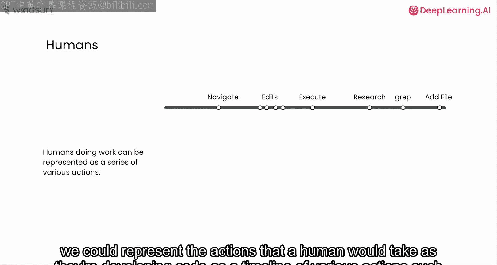
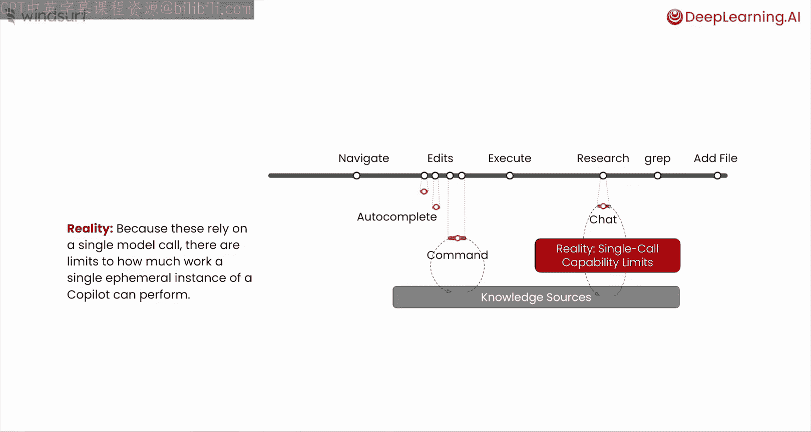
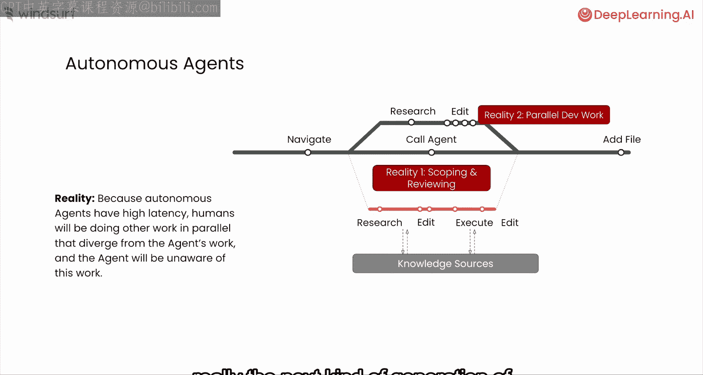
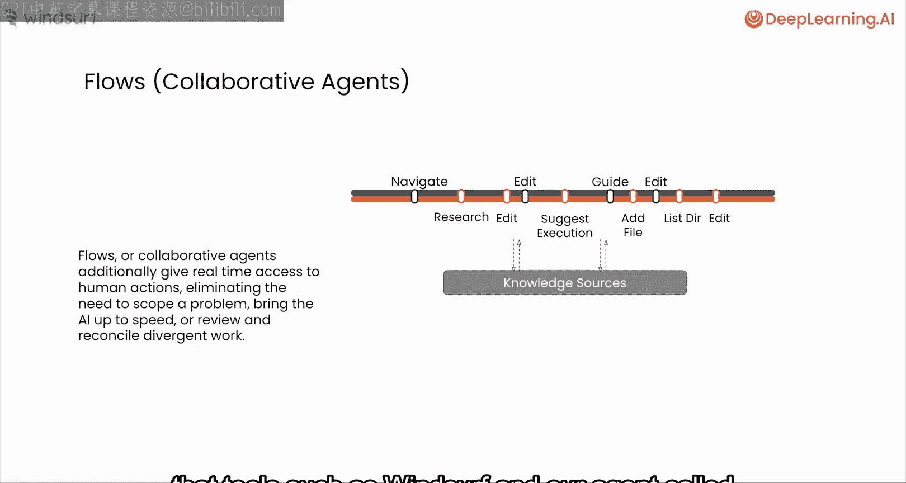
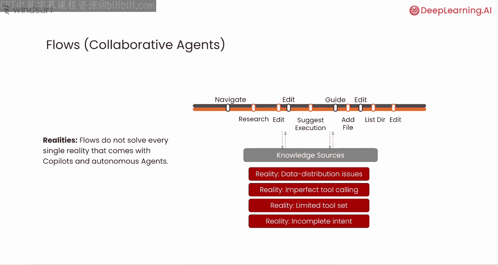
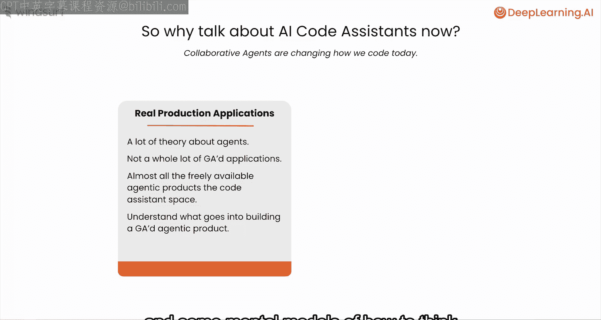
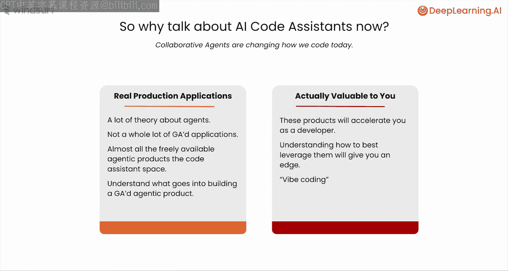

# 003：AI代码助手101 🧠

在本节课中，我们将回顾AI编程工具的发展历程，区分炒作与现实，并建立理解不同类型代码助手的心智模型。我们将从纯人工编程时代开始，逐步探讨Copilot式助手、自主代理以及协作代理（或称“工作流”）的演变，最后讨论当前AI代码助手的现实能力与局限性。

## 从纯人工编程到Copilot式助手

上一节我们使用AI协作代理构建了第一个应用。现在，让我们回溯历史，看看这些工具是如何发展而来的。

在AI出现之前，完全是人类开发者的时代。我们可以将人类开发者编写代码时的行为表示为一系列动作的时间线，例如：
*   在代码库中导航
*   进行编辑
*   进行研究

当ChatGPT以及GitHub Copilot、Codium、Cursor等工具出现后，我们开始进入所谓的 **Copilot式助手时代**。在这个时代，人类无需独立完成每一个小任务（例如进行一次编辑或做一些研究），而是可以通过获取自动补全建议或向聊天式体验提问来替代。这显然增加了价值，并推动了行业向前发展。

随着时间的推移，这些工具变得**越来越好**。一个关键的改进是**能够访问私有知识源**。在代码领域，这可能是一个私有的代码库。大型语言模型本身并未在这些私有代码库上训练，但通过检索方法授予访问权限后，AI助手可以为开发者提供更具体、更准确的答案、响应和建议。这使得情况变得**更好**。**知识与工具的融合**提升了效果。

思考这些Copilot式工具的最佳方式，是将其视为一个**刚开始学习编程的人**。你无法要求它完成一个非常长期运行的任务，因为它只能进行一次LLM调用。但通过不断审查它的输出，你肯定能获得价值并**加速**自己的开发进程。

然而，**单次LLM调用**是这些Copilot式工具的限制，这也制约了Copilot式系统整体能完成的工作量。正因如此，我们开始大量讨论“代理”。

## 从自主代理到协作代理

上一节我们介绍了Copilot式助手的局限性。本节中，我们来看看旨在突破这些限制的“代理”。

最初被讨论的代理迭代是**自主代理**的概念。Cognition公司的Devin等工具就属于这种模式。其理念相对简单：不是每次LLM调用都需要开发者审查，而是让AI系统能够**链式调用多次LLM**，并集成访问能够**改变状态**或为AI系统提供**新输入和信息**的工具。理论上，这将使AI系统能够完成更大、更复杂的任务。

它们仍然像Copilot式系统一样，可以访问知识源。思考这些自主代理的最佳方式，是将其视为一名**实习生或初级工程师**。你仍然需要为他们非常清晰地界定任务范围，并且在它们完成工作后，你必须实际**审查**它所完成的所有工作。这是现实的一部分，也是理解自主代理概念的一种方式。

另一个现实是，许多这类自主代理系统，特别是在软件工程领域，确实**需要花费大量时间**。任何与实习生或初级开发者合作过的人都知道，在你作为开发者和AI代理之间，可能会存在一些并行开发工作。

因此，在自主代理的概念之后，真正下一代工具是**协作代理**的概念，我在本讲座及其他地方可能将其称为“工作流”。工作流的基本理念是，不将AI视为你委派工作的实习生或初级工程师，而是更多地将其视为一个**结对编程伙伴**。将其视为结对编程伙伴的好处在于，你不必完美地界定工作范围并审查代理的大量工作成果，而是一种**来回的、思维同步式的体验**。人类在IDE中采取的任何行动都可以被代理推理，而代理所做的任何工作也可以被人类推理。

当然，它们仍然可以访问知识源。但是，**知识源、工具以及对彼此行为的理解**这三者的结合，创造了一种新的体验。Windsurf以及我们名为Cascade的代理等工具，正是在这种范式上构建的。

## 现实考量：能力与局限

尽管关于AI系统和AI代理在软件工程方面的能力可能存在很多炒作，但现实是，这些工作流与之前出现的任何其他代理式或非代理式系统有着**相同类型的问题和缺点**。

以下是当前AI代码助手的核心局限：
1.  **底层依赖大型语言模型**：这些模型存在数据分布问题。并非每种语言或框架在模型训练所依赖的公共数据集中都得到同等程度的体现。
2.  **工具调用可能不完美**：代理调用外部工具时可能出现错误或理解偏差。
3.  **工具集有限**：可用的工具集可能无法完全匹配我们人类或开发者所能做的所有不同事情。
4.  **存在“不完整的意图”**：代理永远无法完全知晓你在茶水间与同事的对话内容，因此你不能指望代理知道**所有事情**。因此，引导它达到你所能达到的水平，并不能无限提高其性能。

## 为何要学习AI代码助手？

这一切引出了一个问题：今天我们为什么要讨论AI代码助手？原因主要有两方面。

第一，**这些工具现已可用**。关于代理系统有很多理论，但并没有太多个人可以在自己时间自由使用的实际应用。因此，我们可以利用这段时间来真正理解构建一个普遍可访问的代理产品需要什么，以及理解这些产品底层运作的一些心智模型。

当然，另一半原因是，**这是软件工程师的工具**。你作为开发者，可以了解如何最好地利用它们，这将为你的开发工作带来优势。

---

本节课中，我们一起学习了AI代码助手的发展脉络。我们从纯人工编程出发，经历了Copilot式助手的辅助，探讨了旨在独立完成更大任务的自主代理，最终认识了强调人机实时协作的“工作流”或协作代理。同时，我们也清醒地认识到当前技术仍受限于数据、工具和不完整意图等现实因素。理解这些演变和现状，将帮助你更有效地将AI助手融入开发流程，提升工作效率。