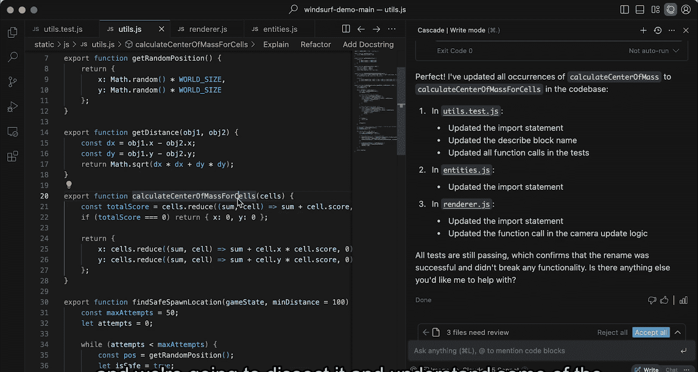

# 004：自动修复测试

在本节课中，我们将学习如何使用 AI 代理（Cascade）来分析和修复 JavaScript 代码中的问题。通过这个过程，你将更详细地了解代理的工作原理。

## 概述

在本节中，我们将在一个使用 Jest 等框架进行测试的 JavaScript 代码库上执行任务。即使你不熟悉 JavaScript 或这些框架也没关系，本次演示的重点在于展示你能够借助代理，在不熟悉的代码库上进行迭代开发。我们将看到 Cascade 如何理解代码库、运行测试、分析问题并自动修复。

## 开始调试与修复

首先，我要求 Cascade 修复或运行代码库中的所有测试。以下是 Cascade 执行过程中的几个关键步骤。

Cascade 首先会浏览整个代码库，理解如何运行这些测试。它利用对现有代码的认知进行分析，并拥有建议终端命令等工具。因此，它可以建议我运行测试的命令，然后分析测试结果。

当测试失败时，Cascade 能够分析堆栈跟踪并询问是否要调查该问题。我可以像在任何聊天体验中一样与它对话。在这个案例中，它是一个能够独立执行多步骤操作的代理。

我回答“是”。随后，Cascade 将像人类一样，使用多种工具执行多个步骤。它会利用上下文感知能力，分析测试代码以及影响测试的源代码，推理问题可能出在哪里，然后使用工具实际编辑文件。

在这个例子中，它发现问题是测试用例本身有误，于是进行了相应的编辑。之后，它再次建议我运行测试的命令。现在，所有测试都通过了。

大约一分钟内，在一个我们并不十分了解的代码库中，代理帮助我们解决了测试中的错误。我接受了这些更改。

## 智能感知与全局更新

接下来，我想展示 Cascade 在 Windsurf 中的另一个能力。我转到定义文件，将函数名改为更具描述性的名称。然后我回到 Cascade，只需说“继续，更新所有调用点”。

请注意，我并没有指定我做了哪些更改，但因为 Cascade 能够感知我在编辑器其他部分的操作，它能注意到我刚才所做的更改，并相应地采取行动。

Cascade 会查找所有文件，更新所有调用点。这涉及到跨多个文件的多次编辑，这是许多仅依赖单次大语言模型调用的 AI 代码助手无法做到的。

完成所有编辑后，Cascade 可以建议我们重新运行测试，以验证测试仍然通过，并且所有调用点都已相应更新。

## 总结

本次演示虽然简短，但突出了使 Cascade 异常强大的几个核心要素：对现有代码库的理解、用于调查和验证工作的多种工具，以及它能清晰理解开发者与文本编辑器交互时的意图。

下一节，我们将以此为例，剖析并理解此类智能代理系统工作的一些思维模型。

