# 005：协作式 AI 代码代理的工作原理 🧠

在本节课中，我们将深入探讨协作式 AI 代码代理（如 Cascade）的核心工作原理。我们将学习几个心智模型，用以剖析和理解代理在底层是如何运作的，重点关注其核心组件，而非用户界面等表面特性。

## 经典代理循环 🔄

上一节我们深入观察了代理的实际运作。本节中，我们来看看理解其基础的一个经典模型：**代理循环**。

许多人都可能见过这个经典代理循环的某种形式。本质上，代理系统会从开发者那里获得一些输入提示。它会访问一个充当“大脑”的大型语言模型，该模型负责处理输入提示并进行推理：“在我作为代理所拥有的所有不同工具中，我应该使用哪个工具？”这可能是像 GrP 或嵌入搜索这样的搜索工具，可能是编辑文件的工具，也可能是建议终端命令的工具。在演示中你看到了所有这些工具。在工具执行某些操作之后，大型语言模型会再次推理：“好的，根据输入和刚刚调用的工具，我的下一个动作应该是什么？是应该调用另一个工具吗？”如果是，它将持续这个循环，直到最终那个充当大脑的大型语言模型决定：“好了，我们完成工具调用了，是时候进入结束状态，结束我的动作并返回给用户了。”

这就是经典的代理循环，其中大型语言模型被用作工具调用的推理代理。

由此可以清晰地看出，代理系统存在两个重要组件：
1.  **工具**：可以采取的所有动作是什么？每个步骤中这些工具的能力有多强？
2.  **推理模型**：目前，在决定调用什么工具以及如何调用（给定大型语言模型拥有的所有相关信息）方面，最先进的技术通常是来自 OpenAI 和 Anthropic 等模型提供商的通用基础模型。

## 超越循环：上下文感知与人类行为追踪 📍

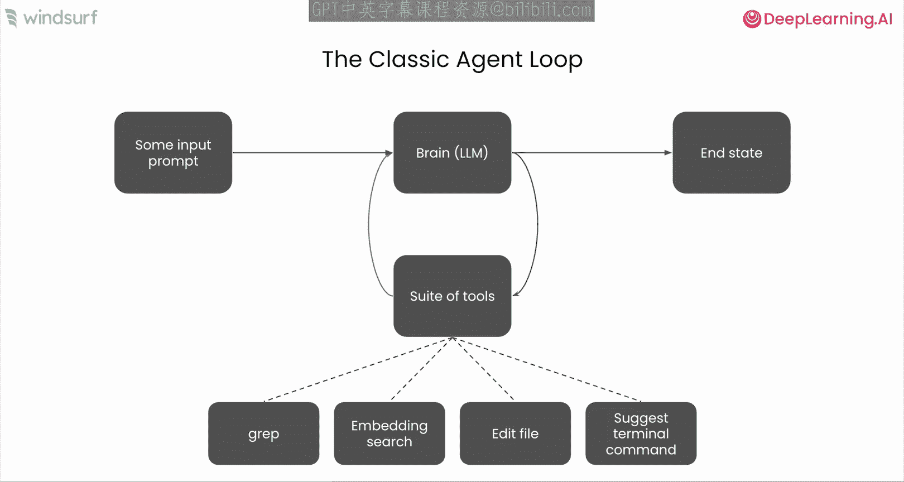

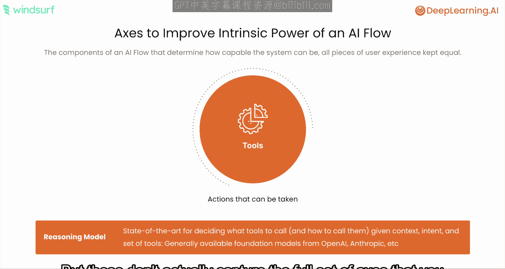

然而，这些并没有完全涵盖可以用来改进代理体验（如 Cascade）的所有维度。我想提到的第一个概念是**上下文感知**。我们之前稍微提到过这一点，当时谈到改进知识访问如何能提升和夯实 AI 系统的结果。但关于上下文感知这个问题，有几种不同的思考方式。

以下是思考上下文感知问题的几个方面：

*   **来源**：手头任务的所有相关知识来源是什么？对于编写新代码这样的任务，这当然包括私有代码库中的现有代码，但也可能包括文档、工单或 Stack Overflow 等内容。这些都是可以帮助代理在其决策过程中立足的各种信息来源。
*   **解析**：能够访问数据固然很好，但你实际上是如何对这些数据进行推理的？这些知识中是否存在可以实际提高从大量信息中检索相关信息能力的结构或隐含信息？我们将在接下来的几张幻灯片中更详细地讨论这一点。
*   **访问权限**：这一点更多是关于确保上下文感知的安全性，尤其是在考虑可能对某些知识有访问控制的大型组织时。AI 不应提供特定用户原本无法访问的知识。

代理系统中未被经典代理循环完全捕捉的另一个组件是**人类行为追踪**的概念。

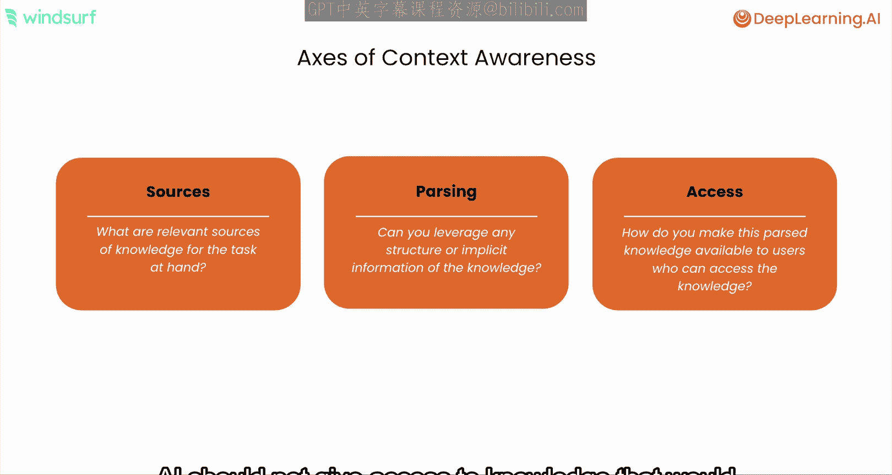

理解开发者正在采取的隐含行动，使得代理系统能够理解需要做什么。这真正实现了那种协作式代理体验或流畅的体验。如果说上下文感知是拉取所有相关的显性知识，那么追踪开发者是否打开了一个文件、在 IDE 中执行了某些导航操作，或是在文件中进行了编辑——我们从这些已采取的行动中获得的所有这些隐性信息——也可以作为 LLM 的输入，用于推理下一步需要调用什么工具，或者我们是否已完成工具调用。

## 组合的价值：以自动补全为例 ✨

我们可以通过观察其他 AI 模式（不仅仅是代理系统）来了解上下文感知和人类行为追踪组合的价值。

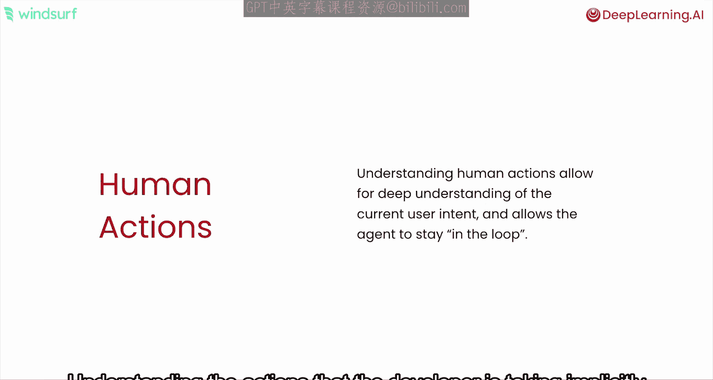

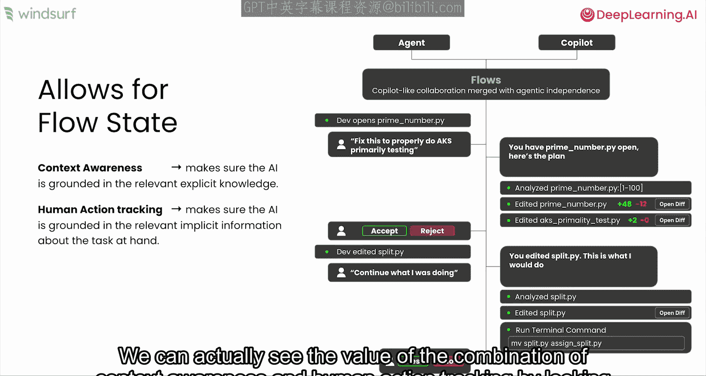

例如，我们可以看看经典的**自动补全**功能，即 AI 在光标位置建议几行代码以完成输入，这样开发者就不必从头开始键入。这在编写样板代码时很有帮助。

下图显示了一系列不同的实验，我们改变了模型可访问的上下文感知和人类行为追踪的水平。在所有示例中，模型完全相同，我们改变的只是提供给它的输入类型。

我们将自动补全的基线性能定义为：仅使用当前打开的文件作为 LLM 的上下文来生成自动补全建议。如果你开始纳入**意图**（这可能包括 IDE 中打开的其他文件和标签），自动补全结果的质量实际上提高了 **11%**。这清楚地表明，通过纳入意图和人类行为追踪，即使使用相同的模型，也能产生更好的结果。

如果我们尝试另一个实验，例如，天真地对整个代码库进行分块嵌入，然后在整个仓库中进行简单的基于嵌入的检索，这也比基线好。但需要注意的一点是（这可能有点反直觉），它的表现实际上比仅使用打开文件和标签的意图要差。这实际上非常重要地指出了上下文感知系统的**解析能力**。因为如果你将解析方式从简单的分块和仅基于嵌入的检索，改为使用抽象语法树解析、自定义代码解析器、更智能的分块和更高级的检索（我们不仅看基于嵌入的检索，还看启发式方法和代码库的其他结构，如导入或附近文件）的系统，你实际上可以大幅提高系统相对于基线的性能。

因此，这真正强调了对于代理系统而言，不仅工具和模型很重要，**上下文感知和理解开发者意图**也同样至关重要。

## 代理系统的三大工具类别 🛠️

当然，稍微讨论一下工具也很重要，因为工具是代理在推理步骤之间可以采取的行动。如果你有更高质量的工具，你将能够采取更高质量的行动，从而更快地获得更好的结果。

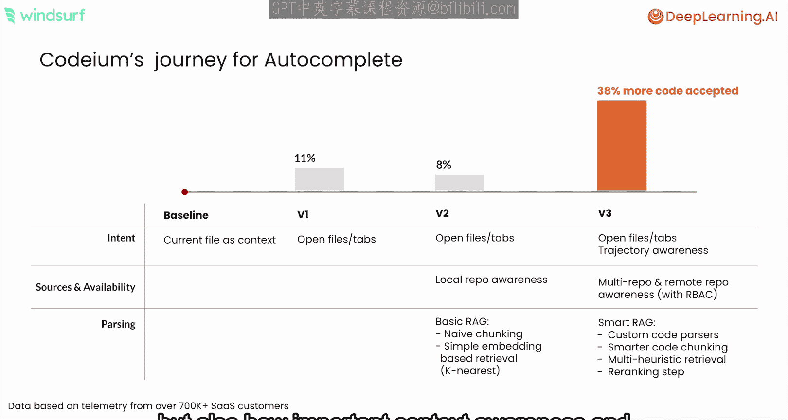

工具主要有三大类别，这是剖析代理系统构成的另一个模型。

以下是构成代理系统的三类主要工具：

1.  **搜索与发现工具**：首先，你基本上需要获取所有相关信息才能进行更改。
2.  **状态更改工具**：允许我们改变世界状态的工具。
3.  **验证工具**：用于检查对状态的任何更改是否确实改善了整个系统，并使我们更接近手头的任务。

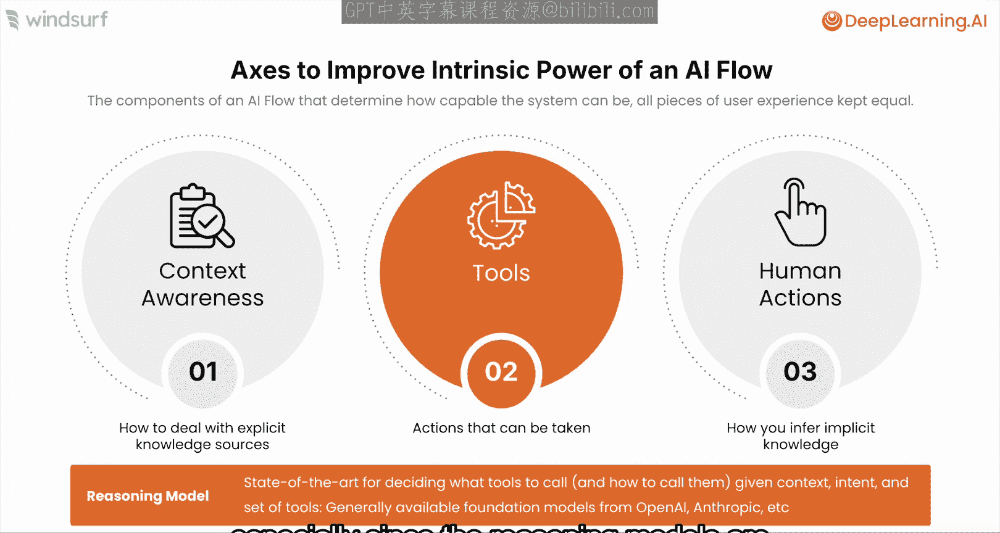

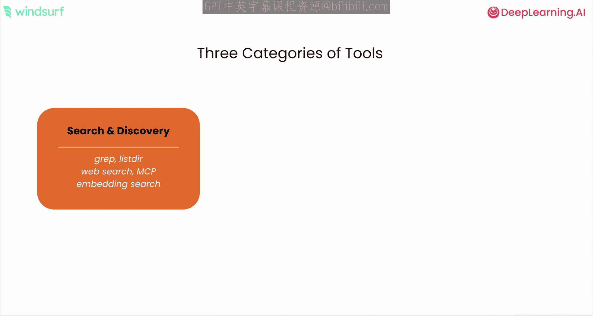

仔细想想，这其实也是人类工作的方式：当我们开始一项任务时，我们会在代码库、网上或其他地方寻找所有相关信息，然后进行一些更改，接着我们会编译代码、运行代码并查看结果，看看是否完全符合我们的预期。如果不符合，我们就重新开始这个过程。因此，我们可以用非常类似的方式，在这些类别中思考代理的工具。

## 整体协作体验 🤝

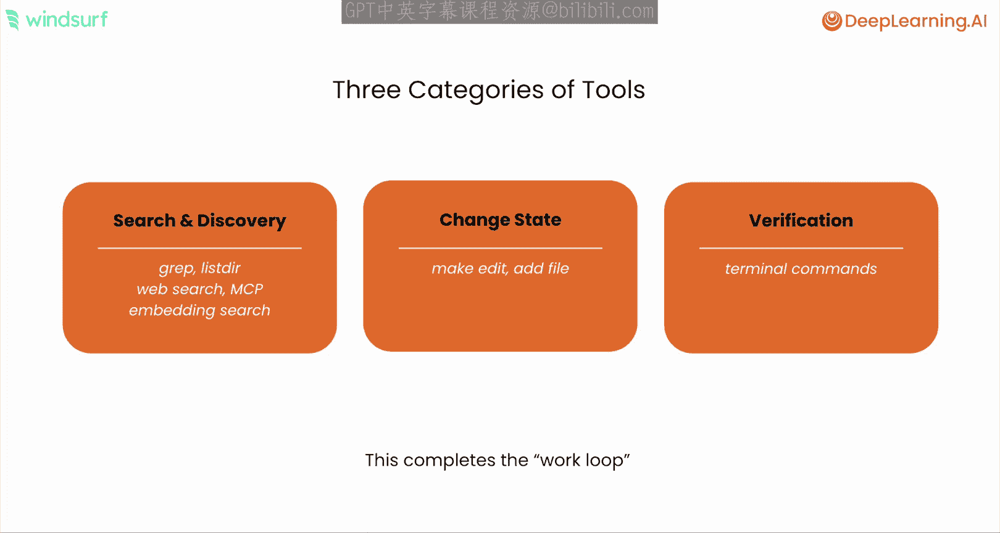

那么，再次将所有部分整合起来，真正让这种协作式代理体验感觉非常自然的，正是这种组合。

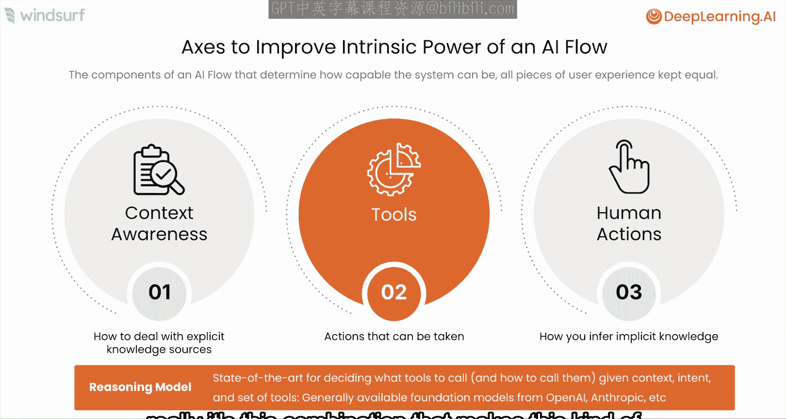

例如，假设你想进行一项修改。你修改了一个类，现在你想在同一个目录中的其他类上做同样的修改。这是一个相对样板化的任务。但如果有一个结对程序员或一个人工程序员在我旁边，一直观察我的工作，我就可以直接告诉他们：“嘿，在这个目录的类似位置做同样的事情。”再次将协作代理视为结对程序员，你可以看到这些不同的组件如何帮助实现这一点。

首先，代理一直在观察开发者行为的理念，将使其能够理解“同样的事情”指的是我刚刚所做的最近一次编辑。**对工具的访问**将允许代理在此目录中找到相关文件，然后使用类似编辑的功能进行更改。而**上下文感知**将允许代理推理其他类是否实际上处于与我刚刚修改的类相似的位置。

因此，需要所有这三个组件共同作用，才能创造出这种与代理协作的体验，类似于与一个人类结对程序员一起工作。

## 总结 📝

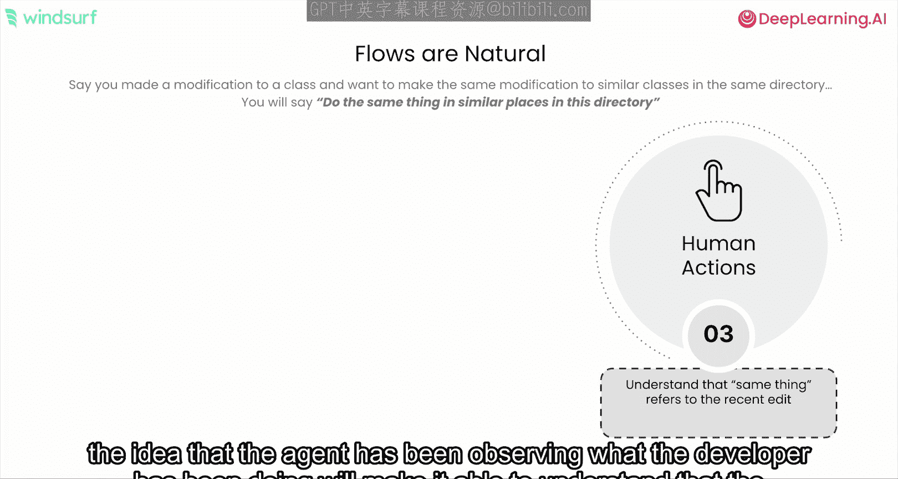

本节课中，我们一起学习了协作式 AI 代码代理的核心工作原理。

*   **上下文感知**引入了显性知识。
*   **人类行为追踪**引入了隐性意图。
*   **工具**随后采取行动，结合这些显性知识和隐性意图，并在搜索与发现、状态更改和验证过程中执行。
*   最终，**大型语言模型**用于整合所有这些，以选择在适当的时间进行正确的工具调用，但这在当今不同的代理系统中是通用的。

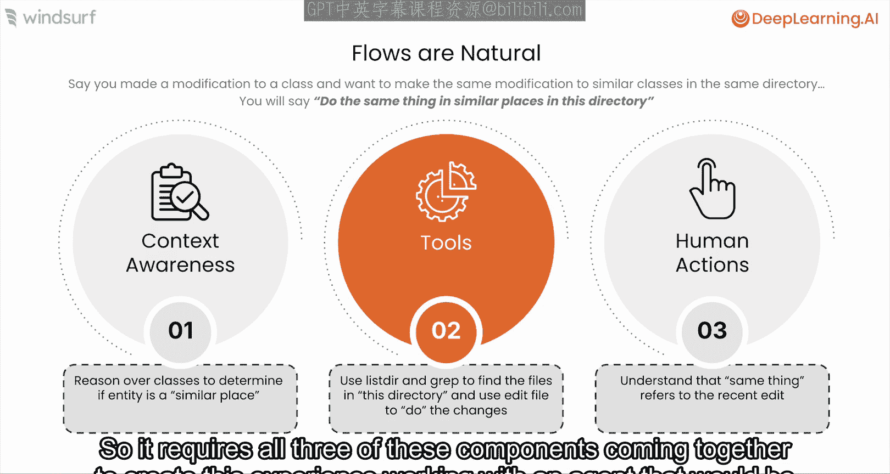

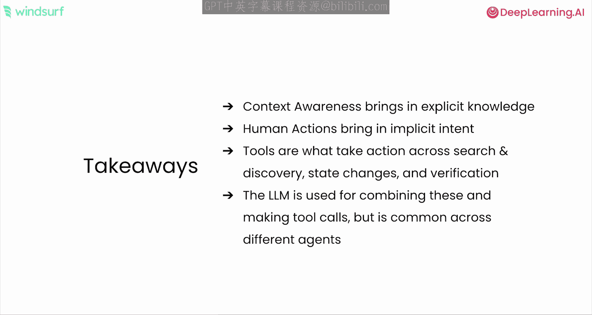

理解这些核心组件——而不仅仅是表面的用户交互——有助于我们更好地设计、评估和利用 AI 编程代理，让它们成为我们开发过程中真正高效、自然的合作伙伴。