# 006：AI 代理的搜索与发现 🔍

在本节课中，我们将对 AI 代理的搜索与发现问题进行一次深入的探讨。这个问题实际上需要新的范式、对现有基准的质疑以及新颖的方法，以最大化代理的最终影响力。

## 为什么代码的搜索与发现是一个有趣的问题？

上一节我们介绍了课程主题，本节中我们来看看为什么代码的搜索与发现本身就是一个值得研究的难题。

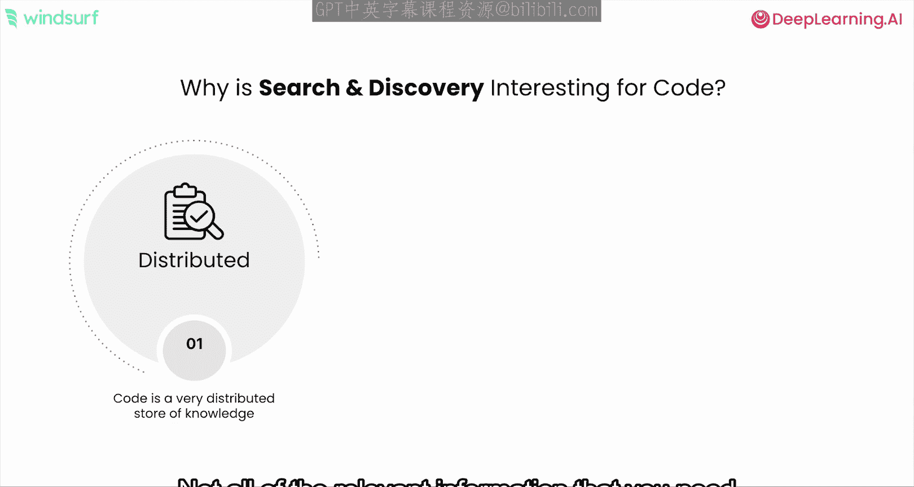

代码因其框架、库和抽象而变得非常分散。你需要的相关信息并不全在你正在编辑的那个文件里。信息通常是不完整的，编写新代码不仅需要现有代码，还需要文档、工单，甚至需要搜索网络。同时，代码也是不精确的，众所周知，实现同一功能有多种方法。因此，如果你想在你的特定代码库中以正确的方式构建某些东西，一个千篇一律的方法和响应可能行不通。

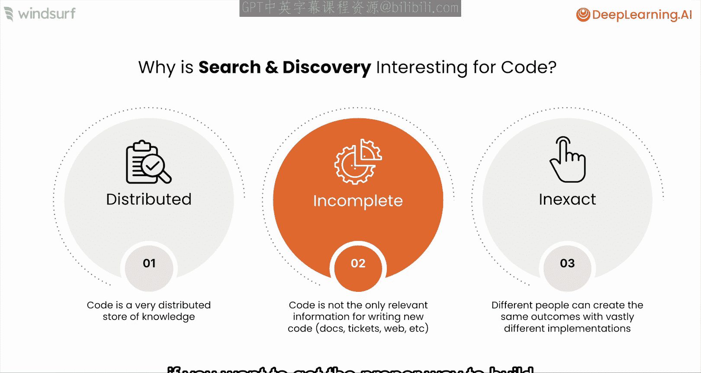

搜索与发现问题的真正核心在于：如果我们只检索到不正确或无价值的信息，那么我们的 AI 代理系统也只能得到不正确和无价值的结果。

## 当前的技术现状：检索增强生成

在深入探讨新方法之前，我们先了解一下当前的技术现状。

当前最先进的技术是检索增强生成。在一个非常基础的层面上，我们从用户的问题或提示开始，一个检索器会检索出必要的相关上下文，连同问题和任务一起传递给大语言模型，以获得响应。这是我们在抽象层面上对检索的一般理解。

但是，如果我们仔细思考，这主要是为类似 Copilot 的辅助系统设计的，我们只对大语言模型进行一次调用。而代理方法从根本上改变了这一点，因为我们不必在单次检索上做大量迭代来使其更复杂、更精确。多步骤的代理式检索方法意味着我们实际上可以进行多次检索尝试。

这与人类的行为非常相似。如果我们出去搜索可能相关的信息，但发现它看起来并不相关，我们会进行另一次搜索，并持续进行，直到在采取任何行动之前收集到所有相关信息。这就是我们在思考任何面向搜索与发现问题的代理生成方法时应该采取的方式。

因此，也许检索器不必超级完美，但我们需要能够对其进行迭代。同样重要的是，并非所有检索器都必须相同。我们可以为整个搜索与发现问题中可能需要执行的不同类型的任务配备不同的检索器。

## 搜索与发现任务的类型与工具

以下是我们在搜索与发现过程中可能需要的一些任务和工具类型。

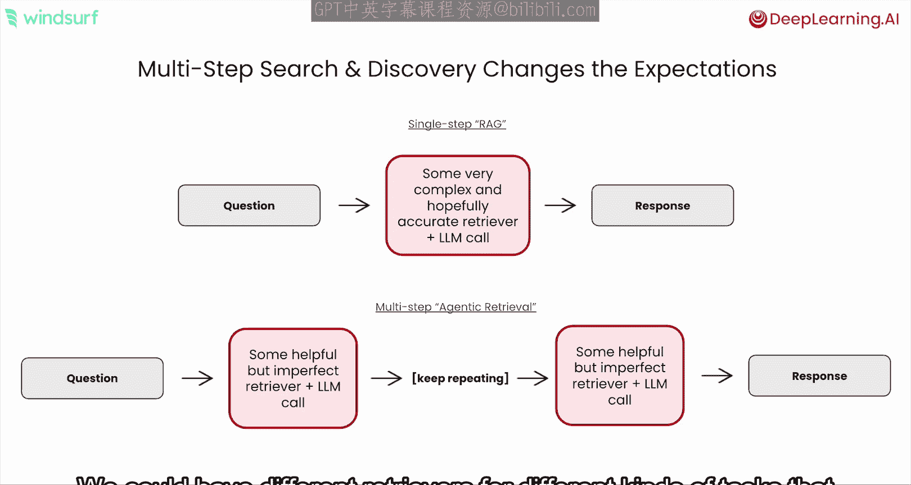

*   **第一类**：我们知道需要从语料库中获取什么，并且有明确的检索规则，例如 `grep`。
*   **第二类**：我们大致知道需要获取什么，但不知道如何获取。例如，我知道外面有一个联系表单对象的示例，我需要进行网络搜索来找到它。
*   **第三类**：通常比较模糊，我只想获取完成任务所需的所有相关信息。我并不确切知道具体是什么，但我知道我的总体目标，比如在当前情况下是构建一个新的联系表单对象。

本课程中，我们将重点讨论我们如何创新并为第三类任务添加了一些新型工具。

## 深入理解第三类任务：获取所有相关信息

为了更好地理解第三类任务，让我们设想一个场景：我想构建一个新对象，只需要所有相关信息。这其实很巧妙。以尝试为我的特定代码库构建联系表单为例，我可能需要从内部工具库中提取信息，查看外部包和文档，参考代码库内外的其他示例，以及风格指南。显然，我需要综合许多不同的信息片段，才能为我的特定代码库获得真正高质量的响应。

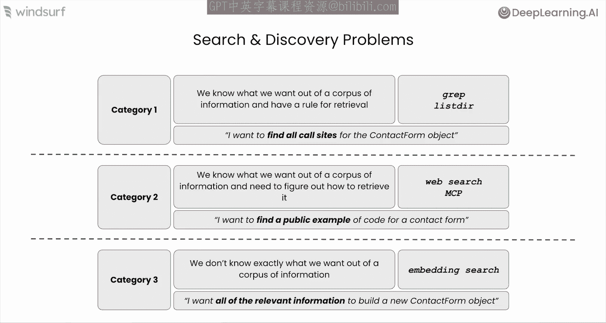

考虑到这一点，我们来谈谈当前的技术现状。

## 当前技术现状：嵌入搜索

当前解决这类问题最先进的方法是嵌入搜索。其工作原理的快速解释是：你有一个嵌入模型，能够将对象（可以是一段代码片段）转换为一串数字，即一个嵌入向量。你可以对代码库中所有现有的代码片段都进行此操作。

在检索时，你只需获取当前的工作内容（即你正在处理的代码上下文），使用相同的嵌入模型将其转换为自己的嵌入向量，然后比较生成的嵌入向量与所有现有嵌入向量，看看在这个 N 维嵌入空间中哪些向量是相近的。

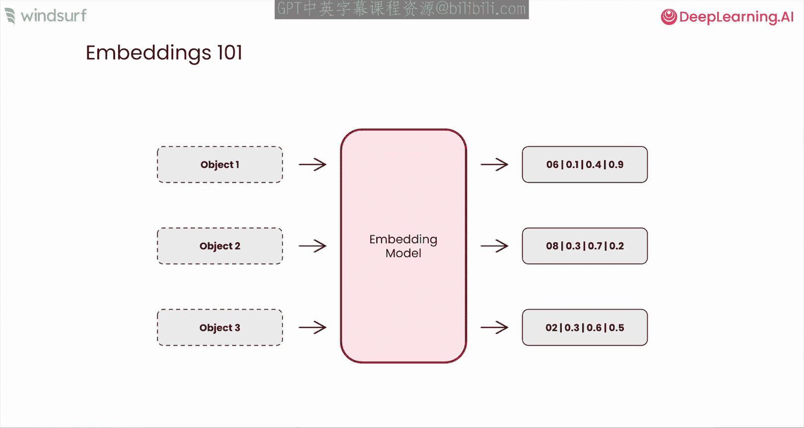

嵌入模型背后的基本思想是，将看起来相似的文本片段转换为在嵌入空间中也彼此接近的向量序列。因此，如果操作正确，当你进行检索时，你拉入的代码片段至少与你当前的工作相似，理想情况下是相关的。

这就是基本方法。但当然，这种基于嵌入的方法并不完美，因为我们操作的是嵌入向量而非原始文本，我们丢失了原始文本片段的许多细微差别。因此，尽管我们尝试了越来越大的嵌入模型和各种方法，但嵌入检索的效果似乎存在某种瓶颈。

## 创新与独特方法：质疑基准并构建新工具

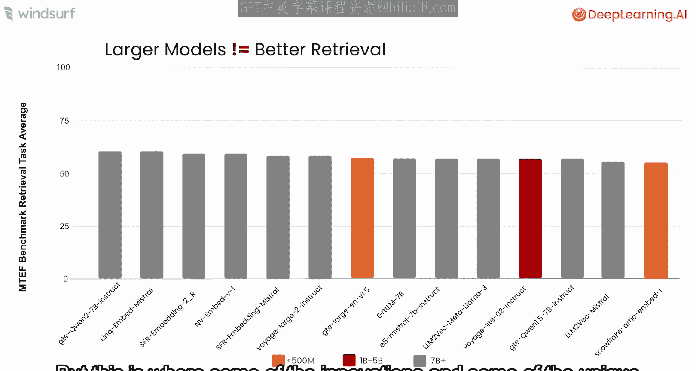

正是在这里，Windsurf 和 Cascade 内部针对此问题的一些创新和独特方法开始显现，因为我们问自己的第一个问题是：这里的基准测试结果真的有用吗？现实情况是，许多用于检索的基准测试对于代码问题来说并不完美。

这些基准测试的工作方式是：有一个信息语料库，它就像一个“大海捞针”问题——我是否从整个语料库中检索到了一个非常特定的信息片段。但在现实中，正如我们讨论的，为了构建联系表单对象，我们实际上需要综合许多信息片段才能得到正确的响应。

因此，“大海捞针”的方法并不是我们特别感兴趣的基准。我们更感兴趣的是这样一种想法：如果我检索 50 个对象，在这 50 个对象中，有多少个真正相关的“真实”对象会出现？如果我对它们的召回率很高，那么至少我拥有了完成特定任务所需的、存在于更大语料库中的所有相关信息。

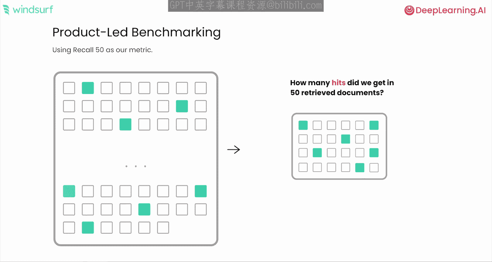

当然，像这样的基准，我们需要自己构建。我们是如何构建的呢？我们查看了 GitHub 公共代码库的语料库，意识到每次提交信息都对应着跨多个文件的一系列更改。这实际上在查询（可以从提交信息推导出来）和我们可能需要检索的所有“真实”相关代码片段（即该次提交中存在的所有更改）之间建立了匹配。

因此，通过从代码库中提取这些信息，我们可以查询提交信息，并提出问题：我们的检索方法是否找到了所有被修改的文件？如果我想提前进行那次提交或查询，这些文件就是所有相关的信息片段。

如果我们观察基于嵌入的方法在这类基准测试上的结果，我们会注意到，实际上没有任何方法能达到超过 50% 的召回率。这意味着基于嵌入的方法有很高的误报率，尤其是在越来越大的代码库上，甚至在一开始就只检索到了一半进行更改所必需的信息。

因此，我们显然希望构建一个比这更好的工具。我们的方法是什么？

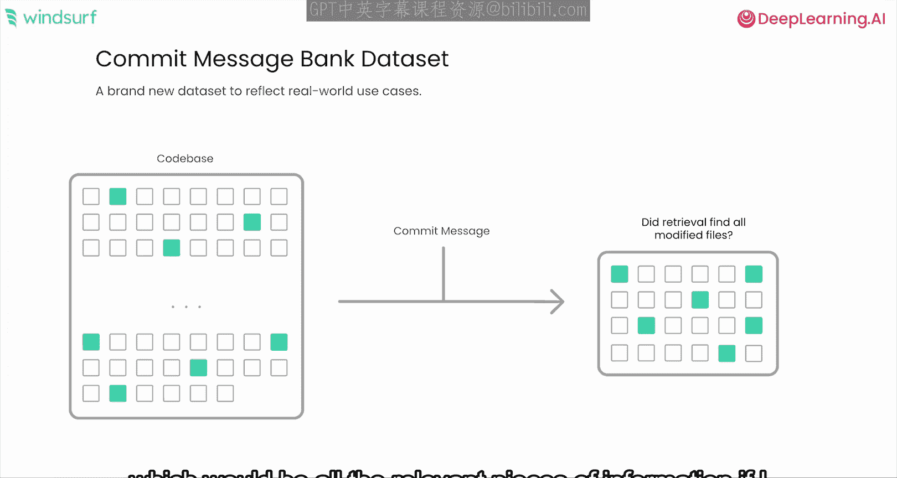

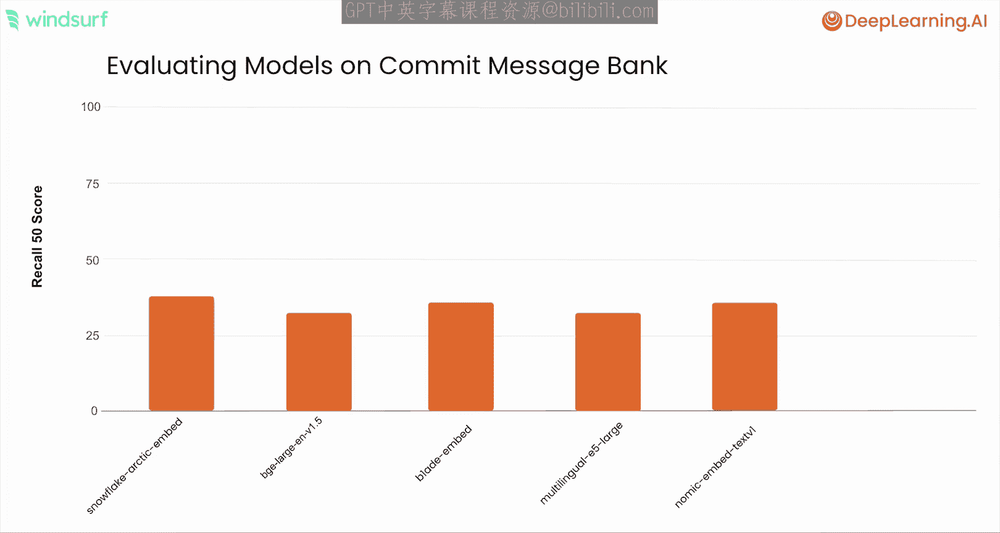

## 我们的方法：Ripide 与基于 LLM 的语义搜索

我们使用了更多的计算资源。我们针对这个问题的解决方案称为 **Ripide**。其基本思想是摆脱嵌入，因为一旦我们进入嵌入空间，就会失去那些细微差别。相反，我们获取查询，对代码库中的每一个代码片段，应用一个大语言模型来提问：这个代码片段与我手头的特定查询有多相关？

我们并行运行所有这些查询，然后利用每个片段相关性的响应，对代码库中的所有代码片段进行重新排序。正如你所意识到的，这种级别的重新排序从未应用于嵌入空间。所有这些都是通过一个基于 LLM 的语义搜索式检索器完成的。毫不奇怪，它在我们的“召回率@50”基准测试上优于基于嵌入的方法。

再次强调，这只是多步骤检索过程中的一个工具。它仍然不完美。但是，通过构建一个在检索质量上显著更高的工具，并将其与多步骤检索范式相结合，我们现在拥有了一种方法，可以让我们的代理系统能够在大型代码库上运行。

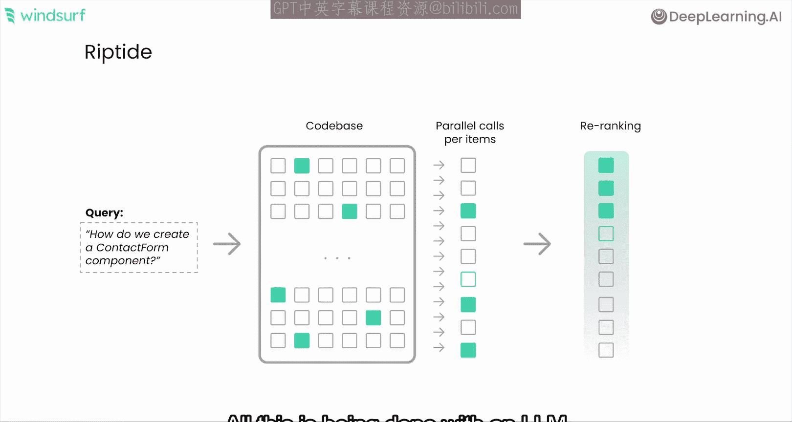

## 总结与要点

本节课中我们一起学习了 AI 代理在代码领域的搜索与发现问题。以下是一些关键的收获：

*   既然我们讨论的是代理，请务必考虑多步骤检索，而不是单步骤检索。
*   考虑所有不同种类的潜在工具，因为你不需要单一的检索方法，可以拥有多种检索方法。
*   质疑基准和约束条件，以开发新的检索方法，从而改进你的代理系统。

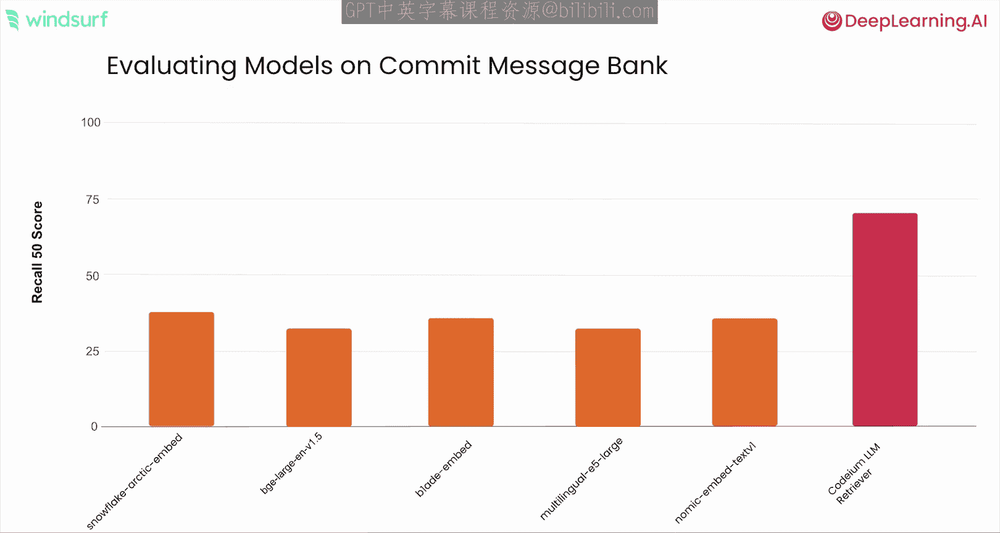

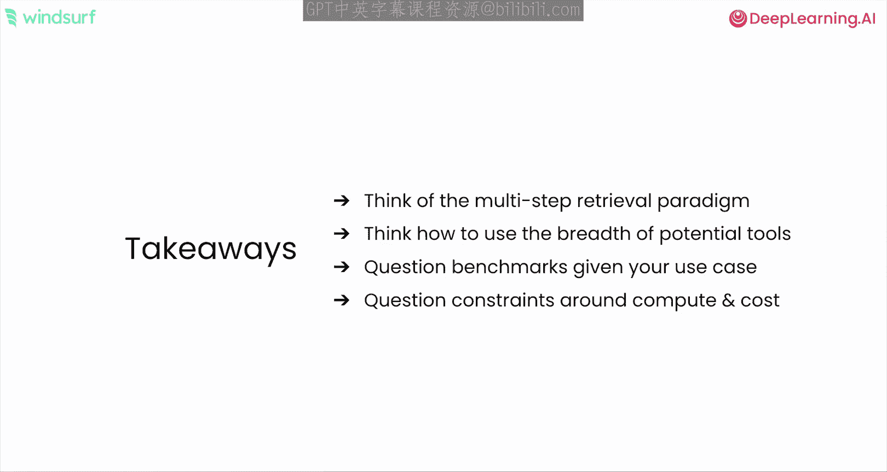

现在我们已经深入探讨了搜索与发现，特别是针对 Cascade、代码和代理的工作原理，接下来让我们将其应用到一个大型代码库上，执行几个不同的任务。