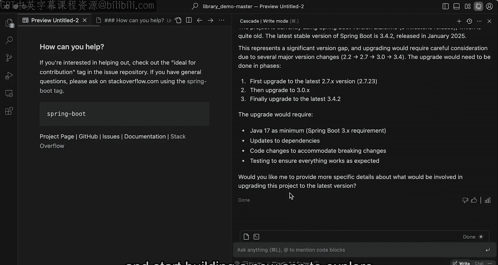

# 007：理解大型代码库 🏗️

在本节课中，你将应用并见证这些搜索与发现方法的力量，我们将使用 AI 代理在一个大型生产代码库上完成几个不同的任务。

## 概述

我们将深入一个包含大量 Java 代码的仓库，演示 Cascade 如何利用其强大的搜索与发现工具，帮助开发者快速理解复杂的代码库并执行特定任务。本节将展示多步骤检索、代码分析和网络搜索等工具的实际应用。

## 探索大型 Java 代码库

上一节我们介绍了搜索与发现工具的基本概念，本节中我们来看看它们如何应用于一个真实的大型项目。这是一个包含约 10 万行 Java 代码的仓库，使用了多种框架和包，例如 **Groovy** 和 **Spring Boot**。

假设我是一名新加入该项目的开发者。通常，熟悉这样的代码库需要很长时间。但借助我们讨论过的强大工具，Cascade 能够帮助我们加速这一过程。

我将在 Cascade 中提出第一个问题：

> 解释整个源代码目录（约 3000 个文件）中的代码是做什么的。

让我们看看 Cascade 如何应对。Cascade 将使用多种我们讨论过的搜索与发现工具。

首先，它会使用 `Ls` 工具来识别所有顶级目录。接着，它执行了一次 `Ript` 调用。如你所见，系统搜索并评估了近 3000 个不同的代码片段，以判断它们与“理解此代码库”这个问题的相关性。然后，它特别进入了 `test` 目录进行深入理解，并再次调用了 `Ript`。

这里可以看到一个**多步骤检索**过程：在尝试给出答案之前，已经进行了多次检索调用。最终，Cascade 以一种相当简洁的方式，向我解释了关于这个仓库我需要了解的所有重要部分，甚至提供了一些方便的链接，让我可以点击并深入查看代码。

我可以随时进行后续提问。例如，在浏览了初步解释后，我对“书籍管理”部分产生了兴趣。

> 请进一步解释书籍管理是如何实现的。

这是一个连续的对话，之前的对话轨迹和上下文也被纳入考虑。但正如你将看到的，系统会针对这个新查询进行另一个 `Ript` 调用，以寻找更相关的内容。

因此，我们看到在回答问题之前，系统进行了多次此类搜索与发现工具的调用。最终，再次给出了全面的解释，并附带了大量可以点击查看的代码引用。

这就是这些强大工具在真实生产代码库上的威力。

## 执行代码库迁移任务

接下来，我将展示搜索与发现在另一种不同类型任务中的应用。

假设我实际上想对这个代码库执行一次迁移。我们以 **Spring Boot** 为例。我会问 Cascade：

> 当前使用的是哪个版本的 Spring Boot？以及最新版本是什么？

这个问题的前半部分需要理解代码库，后半部分则可能需要访问网络获取信息。

因此，Cascade 会先进行分析，找出当前使用的 Spring Boot 版本。然后，你可以看到网络搜索被触发。Cascade 会去网上搜索最新的 Spring Boot 版本，获取结果，并创建一个概要。我既可以查看原始网页，也可以在编辑器中查看它正在分析的文本内容。

它为我提供了预训练模型中不存在的信息，甚至告诉我：“嘿，这里存在显著的版本差距，需要进行多次版本升级。”并开始引导我进行迁移过程。

虽然我不会演示完整的迁移，但这个演示突出展示了多种不同的搜索与发现工具：我们看到了 `Ls` 工具、`Ript` 工具和网络搜索工具的使用。每一次都以多步骤方法进行，这正是允许智能体系统处理这些更复杂、长期运行任务的关键。

## 总结

本节课中，我们一起学习了 Cascade 的 AI 代理如何利用多步骤的搜索与发现工具（如 `Ls`、`Ript` 和网络搜索）来高效理解大型生产代码库。我们看到了它如何快速概括代码结构、深入解释特定模块，并获取外部信息以指导如框架升级等实际开发任务。希望这能让你清晰地理解这些强大工具在实际生产环境中的应用方式。接下来，让我们转换方向，开始构建一个新的应用程序，以探索 Cascade 提供的更多功能。