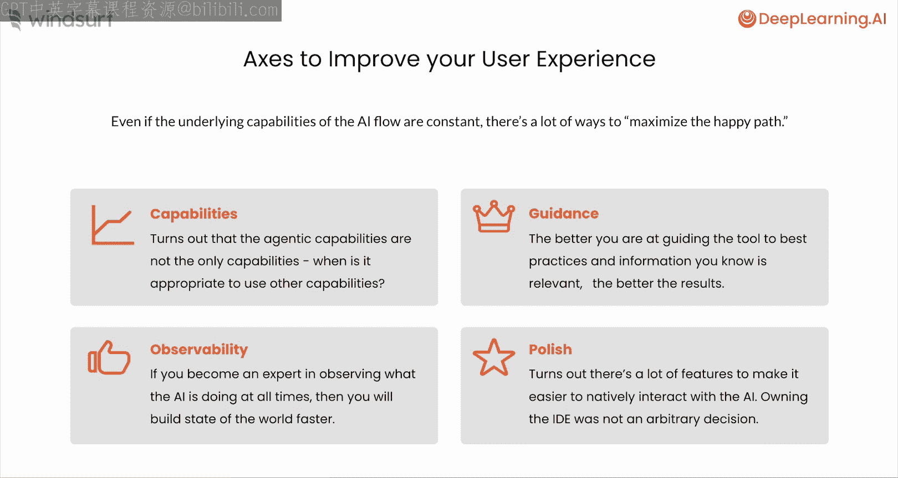
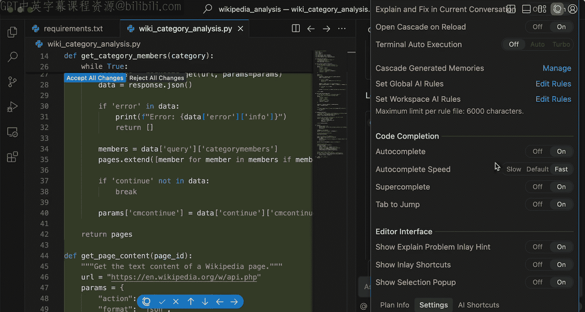
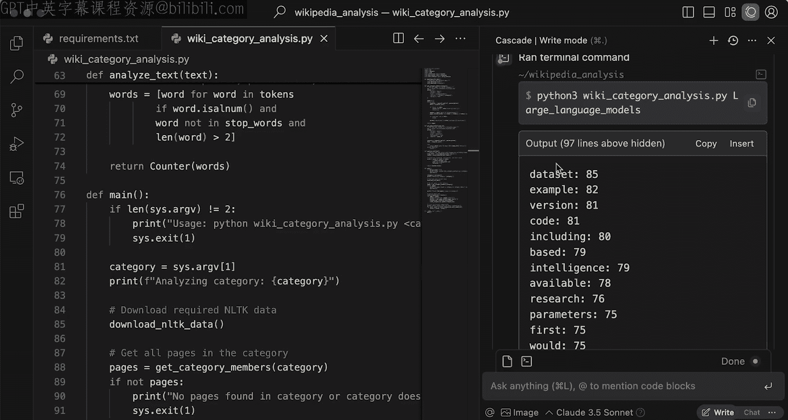

# 008：维基百科分析应用 – 数据分析

在本节课中，你将使用协作代理（Cascade）来开始构建一个更大的维基百科分析应用的数据分析部分。在此过程中，你将学习如何指导和观察 AI 代理工作的基础知识。

## 概述：用户体验的核心要素

在开始构建应用之前，我们先介绍最后一个概念。之前的课程讨论了很多构成协作式 AI 代理（如 Cascade）强大功能的不同组件，例如上下文感知、工具和人工操作。但同样重要的是，思考那些独立于这些底层能力、却能提升用户体验的维度。即使底层能力保持不变，工具的许多方面也能极大地优化用户体验。在开始构建维基百科分析应用时，我会多次提及这些要点，因此了解它们很重要。

以下是几个关键维度：

*   **能力**：我们将大量使用 Cascade。但事实证明，这些代理能力并非 Windsurf 这类 AI 原生 IDE 提供的唯一能力。那么，何时适合使用其他能力呢？
*   **指导**：虽然 Cascade 有能力独立检索正确信息，但事实证明，如果你能像对待结对程序员一样，在适当的地方给予 AI 一些指导，使其能够集中精力，它的表现会好得多。那么，如何有效地对 Cascade 进行指导呢？
*   **可观察性**：当然，现在 AI 能做的远不止提供几行自动补全建议或回复一条聊天消息。因此，如果你擅长随时观察 AI 在做什么，你就能跟上 AI 的进度，保持状态，并确保自己能有效地处理越来越大的任务。
*   **细节打磨**：有很多有用的按钮和快捷键，可以确保你以最优的方式与 AI 进行原生交互。我们决定开发自己的 AI 交互界面并非随意之举，其中包含了许多我们认为能带来独特体验的用户体验细节。

了解了这些，让我们正式开始。



## 启动项目：从零开始

我们将从一个名为 `Wikipedia Analysis` 的完全空白项目开始，并从零构建它。在本视频中，我们将进行一些数据分析。

这个应用的灵感来源于我和办公室的一些朋友玩的一个叫“Catfish”的游戏。简单来说，游戏会给出一个维基百科页面的所有分类，你需要猜出对应的页面。这让我思考，如果我想了解一类新的信息，我需要做什么？我需要学习哪些基本术语？在真正理解那个主题之前，我首先必须了解什么？

因此，我们要做的是尝试利用维基百科信息，获取一个分类，并理解属于该分类的所有页面中出现的单词频率，这将为我开始工作提供一个很好的起点。

我将从这样一个提示开始（直接复制在这里）：
```
写一个脚本，该脚本接收一个维基百科分类作为命令行参数，并输出该分类下所有页面中非常见单词的累计频率。然后针对“Large language models”这个分类运行它。
```
我指定了要使用 MediaWiki API。在运行之前，有几点需要指出：我相对具体地描述了输入和输出的格式，并指定了希望使用的 API。即使没有现有上下文，对 AI 保持清晰仍然很重要。如果你从一个非常模糊的陈述开始，AI 可能会做出正确但出乎意料的事情。再次强调，请将其视为结对程序员。如果你想让结对程序员为你开始一些工作，你需要告诉它做什么。

在开始工作之前，再指出 Cascade 面板的几个要点。如你所见，我目前使用 Claude 3.5 Sonnet 作为推理模型，你实际上可以选择多种不同的可用模型。

现在，让我们开始吧。我将点击回车键，让 Cascade 开始工作。

## 观察与指导：Windsurf 的功能

在点击安装 `requirements.txt` 中的依赖命令之前，让我们先指出 Windsurf 中几个帮助你观察 AI 在做什么的功能。

第一个是我们之前实际上已经用过的功能，就是 **“打开差异对比”按钮**。因为编辑可能发生在多个文件中，能够点击“打开差异对比”并查看 Cascade 所做的更改是非常棒的。审查 AI 所做的更改仍然很重要。

你会注意到的另一件事是我们称之为 **Cascade 导航栏** 的东西。这本质上是一种将审查流程直接构建到编辑器中的方式。因此，如果一个文件中有多个更改，你可以使用上下箭头；你可以使用左右箭头在不同有编辑的文件之间切换。我可以在单个代码块级别、文件级别或跨所有文件接受这些更改。

现在我们已经了解了一些可观察性功能，让我们继续这里的工作。首先，我需要安装 `requirements.txt` 中的依赖。所以点击“接受”。

注意这里，我的环境实际上使用 `python3` 而不是 `python`，使用 `pip3` 而不是 `pip`。Cascade 能够识别这一点并相应地纠正。但在它继续的同时，也许我希望 Cascade 在我工作时始终知道这一点。我不想每次都去弄清楚我用的是 `pip3` 而不是 `pip`。

所以，我将在这里展示第一种指导方法：如果你转到右下角的 Windsurf 设置选项卡，可以看到有很多不同的设置，我将进入这个名为 **“设置全局 AI 规则”** 的选项。这些是 Cascade 在你工作时（无论在哪里工作）都会遵循的规则。当然，仓库规则是针对特定仓库的，但我可以在这里直接说：使用 `python3` 代替 `python`，使用 `pip3` 代替 `pip`，类似这样。现在，Cascade 应该能够在我每次要求它做某事时遵循这些指令，我们稍后会验证这一点。



但让我们继续看看 Cascade 在做什么。它现在说，好的，让我们在那个“大型语言模型”分类上运行它。我们让它运行，如你所见，它开始运行并开始处理属于“大型语言模型”分类的所有维基百科页面。

你可能注意到我们截断了输出，这只是出于空间考虑。但 Cascade 实际上使用的是 IDE 的原生终端。因此，通过点击这个名为 **“转到终端”** 的小按钮，你可以在编辑器的终端面板中调出完整的执行过程。我可以进去查看，即使我只看到最后几行，也能看到一些最常见的词，毫不意外，是像 `model`、`models`、`language`、`OpenAI`、`ChatGPT` 这样的词。所以，我们已经可以大致了解到，是的，如果我要学习大型语言模型，这些可能是我需要了解的一些术语。

这很棒。它成功地构建了一个数据分析脚本，这正是我想做的。我将继续并接受所有更改。重要的是要边进行边接受更改，而不是仅仅累积而不处理。所以，我将接受所有更改并关闭终端。

## 验证与总结：规则生效与本节回顾

现在，让我们实际检查一下我之前设置的全局规则的效果。为此，我将使用一个不同的功能。我可以在当前的 Cascade 对话中要求检查这一点，但保持不同对话之间的分离很重要。

所以，我将在这里与 Cascade 开始一个新的对话。我可以问它执行之前需要的相同命令：`安装 requirements.txt 中的依赖`。如果它什么都没学到，它只会用 `pip` 而不是 `pip3`。但是，它正在使用我们指定的全局规则，直接使用 `pip3`。这是一个例子，说明仅仅设置一些规则就能让 Cascade 始终遵循关于你环境或你做事方式的一般最佳实践。

当然，在这种情况下，一切都已经设置好了。回到我原来的对话，我只需要转到过去的对话记录并返回，我就回到了最初的对话中。

## 总结

在本节课中，你使用 Cascade 构建了应用程序的整个分析部分，利用维基百科 API 提取所有相关数据，进行相应解析，并输出词频结果。在此过程中，你能够使用 Windsurf IDE 中的多项功能来指导 Cascade 并观察它的行为。



在下一节中，我们将为系统添加缓存功能，因为我不想在每次迭代应用程序时都重新运行这个分析。我们下节再见。