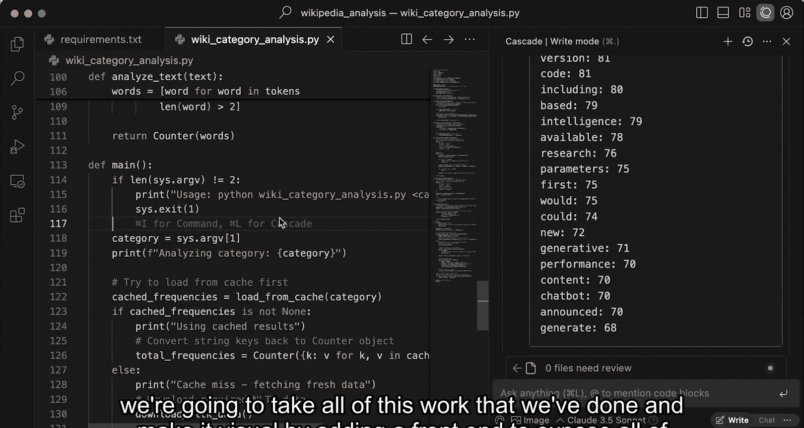

# 009：添加缓存与处理意外情况


在本节课中，我们将为维基百科分析应用添加缓存功能。更重要的是，你将学习当 AI 代理的行为与预期略有偏差时，如何引导它回到正确的轨道上。

让我们开始吧。

## 概述

在上节课中，我们完成了词频分析的核心功能。但在继续构建应用的其他部分之前，我们需要添加一个缓存机制。这是因为处理与“大语言模型”相关的数百个页面需要相当长的时间。我们希望当输入相同时，结果能够被缓存，这样在调整应用其他部分时就不会遇到性能问题。

## 初次尝试与问题

为了实现缓存，我向 AI 代理（Cascade）发出了以下指令：

```
Create a local cache, so we aren't rerunning retrieval logic for the same category.
```

这正是我们刚才提到的需求。让我们看看 Cascade 做了什么。

很好，Cascade 进行了多次编辑。我可以使用 Cascade 的侧边栏逐条查看代码差异，理解所做的修改。

我们运行一下修改后的代码。当然，第一次运行仍然需要处理所有文件。

让我们检查一下缓存文件。看起来它并没有完全按照我的意图执行。它只是缓存了每个不同页面的页面ID，这并不是我真正想要的。我真正希望的是缓存整个脚本的处理结果。

回顾我的查询指令，我发现我的表述有些模糊。从技术上讲，它确实缓存了与该类别相关的页面结果信息，但并非我期望的最终脚本处理结果。

## 解决方案：使用“回退”功能

现在有几种处理方式。即使我已经接受了所有文件更改，我们仍然可以：

1.  进入 Cascade，要求它撤销所有更改，然后尝试进行新的编辑来修复问题。但这可能会使情况变得混乱。
2.  使用一个便捷的功能：将鼠标悬停在某条消息上，会出现“回退到该步骤”的选项。

**回退**功能将回滚整个对话历史，并撤销该步骤之后所有对文件所做的更改。如果我点击“回退”，`wiki_category_analysis.py` 文件中的所有缓存逻辑都会消失。

这个功能有助于保持对话历史的清晰，避免陷入来回纠错的困境。如果保留那些错误的尝试，可能会在未来的对话中给 AI 代理造成混淆。因此，“回退”是一个帮助你摆脱困境的非常有用的功能。

我删除了那个不正确的缓存文件，不再需要它了。😊

## 修正指令并成功实现

现在，让我修改一下指令，使其更具体地描述我想要实现的目标：

```
Create a local cache of the script results. I don‘t want to rerun even the processing logic again for the same category.
```

这次我明确指出了要缓存“脚本结果”。好的，Cascade 首先提示我需要创建缓存目录，这没问题。

它进行了一些修改。让我们再次尝试运行。

第一次运行时，它仍然需要处理所有文件。现在让我们看看缓存文件的内容。太好了！缓存现在完全符合我的期望，里面是脚本的处理结果。如果我再次运行脚本，结果会快得多。

## 回顾与总结

在本节课中，我们成功构建了缓存逻辑。我依然可以使用 Cascade 侧边栏来查看所有更改，😊 确保一切符合预期并理解代码。我可以在单个代码块级别或整个文件级别接受更改。

但更重要的是，在本节课中，你学会了当 AI 的行为出乎意料时，如何巧妙地引导它回到正轨。善用“回退”等功能，可以让你与 AI 结对编程伙伴保持健康、高效的对话历史。

在下节课中，我们将把目前完成的所有工作可视化，通过添加一个前端界面，以一种美观的方式展示所有这些结果和词频数据。我们下节课见。




