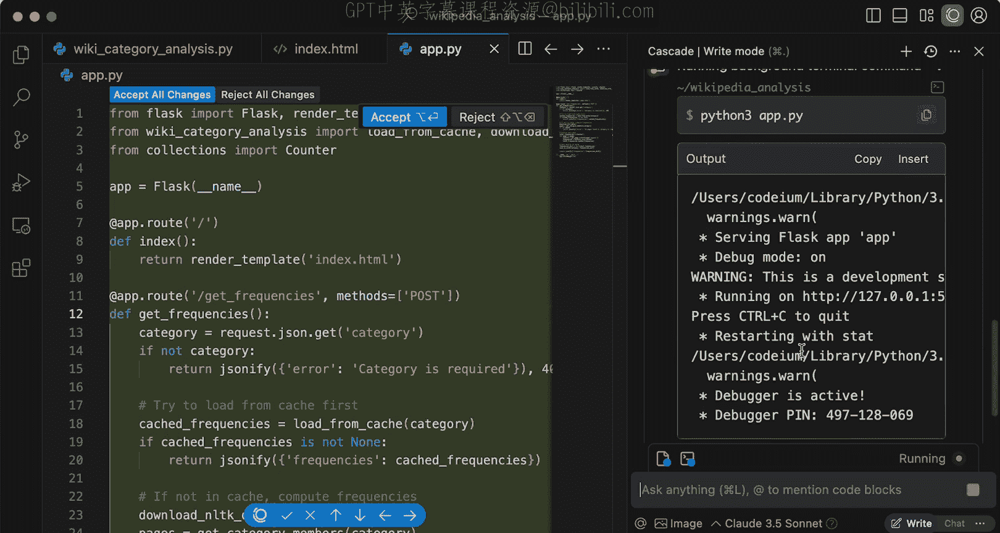
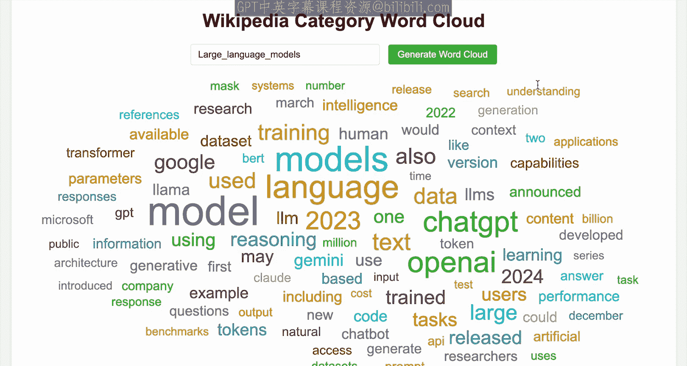
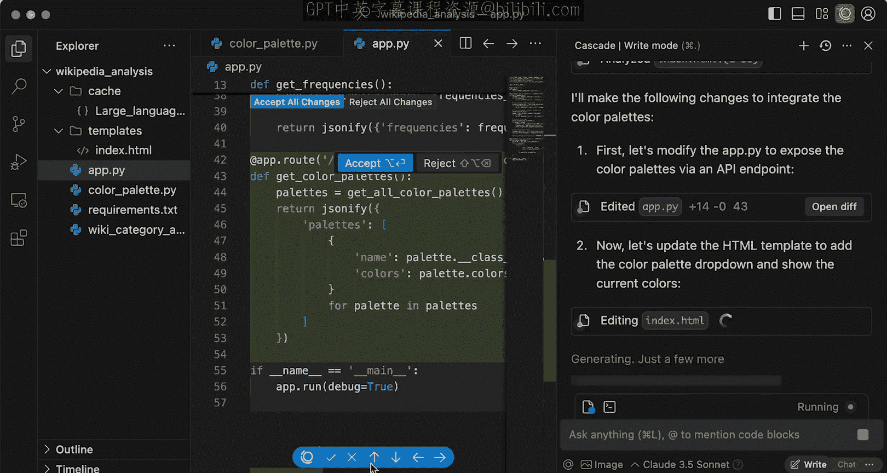
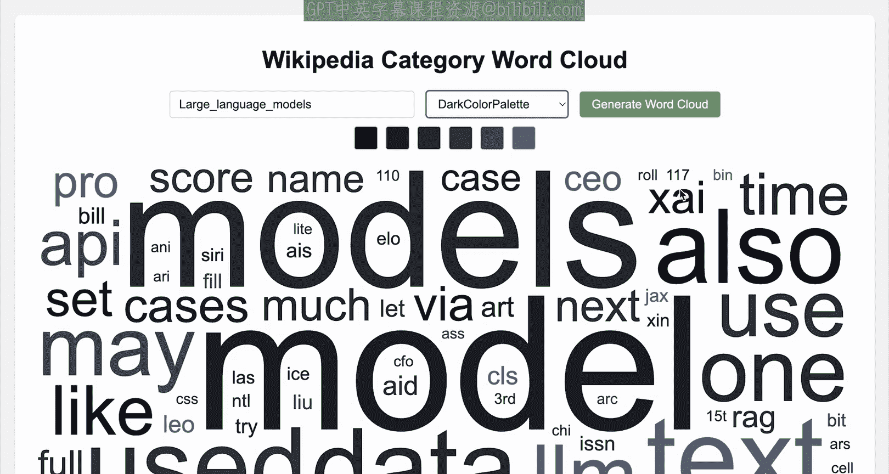
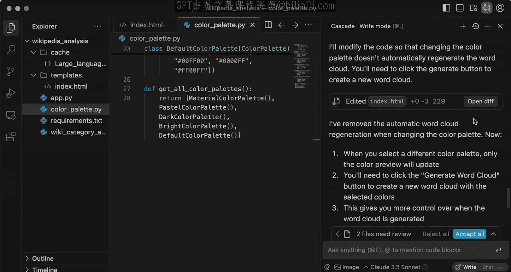
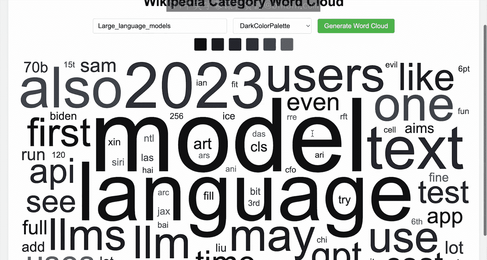
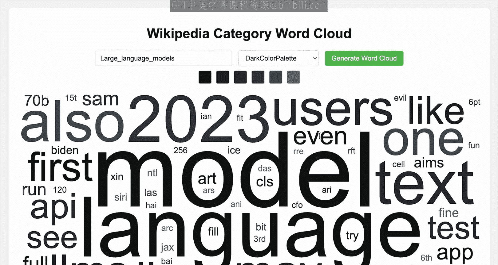
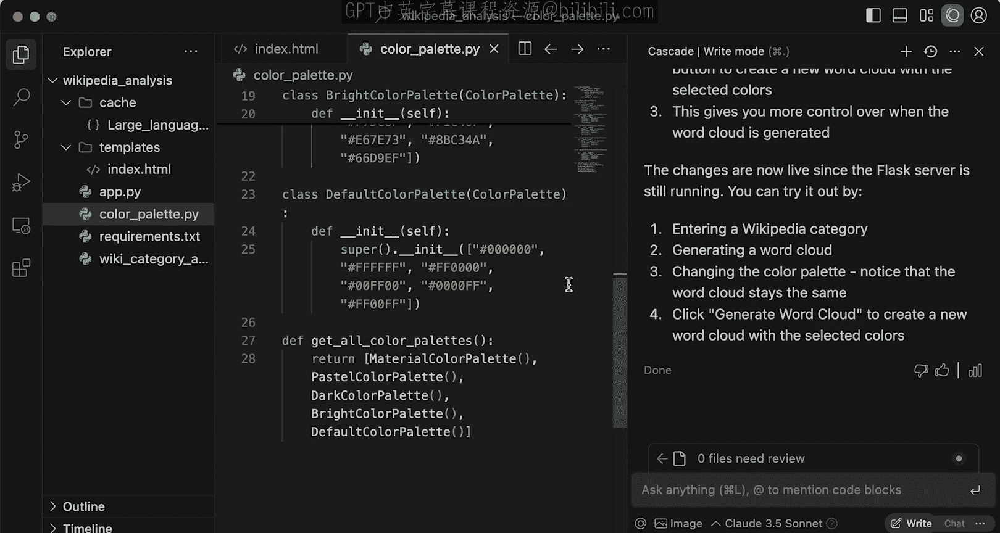

# 010：构建维基百科分析全栈应用 🚀

在本节课中，你将构建一个全栈应用程序，用于展示之前为维基百科分析应用所做的数据分析结果。在此过程中，你将学习一系列技巧、窍门和最佳实践，以最大化你与 AI 代理的互动效率。

## 概述

我们将把之前完成的词频分析和缓存功能可视化，通过一个网页来展示结果。我们将使用 HTML、JavaScript 和 Flask 框架来完成这个任务。

---

## 启动新对话并创建网页

上一节我们完成了词频分析和缓存逻辑。本节中，我们来看看如何将这些功能集成到一个可视化的网页应用中。

首先，在 Windsurf 中开启一个新的对话，因为我们要开始构建前端。使用的提示词如下：

> 创建一个网页，从结果缓存中加载数据（如果可用），否则从头计算词频，并显示一个词云图，其中单词的大小与词频成正比。使用 HTML、JavaScript 和 Flask 来完成此任务。

AI 代理（Cascade）接收指令后，会创建和编辑一系列文件。

## 审查与运行应用

以下是 Cascade 做出的更改，我们可以使用 OpenDiff 工具或 Cascade 侧边栏来审查和调查所有更改。

审查完成后，我们可以运行应用。应用成功启动后，在浏览器中访问 `localhost:5000`。

输入一个分类，例如“大型语言模型”，然后点击生成词云图。由于命中了缓存，生成速度很快，效果看起来不错。

## 管理进程与审查更改

回到 Windsurf，我们可以看到 Cascade 正在运行一个终端进程。

在输入提示区域上方出现的工具栏中，你可以看到所有需要审查的更改、需要查看的文件，以及当前正在运行的所有终端进程。你可以从这里或直接从运行命令的地方结束或取消任何进程。

在审查更改时，有多种方式：
*   可以逐个文件查看。
*   可以按代码块接受更改。
*   可以按文件接受更改。
*   可以直接从工具栏接受所有更改。

## 利用编辑器功能理解代码

查看生成的 HTML 文件，里面包含了很多 JavaScript 代码。如果你对 JavaScript 不熟悉，Windsurf 编辑器提供了一些便捷功能来帮助你理解。

例如，将光标移动到 `generateWordCloud` 这个 JavaScript 函数上，你会注意到文本编辑器上方出现了一些有用的代码透镜（Code Lens）。

点击“解释”按钮，Cascade 会分析相关代码并向我解释其功能。这对于在不熟悉的语言或框架中使用 Cascade 非常有帮助。这种能力得益于我们在早期课程中提到的、构建在代码库之上的复杂解析逻辑。

## 使用命令和自动补全增强应用

接下来，我想为词云添加不同的颜色，让它看起来更漂亮。这里我将演示一些与 Cascade 代理无关的编辑器功能，因为 Windsurf 是一个 AI 原生的 IDE，体验远不止于代理。

首先，我创建一个新文件 `color_palette.py` 来定义颜色调色板。我会暂时关闭 Cascade 对话。

第一个功能是“命令”功能。它允许你直接在文本编辑器中使用自然语言向 AI 发出指令，快捷键是 `Cmd+I`。

我输入指令：“创建一个包含六种典型颜色的 ColorPalette 类，包含一堆常见的调色板。”

AI 会快速为我生成大量代码，这比通过 Cascade 提示可能更快。这就是为什么你不应该事事都依赖代理生成。

此外，你还能看到自动补全功能正在尝试建议额外的样板代码。例如，输入 `class RGBColorPalette`，我可以使用自动补全来快速生成多行代码。

我可以继续工作，例如“定义一个函数来获取所有调色板”或“定义一个方法来返回它们”。你还会注意到，即使是被动编辑，AI 也会根据远离光标位置的上下文，建议接下来的编辑。这是在文本编辑器内部拥有强大被动体验的好处，你可以快速生成大量样板代码，而无需依赖代理完成每一个编辑。

## 使用提及功能集成新代码

现在，我需要将创建的这个 `ColorPalette` 类集成到我的应用程序中。为此，我将切换回 Cascade。

我将要求 Cascade 将 `get_all_color_palettes` 方法集成到现有的应用中。这里我将使用一个名为“提及”的功能。

“提及”是一种让你作为开发者以非常轻量的方式引导 AI 的方法，指向那些你已经知道 AI 需要查看的地方。你可以提及文件、目录、单个方法或函数（我们稍后会用到），甚至可以提及网页或第三方 API 的公共文档。

为了集成调色板，我使用 `@` 提及功能来标记 `get_all_color_palettes` 函数。

然后给出指令：“将颜色调色板设置为下拉可选，并显示正在使用的颜色。”

通过使用提及，代理能够直接定位到需要查看的代码位置，然后利用其代理搜索和发现能力查看其他相关部分，并开始进行修改。我们可以通过 OpenDiff 查看正在进行的更改。

让我们看看效果。看起来不错。尝试生成一个分类的词云图，现在可以选择不同的调色板了，词云图会根据选择的调色板改变颜色。

## 迭代与优化

我注意到，在选择不同的调色板时，词云图会自动改变，而无需我点击“生成词云图”按钮。这可能是期望的行为，但也许我想改变这一点。这就是与 AI 代理或任何 AI 工具合作的迭代过程。

我回到 Windsurf 并给出指令：“确保即使我更改了调色板的选择，也需要点击生成按钮来创建新的词云图。”

接受所有更改后，回到应用程序并刷新。现在，如果我选择一个新的调色板，颜色选项会改变，但词云图不会自动更新，直到我点击生成按钮。这样我们就完成了对应用细节的迭代优化。

---

## 总结 🎉

在本节课中，我们一起学习了如何构建一个完整的全栈应用。我们不仅使用 Cascade 构建了整个应用，还利用了“命令”和“自动补全”功能快速构建了大量样板代码，并将其集成到整体应用程序中。

正如你所见，使用 Windsurf 不仅仅是与一个代理迭代，它是一个完整的 AI 体验，旨在最大限度地提高你开发所需功能的速度。我们完成了相当多的工作，接下来还有最后一节课。让我们继续前进。