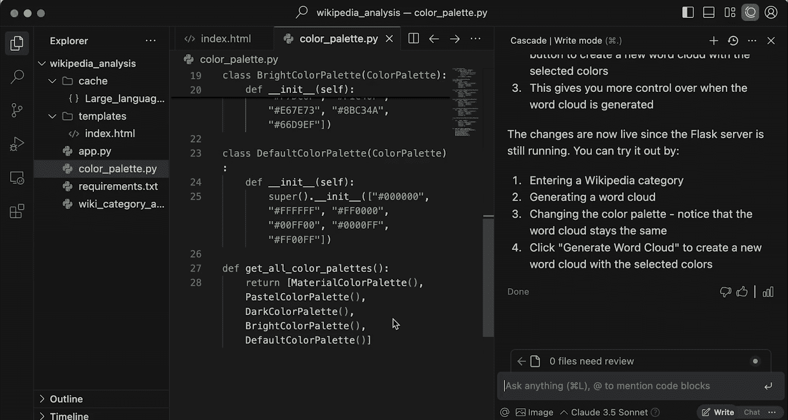
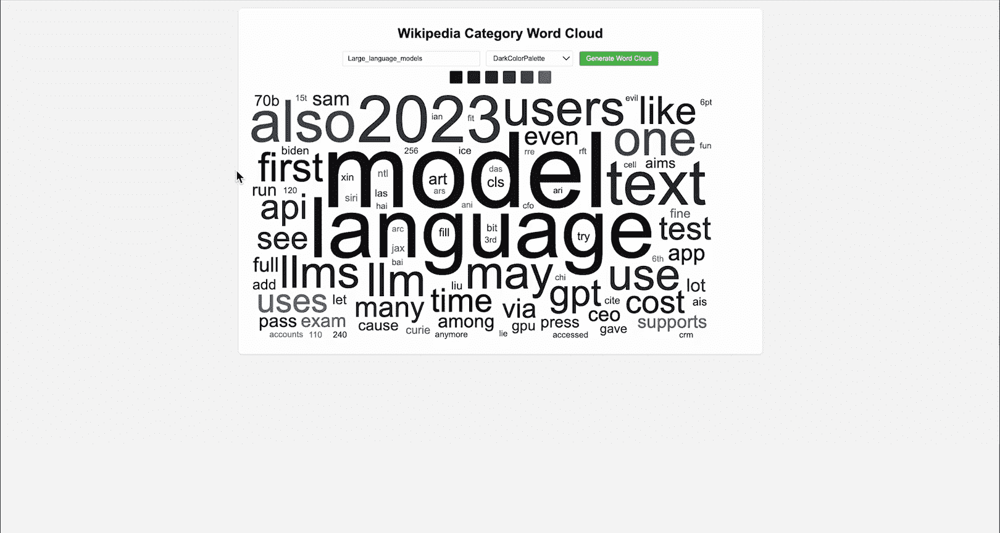
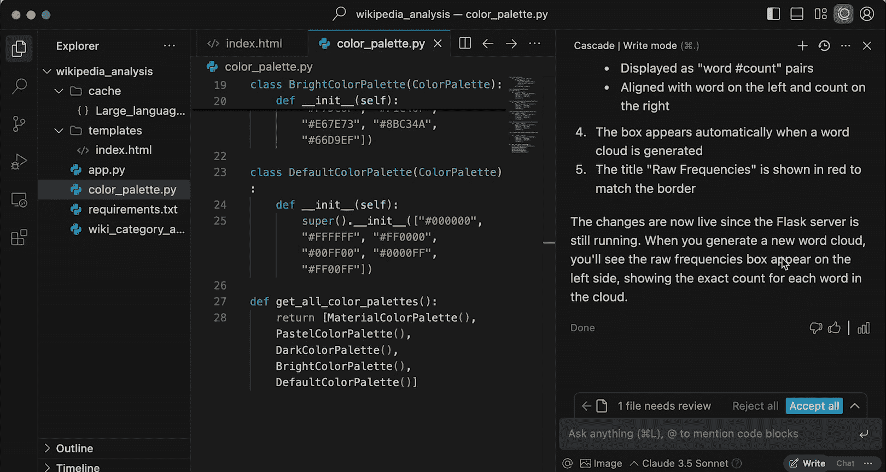
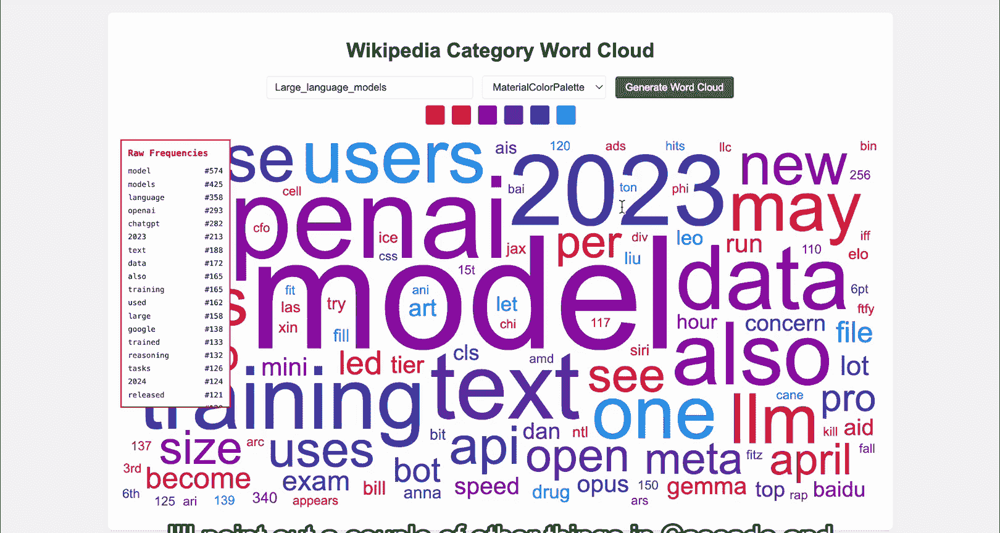
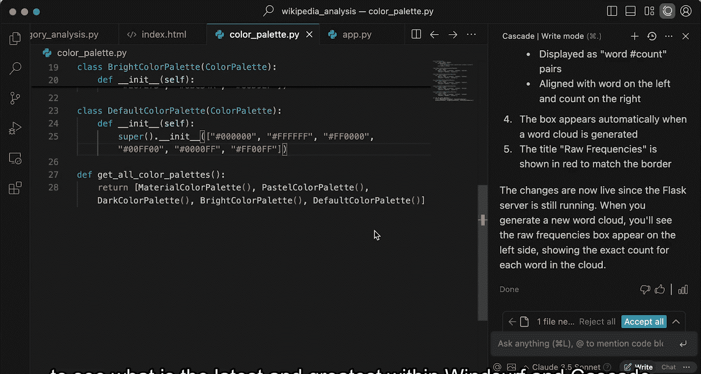

# 011：维基百科分析应用 – 最终优化 🎨

在本节课中，我们将利用 AI 代理的多模态能力，为应用添加更多功能。同时，你将了解一系列实用功能和最佳实践，以便继续构建和定制你的维基百科分析应用。

---

## 课程概述

在上一节课中，我们完成了应用的核心功能。本节中，我们将通过一个具体的例子，学习如何利用多模态输入（如图片）来快速实现界面布局调整，从而提升开发效率。此外，我们还将介绍 Windsurf 和 Cascade 中一些未能在演示中展示的高级功能和设置。

---

## 利用多模态输入优化界面

我们的应用目前运行良好。在界面下方，有一个可以插入图片到 Cascade 的功能，我们将利用这一点。

首先，我回到应用程序界面。为了更清晰地展示我想要添加的内容，我将截取当前应用界面的一个屏幕截图。

打开截图后，我进行了一些简单的标注。我在左侧添加了一个矩形框，并输入了文字。除了现有的词云可视化，我还希望同时看到词频的原始数据。

因此，我添加了文本“Raw Frequencies”（原始频率），并简单列出了几个示例词汇。这只是一个大约30秒内完成的粗略草图，目的是向 Cascade 传达我的布局意图，而无需详细描述每个细节。

完成草图后，我回到 Cascade，并使用图片输入功能上传了这张截图。

上传图片后，我只需对 Cascade 发出简单的指令：“按照图片所示，将原始频率添加到应用中。”

Cascade 能够利用其背后推理模型的多模态能力来理解这张图片。值得注意的是，它自动识别出“原始频率”应该放在词云图的左侧方框内，而我从未在文字指令中明确提及这一点。

修改似乎已经生效。我们返回应用并刷新页面。

刷新后，可以看到原始频率数据已经显示在左侧的方框中，并且使用了我在草图中标注的红色文字和边框。这就是一个利用多模态输入来显著提升开发速度的简单示例。

---

## 探索更多功能与设置

虽然这是我们演示中要添加的最后一个功能，但为了帮助你更好地进行后续开发，我将指出一些在演示中未能展示的 Cascade 和 Windsurf 功能。

首先，Windsurf 的设置面板中有许多选项，可以用于定制你的使用体验。

### 记忆功能

其中一个未展示的功能是“记忆”。其理念与“规则”类似，都是 Cascade 可以持续回溯和参考的信息片段。它允许 Cascade 随着时间推移，逐步构建起关于你工作方式和重要事项的“状态”。

这些记忆可以是你明确提及的（即规则），也可以是自动生成的。Cascade 可以在你工作时自动生成记忆并通知你，或者你也可以直接告诉 Cascade “记住这个”，它就会将其存入记忆库。与规则一样，你可以随时返回编辑这些记忆。

这是一种让 Cascade 自动学习的方式，无需你将所有事项都明确表述为规则。设置面板中还有许多控制被动体验和其他用户体验的选项。

### 命令列表与Turbo模式

在设置面板中搜索“Windsurf”，你会看到许多其他可编辑的字段。其中一个我很喜欢的功能是 Cascade 命令的“允许列表”和“拒绝列表”。

在演示中，Cascade 建议的每个命令都需要我手动接受。但有时，有些命令我完全愿意让它自动运行，而有些命令我则永远不希望它自动运行。你可以通过设置白名单和黑名单来管理这些命令。

在最近的版本中，甚至加入了“Turbo模式”。如果你希望完全沉浸在与 AI 代理的协作编程中，开启此模式后，Cascade 将自动运行所有建议的命令。

---

## 课程总结 🎯

本节课中，我们一起学习了如何利用多模态输入快速实现界面构思，为维基百科分析应用添加了显示原始数据的功能。我们看到，Windsurf 和 Cascade 提供了众多有趣的功能和特性，能够极大地改善开发体验和工作流程。

当然，这只是当前的一个瞬间。Cascade 和 Windsurf 将持续改进，AI 会变得更智能，功能、交互指导和可观测性也将不断扩展。请通过我们的文档或更新日志保持关注，了解 Windsurf 和 Cascade 的最新动态，从而最大化你作为开发者使用 AI 的体验。

