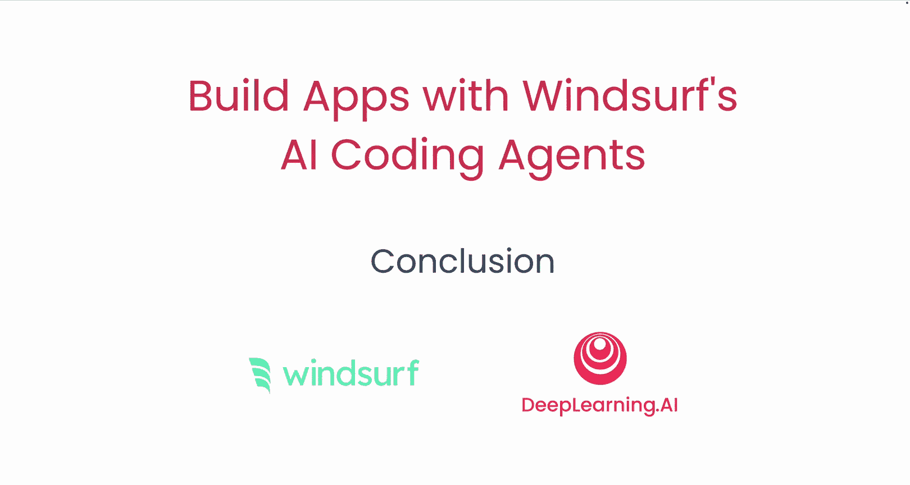

# 012：总结

在本课程中，我们一起学习了关于 AI 代码助手的历史、如何区分炒作与现实、如何思考这些 AI 代码助手以及 AI 代理的工作原理。我们深入探讨了搜索与发现这一具体且重要的范式。在此过程中，你使用 Windsurf 和协作代理构建了多个不同的应用程序。

## 课程回顾 🎯

上一节我们完成了应用程序的构建，本节中我们来回顾整个课程的核心内容。

以下是本课程涵盖的主要学习要点：

*   **AI 代码助手的历史**：了解了 AI 代码助手从早期工具到现代智能代理的发展历程。
*   **区分炒作与现实**：学会了如何客观评估 AI 代码助手的能力与当前局限性。
*   **理解 AI 代码助手**：建立了如何有效利用这些工具辅助编程的思维框架。
*   **AI 代理的工作原理**：探讨了驱动 AI 代码助手执行任务的核心技术机制。
*   **搜索与发现范式**：深入研究了 `搜索` 与 `发现` 作为 AI 代理理解需求和寻找解决方案的关键模式。
*   **实践应用构建**：通过实际操作，使用 **Windsurf** 平台及其 **协作代理** 完成了多个应用程序的开发。

## 展望未来 🚀

恭喜你完成本课程的学习。我期待看到你使用 Windsurf 构建出更多精彩的作品。

**本节课中我们一起学习了 AI 编程代理的核心概念与实践方法，从理论认知到实际构建，完成了从了解到应用的完整旅程。**