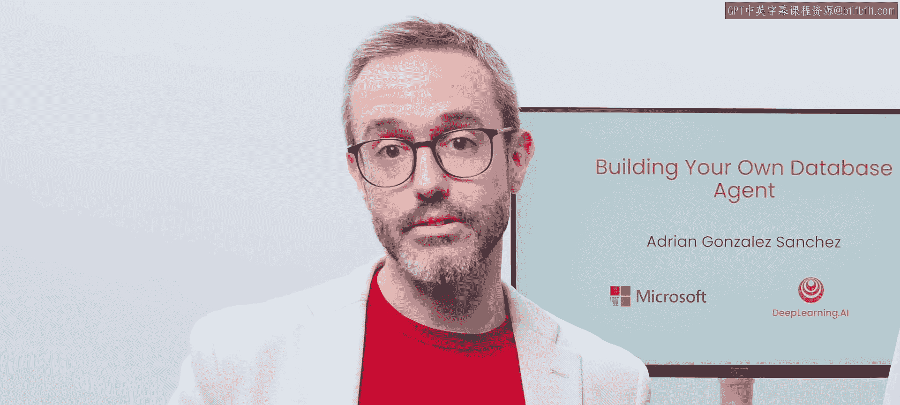
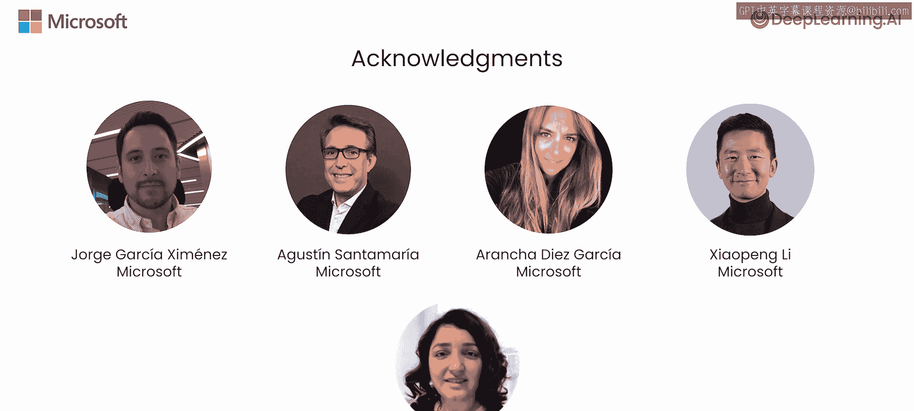

# 001：课程介绍 🚀

在本课程中，我们将学习如何让大型语言模型与表格数据或SQL数据库等结构化数据进行交互。这对于构建一个能利用数据源（而非依赖分析师将问题翻译成SQL查询）来回答问题的系统非常有用。我们将了解数据库智能体如何自动接收问题，并生成一系列动作（即函数调用）来检索相关数据。

具体来说，在本课程中，你将学习如何构建自己的AI智能体来与表格数据和SQL数据库交互。在此过程中，你将了解构建智能体的一些关键模块，并使用LangChain智能体框架。

## 课程讲师与内容概览 👨‍🏫

本课程由微软数据与AI专家、大学讲师、《Azure OpenAI O‘Reilly》书籍作者Ad Gonzalez Sanchez担任讲师。

课程将涵盖以下核心内容：
*   学习如何部署LLM来构建你的AI智能体。
*   实现针对表格数据的检索增强生成。
*   开发你自己的数据库智能体。
*   构建一个函数调用系统。
*   集成Azure OpenAI助手API。

我们将使用Azure OpenAI服务和LangChain来实践这些概念。虽然课程以数据库智能体为例，但这些组件对于构建任何其他类型的智能体同样有用。

## 数据库智能体的意义与前景 💡

数据库智能体是我们分析数据方式的一次激动人心的突破。它让人们无需学习SQL等查询语言，就能与复杂数据交互。这意味着你可以让一个语言模型为你向数据库发出请求，无论数据库提供商、数据模型或类型语言如何。

**核心概念**：使用LLM作为数据库之上的抽象层，是许多公司内部实现数据民主化的新前沿之一。你可以将这一技术应用于你所在的公司或你正在开发的应用中。

此外，智能体是生成式AI中一个快速增长的类别。在本课程中，你还将学习智能体的关键组件，以及将这些组件组装成更广泛系统的最佳实践。

## 课程启动 🎬

在接下来的第一课中，你将开始使用Azure OpenAI服务构建你的第一个AI智能体。

上一节我们介绍了课程的整体目标和内容，本节中我们来看看如何开始实践。

让我们进入下一个视频，正式开始学习。