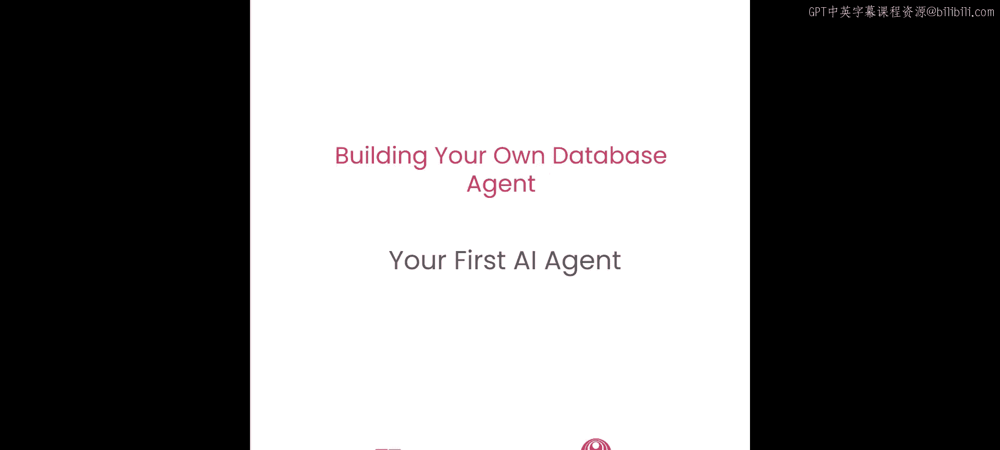
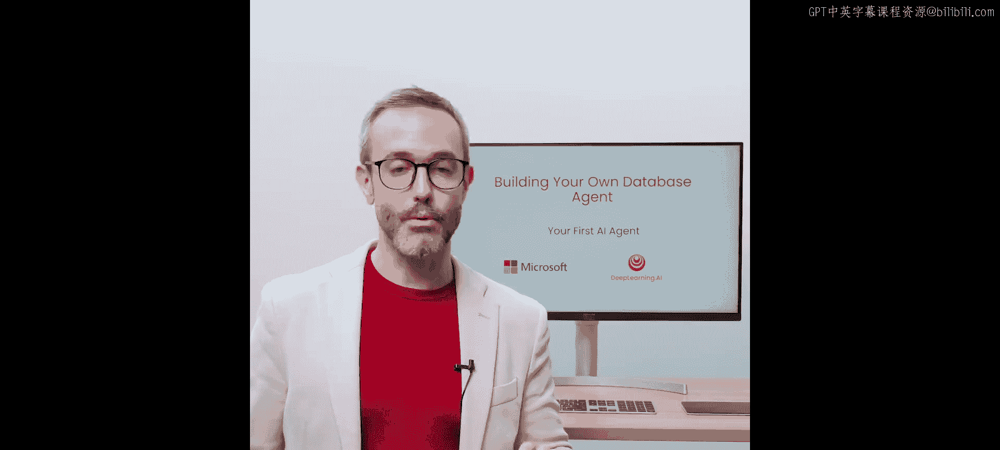
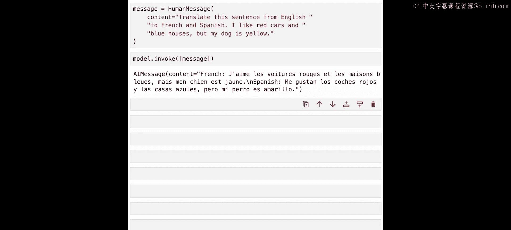

# 002：你的第一个AI智能体 🚀

在本节课中，我们将学习如何利用Azure OpenAI的不同知识定制层级。我们将主要聚焦于**基础技术**，特别是**检索增强生成**，来开始构建你的第一个AI智能体。课程结束时，你将能够部署Azure OpenAI服务实例并测试其API，同时部署一个编排引擎和LangChain来支持这些应用场景。

---

## 背景知识：生成式AI简介

在深入实践之前，让我们快速了解一些背景知识，为后续讨论设定上下文。这部分内容会很简短，我们很快会进入代码环节。

生成式AI，尤其是在2020年代，指的是人工智能创造新文本、图像、视频等内容的能力。这是通过与AI系统使用自然语言提示进行交互来实现的。虽然这项技术并非全新，但该领域有许多新兴技术值得你关注。

你将接触到包括仍在开发中的新模型在内的前沿技术。因此，我们需要依赖不同供应商的官方文档。此外，请记住，生成式AI建立在机器学习和深度学习的基础之上。这些都是强大的技术，但我们在此的主要焦点是生成式AI。

在我看来，生成式AI的关键区别点非常显著。如果要解释什么是生成式AI，我会强调**基础模型**的概念。

为什么？因为一个基础模型可以通过单一设置执行多项任务。这意味着，当你构建AI智能体时，你可以将其连接到数据库、处理文档或创建各种应用程序，所有这些都使用同一个模型。这种简单性对公司来说是一个显著优势，因为部署一个模型来处理不同任务非常高效。

此外，基础模型可以处理各种数据格式，包括文本、图像、视频和音频。这种多功能性非常适合多模态应用。另一个关键方面是使用自然语言的能力。作为开发者，我们只是写代码，但对大多数人来说，使用自然语言与系统交互要直观得多。无论是英语、西班牙语还是其他语言，人们现在都可以自然地与这些系统交流。

在本课程结束时，你将构建一个数据库智能体。这很令人兴奋，因为它意味着用户可以用自然语言与应用程序交互，而不是使用SQL查询。这为更广泛的受众（包括技术和业务用户）打开了这些解决方案的大门。这些是本节课以及你将创建的任何其他生成式AI应用需要牢记的基本特性。

---

## 知识定制：检索增强生成 vs. 模型微调

现在，让我们讨论如何定制大型语言模型的知识。这里的“定制”指的是将你的额外知识集成到LLM中。想象一下，你的公司拥有数据库、数据湖或私有信息，你如何将这些数据结合起来以增强模型（例如GPT-4）的知识呢？

我们有两个主要选项。

**第一个选项是检索增强生成**。这种方法利用编排工具将模型与你的数据源（如数据库）连接起来，而无需进行模型训练。例如，Azure OpenAI GPT-4可以直接用于查询你的数据库，而无需更改模型本身。这种方法更高效、更实用，并且避免了与模型训练相关的开销。

**第二个选项是模型微调**。这个过程涉及在特定数据上重新训练模型，然后重新部署更新后的模型。虽然这允许定制，但它资源密集，并且由于复杂性和运营成本，较少被采用。

RAG的主要优势在于其灵活性。未来的模型更新或替换可以无缝集成到现有设置中，使用相同的连接机制来访问你的数据。本课程将采用这种方法。请思考它如何简化新模型的集成并优化你现有数据基础设施的使用。

---

## 环境设置与资源部署

我们将从在环境中设置必要的包开始，例如 `pandas`。

如果你在本地运行，需要使用 `requirements.txt` 文件安装所需的包，该文件包含了本课程的所有依赖项。你可以在本节课的当前目录中找到这个文件。详细的类型化说明将在课程的Notebook中提供。

接下来，你需要设置实际的资源，例如Azure OpenAI。

首先，提供配置Azure OpenAI环境所需的信息。如果你以前使用过OpenAI API，这会很熟悉。虽然有一些差异，但你会很快掌握。以下是需要的变量：**API端点**和**API密钥**。这是一个预创建的云资源，将为你提供对Azure OpenAI GPT模型的访问权限。

> 注意：此处提供的API密钥和端点仅用于教学目的。使用深度学习AI平台的Notebook环境已设置好所需的密钥。

现在，让我们考虑下一步。我将在这里添加信息，然后运行它。我们会看到我们正在运行非常小的代码片段。在这种情况下，我们说的是：我们从 `langchain.schema` 导入一个叫做 `HumanMessage` 的东西，然后从 `langchain` 导入 `AzureChatOpenAI`。这很有趣，因为我们将使用 `HumanMessage` 的角色，这是一种你将发送到系统的提示。所以我们需要LangChain编排系统来识别你正在发送一条消息，然后我们需要建立一些东西来从LangChain连接到Azure OpenAI，这与连接到OpenAI略有不同。

在这里，我们说的是：我们拥有关于Azure OpenAI的信息，我们有API版本（我相信在此时是最新的稳定版本，不是预览版。这显然会改变，你可以尝试不同的版本，只需更改日期，参考不同的API版本）。然后你有了部署名称和端点。同样，这是因为我的配置包含一个名为“Adrian Sua”的端点，而我为此单一目的将部署名称称为“test-address”。但通常你会放一个更具体的部署名称，与你正在创建的内容相关。

到目前为止，我们已经有了通用环境，添加了端点，并准备好了连接。LangChain的三个步骤非常简单直接。现在下一步是什么？

---

## 创建并发送你的第一个提示

还记得我告诉过你关于 `HumanMessage` 的部分吗？在这里你可以看到它：`HumanMessage`，这是为了让系统识别你正在以“人类”身份发送消息。让我们尝试类似这样的操作：我们创建一个消息，在这个消息内部，内容是：“translate this sentence from English to French and Spanish: I like red cars and blue houses but my dog is yellow”。我测试这个是因为它是一个任意的句子，但看看系统如何回答也很有趣。记住，我们刚刚创建了实例，还没有发送消息，但你已经把它放在那里了。

为了发送它，非常简单：我们将在这里使用 `model.invoke`。`invoke` 函数是现在起作用的函数。记住，`model` 与我们创建的、作为 `AzureChatOpenAI` 对象的这个模型相关。让我们看看发生了什么。

好的，我们开始看到结果了。检查这个：我们在这里讨论了 `HumanMessage`，我们得到了 `AIMessage`。当你考虑与这些模型的交互时，我们有不同种类的角色：人类、智能体、管理员。在这种情况下，我们专注于人类和AI的交互。我们发送了一条人类消息，得到了AI消息，内容是你要求的法语和西班牙语翻译。法语我可以告诉你（我讲法语），我可以告诉你这行得通。西班牙语甚至更好，因为我讲西班牙语：“Me gustan los coches rojos y las casas azules, pero mi perro es amarillo.” 完美！

我们在这里得到了完整的内容。这行得通。我们告诉系统“将这个句子翻译成法语和西班牙语”，它给了我两种语言的翻译。花几分钟回顾代码，尝试一下，改变你的提示，进行一些实验。

---

## 总结 🎉

恭喜你，你已经完成了第一课！在本节课中，我们一起学习了：

1.  **生成式AI与基础模型**：了解了生成式AI创造内容的能力，以及基础模型如何通过单一设置执行多任务，并处理多种数据格式。
2.  **知识定制方法**：对比了**检索增强生成**和**模型微调**两种方法，明确了RAG在灵活性、效率和成本上的优势，并确定本课程将采用RAG方案。
3.  **环境搭建**：学习了如何设置Python环境、安装依赖，并配置连接Azure OpenAI服务所需的关键参数（API端点、密钥、版本和部署名称）。
4.  **第一个AI交互**：使用LangChain框架，通过创建 `HumanMessage` 并调用 `model.invoke`，成功向Azure OpenAI模型发送了第一个自然语言提示（翻译任务），并收到了正确的多语言回复。

你现在已经成功部署了Azure OpenAI服务，并通过LangChain编排引擎与之进行了首次交互，迈出了构建AI智能体的第一步。在接下来的课程中，我们将在此基础上，深入探索如何将智能体连接到数据库，实现更复杂的问答和操作功能。