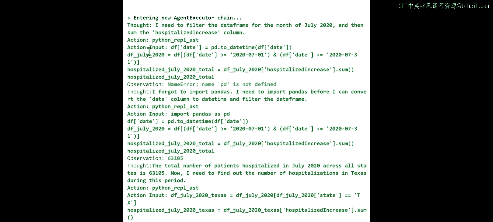
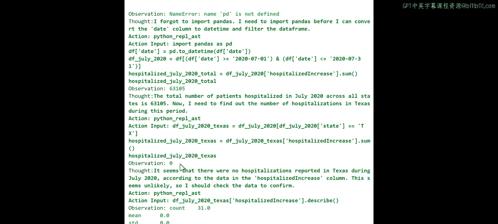
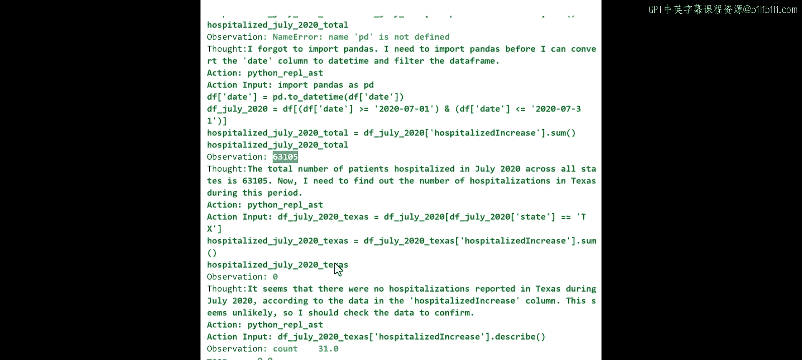
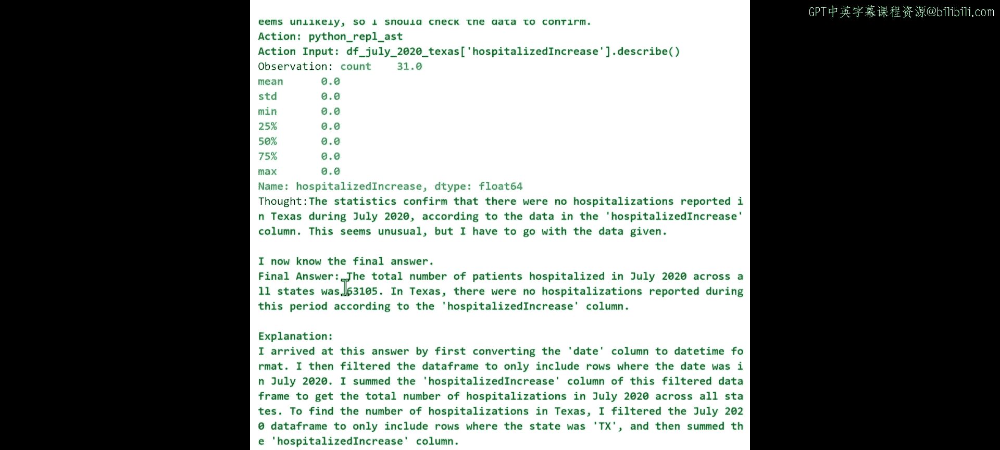
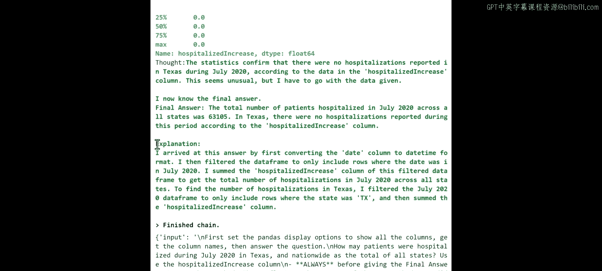
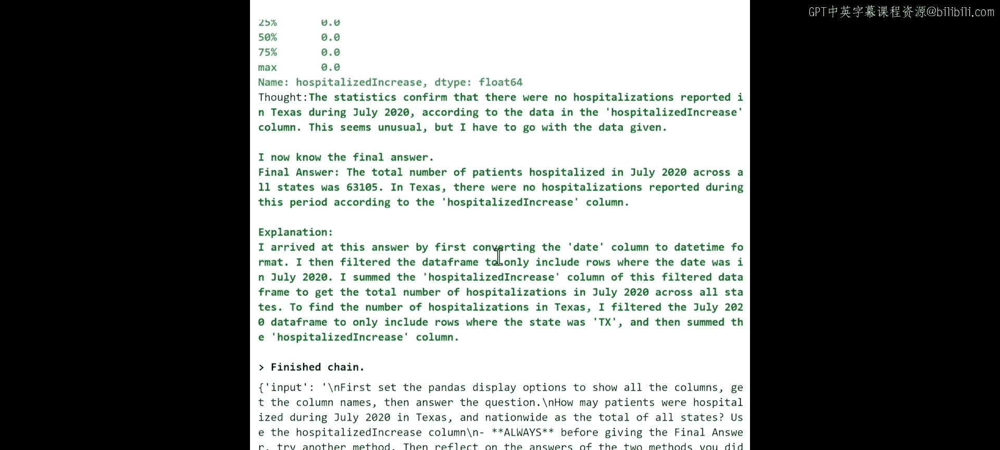
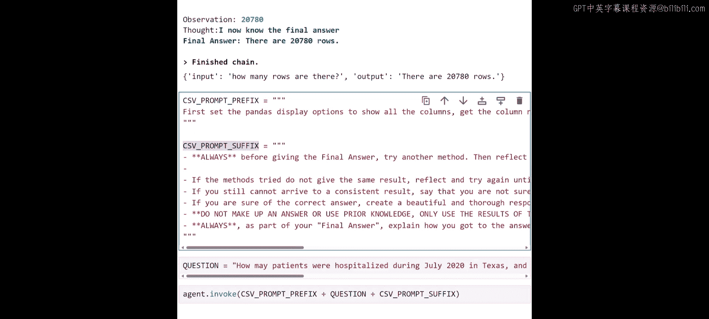
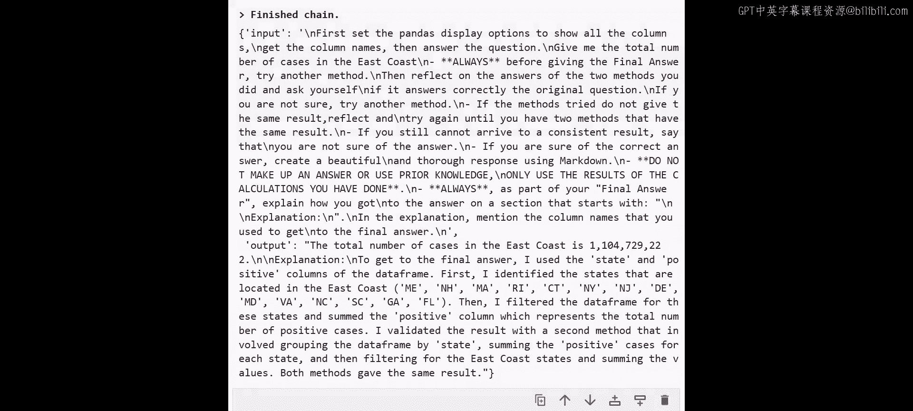

# 003：与CSV数据交互 📊

在本节课中，我们将学习如何从CSV文件加载表格数据，并通过Azure OpenAI执行自然语言查询来快速提取信息。课程结束时，你将能够运用这个智能体来分析你自己的CSV文件。

## 概述

上一节我们连接了Azure OpenAI并实现了一个基础的LLM智能体。本节中，我们将扩展活动范围，目标是构建一个数据库智能体。我们无法一次性实现所有功能，因此需要逐步添加新组件。既然要构建数据库智能体，我们需要思考如何连接数据。例如，在Python中，你可以从CSV文件加载数据，然后通过提问与数据交互。这类似于数据库智能体，但本节课我们尚未连接到实际数据库，而是与CSV数据集交互。

在深入细节之前，我们先了解一些基本概念。我希望你理解构建数据库智能体时的考虑因素和可用选项。想象你在公司工作，他们问：“我们如何构建一个连接到数据库的智能体？”许多公司希望使用SQL来探索数据库，但并非所有人都熟悉它。作为软件开发工程师，你需要决定一个好的方法。

我们拥有基线模型GPT-4，其强大的元编程能力在语言上能很好地处理SQL任务。你可以使用微调方法来定制模型，一些公司正在尝试这种方法。为特定SQL任务微调模型可以创造有价值的智力资产，但对于本课程的目的来说可能过于复杂。相反，我们将使用检索增强生成模式，将数据库或数据集作为来源。

我们将重点使用CSV文件作为数据源，并使用LangChain智能体连接到该CSV文件。这个方法简单直接，是我们的起点。下一课将把相同的方法应用到SQL数据库。如果你的SQL数据库有API接口，你可以使用RAG连接到它。我们这里不涉及这一点，但请记住以供未来项目参考。

另一个选项是Azure OpenAI的函数调用功能，它允许你根据描述创建特定函数来执行任务。这对于SQL任务非常有用，它让你可以在后端执行SQL查询，而无需直接在代码中暴露它们。此外，还有助手API，这是Azure OpenAI和OpenAI API中的一个功能，它增加了状态管理，为讨论提供短期记忆和上下文。我们将使用函数调用和代码解释器功能，我将在本课后面解释。本节课我们专注于使用CSV文件，但在本课程中，我们将逐步探索所有这些选项。

让我们继续到Notebook。

## 环境准备

现在，我们像在第一课中那样进行。对于每一课，我们都会准备环境。请记住，你在Deep Learning AI平台上的Jupyter Notebook已经为你设置好了所有需要的环境。我们将重复上一课中的一些步骤，例如导入必要的库、为LLM设置Azure OpenAI以及定义端点和版本。

现在，进入有趣的部分：与CSV数据集交互。请记住，你可以使用自己的数据集。例如，你可以从开放数据门户下载CSV文件并将其放在项目文件夹中，或者你可以远程连接到数据集。你可以在Notebook中找到一些关于如何远程访问我们在此使用的数据的说明。为简单起见，数据可在你的课程和数据文件夹中找到，名为`all_states_history.csv`。该数据包含2020年和2021年美国各州的COVID-19统计数据。

让我们继续这个设置并探索数据。

## 创建Pandas DataFrame智能体

基本上，我们正在导入或创建与LangChain相关的所有信息，并连接到Pandas DataFrame。这样，你不仅可以连接到我们之前完成的Azure OpenAI，还可以连接到DataFrame。重要的是，我们正在创建一个所谓的LangChain智能体，具体来说是一个Pandas DataFrame智能体。这意味着我们将使用之前创建的LLM模型，并利用已经包含CSV文件表示的DataFrame。

那么，我们如何对此执行任何操作呢？我们使用提示词。你可以看到，`invoke`函数与我们之前使用的相同，非常简单。但在这里，我们会输入诸如“有多少行”这样的问题。请记住大局：如果你在数据科学、人工智能或数据分析的背景下与CSV文件交互，通常从探索性数据分析开始，对吧？你向数据提问：最大值、最小值、平均值是多少，有多少行，有多少空值？这就是我们使用像pandas profiling这样的工具所做的事情。在这里，我希望你只是向数据提问，任何你想问的问题，以理解统计维度和自然数据。

让我们从这个开始，看看它是如何工作的。我已经为DataFrame执行了这部分代码。查看跟踪信息非常有趣，可以看到这种交互：进入新的智能体执行链，进行观察，检查信息，添加思考，现在知道最终答案，最终答案是：有20780行。“完成链”是你需要检查与智能体任何交互的跟踪信息。这里我们有输入（记住我们之前问的问题）和输出：有X行。就这么简单。

这是初始测试，我们创建了一个非常基础的东西，只是询问行数。但显然，当我们与这些模型交互时，我们会做一些更完整的事情。让我给你一个例子。

## 使用前缀和后缀增强交互

我将向你展示如何创建我们称之为前缀和后缀的东西。基本上，在前缀中，我们设置一些初始指令，例如“首先显示所有列”，以便获取列名，然后回答问题。在后缀中，我们解释与模型交互的逻辑，例如“在给出最终答案之前，尝试另一种方法，反思答案，引用来源”。你可以自定义这一点，其魔力在于，你可以根据你希望模型如何交互以及应用程序的类型准备不同类型的前缀和后缀，其中包含不同的文本。这只是纯语言文本，你只是希望模型理解事物。

如果我在这里执行，我们会重新加载它。让我问另一个问题。现在记住，我们有前缀、后缀和问题。我会做一些更复杂的事情，比如“2020年7月德克萨斯州有多少患者住院？全国所有州的总数是多少？”我们可以执行它，我们有三个文本片段：前缀、问题和后缀。之前我们发送的指令非常直接，只是这个指令。但现在我们正在构建更复杂的东西，但遵循相同的程序，我们只是将它们批量组合在一起，所以模型将获得指令、消息，然后是我们希望它如何行为的确认。

你可以根据需要添加任何你认为合适的内容到后缀中，这只是一个说明性的例子。让我运行它，别忘了运行它。再次，我们得到了相同类型的性能表现。我们正在进入智能体执行链，这很酷。智能体正在思考：“嘿，我需要为2020年7月过滤DataFrame，然后汇总所有住院增加的信息。”看，我需要导入pandas，或者我可以继续。智能体正在做所有这些事情。所以基本上，即使你看到很多信息，它也在说：“好的，我们正在查找日期，因为记住是2020年7月。我们需要找到与德克萨斯州相关的信息。”你会得到所有信息，并开始看到一些细节，需要花些时间分析信息。

但这里重要的是，思考过程是：根据此信息，似乎2020年7月德克萨斯州没有住院报告。从跟踪信息中我们可以看到，德克萨斯州是0，但其他州的总数是63,000。为什么？从数据分析的角度来看，你可能会问一个问题：我们是否在那一年在德克萨斯州或其他州跟踪了结果？也许这就是我们没有任何记录的原因。但我可以告诉你，从CSV文件来看，这是正确的信息。所以基本上，如果我们进入最终部分，那是有趣的部分，因为它包含了所有信息。我们确认CSV文件中没有跟踪到住院情况。显然，我假设有一些住院情况，但在2020年7月，这似乎不寻常，但必须根据给定的数据来判断。

看，智能体已经在思考或分析我给出的一些上下文信息。它说：“好的，对于德克萨斯州是0，但总数是63,000。”然后你得到了解释，因为记住在顶部，我们要求了一些推理和解释。所以在这里，我们得到了解释，说：“我通过转换数据得出了这个答案”，它解释了查询的逻辑。这太棒了。再次，花时间探索这些步骤，因为它包含大量信息，但非常好。

现在，你看到了最终答案。基本上，你拥有所有相同的信息，你拥有这里的一切，你可以使用它。它给了我很好的可解释性，很酷。根据你给出的指令，你得到了所有需要的信息。你可以用不同的前缀、后缀和问题再试一次。显然，你可以修改问题。我建议你更改并输入纽约、加利福尼亚或阿拉巴马州，然后开始看到根据州的不同结果，你也可以更改日期，这非常酷。

## 总结

本节课中，我们一起学习了如何加载CSV数据并创建一个Pandas DataFrame智能体。我们通过自然语言与数据进行交互，执行了从简单的行数查询到复杂的、涉及特定时间和地点数据筛选的提问。我们还探讨了如何使用前缀和后缀来引导智能体的行为，使其在回答时提供推理和解释。这种方法为你分析自己的CSV文件提供了一个强大而灵活的工具。在下一课中，我们将把相同的概念应用到SQL数据库上。