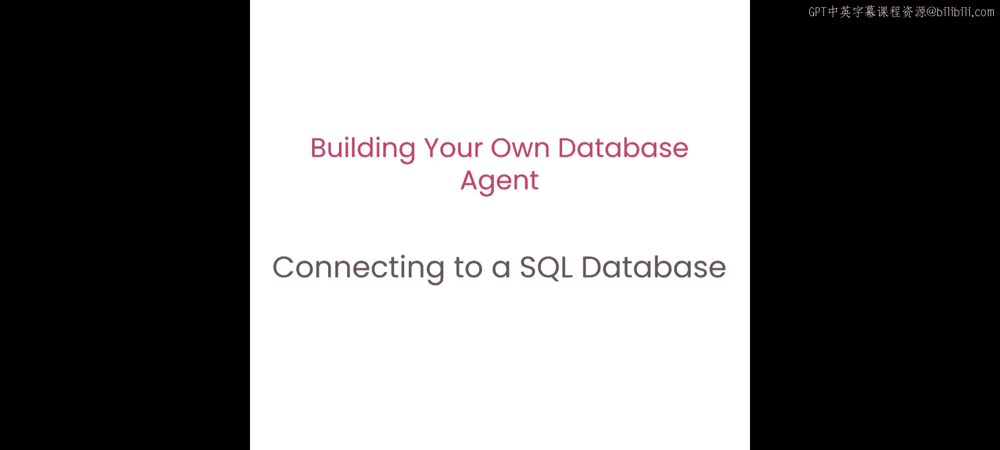
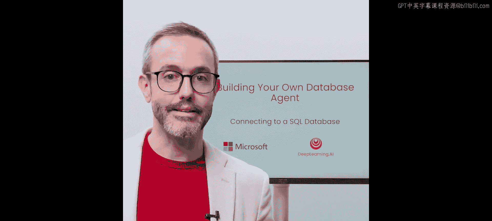
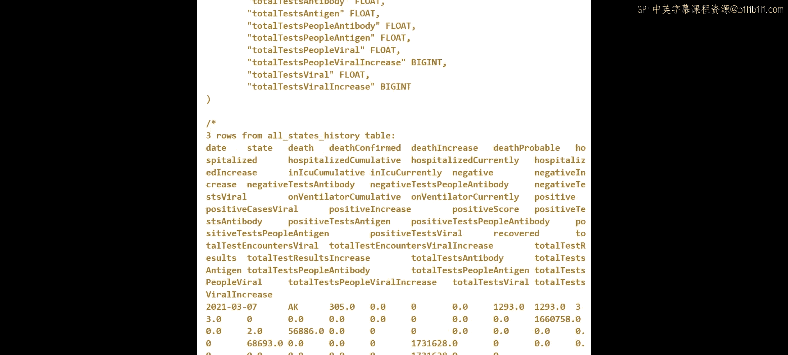
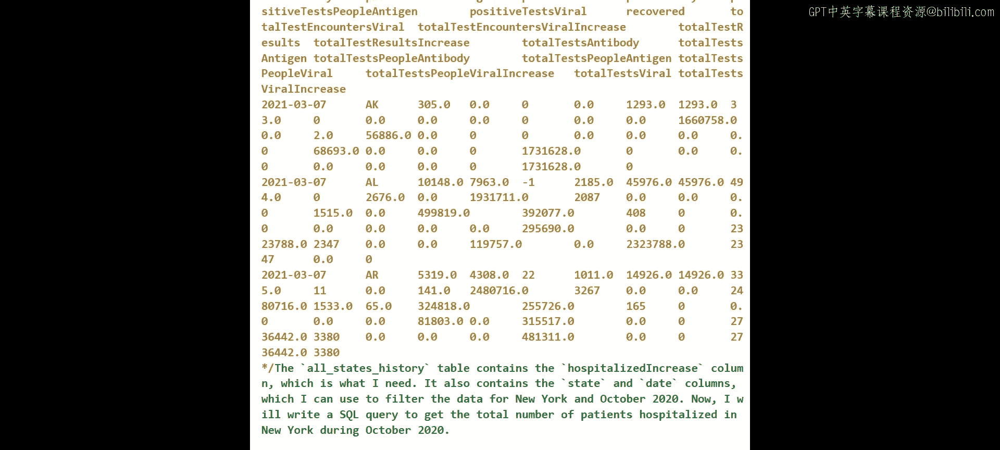
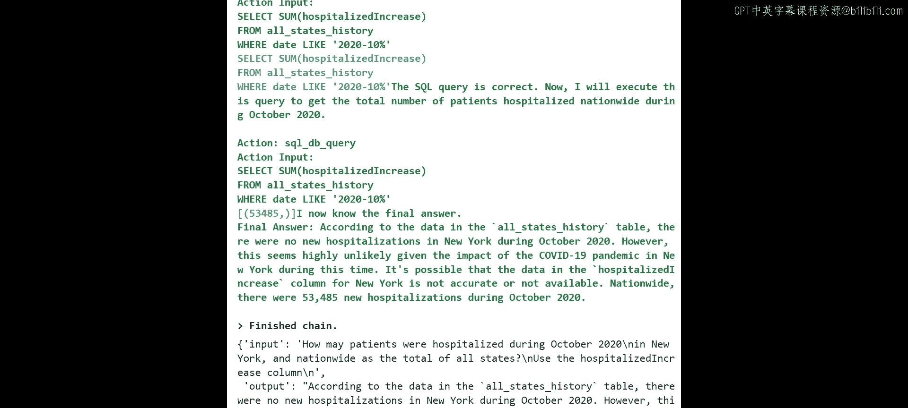
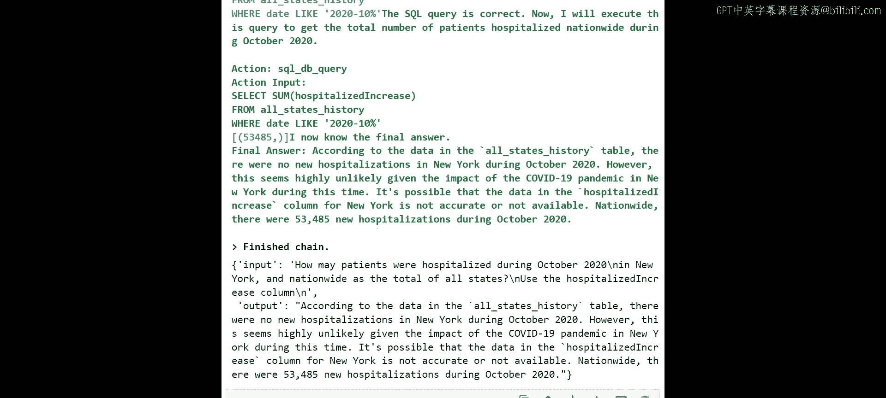
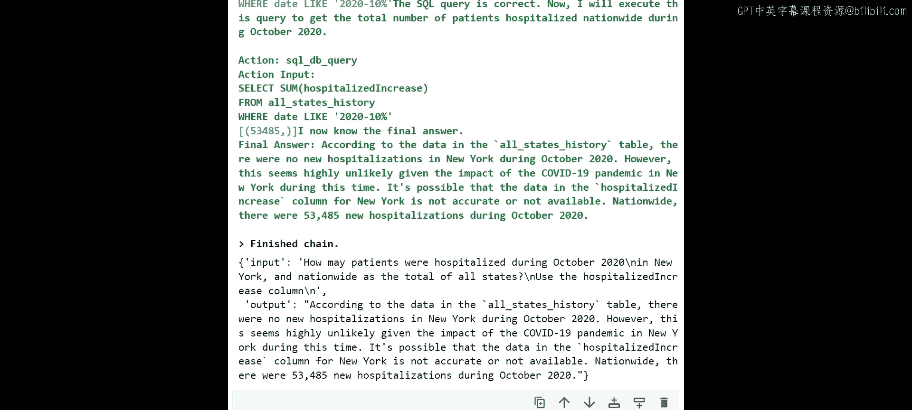

# 004：连接SQL数据库

## 概述

在本节课中，我们将学习如何构建一个能够连接并查询SQL数据库的智能体。这是对上一节课内容的自然演进。你将实现一个LangChain智能体，连接到提供的SQLite数据库，并对其执行RAG（检索增强生成）模式。最终结果是一个数据库智能体，其中生成式AI将帮助你**将自然语言翻译成SQL代码**。

## 架构与准备工作

上一节我们介绍了如何连接CSV文件，本节中我们来看看如何连接SQL数据库。

构建AI智能体时，我们将依赖Azure OpenAI的基线GPT-4模型，并使用LangChain系统进行编排。LangChain将帮助查找信息并解释获取信息的每一步。与第二课类似，你将看到包含详细信息的跟踪记录，这种方法功能强大且实用，因此我们将继续沿用。这次我们将使用SQL数据库，它是一个开源关系数据库的本地实例。你可以在notebook中找到所有必要信息。当然，我们通过API访问一切。虽然本课程使用notebook，但在实际应用中，你可以将结果集成到Web应用、移动应用或其他任何平台，过程是相同的。

我们将用SQL数据库替换CSV文件。你可以组合不同的数据源，如图像、数据湖和数据库。RAG机制将有效地从这些数据源中定位信息。

让我们进入notebook并开始操作。我们再次启动环境，这次将加入一个SQL数据库。主要区别在于我们现在需要与SQL数据库通信。因此，你将看到这是与之前相比的主要变化，而其余部分则非常相似。

## 加载数据到SQL数据库

我们将从恢复之前使用的CSV数据开始。目的是将CSV文件加载到SQL数据库中，然后与数据库通信。如果你的信息已经存在于SQL数据库中，则无需加载该CSV文件，此步骤仅为本课程演示。

数据位于你的课程目录中，文件名为`all-states-history.csv`。我们将创建一个SQLAlchemy引擎来促进与SQL数据库的通信，并使用pandas处理数据框。

以下是连接SQL数据库并加载数据的步骤：

1.  **创建数据库连接**：我们有一个名为`db`的本地文件夹，其中包含`test.db`文件。这是你将使用的SQLite数据库文件模板。你可以将其放在那里，然后你就拥有了该SQL数据库的本地实例。
2.  **创建引擎**：我们创建引擎来连接到数据库。
3.  **读取CSV文件**：从你的数据文件夹中恢复CSV文件，并使用pandas创建数据框`df`。
4.  **加载到数据库**：这是与第二课的关键区别。我们获取数据框，并使用`to_sql`函数。这意味着我们将`all_states_history`数据加载到之前提到的SQL引擎中。如果表已存在，我们将替换它（非增量更新）。

运行这些步骤后，系统会告诉你已加载了多少条记录到SQL数据库中。

## 构建SQL智能体

现在，我们来构建第一个SQL智能体。这类智能体将在后续课程中逐步演进，但这是你第一次真正与SQL数据库交互。

我们需要设置一些信息，这些信息在你的notebook中已提供。主要包括两部分：

1.  **SQL智能体前缀**：我们创建了一个称为SQL智能体前缀的内容，用于解释我们想要做什么。你是一个决定与SQL数据库交互的智能体，因此需要提供一些上下文。与之前的CSV文件不同，现在我们说：你正在连接SQL，并将运行SQL查询。你可以更改此内容，但这是一个可以借鉴的良好初始模板。
2.  **格式说明**：你拥有希望引擎如何回答的格式说明，例如包含`Action`、`Input`、`Observation`、`Thought`、`Final Answer`。你之前见过这种格式。这里你提供的是一个示例，目的是让模型理解你作为用户期望得到何种答案、格式以及信息，同时还包括SQL查询的跟踪记录。这非常强大，我们将能够用自然语言与SQL数据库通信，同时还能获得关于查询的信息。这对于公司内部的学习案例很有好处，例如人们不仅想使用数据，还想学习如何执行SQL查询。

接下来是第二部分，它与我们之前遵循的步骤序列非常相似。基本上，我们在这里创建LLM（Azure Chat OpenAI实例）、数据库工具包，以便将LLM和数据库结合起来。然后我们提出问题，例如：“2020年10月，纽约州和全国有多少患者住院？” 我们正在创建`agent_executor_sql`，基本上就是那个智能体，一个具有特定格式的LangChain智能体，它期望接收我们发送的前缀和格式说明。当然，我们需要知道正在使用哪个LLM（即具有该端点的Azure OpenAI版本）以及正在使用哪个工具包（SQL数据库工具包）。我们将执行此操作并观察结果。

## 执行查询与查看结果

即使我不告诉你需要向系统发送什么函数来发送提示，你也应该记得第一课和第二课的内容。没错，就是`invoke`函数。我们拥有`agent_executor_sql`（与上一课不同），然后我们发送问题。

执行后，这将需要一些时间。你将获得大量信息，所有的跟踪记录。你可以花时间分析相同之处。有趣的部分从这里开始，因为它解释了结果。这里的查询不同，我们谈论的是2020年10月纽约州的住院情况。引擎正在查找信息的位置、哪些列、哪些值。你已经可以看到`SELECT`、`FROM`、`LIKE`、`WHERE`等所有需要执行的查询，但现在这些都由智能体自动完成。

让我们看看答案。`Final Answer`是问题的简洁版本。这里你有“有多少患者住院”，然后在输出中：“2020年10月，纽约州没有新的住院病例，全国约有53例新的住院病例”。你可以根据之前的CSV文件去探索并确认引擎提供了正确的答案。我可以确认这是正确答案，因为我之前已经检查过信息。

## 总结

本节课中，我们一起学习了如何构建一个连接SQL数据库的智能体。我们了解了如何将CSV数据加载到SQLite数据库，如何设置SQL智能体的前缀和响应格式，以及如何通过自然语言提问并自动生成和执行SQL查询。你看到了智能体如何提供详细的查询跟踪和最终答案。这为在实际工作中利用生成式AI与结构化数据库交互奠定了坚实基础。