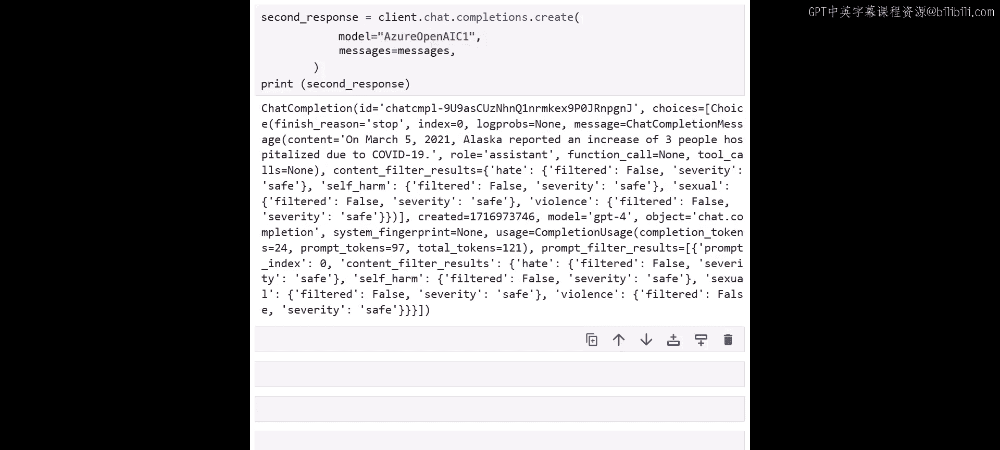

# 005：Azure OpenAI 函数调用功能 🛠️

在本节课中，我们将学习 Azure OpenAI 的函数调用功能。我们将了解如何利用此功能来改进 SQL 智能体的设计，使其能够更精确、更可控地执行数据库查询，而无需在翻译过程中暴露 SQL 语句。

## 概述

上一节我们介绍了使用 LangChain 连接 CSV 文件和 SQL 数据库。本节中，我们来看看 Azure OpenAI 模型的一项新能力：函数调用功能。你可能会想，如果我们的智能体已经运行良好并能正确获取信息，为什么还需要这个功能？函数调用的主要价值在于，它能让我们为系统或智能体提供明确的指令，以从特定主题中查找信息。这包括建议要生成的查询类型，并以你需要的格式获取搜索结果。这种方法为智能体增加了一层确定性行为，允许你更精确地控制整个过程。

## 函数调用的核心概念

与之前基于 LangChain 的智能体方法不同，函数调用将查询封装在函数内部，提供了更多的结构和可预测性。其核心思想是利用预定义的函数将查询发送到数据库，而无需将 SQL 查询暴露在翻译过程中。

以下是其工作原理的简化流程：
1.  **定义工具（函数）**：创建一系列函数，每个函数对应一种特定的查询意图（例如，获取某州的住院人数）。
2.  **描述工具**：将这些函数的描述（名称、用途、所需参数）提供给 AI 模型。
3.  **用户提问**：用户用自然语言提出问题。
4.  **模型选择工具**：AI 模型根据问题意图，自动选择合适的函数并准备调用参数。
5.  **执行函数**：系统执行被选中的函数，该函数内部包含执行 SQL 查询的逻辑。
6.  **返回结果**：函数执行结果返回给 AI 模型，由模型整理成自然语言答案回复给用户。

## 从简单示例开始

为了理解函数调用的机制，我们先从一个与天气相关的简单函数开始。以下是创建和测试一个简单天气查询函数的步骤。

首先，我们需要设置 Azure OpenAI 端点，使用的预览版模型包含了我们将要使用的函数调用功能。

```python
# 示例：设置 Azure OpenAI（关键信息已用占位符替代）
openai.api_type = "azure"
openai.api_base = "你的 Azure OpenAI 端点"
openai.api_version = "预览版 API 版本"
openai.api_key = "你的 API 密钥"
```

接下来，我们定义一个简单的函数。这个函数模拟获取指定城市的当前天气。

```python
def get_current_weather(location: str):
    """
    获取指定城市的当前天气。
    参数:
        location (str): 城市名称，例如 "San Francisco"。
    返回:
        str: 该城市的模拟天气信息。
    """
    # 这是一个模拟函数，实际应用中会调用天气API
    weather_data = {
        "San Francisco": "晴朗，20摄氏度",
        "New York": "多云，15摄氏度",
        "Las Vegas": "晴朗，25摄氏度"
    }
    return f"{location}的天气是：{weather_data.get(location, '信息暂不可用')}"
```

现在，我们教导 AI 系统如何使用这个函数。我们创建一个包含用户消息和工具描述的消息列表。

```python
messages = [
    {"role": "user", "content": "旧金山、纽约和拉斯维加斯的天气怎么样？"}
]

tools = [
    {
        "type": "function",
        "function": {
            "name": "get_current_weather",
            "description": "获取指定城市的当前天气",
            "parameters": {
                "type": "object",
                "properties": {
                    "location": {
                        "type": "string",
                        "description": "城市名称，例如 San Francisco",
                    }
                },
                "required": ["location"],
            },
        },
    }
]
```

然后，我们进行第一次 API 调用。这次调用的目的是让模型根据用户问题，决定需要调用哪些函数以及传入什么参数。

```python
response = openai.ChatCompletion.create(
    engine="你的部署名称",
    messages=messages,
    tools=tools,
    tool_choice="auto", # 让模型自动选择工具
)
```

模型会返回一个响应，其中包含它计划进行的“工具调用”。在这个例子中，由于我们问了三个城市，模型可能会决定调用三次 `get_current_weather` 函数，每次传入不同的城市参数。但这只是第一步，我们还没有得到实际的天气答案。

为了获得最终答案，我们需要执行模型指定的函数调用，并将结果返回给模型进行总结。以下是第二步：

```python
# 1. 解析模型返回的工具调用请求
tool_calls = response.choices[0].message.get(“tool_calls”)
if tool_calls:
    # 2. 准备一个列表来存放所有函数执行结果
    all_results = []
    for tool_call in tool_calls:
        function_name = tool_call.function.name
        function_args = json.loads(tool_call.function.arguments)
        # 3. 根据函数名找到对应的函数并执行
        if function_name == “get_current_weather”:
            function_response = get_current_weather(**function_args)
            all_results.append(function_response)
    # 4. 将函数执行结果作为新的消息附加到对话历史中
    messages.append(response.choices[0].message) # 添加模型的思考
    for result in all_results:
        messages.append({
            “role”: “tool”,
            “content”: result,
            “tool_call_id”: tool_call.id # 关联对应的工具调用
        })
    # 5. 再次调用模型，让它根据原始问题和函数结果生成最终回答
    second_response = openai.ChatCompletion.create(
        engine=“你的部署名称”,
        messages=messages,
    )
    final_answer = second_response.choices[0].message.content
    print(final_answer)
```

最终，我们将得到一个如“旧金山天气晴朗，20摄氏度；纽约多云，15摄氏度；拉斯维加斯晴朗，25摄氏度”的自然语言回答。

## 应用于数据库查询

理解了基础机制后，我们现在将其应用到数据库智能体上。我们将创建与数据库查询相关的函数。

首先，我们像之前课程一样，将数据加载到 SQLite 数据库中。

```python
import pandas as pd
import sqlite3

# 加载 CSV 数据
df = pd.read_csv(“covid_data.csv“)
# 创建内存中的 SQLite 数据库连接
conn = sqlite3.connect(“:memory:“)
# 将 DataFrame 写入数据库
df.to_sql(“covid_stats“, conn, index=False, if_exists=“replace“)
```

接下来，我们定义两个与数据库交互的函数。一个用于查询住院人数增长，另一个用于查询阳性病例数。

```python
def get_hospitalized_increase(state: str, date: str):
    """
    获取特定州和日期的住院人数增长。
    参数:
        state (str): 州名，例如 ‘Alaska‘。
        date (str): 日期，格式为 ‘YYYY-MM-DD‘，例如 ‘2021-03-05‘。
    返回:
        str: 查询结果。
    """
    query = f“““
        SELECT hospitalized_increase
        FROM covid_stats
        WHERE state = ‘{state}‘ AND date = ‘{date}‘
    “““
    result = pd.read_sql_query(query, conn)
    # 返回格式化的结果
    if not result.empty:
        return f“在{date}，{state}州报告的住院人数增长为{result.iloc[0, 0]}人。“
    else:
        return f“未找到{date}在{state}州的住院数据。“

def get_positive_cases(state: str, date: str):
    """
    获取特定州和日期的阳性病例数。
    参数:
        state (str): 州名。
        date (str): 日期，格式为 ‘YYYY-MM-DD‘。
    返回:
        str: 查询结果。
    """
    query = f“““
        SELECT positive_cases
        FROM covid_stats
        WHERE state = ‘{state}‘ AND date = ‘{date}‘
    “““
    result = pd.read_sql_query(query, conn)
    if not result.empty:
        return f“在{date}，{state}州报告的阳性病例数为{result.iloc[0, 0]}例。“
    else:
        return f“未找到{date}在{state}州的阳性病例数据。“
```

现在，我们教导智能体如何根据用户的问题选择正确的函数。我们创建一个用户消息示例和工具描述列表。

```python
# 用户的问题示例
user_message = “2021年3月5日阿拉斯加州的住院人数是多少？“

# 定义可用的工具（函数）
database_tools = [
    {
        “type“: “function“,
        “function“: {
            “name“: “get_hospitalized_increase“,
            “description“: “获取特定州和日期的住院人数增长“,
            “parameters“: {
                “type“: “object“,
                “properties“: {
                    “state“: {“type“: “string“, “description“: “美国的州名，例如 Alaska“},
                    “date“: {“type“: “string“, “description“: “日期，格式为 YYYY-MM-DD“},
                },
                “required“: [“state“, “date“],
            },
        },
    },
    {
        “type“: “function“,
        “function“: {
            “name“: “get_positive_cases“,
            “description“: “获取特定州和日期的阳性病例数“,
            “parameters“: {
                “type“: “object“,
                “properties“: {
                    “state“: {“type“: “string“, “description“: “美国的州名“},
                    “date“: {“type“: “string“, “description“: “日期，格式为 YYYY-MM-DD“},
                },
                “required“: [“state“, “date“],
            },
        },
    }
]

messages = [{“role“: “user“, “content“: user_message}]
```

然后，我们重复与天气示例相同的两步流程：
1.  第一次调用，让模型根据问题意图（“住院人数”）选择 `get_hospitalized_increase` 函数，并提取出 `state=“Alaska“` 和 `date=“2021-03-05“` 参数。
2.  执行被选中的函数，获取数据库查询结果。
3.  将结果返回给模型，生成最终的自然语言回答，例如：“在2021年3月5日，阿拉斯加州报告的COVID-19住院人数增长为3人。”

通过这种方式，我们构建了一个更结构化、更可控的数据库智能体。系统不再直接生成不可预测的 SQL，而是通过我们预定义的、安全的函数来访问数据库，大大提高了系统的可靠性和安全性。

## 总结




本节课中，我们一起学习了 Azure OpenAI 的函数调用功能。我们了解到，该功能通过将查询逻辑封装在预定义的函数中，为数据库智能体带来了更强的结构性和可控性。我们从创建一个简单的天气查询函数开始，理解了函数调用的两步流程：模型决策与函数执行。随后，我们将此模式应用于实际的数据库查询场景，创建了针对住院数据和阳性病例数据的查询函数，并教会了智能体如何根据用户意图自动选择正确的工具。这种方法使得智能体的行为更加确定，输出更加精准，是构建生产级可靠 AI 应用的重要一步。