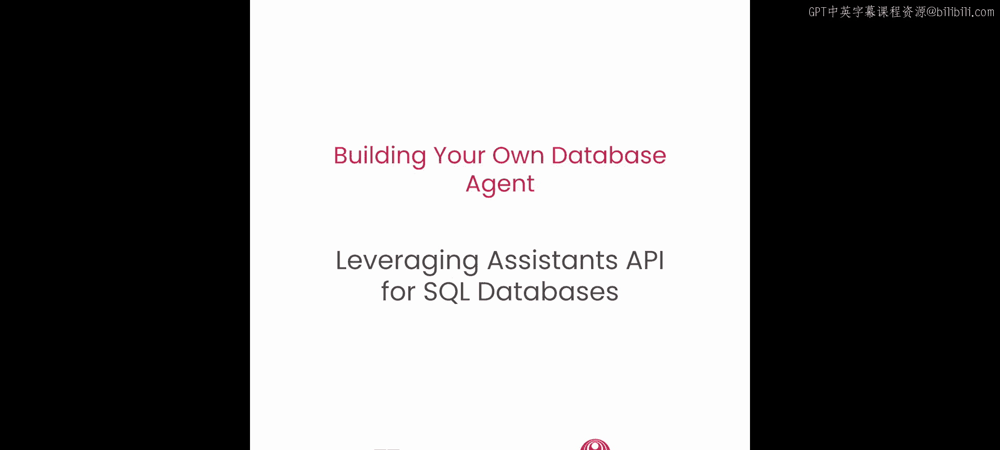
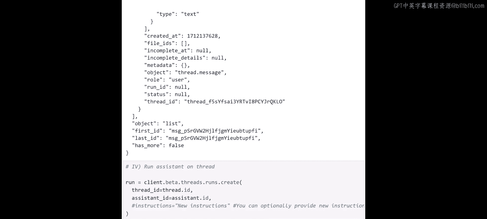

# 006：利用Assistants API连接SQL数据库




在本节课中，我们将学习如何利用最新的模型功能，特别是Assistants API。这个API是之前API的有状态演进版本，旨在促进新型AI智能体的创建。


本节课将为你提供使用全新Assistants API的机会，并测试其函数调用和代码解释器功能。这将完善多种实现模式，帮助你连接SQL数据库并创建自己的数据库智能体。


## 课程概述

在之前的课程中，我们部署了Azure OpenAI和LangChain实例，为CSV和SQL数据库创建了智能体，并在第4课中切换到使用Azure OpenAI的函数调用功能。我们看到函数调用效果良好，允许系统利用多个函数。

现在，让我们看看Azure OpenAI的另一项功能：Assistants API。之前我们使用GPT-4和聊天补全功能。Assistants API的不同之处在于它能动态维护讨论的上下文。与无状态的聊天补全不同，Assistants API是有状态的，这意味着它会跟踪对话。这对于需要在交互间保持上下文的场景（如电子商务）非常重要。

在Assistants API内部，我们也可以使用函数调用，类似于我们在第4课中所做的。此外，我们还将探索代码解释器功能。代码解释器功能允许Assistants API处理Python代码，它可以迭代地运行代码并进行修改，直到执行成功。这对于复杂任务非常有用。代码解释器功能就像当前环境中的一个环境，使智能体能够修改自己的代码以找到解决方案。

本节课将帮助你探索Assistants API的有状态能力和代码解释器功能，以实现动态和复杂的交互。

## 开始实践

让我们进入最后一个笔记本并开始操作。这次我们将通过结合之前的配置来保持简洁。我们将一起执行所有操作，包括记录端点、加载CSV数据并将其导入SQL数据库，类似于我们之前所做的。

我们将从导入包含第4课中使用的一些变量和函数的辅助函数开始。这主要是为了引入第4课中定义的SQL工具以及住院和阳性病例的函数。

以下是关键步骤的代码和说明。

### 1. 初始化客户端与助手

首先，我们设置API密钥、端点和API版本。因为我们使用所有新功能，所以采用最新版本。

```python
# 初始化Azure OpenAI客户端
client = AzureOpenAI(
    api_key=your_api_key,
    api_version="2024-02-15-preview", # 使用最新版本
    azure_endpoint=your_endpoint
)
```

接着，我们创建一个助手。我们提供指令，说明这是一个回答关于COVID数据集的助手，指定模型，并解释该助手可以使用的工具。

```python
# 创建助手
assistant = client.beta.assistants.create(
    instructions="你是一个回答关于COVID数据问题的助手。",
    model="gpt-4", # 指定模型
    tools=[...] # 此处列出之前定义的函数工具
)
```

### 2. 创建对话线程

这是第二步。我们创建一个线程，这就像是讨论的轨迹，可以将不同的消息和用户-机器讨论关联起来。

```python
# 创建线程
thread = client.beta.threads.create()
```

系统会返回一个唯一的线程标识符和一些元数据。这个`thread`对象是Assistants API特有的。

### 3. 添加用户消息

现在，我们向线程中添加一条用户消息。

```python
# 向线程添加消息
message = client.beta.threads.messages.create(
    thread_id=thread.id,
    role="user",
    content="2021年3月，阿拉斯加州有多少人住院？"
)
```

我们打印消息以查看其结构，可以看到它是一个包含内容、角色和元数据的JSON对象。

### 4. 运行助手处理线程

我们已经告诉系统有一些消息和讨论正在进行。现在运行系统来处理这个线程。

```python
# 在线程上运行助手
run = client.beta.threads.runs.create(
    thread_id=thread.id,
    assistant_id=assistant.id
)
```

这就是设置Assistants API的基本四步流程，具体步骤会根据你拥有的函数和问题类型而略有不同。

## 使用函数调用

现在，我们将复制第4课中函数调用的操作，但这次在Assistants API中使用它。之后我们将使用代码解释器，但让我们先关注函数调用。

使用函数调用的动态过程与之前非常相似。我们已经定义了函数，并在这个案例中说明我们有一个正在进行的讨论线程，因为我们之前已经启动了它。

以下是运行函数调用的代码：

```python
# 使用函数调用运行
run = client.beta.threads.runs.create(
    thread_id=thread.id,
    assistant_id=assistant.id,
    tools=[{"type": "function", "function": function_schema}] # function_schema是函数定义
)
```

运行这段代码后，系统会处理我们之前传递的测试问题（例如“阿拉斯加州有多少人住院？”），并在讨论中获取答案。答案会显示在特定日期阿拉斯加州有多少人住院。你可以打印JSON转储，或者以更好的格式查看它。

## 使用代码解释器

接下来是全新的部分：使用代码解释器。记住，代码解释器就像你正在使用的这个沙盒环境中的一个代码沙盒，它是OpenAI和Azure OpenAI中可用的一个代码沙盒，允许助手以智能方式运行复杂任务的代码，甚至允许它在代码不完善时找到使其工作的方法，它会迭代并找到解决方案。

这同样是在我们之前所做工作的基础上进行的增量操作。我们已经有了助手，现在我们基本上是用相同的模型创建一个助手，但在这里我们指定工具类型为代码解释器。

```python
# 创建使用代码解释器的助手
assistant_with_interpreter = client.beta.assistants.create(
    instructions="你是一个可以使用代码解释器分析数据的助手。",
    model="gpt-4",
    tools=[{"type": "code_interpreter"}]
)
```

我们使用我们的问题“2021年阿拉斯加州的住院情况”，像之前一样运行线程进行讨论，但这次集成了代码解释器工具。

```python
# 使用代码解释器运行线程
run = client.beta.threads.runs.create(
    thread_id=thread.id,
    assistant_id=assistant_with_interpreter.id
)
```

运行后，你可以查看线程状态。当运行完成后，你可以通过消息参数获取结果。

```python
# 获取消息列表
messages = client.beta.threads.messages.list(thread_id=thread.id)
```

结果会显示，例如，在2021年3月，阿拉斯加州有多少人因COVID-19住院。同样，我们得到了答案。在这种情况下，我们所做的就是添加代码解释器，但答案的格式非常相似。

## 总结

在本节课中，我们一起学习了如何利用Azure OpenAI的Assistants API来构建有状态的数据库智能体。我们回顾了初始化助手、创建对话线程、添加消息以及运行助手的基本步骤。我们实践了在Assistants API框架内使用函数调用功能来执行特定任务。最后，我们探索了强大的代码解释器功能，它允许智能体在沙盒环境中运行和迭代Python代码，以解决更复杂的数据查询和分析问题。

通过结合这些功能，你可以创建出能够理解上下文、动态调用工具并自主执行代码以找到解决方案的智能数据库代理，从而大大增强了AI应用处理SQL数据库的能力。



