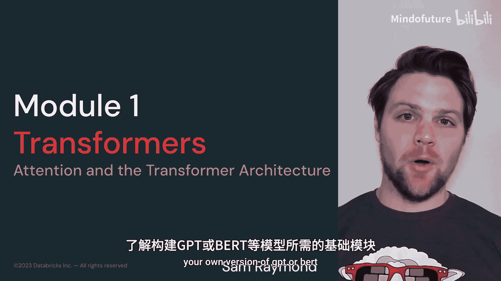
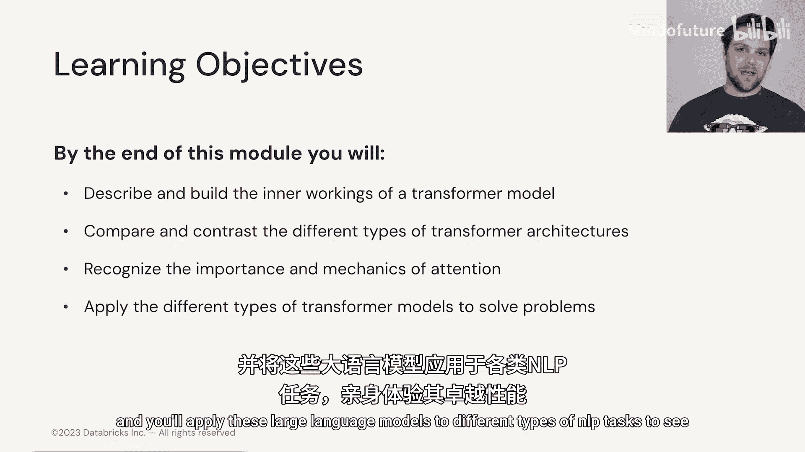
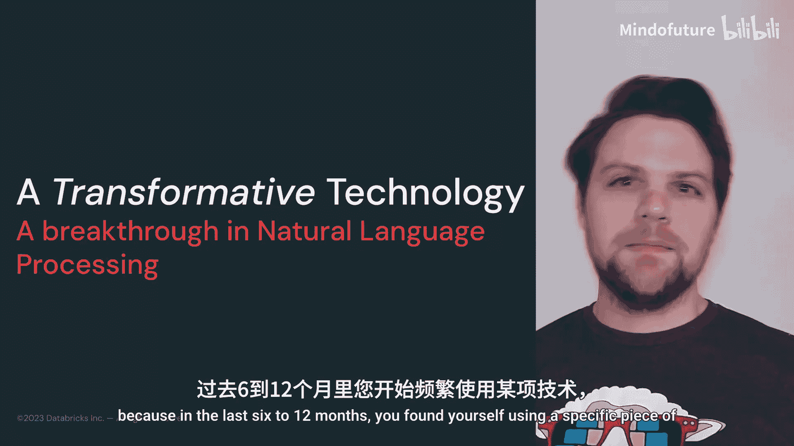
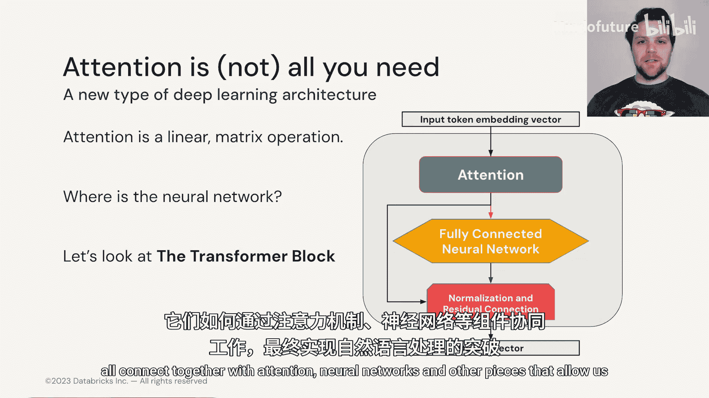

# 003：Transformer概览 🧠

在本模块中，我们将深入探讨Transformer模型。我们将拆解一个Transformer模型，了解其构成部分。我们将学习构成GPT、BERT或其他任何基于Transformer模型的不同构建模块。

## 课程概述

在本节课中，我们将学习Transformer模型的核心组件。我们将了解构成各种Transformer架构（包括编码器模型、解码器模型以及编码器-解码器组合模型）的所有不同构建模块。我们还将更好地理解注意力机制是什么、如何工作以及为何它如此重要，并解锁了如今大型语言模型的能力。最后，我们将把这些大型语言模型应用于不同类型的NLP任务，以观察其卓越性能。

## 背景与重要性

回顾过去，您学习本课程的主要原因之一，很可能是在过去6到12个月里，您开始使用了一项特定的技术，最可能是ChatGPT。2022年，OpenAI向世界发布了ChatGPT，它成为了人类历史上采用速度最快的技术。

这标志着我们正在进入人工智能的新黄金时代。2023年，我们在AI大型语言模型领域见证了想法、概念和创新的爆炸式增长，它们持续以其所能实现的功能令我们惊叹。

ChatGPT及其同类产品代表了人类与技术互动的一种新方式。因为它们基于自然语言处理，我们能够以比其他类型技术更自然的方式与它们交流。同时，它们广泛的技能和深厚的技术知识也使我们能够在日常工作中表现得更好。

我们实际上以前也见过类似的创新。对于那些熟悉过去十年左右深度学习领域的人来说，可能已经注意到我们在2010年代初、2012年左右经历过类似的狂热时刻。当时，计算机视觉领域因卷积神经网络的创新而震动。这项创新就是卷积层，它使我们能够查看图像的不同空间区域，以理解图像内部的内容。

正如您在此处看到的图像所示，这意味着我们可以与旧技术竞争并完全超越它们。在ImageNet测试中，卷积神经网络轻松主导了竞争，并且自2012年左右以来，每个模型都基于卷积神经网络，使结果趋于饱和。

自然语言处理领域一直在等待这种发展，我们在2018年左右得到了它。解锁大型语言模型能力的关键创新是一种称为**注意力机制**的东西。

## 核心创新：注意力机制

注意力，顾名思义，允许计算机（在此处指Transformer）精确地看到一个单词在特定序列中如何与其他单词相关联。它为序列中每个单词对其他单词的重要性进行评分。

对我们人类来说，这似乎是一个显而易见的概念，是我们早年就发展出来的能力。但对于自然语言处理来说，这是一个至关重要的部分，它解锁了以前无法实现的能力。

然而，虽然注意力是我们掌握自然语言处理能力的一大进步，但它实际上只是构建我们今天看到的Transformer和模型所需的几个部分之一。

## 后续内容预告

在下一节中，我们将深入探讨所谓的**Transformer模块**，并了解从输入标记到下一个选定单词的输出，所有这些部分如何通过注意力、神经网络和其他组件连接在一起，使我们能够攻克NLP任务。

## 总结

本节课我们一起学习了Transformer模型的概览及其重要性。我们了解到，注意力机制是解锁现代大型语言模型能力的关键创新，它允许模型理解序列中单词之间的关系。我们还回顾了计算机视觉中卷积神经网络的类似突破，并预告了接下来将深入探讨Transformer的具体构建模块。