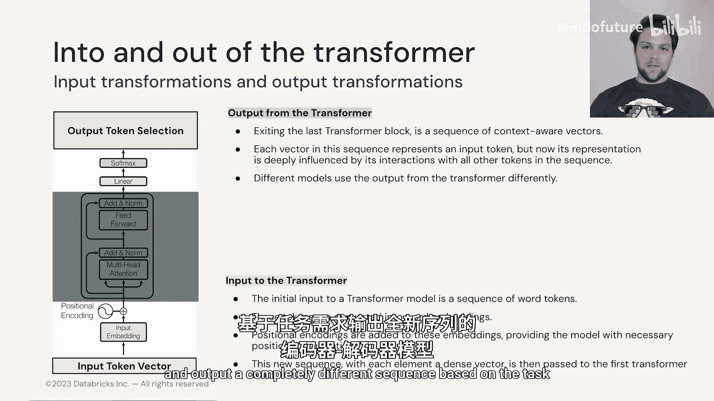

# 004：1.3 Transformer块 🧱

在本节课中，我们将要学习Transformer模型的核心组成部分——Transformer块。我们将了解输入序列如何通过这个块被处理和丰富，以及它如何为最终的预测任务做准备。

---

## 输入与目标

Transformer与大多数语言模型一样，用于尝试预测下一个词。

Transformer实现这一点的方式与大多数其他语言模型不同。

但它们仍然基于相同的基本原理工作。

它们会接收一个词元序列，然后对该序列进行处理。

改变该序列中的信息，使得该序列可用于预测词汇表中的下一个词或词元。

在Transformer中，我们获取输入词元并将其转换为词嵌入向量，从而得到一个由不同词嵌入向量组成的向量序列。

然后，我们经过一系列丰富阶段，使得这些向量被转换，并为每个向量构建越来越多的上下文和更多信息，以便当我们最终将其提供给softmax分类层或预测层时，它有大量信息可供使用。

---

## Transformer块概览

上一节我们介绍了Transformer的基本目标，本节中我们来看看实现这一目标的核心结构——Transformer块。

如果我们观察Transformer块，其中词元被丰富然后传递到下一个序列，我们可以在示意图中看到实际发生的过程。

如果我们考虑一个仅包含一个Transformer块的Transformer。

该过程大致如下：我们获取一个输入词元序列。

将它们转换为词向量，从而得到一系列词向量。

然后，我们会添加额外信息，例如位置编码（我们稍后会讨论）。

这提供了序列中每个词元相对于其他词元的位置信息。

然后我们将其传入Transformer块。

Transformer块的目标是尽可能用丰富的上下文信息来丰富该序列中的每个词元。

它通过注意力机制和神经网络变换来实现这一点。

然后我们通过添加残差连接和归一化序列中的向量来进一步处理。

接着，这些向量在我们的Transformer输出端，通过一个线性和softmax的组合，来尝试预测下一个词元或对序列进行分类。

大多数Transformer会有数百个Transformer块，但过程完全相同。

在Transformer块的末端，序列现在与我们最初的自然语言输入几乎没有相似之处，但仍保持相同的大小和格式，并被传递到下一个Transformer块。

---

## 逐步解析处理阶段

让我们逐步看看这个准备、丰富和预测阶段是如何工作的。

### 注意力机制 👁️

首先，我们有至关重要的注意力机制。

注意力机制的作用是衡量序列中每个词相对于其他词的重要性和相关性。

当我们从一个块到另一个块，在传统的Transformer架构中向上移动时，这个概念会略有延伸，我们可能有几十个甚至几百个Transformer块。

因此，在第一个块之后，你并不是真正地在比较一个词与另一个词，但你仍然在关注每个词元开始时所在的完全相同的序列和位置。

它们被之前的块赋予了额外的上下文信息，我们仍然在观察不同的块如何以不同的方式传递序列。

通过这样做，通过添加越来越多的Transformer块层，我们能够丰富这些向量，并更深入地观察序列内部是如何相互作用的。

典型的序列长度如今是数千，甚至数万的数量级。

因此，有大量信息需要处理，单个Transformer块无法捕获例如多段落上下文中的所有信息。

此外，注意力是一个线性操作（我们稍后会看到它的具体形式），到目前为止它并没有为模型添加任何深度学习成分。

事实上，Transformer几乎不被视为深度学习模型。

然而，大型语言模型中的大部分参数被每个注意力块中使用的前馈神经网络所占据。

### 前馈神经网络 🧠

现在，Transformer中的前馈神经网络的工作方式可能与你的预期略有不同。

如前所述，提供给Transformer的词元被转换为词嵌入，它们具有特定的维度，假设是100维。

这意味着我们将得到一个向量序列，每个向量长度为100维。

在Transformer中被称为“位置式前馈神经网络”的网络，其输入宽度将是100个神经元。

这意味着我们逐个将每个词元传递给神经网络。

该神经网络的权重和结构在每次应用于序列中的每个向量时都是相同的。

因此，这个“位置式”（意味着它处理每个位置）前馈神经网络被应用于每个词元，以便将其转换为正确的格式，然后提供给Transformer中的下一个块，或在Transformer末端提供给输出块。

这允许进行非线性变换，并且使得Transformer本身能够在我们从最初理解（例如，名词和动词在Transformer块较低层次上如何相关）一直到理解上下文的情感（在Transformer块末端）的过程中，建立起不同层次的复杂性和理解。

我们将在后续的笔记本中操作Transformer时看到更多这方面的内容。

### 残差连接与层归一化 ⚖️

Transformer块架构中另一个非常重要的部分是残差连接和层归一化。

特别是残差连接非常重要，因为它们允许梯度在反向传播期间自由地反向流动。

它们还确保输入序列的信号在这些向量变得越来越丰富的过程中不会丢失。

因此，我们有一条不间断的路径，让输入序列的原始结构能够一直穿过Transformer。

层归一化也至关重要，因为Transformer通常需要很长时间来训练。

因此，确保训练的稳定性是层归一化允许我们做到的事情。

---

## 整体输入与输出

现在让我们谈谈整个Transformer本身的输入和输出。

让我们从输入开始。如前所述，我们从一系列自然语言词元开始，这些词元被转换为词嵌入。

然后，为了确保我们保留序列中这些词元的顺序，我们还会向词嵌入附加一种位置编码。

位置编码有多种不同类型，我们将在本模块和模块3的笔记本中探讨其中一些。

一旦我们的词元被丰富为带有位置编码的词嵌入，我们就把它们传入Transformer块。

然后，Transformer块致力于为序列中的向量添加不同类型的丰富性、复杂性，以及（希望是）理解。

然后将其传递给Transformer的输出端。

在Transformer的输出端，我们有我们的词汇表和一个线性神经网络，该网络使用softmax函数来选择下一个要生成的词元（基于我们在Transformer块中构建的序列向量），或者根据我们为特定应用开发的某种分类方案对其进行分类。

---

## 不同的Transformer应用方式

在本节中描述的Transformer块有多种不同的使用方式，在下一节中，我们将讨论其中一些不同的方法。

以下是几种主要类型：

*   **编码器模型**：我们实际上不生成任何新词元。
*   **解码器模型**：我们只专注于生成下一个词元。
*   **编码器-解码器模型**：我们输入一个序列，并根据任务输出一个完全不同的序列。

---

## 总结

本节课中我们一起学习了Transformer的核心处理单元——Transformer块。我们了解了输入序列如何通过词嵌入和位置编码进行准备，然后通过注意力机制和前馈神经网络在块内被丰富。我们还探讨了残差连接和层归一化在稳定训练和传递信息中的关键作用。最后，我们概述了Transformer的整体输入输出流程，并预告了基于Transformer块的不同模型架构。